# Example_Beris_simple

``` r
library(spacemodR)
library(ggplot2)
library(sf)
#> Linking to GEOS 3.12.1, GDAL 3.8.4, PROJ 9.4.0; sf_use_s2() is TRUE
library(terra)
#> terra 1.9.1
```

## Presentation of the Metaleurop Site and Data

The “Metaleurop” case involves a 40 km² site in northern France centered
around a former lead smelter. Soil levels around the plant are
relatively high. Below are the contamination maps for lead, zinc, and
cadmium in the soil, extrapolated from 595 data points.

We do not show here how the extrapolation has been made.

``` r
ground_cd <- load_raster_extdata("ground_concentration_cd_compressed.tif")
ground_pb <- load_raster_extdata("ground_concentration_pb_compressed.tif")
ground_zn <- load_raster_extdata("ground_concentration_zn_compressed.tif")
ground <- terra::rast(list(cd=ground_cd, pb=ground_pb, zn=ground_zn))

terra::plot(ground, main="Soil Concentration (log10)")
```

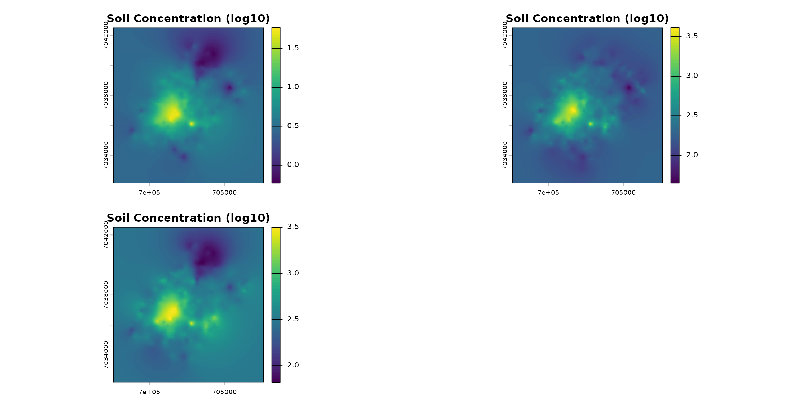

``` r
ground_df <- as.data.frame(ground, xy = TRUE, na.rm = TRUE)

plt_init = ggplot(data = ground_df, aes(x = x, y = y)) +
  theme_minimal() +
  labs(title="Concentration (lo10 scaled)", x="longitude", y="latitude") +
  scale_fill_viridis_c()

plt_init + geom_raster(aes(fill=cd))
```

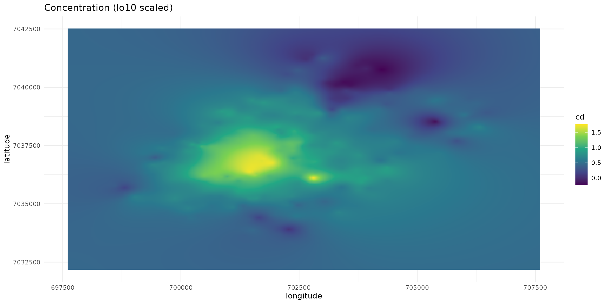

``` r

plt_init + geom_raster(aes(fill=pb))
```

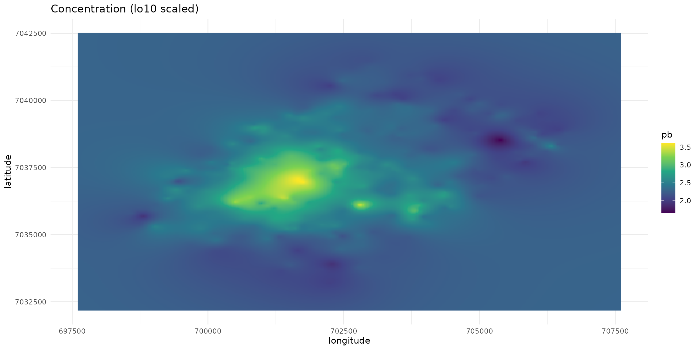

``` r

plt_init + geom_raster(aes(fill=zn))
```

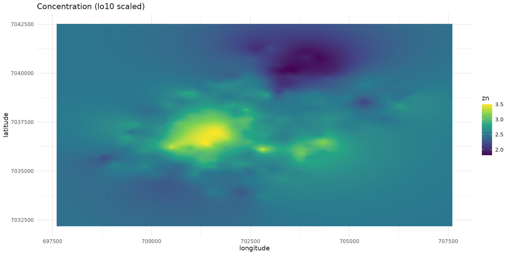

Since 2006, a total of 1426 micro-mammals individuals (9 species) have
been captured to measure the bioaccumulation of metals and kidneys,
livers, hairs:

``` r
data("sf_micromammals")
trophic_cat =  ifelse(sf_micromammals$genus %in% c("crocidura", "sorex"), "insectivore", "herbivore")
sf_micromammals$trophic = factor(trophic_cat, levels = c("herbivore", "insectivore"))
ptsHerb = sf_micromammals[sf_micromammals$trophic=="herbivore", ]
ptsInsect = sf_micromammals[sf_micromammals$trophic=="insectivore", ]

lmH <- lm(log10(cd_WB_FW) ~ log10(cd_S), data = ptsHerb)
lmI <- lm(log10(cd_WB_FW) ~ log10(cd_S), data = ptsInsect)

ggplot(data = sf_micromammals) +
  theme_minimal() +
  labs(title="Cadmium (Cd): log10(Whole body) ~ log10(Soil)",
       x="Soil concentration (log10)",
       y="Whole body concentration (log10)") +
  scale_x_log10() + scale_y_log10() +
  scale_color_manual(
    name="Trophic category",
    values=c("#11aa44", "#aa4411")) +
  geom_point(aes(x=cd_S, y=cd_WB_FW, color=trophic)) +
  geom_abline(intercept=coef(lmH)[1], slope=coef(lmH)[2], color = "#11aa44", size=2) +
  geom_abline(intercept=coef(lmI)[1], slope=coef(lmI)[2], color = "#aa4411", size=1.5) +
  geom_abline(intercept= -1.2571, slope=0.4723, color = "red")
#> Warning: Using `size` aesthetic for lines was deprecated in ggplot2 3.4.0.
#> ℹ Please use `linewidth` instead.
#> This warning is displayed once per session.
#> Call `lifecycle::last_lifecycle_warnings()` to see where this warning was
#> generated.
```

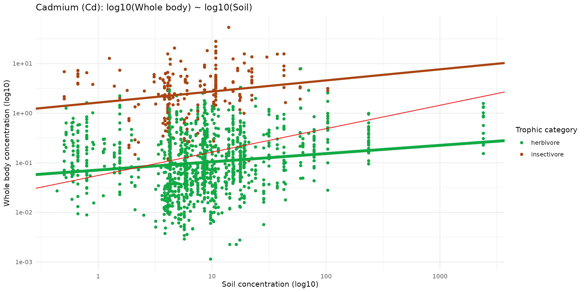

## A simple Soil - Target model Fixed individuals

``` r

unique(sf_micromammals$genus)
#> [1] "crocidura" "apodemus"  "myodes"    "microtus"  "sorex"


names_hab = c("soil", "mamHerb", "mamInsect")

list_habitat <- lapply(names_hab, function(i) ground_cd)
stack_habitat <- raster_stack(list_habitat, names_hab)

terra::plot(stack_habitat)
```


``` r
trophic_df <- trophic() |>
  #add_link("soil", "plant") |>
  #add_link("soil", "invert") |>
  add_link("soil", "mamHerb") |>
  add_link("soil", "mamInsect") # |>
  #add_link("soil", "birdInsect")

plot(trophic_df, shift=FALSE)
```


``` r
spcmdl_simple <- spacemodel(stack_habitat, trophic_df)
```

``` r
kernels <- list(
  soil  = NA,
  #plant = NA,
  #invert = NA,
  mamHerb = NA,
  mamInsect = NA#,
  #birdInsect = NA
)
```

``` r
simple_intakes <- intake(spcmdl_simple,
  "soil -> mamHerb" = ~ 10^(-1 + 0.2*x),
  "soil -> mamInsect" = ~ 10^(-0.2 + 0.3*x),
  default = 1 # for all other default is 1
)
spcmdl_transfer <- transfer(spcmdl_simple, kernels, simple_intakes)
```

``` r
terra::plot(spcmdl_transfer)
```

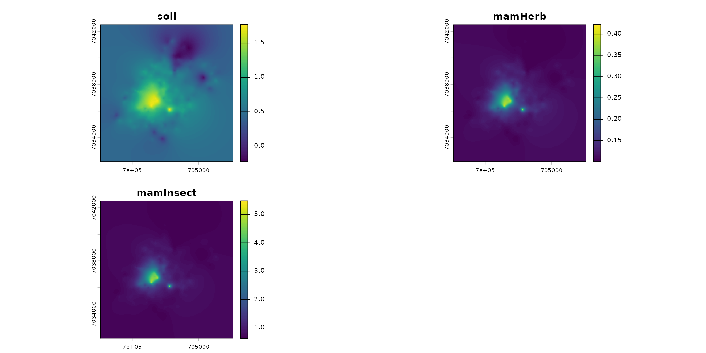

``` r
df_raster <- as.data.frame(spcmdl_transfer, xy = TRUE, na.rm = TRUE)
ggplot() +
  geom_raster(data = df_raster, aes(x = x, y = y, fill = mamHerb)) +
  scale_fill_viridis_c() +
  geom_sf(data = sf_micromammals, color = "red", size = 2, alpha = 0.7) +
  theme_minimal() +
  labs(title = "Ma carte Raster + Points", fill = "Valeur")
```

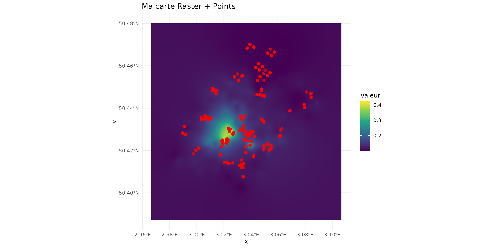

``` r
predict_insect <- terra::extract(spcmdl_transfer[["mamInsect"]], ptsInsect)
ptsInsect$predict <- predict_insect[, "mamInsect"]

predict_herb <- terra::extract(spcmdl_transfer[["mamHerb"]], ptsHerb)
ptsHerb$predict <- predict_herb[, "mamHerb"]
```

``` r
ggplot() +
  theme_minimal() +
  scale_x_log10() + scale_y_log10() +
  labs(title="Predicted ~  Observed", x = "Observed", y = "Predicted") + 
  geom_abline(slope=1) +
  geom_point(data = ptsInsect, color="#aa4411", 
             aes(x=cd_WB_FW, y=predict, color=trophic)) +
  geom_point(data = ptsHerb, color="#11aa44",
             aes(x=cd_WB_FW, y=predict, color=trophic))
#> Warning: Removed 7 rows containing missing values or values outside the scale range
#> (`geom_point()`).
#> Warning: Removed 111 rows containing missing values or values outside the scale range
#> (`geom_point()`).
```

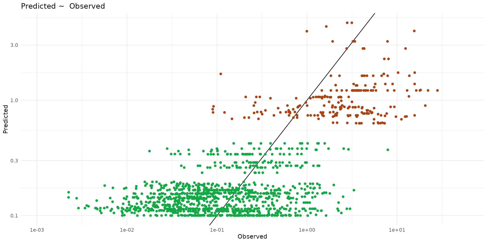

``` r
sf_predict = rbind(ptsInsect, ptsHerb)
ggplot(data = sf_predict) +
  theme_minimal() +
  scale_x_log10() + scale_y_log10() +
  scale_color_manual(values=c("#11aa44", "#aa4411")) +
  geom_point(aes(x=cd_S, y=predict, color=trophic)) +
  geom_abline(intercept= -0.2, slope=0.3, color = "#aa4411" ) +
  geom_abline(intercept= -1,  slope=0.2, color = "#11aa44" ) +
  geom_abline(intercept= -1.2571, slope=0.4723, color = "red")
#> Warning: Removed 118 rows containing missing values or values outside the scale range
#> (`geom_point()`).
```

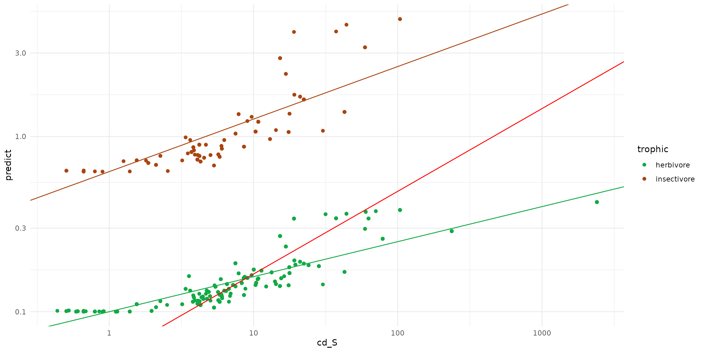

## A simple Soil - Target model with Dispersal

``` r
ground_cd <- load_raster_extdata("ground_concentration_cd_compressed.tif")
# names_hab = c("soil", "plant", "invert", "mamHerb", "mamInsect", "birdInsect")
names_hab = c("soil", "mamHerb", "mamInsect")
list_habitat <- lapply(names_hab, function(i) ground_cd)
stack_habitat <- raster_stack(list_habitat, names_hab)

terra::plot(stack_habitat)
```

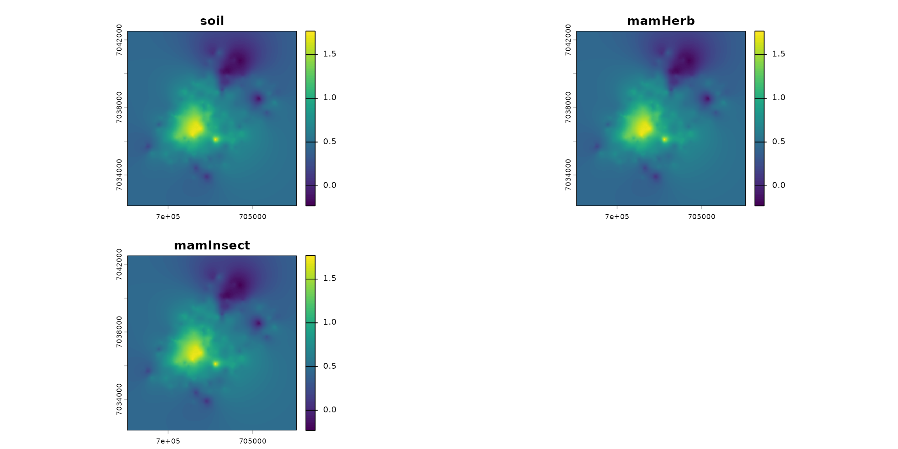

``` r
trophic_df <- trophic() |>
  #add_link("soil", "plant") |>
  #add_link("soil", "invert") |>
  add_link("soil", "mamHerb") |>
  add_link("soil", "mamInsect") # |>
  #add_link("soil", "birdInsect")

plot(trophic_df, shift=FALSE)
```

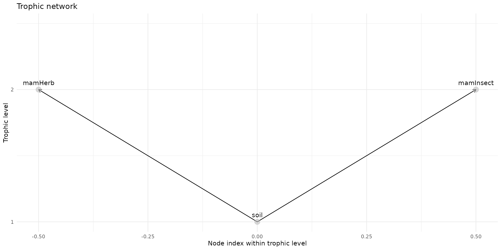

``` r
spcmdl_simple <- spacemodel(stack_habitat, trophic_df)
```

``` r
k_mamInsect <- compute_kernel(radius=100, GSD=25, size_std=1.5)
k_mamHerb <- compute_kernel(radius=500, GSD=25, size_std=1.5)

kernels <- list(
  soil  = NA,
  #plant = NA,
  #invert = NA,
  mamHerb = k_mamHerb,
  mamInsect = k_mamInsect#,
  #birdInsect = NA
)
```

``` r
simple_intakes <- intake(spcmdl_simple,
  "soil -> mamHerb" = ~ 10^(-1 + 0.2*x),
  "soil -> mamInsect" = ~ 10^(-0.2 + 0.3*x),
  default = 1 # for all other default is 1
)
spcmdl_transfer <- transfer(spcmdl_simple, kernels, simple_intakes)
```

``` r
terra::plot(spcmdl_transfer)
```

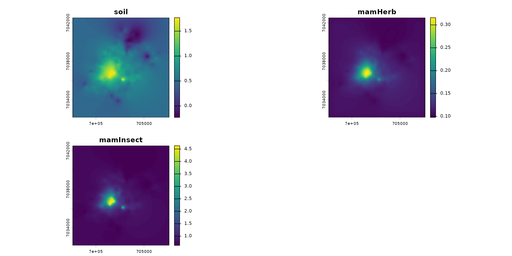

``` r
df_raster <- as.data.frame(spcmdl_transfer, xy = TRUE, na.rm = TRUE)
ggplot() +
  geom_raster(data = df_raster, aes(x = x, y = y, fill = mamHerb)) +
  scale_fill_viridis_c() +
  geom_sf(data = sf_micromammals, color = "red", size = 2, alpha = 0.7) +
  theme_minimal() +
  labs(title = "Ma carte Raster + Points", fill = "Valeur")
```

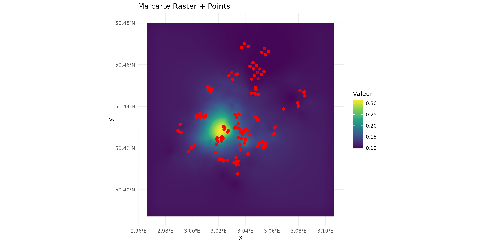

``` r
ptsInsect = sf_micromammals[sf_micromammals$trophic=="insectivore", ]
ptsHerb = sf_micromammals[sf_micromammals$trophic=="herbivore", ]

predict_insect <- terra::extract(spcmdl_transfer[["mamInsect"]], ptsInsect)
ptsInsect$predict <- predict_insect[, "mamInsect"]

predict_herb <- terra::extract(spcmdl_transfer[["mamHerb"]], ptsHerb)
ptsHerb$predict <- predict_herb[, "mamHerb"]
```

``` r
ggplot() +
  theme_minimal() +
  scale_x_log10() + scale_y_log10() +
  labs(title="Predicted ~  Observed", x = "Observed", y = "Predicted") + 
  geom_abline(slope=1) +
  geom_point(data = ptsInsect, color="#aa4411", 
             aes(x=cd_WB_FW, y=predict, color=trophic)) +
  geom_point(data = ptsHerb, color="#11aa44",
             aes(x=cd_WB_FW, y=predict, color=trophic))
#> Warning: Removed 7 rows containing missing values or values outside the scale range
#> (`geom_point()`).
#> Warning: Removed 111 rows containing missing values or values outside the scale range
#> (`geom_point()`).
```

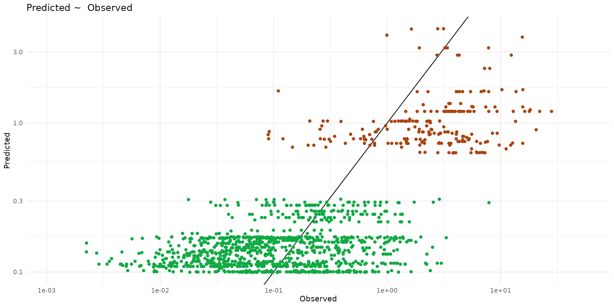

``` r
sf_predict = rbind(ptsInsect, ptsHerb)
ggplot(data = sf_predict) +
  theme_minimal() +
  scale_x_log10() + scale_y_log10() +
  scale_color_manual(values=c("#11aa44", "#aa4411")) +
  geom_point(aes(x=cd_S, y=predict, color=trophic)) +
  geom_abline(intercept= -0.2, slope=0.3, color = "#aa4411" ) +
  geom_abline(intercept= -1,  slope=0.2, color = "#11aa44" ) +
  geom_abline(intercept= -1.2571, slope=0.4723, color = "red")
#> Warning: Removed 118 rows containing missing values or values outside the scale range
#> (`geom_point()`).
```

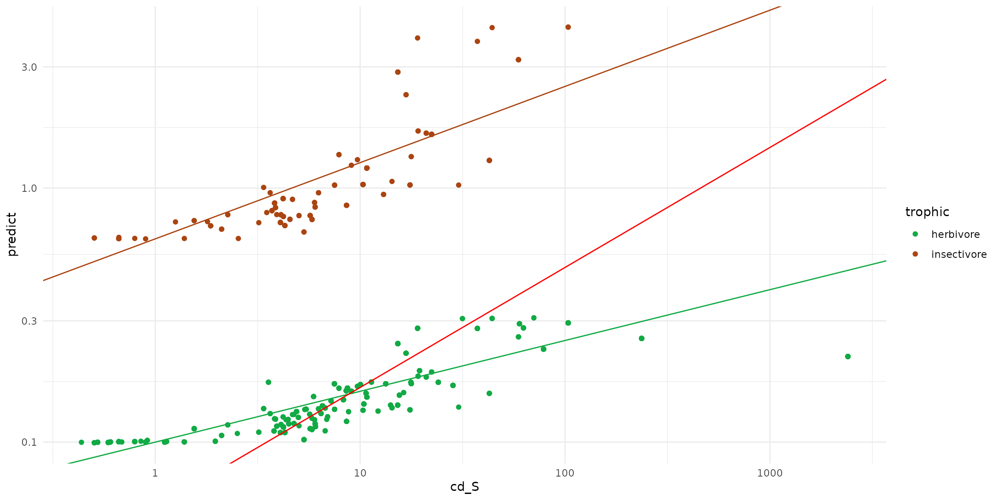
