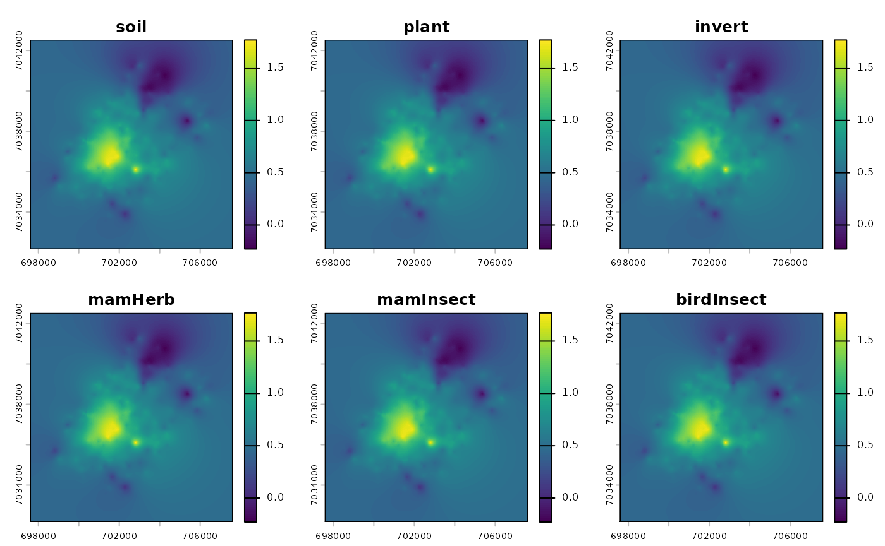

# Example_Berisp

``` r
library(spacemodR)
```

## Define a Spacemodel

### Habitat

``` r
ground_cd <- load_raster_extdata("ground_concentration_cd_compressed.tif")
names_hab = c("soil", "plant", "invert", "mamHerb", "mamInsect", "birdInsect")
list_habitat <- lapply(names_hab, function(i) ground_cd)
stack_habitat <- raster_stack(list_habitat, names_hab)

terra::plot(stack_habitat)
```



### Trophic web

``` r
trophic_df <- trophic() |>
  add_link("soil", "plant") |>
  add_link("soil", "invert") |>
  add_link("soil", "mamHerb") |>
  add_link("soil", "mamInsect") |>
  add_link("soil", "birdInsect")
```

## Fixed species

### Contamination of earthworm

For Cadmium, the equation is given by (Ma et al., 2004):

$$\log C_{earthworm} = a + b \times \log C_{soil} + c \times \log OM + d \times pH$$

For Zinc and Arsenic, equation si given by:

$$\log C_{earthworm} = a + b \times \log C_{soil} + d \times pH$$

``` r
feq1 = function(Csoil,OM,pH,a,b,c,d){
  a+b*log(x)+c*log(OM)+d*pH
}
crt_feq1 <- function(a, b, c, d) {
  function(Csoil, OM, pH) {
    feq1(Csoil, OM, pH, a, b, c, d)
  }
}

soil_earthworm <- list(
  c(substance = "cadmium", from = "soil", to = "earthworm",
    flux = crt_feq1(a=2.92,  b=0.747,  c=-0.5336, d=-0.2101)),
  c(substance = "zinc",    from = "soil", to = "earthworm",
    flux = crt_feq1(a=4.453, b=0.234,  c=0.0,     d=-0.12845)),
  c(substance = "arsenic", from = "soil", to = "earthworm",
    flux = crt_feq1(a=0.341, b=1.0908, c=0.0,     d=-0.41611))
)
df <- as.data.frame(do.call(rbind, soil_earthworm), stringsAsFactors = FALSE)

print(df)
#>   substance from        to
#> 1   cadmium soil earthworm
#> 2      zinc soil earthworm
#> 3   arsenic soil earthworm
#>                                                                   flux
#> 1 function (Csoil, OM, pH) , {,     feq1(Csoil, OM, pH, a, b, c, d), }
#> 2 function (Csoil, OM, pH) , {,     feq1(Csoil, OM, pH, a, b, c, d), }
#> 3 function (Csoil, OM, pH) , {,     feq1(Csoil, OM, pH, a, b, c, d), }
```

### Vegetation

``` r
feq1 = function(Csoil,OM,pH,a,b,c,d){
  a+b*log(x)+c*log(OM)+d*pH
}
crt_feq1 <- function(a, b, c, d) {
  function(Csoil, OM, pH) {
    feq1(Csoil, OM, pH, a, b, c, d)
  }
}

soil_earthworm <- list(
  c(substance = "cadmium", from = "soil", to = "earthworm",
    flux = crt_feq1(a=2.92,  b=0.747,  c=-0.5336, d=-0.2101)),
  c(substance = "zinc",    from = "soil", to = "earthworm",
    flux = crt_feq1(a=4.453, b=0.234,  c=0.0,     d=-0.12845)),
  c(substance = "arsenic", from = "soil", to = "earthworm",
    flux = crt_feq1(a=0.341, b=1.0908, c=0.0,     d=-0.41611))
)
df <- as.data.frame(do.call(rbind, soil_earthworm), stringsAsFactors = FALSE)

print(df)
#>   substance from        to
#> 1   cadmium soil earthworm
#> 2      zinc soil earthworm
#> 3   arsenic soil earthworm
#>                                                                   flux
#> 1 function (Csoil, OM, pH) , {,     feq1(Csoil, OM, pH, a, b, c, d), }
#> 2 function (Csoil, OM, pH) , {,     feq1(Csoil, OM, pH, a, b, c, d), }
#> 3 function (Csoil, OM, pH) , {,     feq1(Csoil, OM, pH, a, b, c, d), }
```

## Fixed Species

### Cadmium
