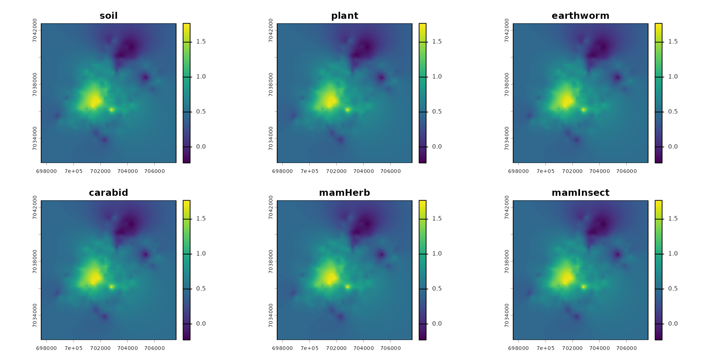
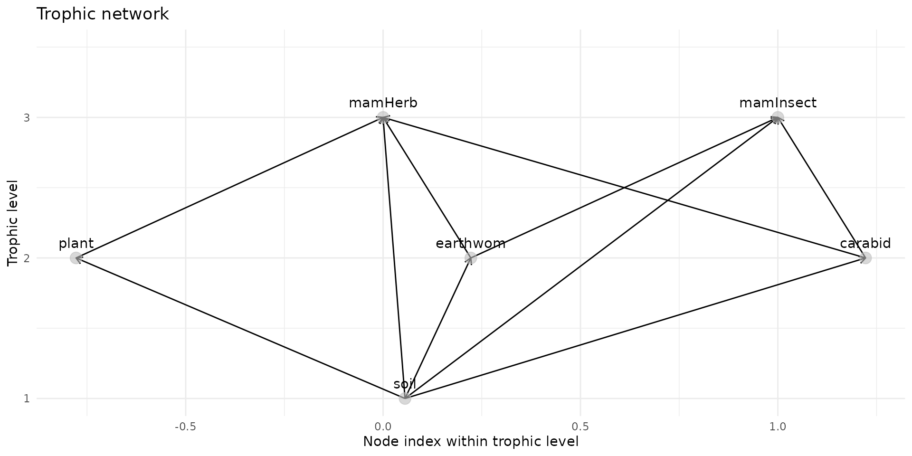

# Berisp-like: a trophic model of contamination

``` r
library(spacemodR)
library(rstan)
library(dplyr)
library(terra)
```

## Define a Spacemodel

### Habitat

``` r
ground_cd <- load_raster_extdata("ground_concentration_cd_compressed.tif")
names_hab = c("soil", "plant", "earthwom", "carabid", "mamHerb", "mamInsect")
list_habitat <- lapply(names_hab, function(i) ground_cd)
stack_habitat <- raster_stack(list_habitat, names_hab)

terra::plot(stack_habitat)
```



### Trophic web

``` r
trophic_df <- trophic() |>
  add_link("soil", "plant", 1) |>
  add_link("soil", "earthwom", 1) |>
  add_link("soil", "carabid", 1) |>
  # mamHerb
  add_link("soil", "mamHerb", 2/100) |>
  add_link("plant", "mamHerb", 90/100) |>
  add_link("earthwom", "mamHerb", 4/100) |>
  add_link("carabid", "mamHerb", 4/100) |>
  # mamInsect
  add_link("soil", "mamInsect", 2/100) |>
  add_link("earthwom", "mamInsect", 49/100) |>
  add_link("carabid", "mamInsect", 49/100)
```

``` r
plot(trophic_df)
```



## Contaminantion by Cadmium

### Vegetation

### Earthworm

For Cadmium, the equation is given by (Ma et al., 2004):

$$\log C_{earthworm} = a + b \times \log C_{soil} + c \times \log OM + d \times pH$$

### Carabid

``` r
inter_carab = -1
slope_carab = 0.6
```

### Transfer of food

$$C = \frac{1}{b} \times \frac{food \times C_{food} \times c_{up}}{C_{out}}\left( 1 - \exp^{- c_{out} \times a} \right)$$
where:

- $b$: average individual biomass $\lbrack g\rbrack$,
- $c_{up}$: assimilation efficiency of food $\lbrack n.d.\rbrack$,
- $c_{out}$: excretion rate of food,
  $\left\lbrack day^{- 1} \right\rbrack$
- $a$: average age $\lbrack day\rbrack$,
- $food$: amount of food ingested $\lbrack g\rbrack$.
