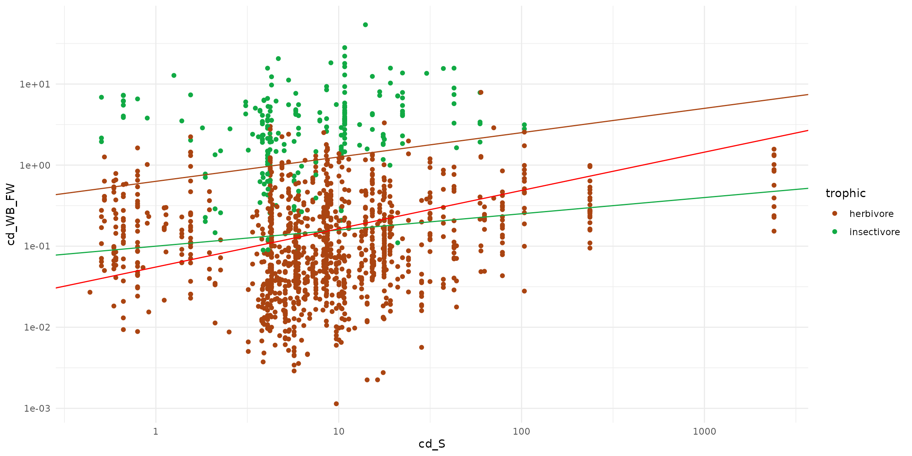
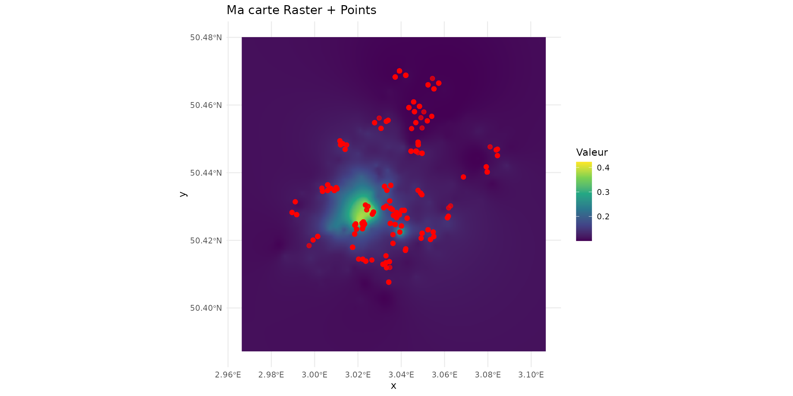
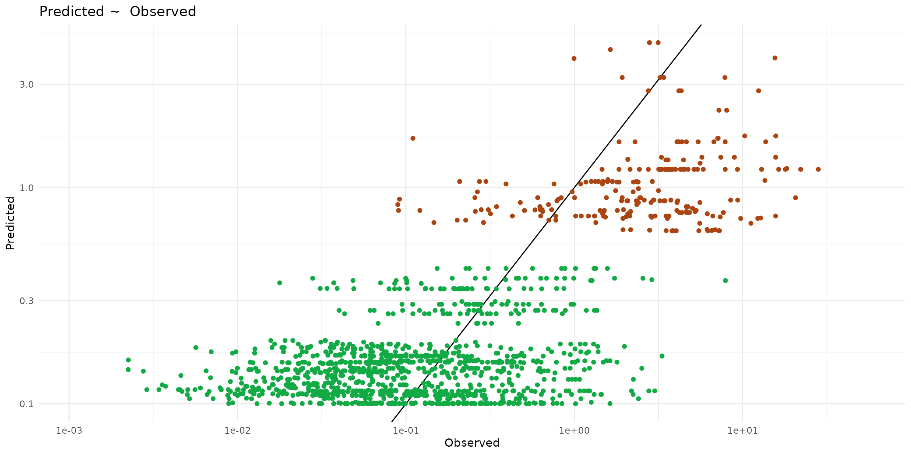
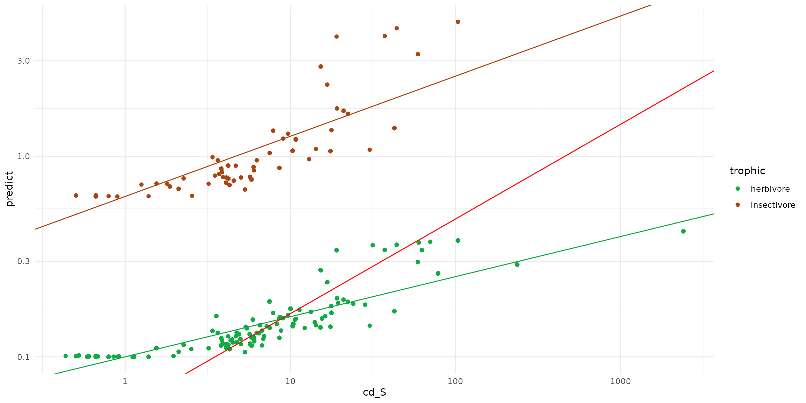
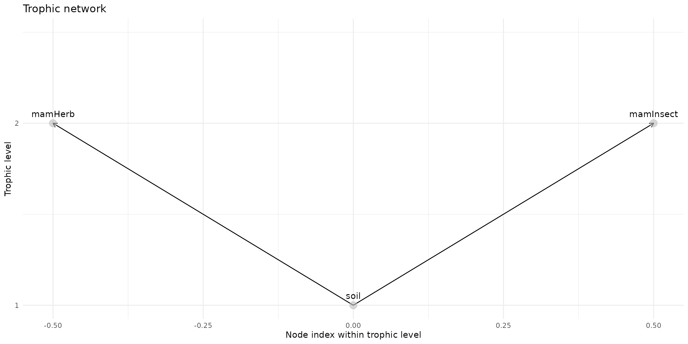
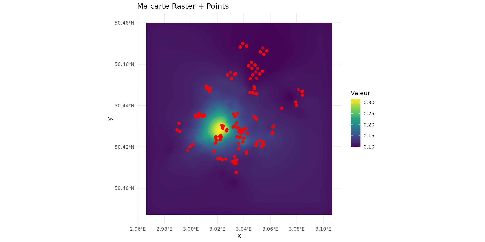
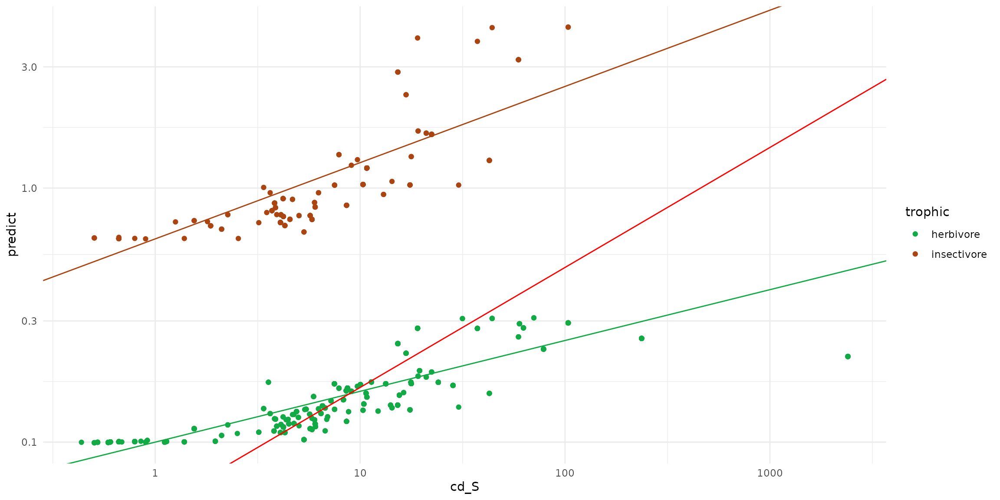

# Example_Beris_simple

``` r
library(spacemodR)
library(ggplot2)
library(sf)
#> Linking to GEOS 3.12.1, GDAL 3.8.4, PROJ 9.4.0; sf_use_s2() is TRUE
library(terra)
#> terra 1.8.93
```

## A simple Soil - Target model Fixed individuals

``` r
ground_cd <- load_raster_extdata("ground_concentration_cd_compressed.tif")
# names_hab = c("soil", "plant", "invert", "mamHerb", "mamInsect", "birdInsect")
names_hab = c("soil", "mamHerb", "mamInsect")
list_habitat <- lapply(names_hab, function(i) ground_cd)
stack_habitat <- raster_stack(list_habitat, names_hab)

terra::plot(stack_habitat)
```


``` r
trophic_df <- trophic() |>
  #add_link("soil", "plant") |>
  #add_link("soil", "invert") |>
  add_link("soil", "mamHerb") |>
  add_link("soil", "mamInsect") # |>
  #add_link("soil", "birdInsect")

plot(trophic_df, shift=FALSE)
```


``` r
spcmdl_simple <- spacemodel(stack_habitat, trophic_df)
```

``` r
kernels <- list(
  soil  = NA,
  #plant = NA,
  #invert = NA,
  mamHerb = NA,
  mamInsect = NA#,
  #birdInsect = NA
)
```

``` r
data("sf_micromammals")
sf_micromammals$trophic = ifelse(sf_micromammals$genus %in% c("crocidura", "sorex"), "insectivore", "herbivore")
ggplot(data = sf_micromammals) +
  theme_minimal() +
  scale_x_log10() + scale_y_log10() +
  scale_color_manual(values=c("#aa4411", "#11aa44")) +
  geom_point(aes(x=cd_S, y=cd_WB_FW, color=trophic)) +
  geom_abline(intercept= -0.2, slope=0.3, color = "#aa4411" ) +
  geom_abline(intercept= -1,  slope=0.2, color = "#11aa44" ) +
  geom_abline(intercept= -1.2571, slope=0.4723, color = "red")
```



``` r
simple_intakes <- intake(spcmdl_simple,
  "soil -> mamHerb" = ~ 10^(-1 + 0.2*x),
  "soil -> mamInsect" = ~ 10^(-0.2 + 0.3*x),
  default = 1 # for all other default is 1
)
spcmdl_transfer <- transfer(spcmdl_simple, kernels, simple_intakes)
```

``` r
terra::plot(spcmdl_transfer)
```


``` r
df_raster <- as.data.frame(spcmdl_transfer, xy = TRUE, na.rm = TRUE)
ggplot() +
  geom_raster(data = df_raster, aes(x = x, y = y, fill = mamHerb)) +
  scale_fill_viridis_c() +
  geom_sf(data = sf_micromammals, color = "red", size = 2, alpha = 0.7) +
  theme_minimal() +
  labs(title = "Ma carte Raster + Points", fill = "Valeur")
```



``` r
ptsInsect = sf_micromammals[sf_micromammals$trophic=="insectivore", ]
ptsHerb = sf_micromammals[sf_micromammals$trophic=="herbivore", ]

predict_insect <- terra::extract(spcmdl_transfer[["mamInsect"]], ptsInsect)
ptsInsect$predict <- predict_insect[, "mamInsect"]

predict_herb <- terra::extract(spcmdl_transfer[["mamHerb"]], ptsHerb)
ptsHerb$predict <- predict_herb[, "mamHerb"]
```

``` r
ggplot() +
  theme_minimal() +
  scale_x_log10() + scale_y_log10() +
  labs(title="Predicted ~  Observed", x = "Observed", y = "Predicted") + 
  geom_abline(slope=1) +
  geom_point(data = ptsInsect, color="#aa4411", 
             aes(x=cd_WB_FW, y=predict, color=trophic)) +
  geom_point(data = ptsHerb, color="#11aa44",
             aes(x=cd_WB_FW, y=predict, color=trophic))
#> Warning: Removed 7 rows containing missing values or values outside the scale range
#> (`geom_point()`).
#> Warning: Removed 111 rows containing missing values or values outside the scale range
#> (`geom_point()`).
```



``` r
sf_predict = rbind(ptsInsect, ptsHerb)
ggplot(data = sf_predict) +
  theme_minimal() +
  scale_x_log10() + scale_y_log10() +
  scale_color_manual(values=c("#11aa44", "#aa4411")) +
  geom_point(aes(x=cd_S, y=predict, color=trophic)) +
  geom_abline(intercept= -0.2, slope=0.3, color = "#aa4411" ) +
  geom_abline(intercept= -1,  slope=0.2, color = "#11aa44" ) +
  geom_abline(intercept= -1.2571, slope=0.4723, color = "red")
#> Warning: Removed 118 rows containing missing values or values outside the scale range
#> (`geom_point()`).
```



## A simple Soil - Target model with Dispersal

``` r
ground_cd <- load_raster_extdata("ground_concentration_cd_compressed.tif")
# names_hab = c("soil", "plant", "invert", "mamHerb", "mamInsect", "birdInsect")
names_hab = c("soil", "mamHerb", "mamInsect")
list_habitat <- lapply(names_hab, function(i) ground_cd)
stack_habitat <- raster_stack(list_habitat, names_hab)

terra::plot(stack_habitat)
```


``` r
trophic_df <- trophic() |>
  #add_link("soil", "plant") |>
  #add_link("soil", "invert") |>
  add_link("soil", "mamHerb") |>
  add_link("soil", "mamInsect") # |>
  #add_link("soil", "birdInsect")

plot(trophic_df, shift=FALSE)
```



``` r
spcmdl_simple <- spacemodel(stack_habitat, trophic_df)
```

``` r
k_mamInsect <- compute_kernel(radius=100, GSD=25, size_std=1.5)
k_mamHerb <- compute_kernel(radius=500, GSD=25, size_std=1.5)

kernels <- list(
  soil  = NA,
  #plant = NA,
  #invert = NA,
  mamHerb = k_mamHerb,
  mamInsect = k_mamInsect#,
  #birdInsect = NA
)
```

``` r
simple_intakes <- intake(spcmdl_simple,
  "soil -> mamHerb" = ~ 10^(-1 + 0.2*x),
  "soil -> mamInsect" = ~ 10^(-0.2 + 0.3*x),
  default = 1 # for all other default is 1
)
spcmdl_transfer <- transfer(spcmdl_simple, kernels, simple_intakes)
```

``` r
terra::plot(spcmdl_transfer)
```


``` r
df_raster <- as.data.frame(spcmdl_transfer, xy = TRUE, na.rm = TRUE)
ggplot() +
  geom_raster(data = df_raster, aes(x = x, y = y, fill = mamHerb)) +
  scale_fill_viridis_c() +
  geom_sf(data = sf_micromammals, color = "red", size = 2, alpha = 0.7) +
  theme_minimal() +
  labs(title = "Ma carte Raster + Points", fill = "Valeur")
```



``` r
ptsInsect = sf_micromammals[sf_micromammals$trophic=="insectivore", ]
ptsHerb = sf_micromammals[sf_micromammals$trophic=="herbivore", ]

predict_insect <- terra::extract(spcmdl_transfer[["mamInsect"]], ptsInsect)
ptsInsect$predict <- predict_insect[, "mamInsect"]

predict_herb <- terra::extract(spcmdl_transfer[["mamHerb"]], ptsHerb)
ptsHerb$predict <- predict_herb[, "mamHerb"]
```

``` r
ggplot() +
  theme_minimal() +
  scale_x_log10() + scale_y_log10() +
  labs(title="Predicted ~  Observed", x = "Observed", y = "Predicted") + 
  geom_abline(slope=1) +
  geom_point(data = ptsInsect, color="#aa4411", 
             aes(x=cd_WB_FW, y=predict, color=trophic)) +
  geom_point(data = ptsHerb, color="#11aa44",
             aes(x=cd_WB_FW, y=predict, color=trophic))
#> Warning: Removed 7 rows containing missing values or values outside the scale range
#> (`geom_point()`).
#> Warning: Removed 111 rows containing missing values or values outside the scale range
#> (`geom_point()`).
```


``` r
sf_predict = rbind(ptsInsect, ptsHerb)
ggplot(data = sf_predict) +
  theme_minimal() +
  scale_x_log10() + scale_y_log10() +
  scale_color_manual(values=c("#11aa44", "#aa4411")) +
  geom_point(aes(x=cd_S, y=predict, color=trophic)) +
  geom_abline(intercept= -0.2, slope=0.3, color = "#aa4411" ) +
  geom_abline(intercept= -1,  slope=0.2, color = "#11aa44" ) +
  geom_abline(intercept= -1.2571, slope=0.4723, color = "red")
#> Warning: Removed 118 rows containing missing values or values outside the scale range
#> (`geom_point()`).
```


