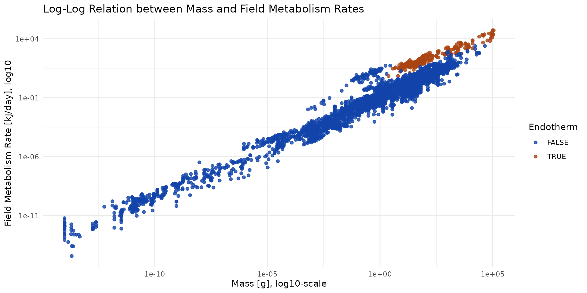
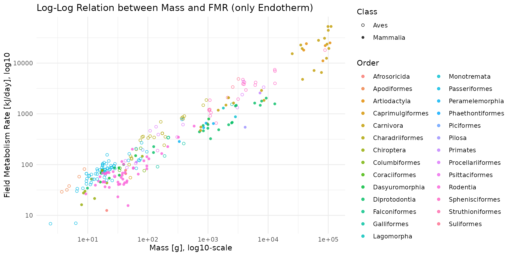

# Food Intake Rate

## Daily Food Intake (DFI)

The calculation of Daily Food Intake (DFI), expressed in grams of fresh
matter per day ($`g/day`$), serves as the central pivot for translating
physiological energy expenditure into actual predation or herbivory
pressures. This estimation process requires the alignment of four
critical variables: the Field Metabolic Rate (FMR), nutrient
assimilation efficiency, the energy density of the consumed items, and
their water content.

### Energetic Needs

Estimating food consumption from metabolism relies on an energy flux
model where the maximum intake ($`I`$) can be derived from the following
formula:

``` math
I = \frac{FMR}{e_{a}(1 - e_{p})i}
```

In this equation, the variables are defined as follows:

- $`FMR`$ represents the field metabolic rate ($`kJ/day`$).
- $`e_{a}`$ is the assimilation efficiency (ranging from $`0`$ to
  $`1`$).
- $`e_{p}`$ is the production efficiency.
- $`i`$ corresponds to the caloric content or energy density of the food
  item ($`kJ/g`$).

Sometimes, the equation is written:

``` math
FIR = \frac{DEE}{FE \times (1 - MC)*AE} = \frac{FMR}{i \times (1 - MC)*e_{a}}
```

If the animal is an adult with a stable body mass, its production
efficiency ($`e_{p}`$) is close to 0.

#### The FmrBT Database

The database provided by Castro ([2025](#ref-decastro2025fmrbt)), named
`FmrBT`, constitutes a comprehensive resource of Field Metabolism Rates
($`FMR`$), body mass, and ambient temperature, covering over 700
identified species.

Unlike the Basal Metabolic Rate (BMR), the $`FMR`$ captures energy
expended within a natural habitat, including locomotion, foraging,
digestion, and thermoregulation. This database is crucial because it
explicitly integrates the effects of temperature, a factor that
accelerates metabolic chemical reactions, particularly in ectotherms.

- FMR $`[kJ/d]`$: Field metabolic rate per individual ($`kJ/day`$).
- Mass $`[g]`$: Body mass of the individual ($`grams`$).
- Temp $`[Celsius]`$: The temperature recorded during the study
  ($`Celsius`$).
- Endotherm $`[\text{binary}]`$: The thermal status of the species,
  where $`1`$ represents an endotherm (organism that maintains its body
  at a metabolically favorable temperature) and $`0`$ represents an
  ectotherm (internal physiological sources of heat quite negligible).

``` r

# FmrBT <- read.csv("raw_data/FieldMR_SciDataPub.csv")
data("FmrBT")

FmrBT$Endotherm = ifelse(FmrBT$Endotherm==0, FALSE, TRUE)
head(FmrBT)
#>    Kingdom   Phylum          Class           Order         Family     Genus
#> 1 Animalia Chordata Actinopterygii   Salmoniformes     Salmonidae     Salmo
#> 2 Animalia Chordata Actinopterygii   Salmoniformes     Salmonidae     Salmo
#> 3 Animalia Chordata           Aves   Passeriformes Leiothrichidae Turdoides
#> 4 Animalia Chordata           Aves   Passeriformes Leiothrichidae Turdoides
#> 5 Animalia Chordata           Aves Charadriiformes   Scolopacidae   Actitis
#> 6 Animalia Chordata       Mammalia       Carnivora        Canidae    Lycaon
#>        SpeciesVerbatim  SpeciesAcceptedName    FMR_kJ_d  Mass_g Temp_C
#> 1  Salmo trutta trutta         Salmo trutta    73.01160   393.0   14.0
#> 2  Salmo trutta trutta         Salmo trutta    71.83736   393.0   18.0
#> 3 Turdoides squamiceps Turdoides squamiceps   123.16560    70.3   30.0
#> 4 Turdoides squamiceps Turdoides squamiceps   130.09248    75.6   15.0
#> 5   Actitis hypoleucos   Actitis hypoleucos   146.00000    51.6   11.5
#> 6        Lycaon pictus        Lycaon pictus 15300.00000 25170.0   19.5
#>   Endotherm      Reference Comment Outlier
#> 1     FALSE Altimiras 2002               0
#> 2     FALSE Altimiras 2002               0
#> 3      TRUE     Anava 2002               0
#> 4      TRUE     Anava 2002               0
#> 5      TRUE  Anderson 2005               0
#> 6      TRUE  Anderson 2005               1
```

There is a log-log relationship between Mass and Field Metabolism.

``` r

ggplot(data=FmrBT) +
  theme_minimal() +
  labs(
    title="Log-Log Relation between Mass and Field Metabolism Rates",
    x="Mass [g], log10-scale", y="Field Metabolism Rate [kJ/day], log10"
    ) +
  scale_x_log10() + scale_y_log10() +
  scale_color_manual("Endotherm", values=c("#1144aa", "#aa4411")) +
  geom_point(aes(x=Mass_g, y=FMR_kJ_d, color=Endotherm), alpha=0.8)
```



``` r


ggplot(data=FmrBT[FmrBT$Endotherm, ]) +
  theme_minimal() +
  labs(
    title="Log-Log Relation between Mass and FMR (only Endotherm)",
    x="Mass [g], log10-scale", y="Field Metabolism Rate [kJ/day], log10"
    ) +
  scale_x_log10() + scale_y_log10() +
  scale_shape_manual(values = c(1,16)) +
  geom_point(aes(x=Mass_g, y=FMR_kJ_d, color=Order, shape=Class),  alpha=0.8)
```



``` r

# FmrBT_Endotherm_NAMES <- read.csv("raw_data/FieldMR_SciDataPub_Endotherm_NAMES.csv")
# FmrBT_Endotherm_NAMES
```

### Food Item Proportion

Apply the dietary category percentages from the EltonTraits 1.0 database
(for birds and mammals) or MammalBase.

For reptiles, refer to data provided by the GARD Initiative.

Partitionnement du Régime Alimentaire : Appliquer les pourcentages de
catégories de la base EltonTraits 1.0 (oiseaux/mammifères) ou de
MammalBase.

Pour les reptiles, se référer aux données de l’initiative GARD

EltonTraits :

=\> EXPLIQUER CE QU’ON A DANS LES COLONNES !!!

``` r

data("DBFunc_BirdFuncDat")
data("DBFunc_MamFuncDat")

# head(DBFunc_MamFuncDat)
```

### Energy Density in Items

Assignation de la Densité Énergétique ($`kJ/g`$ MS) :

Végétaux : Utiliser les valeurs LCV de la base TRY.

Invertébrés : Appliquer le modèle AFDW
($`log_{10}(ED) = 1,07 \times log_{10}(AFDW) - 0,80`$) ou les constantes
de Cummins & Wuycheck.

Vertébrés : Utiliser le paramètre $`\xi_{WE}`$ de Add-my-pet.

Une avancée significative dans l’estimation de la densité énergétique
repose sur l’utilisation du pourcentage d’AFDW. Le poids sec total
($`DW`$) inclut souvent des composants inorganiques non digestibles
comme les os, les coquilles ou les sels, qui varient considérablement
entre les organismes et peuvent fausser les estimations énergétiques. En
isolant la fraction organique, le modèle AFDW permet d’estimer la
densité énergétique des invertébrés, des vertébrés et des plantes avec
une seule équation.L’équation de régression globale identifiée est :
``` math
\log_{10}(ED) = 1,07 \times \log_{10}(AFDW) - 0,80
```

### Dry/Fresh Weight

Conversion en Matière Fraîche ($`g/jour`$) : Utiliser les ratios de
teneur en eau par taxon (ex: diviser la masse sèche par 0,22 pour les
invertébrés ou 0,30 pour les mammifères).

### Assimilation rate

Correction de l’Assimilation : Appliquer le taux d’assimilation
($`e_{a}`$) spécifique à l’item alimentaire (ex: 0,7 pour les
herbivores, 0,8 pour les carnivores).

Castro, Francisco de. 2025. “FmrBT: A Comprehensive Data Set of Field
Metabolic Rates, Body Mass and Ambient Temperature.” *Scientific Data*
12 (1): 1589.
