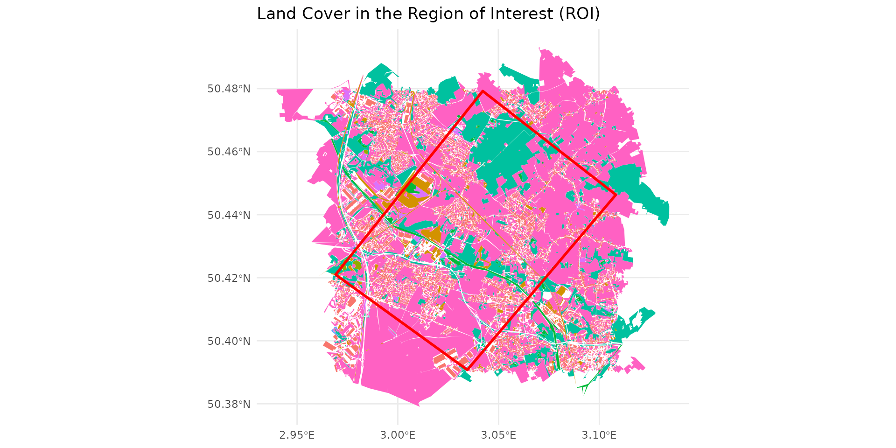
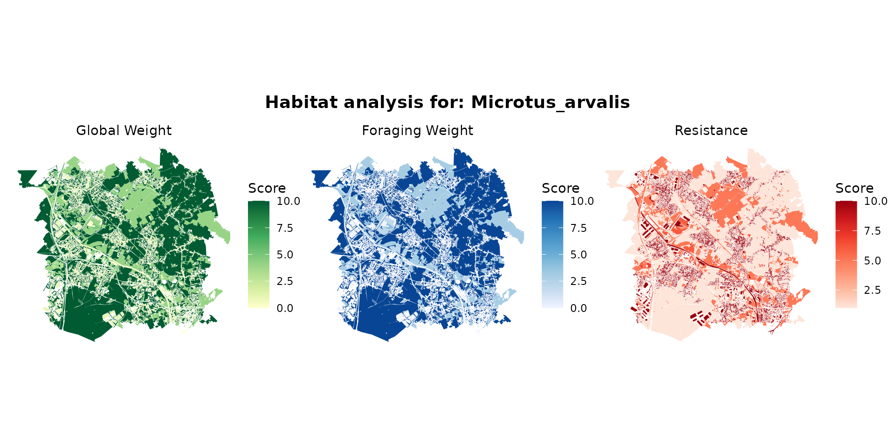
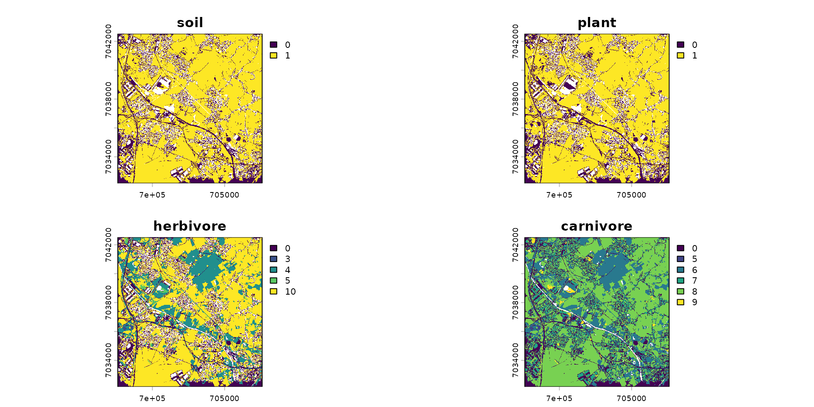
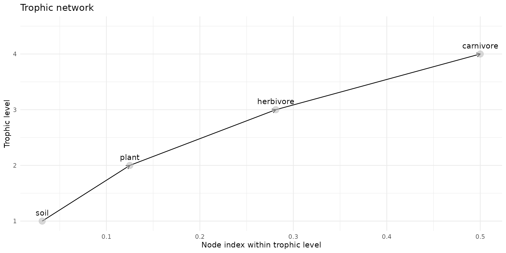
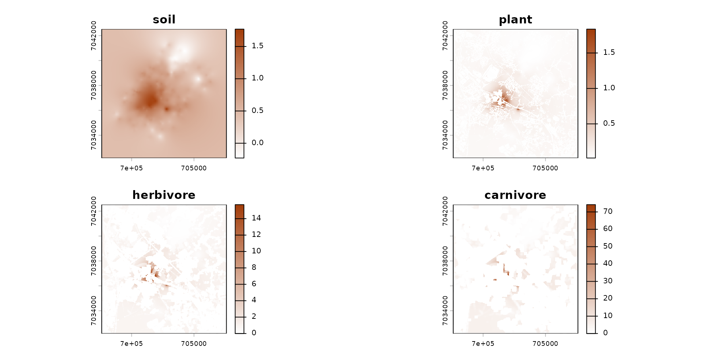
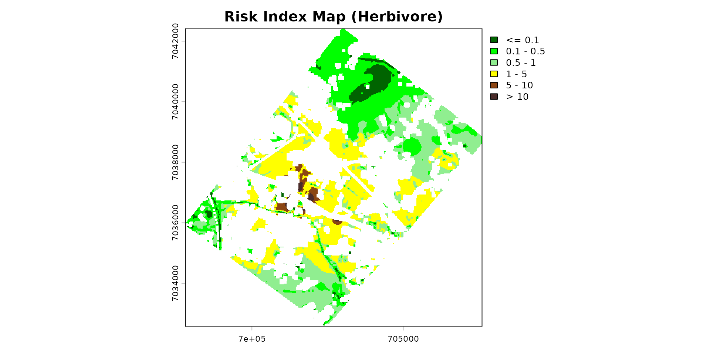

# Getting Started: Overview of spacemodR

Welcome to `spacemodR`! This Getting Started guide provides a high-level
overview of the package’s capabilities.

The primary goal of `spacemodR` is to perform **Spatially Explicit
Ecological Risk Assessments (ERA)**. Rather than calculating a global,
single-point risk for a site, we integrate the actual geography of the
landscape to map ecological and contaminant flows.

To achieve this, we follow a logical, modular pipeline:

1.  **Landscape and Habitats**: Define the study area and the species’
    ability to inhabit it.
2.  **Trophic Web**: Define “who eats whom” (predator-prey
    relationships).
3.  **The Spacemodel**: The core object that merges spatial data with
    ecological relationships.
4.  **Dispersal**: Model animal movement across the landscape.
5.  **Transfer and Exposure**: Track the propagation of a contaminant
    through the food web.
6.  **Risk Mapping**: Generate spatial risk indices (e.g., Eco-SSL).

Let’s start by loading the necessary packages:

``` r

library(spacemodR)
library(ggplot2)
library(terra)
```

------------------------------------------------------------------------

## 1. Landscape and Habitats

Everything starts with geography. `spacemodR` facilitates the extraction
and manipulation of land cover data (like the OCS-GE database in France)
for a given Region of Interest (ROI).

First, we load data from a site in northern France. Here, we use the
provided data (`ocsge_metaleurop` and `roi_metaleurop`) along with the
`ggplot2` package for visualization.

``` r

# Load a study area (e.g., the Metaleurop site) and its land cover data
data("roi_metaleurop")
data("ocsge_metaleurop")

ggplot() +
  theme_minimal() +
  geom_sf(data=ocsge_metaleurop, aes(fill=code_cs), color=NA) +
  geom_sf(data=roi_metaleurop, fill=NA, color="red", size=1) +
  theme(legend.position = "none") +
  labs(title="Land Cover in the Region of Interest (ROI)")
```



From these vector polygons, we define **habitats** for our species. A
habitat is a combination of favorable, unfavorable, or neutral zones.
These geometries are then rasterized (converted into regular grids) to
prepare them for modeling.

``` r

# Example: Loading a background concentration raster for a contaminant (Cadmium)
ground_cd <- load_raster_extdata("ground_concentration_cd_compressed.tif")

# Habitat definition based on OSGE codes (which are in the `ocsge_metaleurop` table)
layer_soil_natural = ocsge_metaleurop$code_cs %in% 
  c("CS1.2.1","CS2.1.1.1","CS2.1.1.2","CS2.1.1.3", "CS2.1.2","CS2.1.3","CS2.2.1","CS2.2.3")
layer_soil_artificial = ocsge_metaleurop$code_cs %in%
  c("CS1.1.1.1", "CS1.1.1.2", "CS1.1.2.1")
layer_plant = ocsge_metaleurop$code_cs %in% 
   c("CS2.1.1.1", "CS2.1.1.2", "CS2.1.1.3", "CS2.1.3", "CS2.2.1")
```

``` r

habitat_sol = habitat() |>
  add_habitat(ocsge_metaleurop[layer_soil_natural,]) |>
  add_nohabitat(ocsge_metaleurop[layer_soil_artificial,])
plot(habitat_sol)
```


``` r

habitat_plante = habitat() |>
  add_habitat(ocsge_metaleurop[layer_plant,]) |>
  add_nohabitat(ocsge_metaleurop[layer_soil_artificial,])
```

Some of these habitat specificities are included in the project.
Currently, there are 935 species, including 499 birds, 215 mammals, 136
reptiles, and 85 amphibians.

For example, for the common vole (*Microtus arvalis*):

``` r

microtus_hab <- join_ocsge_species(ocsge_metaleurop, "Microtus_arvalis")
plot_species_habitat(microtus_hab)
```



… and the greater white-toothed shrew (*Crocidura russula*):

``` r

crocidura_hab <- join_ocsge_species(ocsge_metaleurop, "Crocidura")
plot_species_habitat(crocidura_hab)
```


To understand the 3 maps in detail, please refer to the **Habitat**
page. Briefly:

- **Global weight**: This is the carrying capacity (or general
  attractiveness) of an environment for the species.
- **Foraging weight**: This is the trophic attractiveness of the
  environment. An animal does not necessarily feed everywhere it lives.
- **Resistance** (Movement resistance / Spatial friction): This is the
  energetic cost or danger associated with crossing this environment.
  This parameter is used by connectivity and dispersal models (like the
  Omniscape algorithm discussed later).

``` r

# We use the `weight_global` as habitat
habitat_herbivore <- habitat(microtus_hab, habitat=TRUE, weight=microtus_hab$weight_global) |>
  add_nohabitat(microtus_hab[microtus_hab$resistance==10,])
habitat_carnivore <- habitat(crocidura_hab, habitat=TRUE, weight=crocidura_hab$weight_global) |>
  add_nohabitat(crocidura_hab[crocidura_hab$resistance==10,])
```

At this stage, now that the habitats are defined, we rasterize the
habitats based on a default layer, here `cd_ground`. This allows us to
have the same landscape grid so we can successfully overlay all the
layers.

``` r

# We initialize habitat grids (rasters) for each level
rast_sol <- habitat_raster(ground_cd, habitat_sol)
rast_plant <- habitat_raster(ground_cd, habitat_plante)
rast_herbivor <- habitat_raster(ground_cd, habitat_herbivore)
rast_carnivor <- habitat_raster(ground_cd, habitat_carnivore)

# We create the `raster_stack` of the habitats
stack_habitat <- raster_stack(
  raster_list = list(rast_sol, rast_plant, rast_herbivor, rast_carnivor),
  names = c("soil", "plant", "herbivore", "carnivore")
)

terra::plot(stack_habitat)
```



------------------------------------------------------------------------

## 2. The Trophic Web

Once our maps are created, we need to link these layers through
ecological interactions. `spacemodR` uses a **Directed Acyclic Graph
(DAG)** to define prey, predators, and the flow of energy (or
contaminants).

``` r

# Build the trophic web
trophic_df <- trophic() |>
  add_link(from = "soil", to = "plant") |>
  add_link(from = "plant", to = "herbivore") |>
  add_link(from = "herbivore", to = "carnivore")

# Visualize the trophic links
plot(trophic_df)
```



------------------------------------------------------------------------

## 3. The Spacemodel: The Core Object

The `spacemodel` is the heart of the package. It inherently links the
spatial dimension (the `raster_stack`) with the ecological dimension
(the `trophic_df` graph).

Any subsequent operation (dispersal, exposure) will use this object to
ensure computational consistency.

``` r

spcmdl <- spacemodel(stack_habitat, trophic_df)
print(spcmdl)
#> class       : SpatRaster
#> size        : 415, 401, 4  (nrow, ncol, nlyr)
#> resolution  : 24.93766, 24.93976  (x, y)
#> extent      : 697602.7, 707602.7, 7032171, 7042521  (xmin, xmax, ymin, ymax)
#> coord. ref. : RGF93 v1 / Lambert-93 (EPSG:2154)
#> source(s)   : memory
#> varnames    : ground_concentration_cd_compressed
#>               ground_concentration_cd_compressed
#>               ground_concentration_cd_compressed
#>               ground_concentration_cd_compressed
#> names       : soil, plant, herbivore, carnivore
#> min values  :    0,     0,         0,         0
#> max values  :    1,     1,        10,         9
```

------------------------------------------------------------------------

## 4. Dispersal and Movement

Animals are not static. An individual’s exposure depends on its
movements (its foraging radius, its dispersal). `spacemodR` allows you
to simulate these movements, for instance via convolution kernels or
circuit theory (Omniscape).

``` r

# Compute dispersal kernels based on a mobility radius (e.g., in pixels)
k_herb <- compute_kernel(radius=50, GSD=25, size_std=0.5)
k_carn <- compute_kernel(radius=150, GSD=25, size_std=0.5)

# Apply dispersal to the spacemodel
spcmdl_dispersal <- spcmdl |>
  dispersal("herbivore", method="convolution", method_option=list(kernel=k_herb)) |>
  dispersal("carnivore", method="convolution", method_option=list(kernel=k_carn))

# Note: In this example, the soil and plants are static and do not disperse.
```

------------------------------------------------------------------------

## 5. Exposure and Contaminant Transfer

Now that the system is set up, we can “inject” our actual pollutant
concentrations into the soil, and model its bioconcentration and
bioaccumulation up to the top of the food chain using the
[`transfer()`](https://qonfluens.github.io/spacemodR/reference/transfer.md)
function.

``` r

# 1. Assign the actual concentration grid into the "soil" layer
spcmdl_dispersal[["soil"]][] <- ground_cd

# 2. Define the transfer equations (Bioaccumulation / Bioconcentration Factors)
fluxes <- flux(spcmdl_dispersal, default = 1) |>
  add_flux("soil", "plant",  ~ 10^x / 32) |> # Specific equation for plants
  add_flux("soil", "herbivore",  0.5) |>     # Simple transfer factor for the herbivore
  add_flux("herbivore", "carnivore",  0.8)   # Simple transfer factor for the carnivore

# 3. Gather our dispersal kernels for the exposure calculation
kernels <- list(soil = NA, plant = NA, herbivore = k_herb, carnivore = k_carn)

# 4. Compute the global transfer throughout the ecosystem
spcmdl_transfer <- transfer(spcmdl_dispersal, kernels, fluxes)

# Visualize the contamination absorbed by the carnivore
color_transfer <- colorRampPalette(c("white", "#A33D0A"))(255)
terra::plot(spcmdl_transfer, col=color_transfer)
```



------------------------------------------------------------------------

## 6. Ecological Risk Mapping

The final step of an ERA often involves generating a **Risk Index**
(e.g., Hazard Quotient or Eco-SSL approach). This allows us to map
“Hot-Spots” where ecotoxicological reference thresholds are exceeded.

``` r

# Define risk classes (from "Safe" to "Very High Risk")
breaks_risk <- c(-Inf, 0.1, 0.5, 1, 5, 10, Inf)
cols_risk <- c(
  "darkgreen",   # 0 - 0.1 (No Risk)
  "green",       # 0.1 - 0.5
  "lightgreen",  # 0.5 - 1 (Threshold limit)
  "yellow",      # 1 - 5 (Moderate Risk)
  "saddlebrown", # 5 - 10 (High Risk)
  "#4A2C2A"      # > 10 (Severe Risk)
)

# Project the risk onto the Region of Interest
poly_vect <- terra::project(terra::vect(roi_metaleurop), terra::crs(spcmdl_transfer))
rast_crop <- terra::crop(spcmdl_transfer[["herbivore"]], poly_vect)
rast_final <- terra::mask(rast_crop, poly_vect)

terra::plot(rast_final,
            breaks = breaks_risk,
            col = cols_risk,
            main = "Risk Index Map (Herbivore)")
```



------------------------------------------------------------------------

## Next Steps

You have just seen the entire `spacemodR` pipeline in action! To go
further and finely configure each step, we invite you to consult our
specialized guides:

- 🧩️ **Habitat Layer**: Build complex habitat and resistance maps from
  vector geometries.
- 🧩️️ **Landscape Connectivity**: Integrate circuit theory (Omniscape) to
  model the movement of large mammals
- 🎯️ **Tuning Parameters**: Explore parameters and their inference (with
  Bayesian tools).
- 🧪 **The Example Zoo**: Explore real-world case studies (like the
  complete Berisp model).
