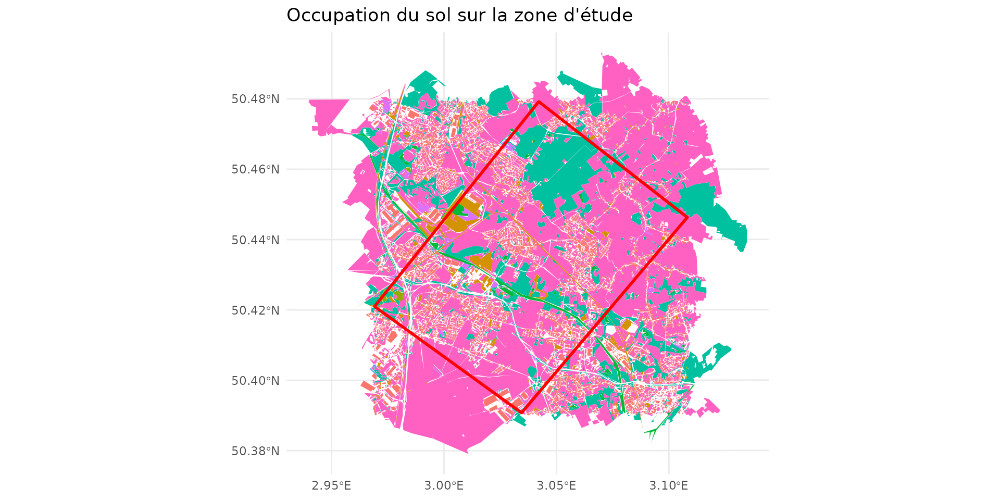
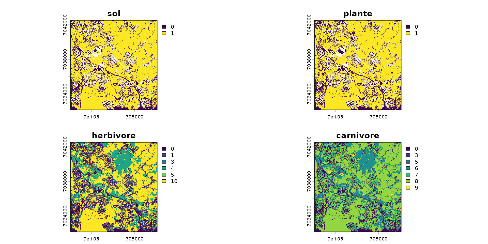
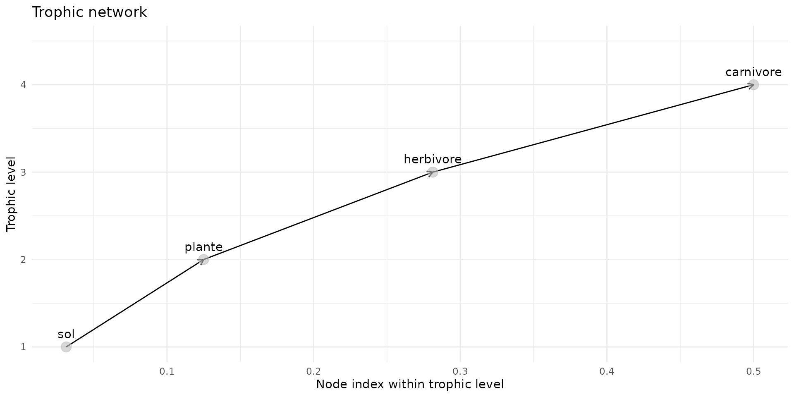
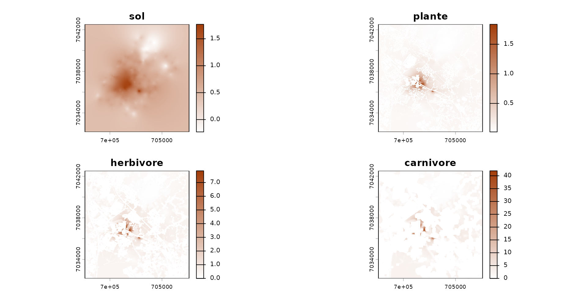
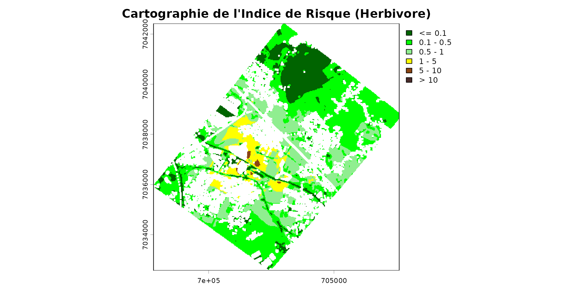

# Getting Started: Vue d'ensemble de spacemodR

Bienvenue dans `spacemodR` ! Ce guide de démarrage (“Getting Started”)
vous offre une vue d’ensemble des capacités du package.

L’objectif de `spacemodR` est de réaliser des **Évaluations des Risques
Écologiques (ERE) spatialement explicites**. Plutôt que de calculer un
risque global sur un site, nous intégrons la géographie réelle du
paysage pour cartographier les flux.

Pour cela, nous suivons un pipeline logique et modulaire :

1.  **Le Paysage et les Habitats** : Définir la zone d’étude et la
    capacité des espèces à y vivre.
2.  **Le Réseau Trophique** : Définir “qui mange qui” (les proies et les
    prédateurs).
3.  **Le Spacemodel** : L’objet central qui fusionne l’espace et les
    relations écologiques.
4.  **La Dispersion** : Modéliser le mouvement des animaux dans le
    paysage.
5.  **Le Transfert et l’Exposition** : Suivre la propagation d’un
    contaminant à travers le réseau trophique.
6.  **La Cartographie du Risque** : Générer des indices de risque
    spatiaux (ex: Eco-SSL).

Commençons par charger les packages nécessaires :

``` r

library(spacemodR)
library(ggplot2)
library(terra)
```

------------------------------------------------------------------------

## 1. Le Paysage et les Habitats

Tout commence par la géographie. `spacemodR` facilite l’extraction et la
manipulation de données d’occupation du sol (comme la base OCS-GE en
France) pour une zone d’intérêt (Region of Interest - ROI).

Nous chargeons dans un premier temps les données d’un site dans le nord
de la France. Ici, on utilise les présente (`ocsge_metaleurop` et
`roi_metaleurop`) ainsi que le package `ggplot2` pour la représentation.

``` r

# Charger une zone d'étude (ex: site de Metaleurop) et les données d'occupation du sol
data("roi_metaleurop")
data("ocsge_metaleurop")

ggplot() +
  theme_minimal() +
  geom_sf(data=ocsge_metaleurop, aes(fill=code_cs), color=NA) +
  geom_sf(data=roi_metaleurop, fill=NA, color="red", size=1) +
  theme(legend.position = "none") +
  labs(title="Occupation du sol sur la zone d'étude")
```



À partir de ces polygones, nous définissons des **habitats** pour nos
espèces. Un habitat est une combinaison de zones favorables,
défavorables ou neutres. Ces géométries sont ensuite transformées en
grilles régulières (rasters) prêtes pour la modélisation.

``` r

# Exemple: Chargement d'un raster de la concentration de fond d'un contaminant (Cadmium)
ground_cd <- load_raster_extdata("ground_concentration_cd_compressed.tif")

# Définition d'habitat à partir des code OSGE (qui sont dans le tableau `ocsge_metaleurop`)
layer_soil_natural = ocsge_metaleurop$code_cs %in% 
  c("CS1.2.1","CS2.1.1.1","CS2.1.1.2","CS2.1.1.3", "CS2.1.2","CS2.1.3","CS2.2.1","CS2.2.3")
layer_soil_artificial = ocsge_metaleurop$code_cs %in%
  c("CS1.1.1.1", "CS1.1.1.2", "CS1.1.2.1")
layer_plant = ocsge_metaleurop$code_cs %in% 
   c("CS2.1.1.1", "CS2.1.1.2", "CS2.1.1.3", "CS2.1.3", "CS2.2.1")
```

``` r

habitat_sol = habitat() |>
  add_habitat(ocsge_metaleurop[layer_soil_natural,]) |>
  add_nohabitat(ocsge_metaleurop[layer_soil_artificial,])
plot(habitat_sol)
```


``` r

habitat_plante = habitat() |>
  add_habitat(ocsge_metaleurop[layer_plant,]) |>
  add_nohabitat(ocsge_metaleurop[layer_soil_artificial,])
```

Certaines de ces spécificités d’habitats sont incluses dans le projet.
Pour l’instant, 935 espèces dont 499 oiseaux, 215 mammifères, 136
reptiles et 85 amphibiens.

Par exemple pour le campagnol des champs (*Microtus arvalis*):

``` r

microtus_hab <- join_ocsge_species(ocsge_metaleurop, "Microtus_arvalis")
plot_species_habitat(microtus_hab)
```


… et la musaraigne grise commune (*Crocidura russula*):

``` r

crocidura_hab <- join_ocsge_species(ocsge_metaleurop, "Crocidura")
plot_species_habitat(crocidura_hab)
```


Pour comprendre les 3 cartes en détails, ce référer à la page
**Habitat**. Brièvement:

- **Global weight** (pondération globale), c’est la capacité d’accueil
  (ou l’attractivité générale) d’un milieu pour l’espèce.
- **Foraging weight** (pondération de recherche de nourriture) : c’est
  l’attractivité trophique du milieu. Un animal ne se nourrit pas
  forcément partout où il vit.
- **Resistance** (résistance au déplacement / Friction spatiale) : c’est
  le coût énergétique ou le danger lié à la traversée de ce milieu. Ce
  paramètre est utilisé par les modèles de connectivité et de dispersion
  (comme l’algorithme Omniscape abordé plus tard).

``` r

# nous utilise le poids `weight_global` comme habitat
habitat_herbivore <- habitat(microtus_hab, habitat=TRUE, weight=microtus_hab$weight_global)
habitat_carnivore <- habitat(crocidura_hab, habitat=TRUE, weight=crocidura_hab$weight_global)
```

A cette étape, maintenant que les habitats sont défini, on rasterize les
habitats selon une couche par défaut, ici `cd_ground`, qui va permettre
d’avoir la même grille paysagère afin de pouvoir superposer toutes les
couches.

``` r

# On initialise des grilles d'habitats (raster) pour chaque maillon
rast_sol <- habitat_raster(ground_cd, habitat_sol)
rast_plant <- habitat_raster(ground_cd, habitat_plante)
rast_herbivor <- habitat_raster(ground_cd, habitat_herbivore)
rast_carnivor <- habitat_raster(ground_cd, habitat_carnivore)

# On créé le `raster_stack` des habiats
stack_habitat <- raster_stack(
  raster_list = list(rast_sol, rast_plant, rast_herbivor, rast_carnivor),
  names = c("sol", "plante", "herbivore", "carnivore")
)

terra::plot(stack_habitat)
```



------------------------------------------------------------------------

## 2. Le Réseau Trophique

Une fois nos cartes créées, nous devons relier ces couches par des
interactions écologiques. `spacemodR` utilise un **Graphe Orienté
Acyclique (DAG)** pour définir les proies, les prédateurs, et le flux de
l’énergie (ou des contaminants).

``` r

# Construction du réseau trophique
trophic_df <- trophic() |>
  add_link(from = "sol", to = "plante") |>
  add_link(from = "plante", to = "herbivore") |>
  add_link(from = "herbivore", to = "carnivore")

# Visualisation des liens trophiques
plot(trophic_df)
```



------------------------------------------------------------------------

## 3. Le Spacemodel : l’objet central

Le `spacemodel` est le cœur du package. Il lie intrinsèquement la
dimension spatiale (le `raster_stack`) et la dimension écologique (le
graphe `trophic_df`).

Toute opération ultérieure (dispersion, exposition) utilisera cet objet
pour garantir la cohérence des calculs.

``` r

spcmdl <- spacemodel(stack_habitat, trophic_df)
print(spcmdl)
#> class       : SpatRaster
#> size        : 415, 401, 4  (nrow, ncol, nlyr)
#> resolution  : 24.93766, 24.93976  (x, y)
#> extent      : 697602.7, 707602.7, 7032171, 7042521  (xmin, xmax, ymin, ymax)
#> coord. ref. : RGF93 v1 / Lambert-93 (EPSG:2154)
#> source(s)   : memory
#> varnames    : ground_concentration_cd_compressed
#>               ground_concentration_cd_compressed
#>               ground_concentration_cd_compressed
#>               ground_concentration_cd_compressed
#> names       : sol, plante, herbivore, carnivore
#> min values  :   0,      0,         0,         0
#> max values  :   1,      1,        10,         9
```

------------------------------------------------------------------------

## 4. La Dispersion et le Mouvement

Les animaux ne sont pas statiques. L’exposition d’un individu dépend de
ses déplacements (son rayon de recherche de nourriture, sa dispersion).
`spacemodR` permet de simuler ces mouvements, par exemple via des noyaux
de convolution (kernels) ou la théorie des circuits (Omniscape).

``` r

# Calcul des noyaux de dispersion en fonction d'un rayon de mobilité (ex: en pixels)
k_herb <- compute_kernel(radius=50, GSD=25, size_std=0.5)
k_carn <- compute_kernel(radius=150, GSD=25, size_std=0.5)

# Application de la dispersion sur le spacemodel
spcmdl_dispersal <- spcmdl |>
  dispersal("herbivore", method="convolution", method_option=list(kernel=k_herb)) |>
  dispersal("carnivore", method="convolution", method_option=list(kernel=k_carn))

# Note : le sol et les plantes sont évidemment statiques et ne dispersent pas.
```

------------------------------------------------------------------------

## 5. Exposition et Transfert des Contaminants

Maintenant que le système est en place, nous pouvons “injecter” la
concentration de notre polluant dans le sol, et modéliser sa
bioconcentration et sa bioaccumulation jusqu’au sommet de la chaîne
alimentaire grâce à la fonction
[`transfer()`](https://qonfluens.github.io/spacemodR/reference/transfer.md).

``` r

# 1. On assigne la grille de concentration réelle dans la couche "soil"
spcmdl_dispersal[["sol"]][] <- ground_cd

# 2. On définit les équations de transfert (Facteurs de Bioaccumulation / Bioconcentration)
intakes <- intake(spcmdl_dispersal,
  "sol -> plante" = ~ 10^x / 32,      # Equation spécifique pour les plantes
  "plante -> herbivore" = 0.5,         # Facteur simple pour l'herbivore
  "herbivore -> carnivore" = 0.8,     # Facteur simple pour le carnivore
  default = 1
)

# 3. On rassemble nos noyaux de dispersion pour le calcul de l'exposition
kernels <- list(sol = NA, plante = NA, herbivore = k_herb, carnivore = k_carn)

# 4. Calcul du transfert global dans l'écosystème
spcmdl_transfer <- transfer(spcmdl_dispersal, kernels, intakes)

# Visualisation de la contamination absorbée par le carnivore
color_transfer <- colorRampPalette(c("white", "#A33D0A"))(255)
terra::plot(spcmdl_transfer, col=color_transfer)
```



------------------------------------------------------------------------

## 6. Cartographie du Risque Écologique

L’étape finale de l’ERA consiste souvent à générer un **Indice de
Risque** (par exemple, le Quotient de Danger ou l’approche Eco-SSL).
Cela permet de cartographier les “Hot-Spots” où les seuils de toxicité
de référence sont dépassés.

``` r

# Définition des classes de risque (de "Sûr" à "Risque Très Élevé")
breaks_risk <- c(-Inf, 0.1, 0.5, 1, 5, 10, Inf)
cols_risk <- c(
  "darkgreen",   # 0 - 0.1 (Pas de risque)
  "green",       # 0.1 - 0.5
  "lightgreen",  # 0.5 - 1 (Limite)
  "yellow",      # 1 - 5 (Risque modéré)
  "saddlebrown", # 5 - 10 (Risque fort)
  "#4A2C2A"      # > 10 (Risque très sévère)
)

# Projection du risque sur la zone d'étude
poly_vect <- terra::project(terra::vect(roi_metaleurop), terra::crs(spcmdl_transfer))
rast_crop <- terra::crop(spcmdl_transfer[["herbivore"]], poly_vect)
rast_final <- terra::mask(rast_crop, poly_vect)

terra::plot(rast_final,
            breaks = breaks_risk,
            col = cols_risk,
            main = "Cartographie de l'Indice de Risque (Herbivore)")
```



------------------------------------------------------------------------

## Prochaines Étapes

Vous venez de voir l’ensemble du pipeline `spacemodR` en action ! Pour
aller plus loin et configurer finement chaque étape, nous vous invitons
à consulter nos guides spécialisés :

- 🧩️ **Habitat Layer** : Construire des cartes de résistance et
  d’habitats complexes depuis des vecteurs.
- 🧩️ **Landscape Connectivity** : Intégrer la théorie des circuits
  (Omniscape) pour le mouvement des grands mammifères.
- 🎯️ **Tuning Parameters**: Faire l’inférence des paramètres (méthodes
  Bayesiennes).
- 🧪 **The Example Zoo** : Explorer des cas d’études réels (comme le
  modèle Berisp complet).
