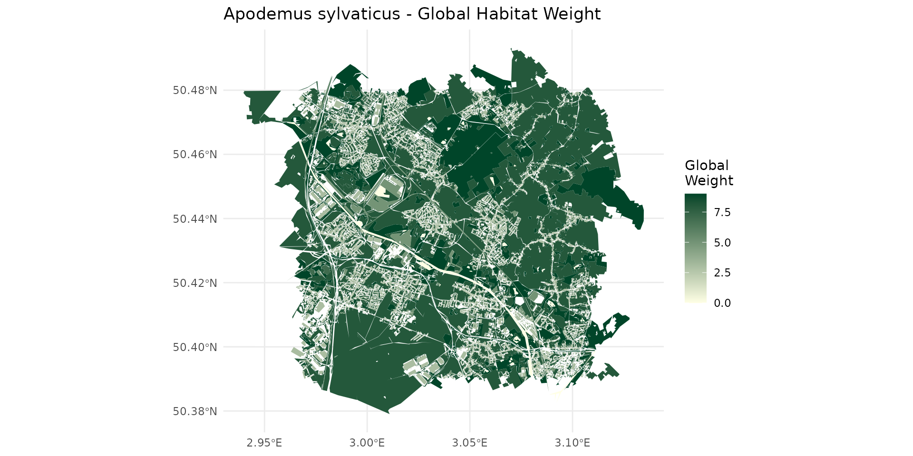
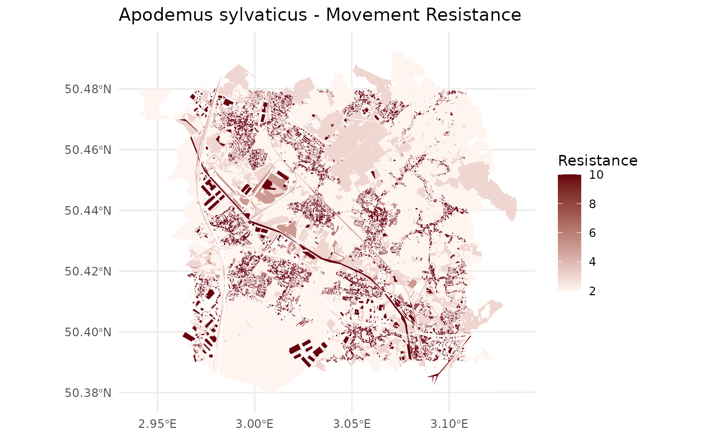
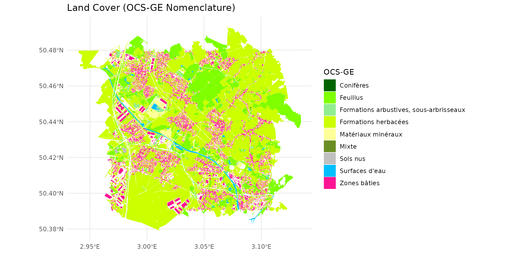
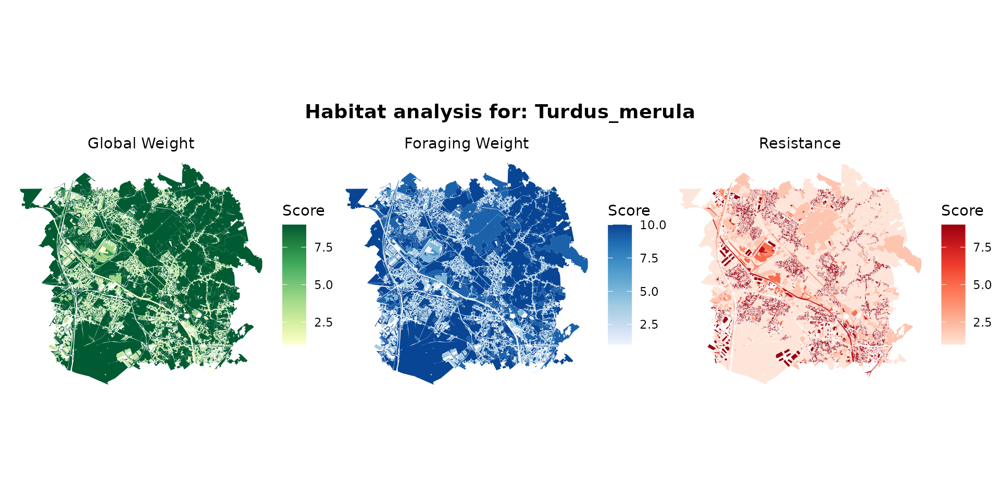
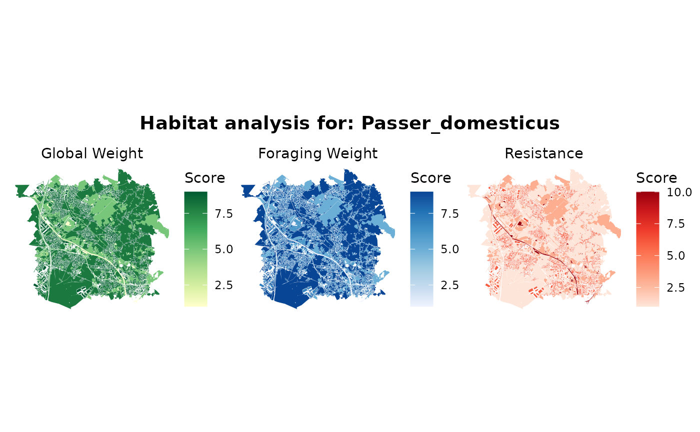
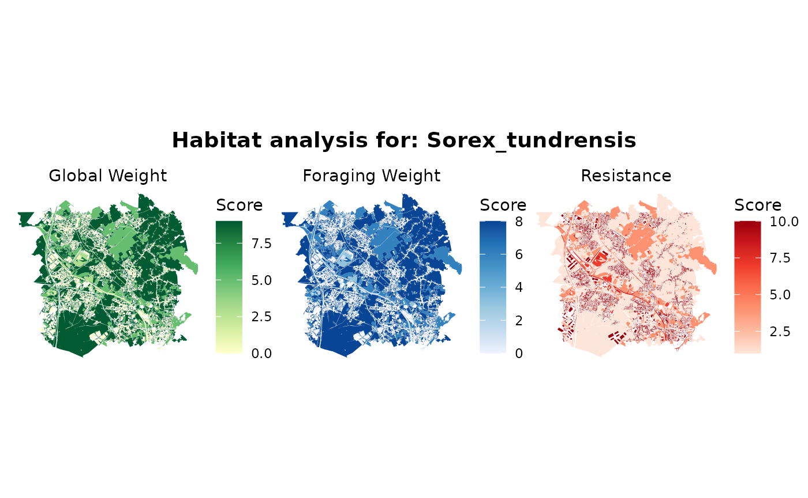
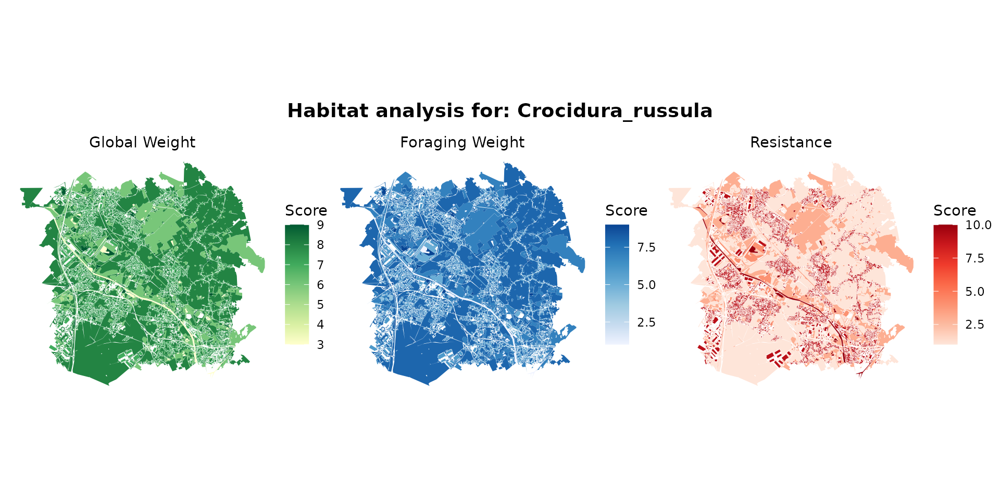
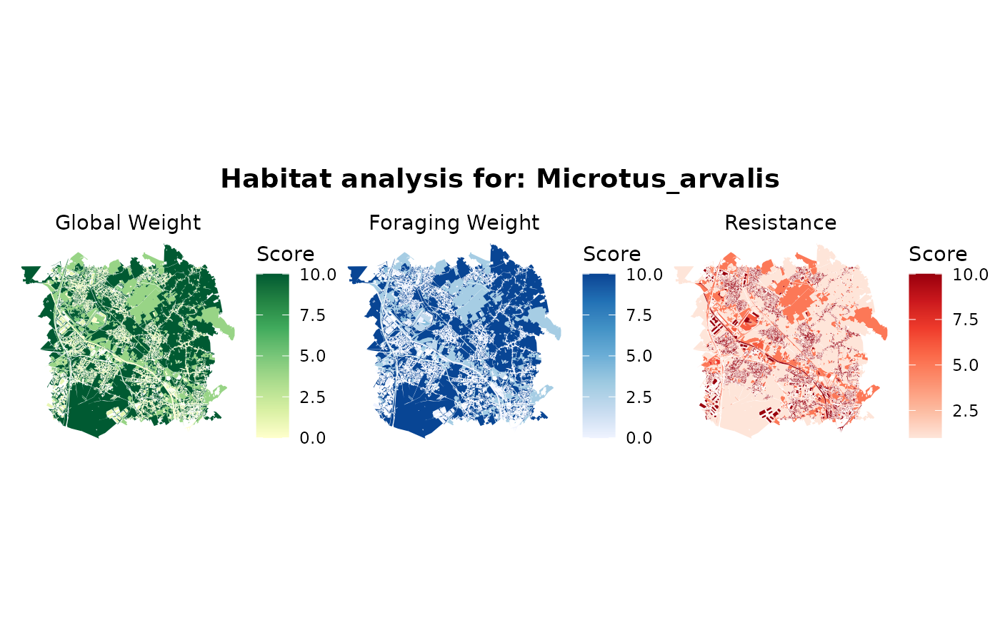

# Habitat Analysis and Visualization

## Introduction

In this vignette, we explore the database linking OCS-GE (French GIS
layer for Occupation du Sol à Grande Échelle) labels with species
labels.

We will analyze how different land cover types act as habitats with
varying qualities or resistances for different species, starting with
the Wood mouse (Apodemus sylvaticus).

``` r
library(spacemodR)
library(dplyr)
library(ggplot2)
library(sf)
library(leaflet)
library(patchwork)
```

## Weighted species habitat with OCS-GE layer for *Apodemus sylvaticus*

First, we load the necessary datasets provided by spacemodR:

1.  The species dictionary assigning weights to land cover codes.
2.  The OCS-GE nomenclature reference (containing names and specific hex
    colors).
3.  The spatial layer for OCS-GE (here, we use the ocsge_metaleurop
    dataset as our base map).

``` r
# Load the species dict and reference tables
data("ocsge_species_dict")
data("ref_ocsge")

# Load spatial data
data("ocsge_metaleurop") 
sf_ocsge <- ocsge_metaleurop
```

We filter our species dictionary for *Apodemus sylvaticus* and join it
with the reference nomenclature to link the OCS-GE codes to their
descriptive labels and predefined colors.

``` r
# Filter for Apodemus sylvaticus
dfhab_Apsy <- ocsge_species_dict[
  grepl("Apodemus_sylvaticus",ocsge_species_dict$nom_espece, ignore.case = TRUE), 
  ]

# Join ref_ocsge with the species dictionary. 
# ref_ocsge$code_cs_ (with spaces) matches ocsge_species_dict$code_cs
df_merged_Apsy <- ref_ocsge %>%
  dplyr::left_join(dfhab_Apsy, by = c("code_cs_" = "code_cs"))

# Join with the spatial sf object. Assuming sf_ocsge uses 'code_cs' (without spaces)
sf_Apsy <- sf_ocsge %>%
  dplyr::left_join(df_merged_Apsy, by = "code_cs")
```

### Understanding Habitat Values

By examining the weight_global (wg), we can classify the landscape into
different habitat qualities for the species:

- Non-habitat area (wg = 0):

``` r
df_merged_Apsy %>% 
  filter(weight_global == 0) %>%
  pull(nomenclature) %>%
  unique()
#> [1] "Surfaces d'eau"    "Névés et glaciers"
```

- Very Poor habitat (0 \< wg \<= 3):

``` r
df_merged_Apsy %>% 
  filter(weight_global > 0, weight_global <= 3) %>% 
  pull(nomenclature) %>% 
  unique()
#> [1] "Zones bâties"                    "Zones non bâties"               
#> [3] "Autres formations non ligneuses"
```

- Poor habitat (3 \< wg \<= 7):

``` r
df_merged_Apsy %>% 
  filter(weight_global > 7) %>% 
  pull(nomenclature) %>% 
  unique()
#> [1] "Feuillus"                               
#> [2] "Conifères"                              
#> [3] "Mixte"                                  
#> [4] "Formations arbustives, sous-arbrisseaux"
#> [5] "Formations herbacées"
```

- Good habitat (wg \> 7):

``` r
df_merged_Apsy %>% 
  filter(weight_global > 7) %>% 
  pull(nomenclature) %>% 
  unique()
#> [1] "Feuillus"                               
#> [2] "Conifères"                              
#> [3] "Mixte"                                  
#> [4] "Formations arbustives, sous-arbrisseaux"
#> [5] "Formations herbacées"
```

### Static Mapping

We will now visualize the spatial distribution of these metrics. We
produce four maps focusing on Global Weight, Foraging Weight, Landscape
Resistance, and finally the standard OCS-GE Land Cover.



### Interactive Synthesis

To better explore the local variations and overlay different habitat
parameters for *Apodemus sylvaticus*, we combine them into a single
interactive leaflet map. You can toggle the layers in the top right
corner.

## Multi-species Interactive Synthesis

Different species interact with the landscape in radically different
ways. Below, we create a function to automatically generate the
interactive Leaflet synthesis for any given species, allowing us to
rapidly compare their habitat preferences.

``` r
plot_species_ggplot <- function(species_pattern) {
  
  # Find matching species in dict
  matched <- ocsge_species_dict[grepl(species_pattern, ocsge_species_dict$nom_espece, ignore.case = TRUE), ]
  
  if(nrow(matched) == 0) {
    message(paste("No data found for", species_pattern))
    return(NULL)
  }
  
  # Take the first match if multiple exist
  sp_target <- matched$nom_espece[1]
  df_sp <- matched[matched$nom_espece == sp_target, ]
  
  # Join data
  df_merged <- ref_ocsge %>% dplyr::left_join(df_sp, by = c("code_cs_" = "code_cs"))
  sf_merged <- sf_ocsge %>% dplyr::left_join(df_merged, by = "code_cs")
  # 1. Map: Global Weight
  p1 <- ggplot(sf_merged) +
    geom_sf(aes(fill = weight_global), color = NA) +
    scale_fill_distiller(palette = "YlGn", direction = 1, na.value = "transparent", name = "Score") +
    theme_void() +
    labs(subtitle = "Global Weight") +
    theme(plot.subtitle = element_text(hjust = 0.5))
  
  # 2. Map: Foraging Weight
  p2 <- ggplot(sf_merged) +
    geom_sf(aes(fill = weight_foraging), color = NA) +
    scale_fill_distiller(palette = "Blues", direction = 1, na.value = "transparent", name = "Score") +
    theme_void() +
    labs(subtitle = "Foraging Weight") +
    theme(plot.subtitle = element_text(hjust = 0.5))
  
  # 3. Map: Resistance
  p3 <- ggplot(sf_merged) +
    geom_sf(aes(fill = resistance), color = NA) +
    scale_fill_distiller(palette = "Reds", direction = 1, na.value = "transparent", name = "Score") +
    theme_void() +
    labs(subtitle = "Resistance") +
    theme(plot.subtitle = element_text(hjust = 0.5))
  
  # Combine the 3 plots side-by-side using patchwork
  combined_plot <- p1 + p2 + p3 + 
    patchwork::plot_annotation(
      title = paste("Habitat analysis for:", sp_target),
      theme = theme(plot.title = element_text(size = 14, face = "bold", hjust = 0.5))
    )
  
  return(combined_plot)
}
```

### Turdus merula (Blackbird)

``` r
plot_species_ggplot("Turdus_merula")
```



### Passer domesticus (House Sparrow)

``` r
plot_species_ggplot("Passer_domesticus")
```



### Other Small Mammals (Sorex, Crocidura, Microtus arvalis)

``` r
plot_species_ggplot("Sorex")
```



``` r
plot_species_ggplot("Crocidura")
```



``` r
plot_species_ggplot("Microtus_arvalis")
```


