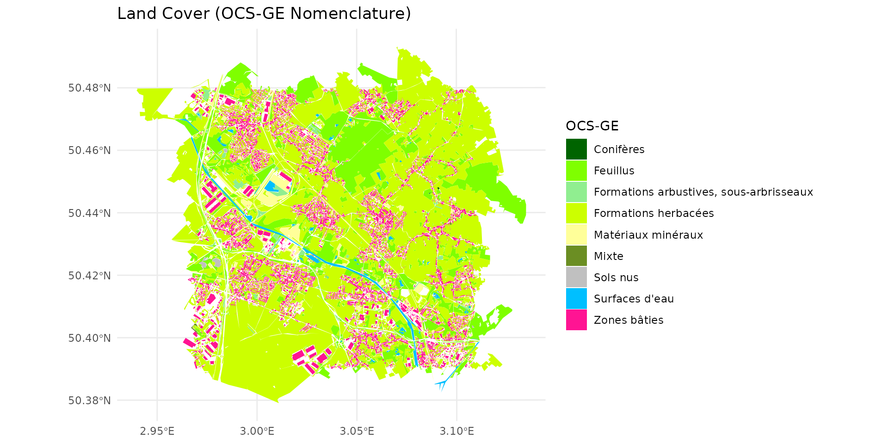
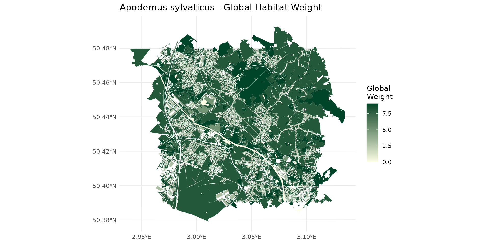
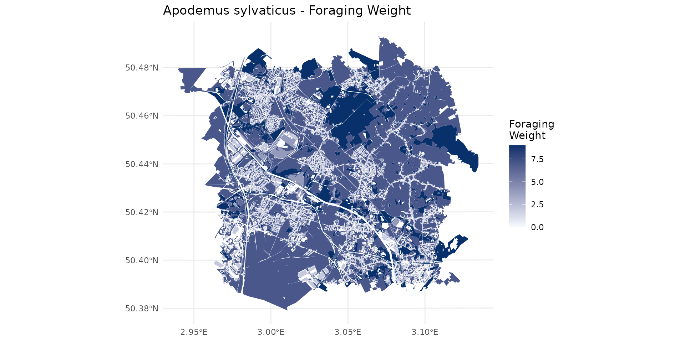
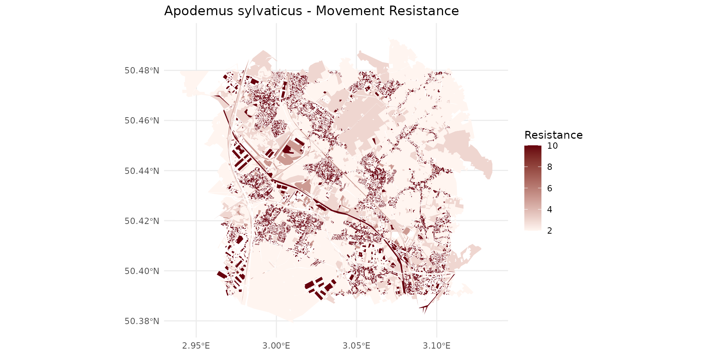
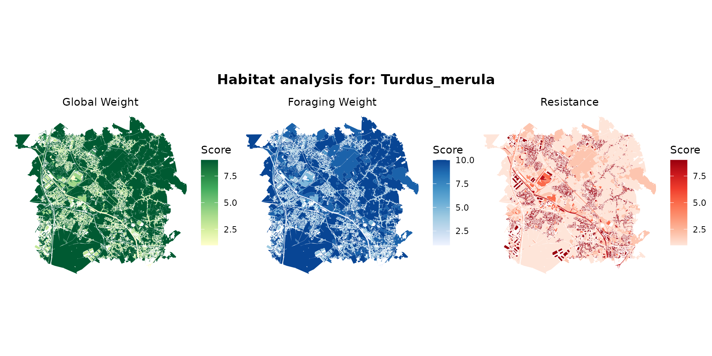
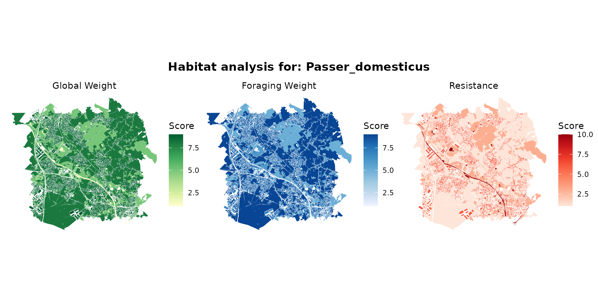
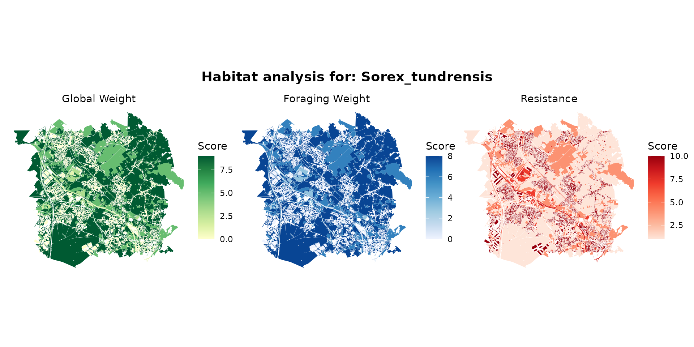
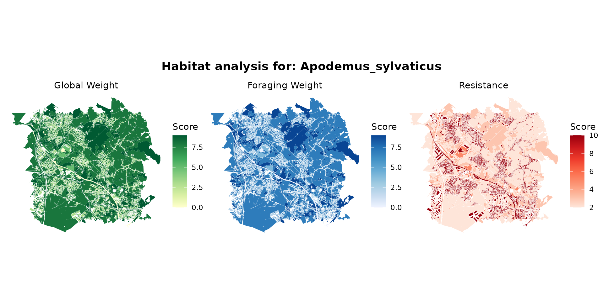
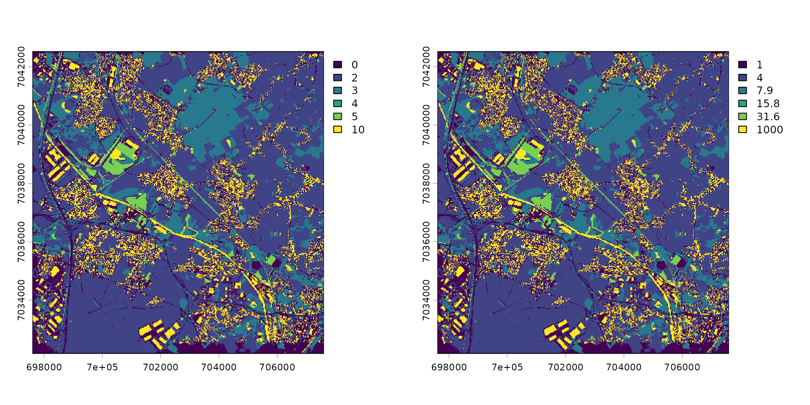
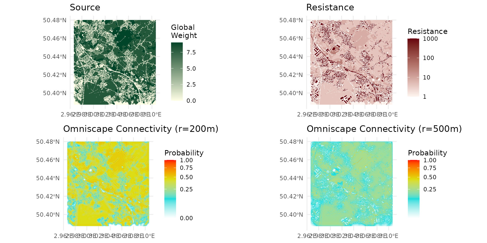

# Habitat and Connectivity

## Introduction

In this vignette, we explore the database linking OCS-GE (French GIS
layer for Occupation du Sol à Grande Échelle) labels with species
labels.

We will analyze how different land cover types act as habitats with
varying qualities or resistances for different species, starting with
the Wood mouse (Apodemus sylvaticus).

``` r

library(spacemodR)
library(dplyr)
library(ggplot2)
library(terra)
library(tidyterra)
library(sf)
library(leaflet)
library(patchwork)
```

## The database construction

To build the habitat database for spacemod, we transitioned from
traditional static mapping to a dynamic semantic analysis. Here is a
breakdown of how this new methodology compares to previous standards.

### The Original Framework (O’Connor et al., 2024 ; @oconnor2024habitat)

The foundational method described by O’Connor et al. (2024) relies on an
“expert-based” crosswalk to define optimal habitats for European
terrestrial vertebrates. It links a European land systems map—which
accounts for both land cover and land use intensity—to standardized
habitat classifications from GlobCover and the IUCN Red List. This
approach assigns simple, discrete suitability scores: 2 for optimal
habitat, 1 for secondary habitat, and 0 for unsuitable. These scores
were then manually penalized by subtracting points if specific keywords
related to land use intensity or threats (e.g., agricultural
intensification) appeared in the species’ IUCN descriptions. Ultimately,
this generated Area of Habitat (AOH) maps, filtering existing occurrence
maps to show simple presence or absence at a 1 km² resolution.

### The LLM-Assisted Approach for spacemod

Our approach steps away from rigid keyword matching and discrete
scoring, moving toward a semantic analysis of a species’ ecological
requirements.Instead of using the broad European land systems, this
database utilizes the fine-scale French OCS-GE (Occupation du Sol à
Grande Échelle) nomenclature. Each OCS-GE code was enriched with precise
ecological context. For example, paved roads are described as creating a
“barrier effect,” while mineral soils are noted as “thermophilic.”Using
a Large Language Model (Gemini), we fed the AI free-text descriptions of
both preferred and avoided habitats (sourced from EEA databases). The
model conceptually analyzed these texts against our enriched OCS-GE
descriptions.

Instead of a single presence/absence score, the model simultaneously
generates four continuous variables (on a scale of 0 to 10) that capture
finer landscape ecology concepts: \* `weight_global`: Overall habitat
suitability (closest to the traditional AOH score). \*
`weight_movement`: Landscape permeability for species dispersion. \*
`weight_foraging`: Habitat attractiveness specifically for feeding and
resource acquisition. \* `resistance`: The impedance or barrier effect
of the environment, heavily informed by the “avoided-habitat”
descriptions.

### The Fundamental Difference

This new method represents a major shift in both scale and
functionality. The original methodology relied on rigid keyword
penalties to output a discrete matrix (0, 1, or 2), answering a simple
question: can the species live in this pixel? By leveraging natural
language understanding, our method generates a continuous matrix (0-10)
that distinguishes between an environment where a species simply
survives, one it actively seeks for food, and one it merely uses for
transit. These variables are specifically designed to be injected into
complex spatial ecological models (such as graph theory or
Circuitscape), offering a much more nuanced view of landscape
connectivity than traditional AOH mapping.

## Defining Habitat

### Weighted species habitat with OCS-GE layer for *Apodemus sylvaticus*

First, we load the necessary datasets provided by spacemodR:

1.  The species dictionary assigning weights to land cover codes.
2.  The OCS-GE nomenclature reference (containing names and specific hex
    colors).
3.  The spatial layer for OCS-GE (here, we use the ocsge_metaleurop
    dataset as our base map).

``` r

# Load the species dict and reference tables
data("ocsge_species_dict")
data("ref_ocsge")

# Load spatial data
data("ocsge_metaleurop") 
sf_ocsge <- ocsge_metaleurop
```

We filter our species dictionary for *Apodemus sylvaticus* and join it
with the reference nomenclature to link the OCS-GE codes to their
descriptive labels and predefined colors.

``` r

# Filter for Apodemus sylvaticus
dfhab_Apsy <- ocsge_species_dict[
  grepl("Apodemus_sylvaticus",ocsge_species_dict$nom_espece, ignore.case = TRUE), 
  ]

# Join ref_ocsge with the species dictionary. 
# ref_ocsge$code_cs_ (with spaces) matches ocsge_species_dict$code_cs
df_merged_Apsy <- ref_ocsge %>%
  dplyr::left_join(dfhab_Apsy, by = c("code_cs_" = "code_cs"))

# Join with the spatial sf object. Assuming sf_ocsge uses 'code_cs' (without spaces)
sf_Apsy <- sf_ocsge %>%
  dplyr::left_join(df_merged_Apsy, by = "code_cs")
```

#### Understanding Habitat Values

By examining the weight_global (wg), we can classify the landscape into
different habitat qualities for the species:

- Non-habitat area (wg = 0):

``` r

df_merged_Apsy %>% 
  filter(weight_global == 0) %>%
  pull(nomenclature) %>%
  unique()
#> [1] "Surfaces d'eau"    "Névés et glaciers"
```

- Very Poor habitat (0 \< wg \<= 3):

``` r

df_merged_Apsy %>% 
  filter(weight_global > 0, weight_global <= 3) %>% 
  pull(nomenclature) %>% 
  unique()
#> [1] "Zones bâties"                    "Zones non bâties"               
#> [3] "Autres formations non ligneuses"
```

- Poor habitat (3 \< wg \<= 7):

``` r

df_merged_Apsy %>% 
  filter(weight_global > 7) %>% 
  pull(nomenclature) %>% 
  unique()
#> [1] "Feuillus"                               
#> [2] "Conifères"                              
#> [3] "Mixte"                                  
#> [4] "Formations arbustives, sous-arbrisseaux"
#> [5] "Formations herbacées"
```

- Good habitat (wg \> 7):

``` r

df_merged_Apsy %>% 
  filter(weight_global > 7) %>% 
  pull(nomenclature) %>% 
  unique()
#> [1] "Feuillus"                               
#> [2] "Conifères"                              
#> [3] "Mixte"                                  
#> [4] "Formations arbustives, sous-arbrisseaux"
#> [5] "Formations herbacées"
```

#### Static Mapping

We will now visualize the spatial distribution of these metrics. We
produce four maps focusing on Global Weight, Foraging Weight, Landscape
Resistance, and finally the standard OCS-GE Land Cover.



#### Interactive Synthesis

To better explore the local variations and overlay different habitat
parameters for *Apodemus sylvaticus*, we combine them into a single
interactive leaflet map. You can toggle the layers in the top right
corner.

### Multi-species Interactive Synthesis

Different species interact with the landscape in radically different
ways. Below, we create a function to automatically generate the
interactive Leaflet synthesis for any given species, allowing us to
rapidly compare their habitat preferences. \### Turdus merula
(Blackbird)

``` r

turdus_hab <- join_ocsge_species(sf_ocsge, "Turdus_merula")
plot_species_habitat(turdus_hab)
```



#### Passer domesticus (House Sparrow)

``` r

passer_hab <- join_ocsge_species(sf_ocsge, "Passer_domesticus")
plot_species_habitat(passer_hab)
```



#### Small Mammals (Sorex, Crocidura, Microtus arvalis)

``` r

sorex_hab <- join_ocsge_species(sf_ocsge, "Sorex")
plot_species_habitat(sorex_hab)
```



``` r

crocidura_hab <- join_ocsge_species(sf_ocsge, "Crocidura")
plot_species_habitat(crocidura_hab)
```


``` r

microtus_hab <- join_ocsge_species(sf_ocsge, "Microtus_arvalis")
plot_species_habitat(microtus_hab)
```


## Connectivity

### From habitat to raster of source and resistance

1.  first step is to collect habitat of the OCS-GE as we did previously

``` r

apsy_hab <- join_ocsge_species(sf_ocsge, "Apodemus_sylvaticus")
plot_species_habitat(apsy_hab)
```



2.  then, we have to create an `habitat` object to benefit from
    `spacemodR` functionalities

``` r

apsy_habitat <- habitat(apsy_hab, habitat=TRUE, weight=apsy_hab$weight_global)
apsy_resistance <- habitat(apsy_hab, habitat=TRUE, weight=apsy_hab$resistance)
```

3.  converting them in raster

``` r

ground_cd <- load_raster_extdata("ground_concentration_cd_compressed.tif")
```

``` r

rast_Apsy_habitat <- habitat_raster(ground_cd, apsy_habitat)
```

Note that for resistance, we have to use and exponential scale compare
to the score in $`[0-10]`$ that with have in the data-set
`ocsge_species_dict` to an exponential $`[1-1000]`$.

``` r

rast_Apsy_resistance_init <- habitat_raster(ground_cd, apsy_resistance)
exp_scl <- function(x) { 10^( (log10(1000) / 10) * x )}
rast_Apsy_resistance <- exp_scl(rast_Apsy_resistance_init)
```

``` r

par(mfrow = c(1, 2))
plot(rast_Apsy_resistance_init)
plot(rast_Apsy_resistance)
```



``` r

par(mfrow = c(1, 1))
```

``` r

terra::writeRaster(rast_Apsy_habitat, "julia_run/rast_Apsy_habitat.tif", overwrite = TRUE)
terra::writeRaster(rast_Apsy_resistance, "julia_run/rast_Apsy_resistance.tif", overwrite = TRUE)
```

### Kernel

### Omniscape

4.  defining a radius

To define the radius, we have to know the real distance radius and then
convert it into number of pixel. Let say, we have a dispersal radius of
500m for *Apodemus sylvaticus*, which is actually quite large for that
species.

Here the map has pixels of 24m, so we use this large value for examples.

For pixel, the size is given by `res(raster)`, here it is a meter
system:

``` r

# get pixel size
terra::res(ground_cd)
#> [1] 24.93766 24.93976
# convert meter radius to pixel radius
m_radius = 500
px_radius = 500 / res(ground_cd)[1]
px_radius
#> [1] 20.05
```

``` bash
docker run --rm \
  -v "$(pwd)/julia_run:/julia_run" \
  spacemodr Rscript /julia_run/run_dispersal.R \
  /julia_run/rast_Apsy_habitat.tif \
  /julia_run/rast_Apsy_resistance.tif \
  20.05 \
  omniscape_apsy_500m
```

``` bash
docker run --rm \
  -v "$(pwd)/julia_run:/julia_run" \
  spacemodr Rscript /julia_run/run_dispersal.R \
  /julia_run/rast_Apsy_habitat.tif \
  /julia_run/rast_Apsy_resistance.tif \
  8.02 \
  omniscape_apsy_200m
```

``` r

p_src = ggplot() +
  theme_minimal() +
  geom_spatraster(data = rast_Apsy_habitat) +
  scale_fill_gradient(low = "#ffffe5", high = "#004529", na.value = "transparent", name = "Global\nWeight") +
  labs(title = "Source")

p_res = ggplot() +
  theme_minimal() +
  geom_spatraster(data = rast_Apsy_resistance) +
  scale_fill_gradient(
    low = "#fff5f0", high = "#67000d", transform="log10",
    na.value = "transparent", name = "Resistance")+
  labs(title = "Resistance")

max_r200m <- global(omniscape_apsy_200m, fun = "max", na.rm = TRUE)
norm_r200m <- omniscape_apsy_200m / as.numeric(max_r200m)
p_omn_200m = ggplot() +
  theme_minimal() +
  geom_spatraster(data = norm_r200m) +
  scale_fill_gradientn(
    colours = c("white", "#11dddd", "#dddd11", "red"),
    trans = "sqrt", 
    na.value = "transparent") +
  labs(title = "Omniscape Connectivity (r=200m)", fill = "Probability")

max_r500m <- global(omniscape_apsy_500m, fun = "max", na.rm = TRUE)
norm_r500m <- omniscape_apsy_500m / as.numeric(max_r500m)
p_omn_500m = ggplot() +
  theme_minimal() +
  geom_spatraster(data = norm_r500m) +
  scale_fill_gradientn(
    colours = c("white", "#11dddd", "#dddd11", "red"),
    trans = "sqrt", na.value = "transparent") +
  labs(title = "Omniscape Connectivity (r=500m)", fill = "Probability")

gridExtra::grid.arrange(p_src, p_res, p_omn_200m, p_omn_500m, ncol=2)
```


