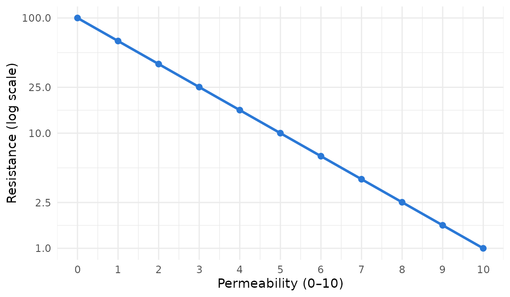
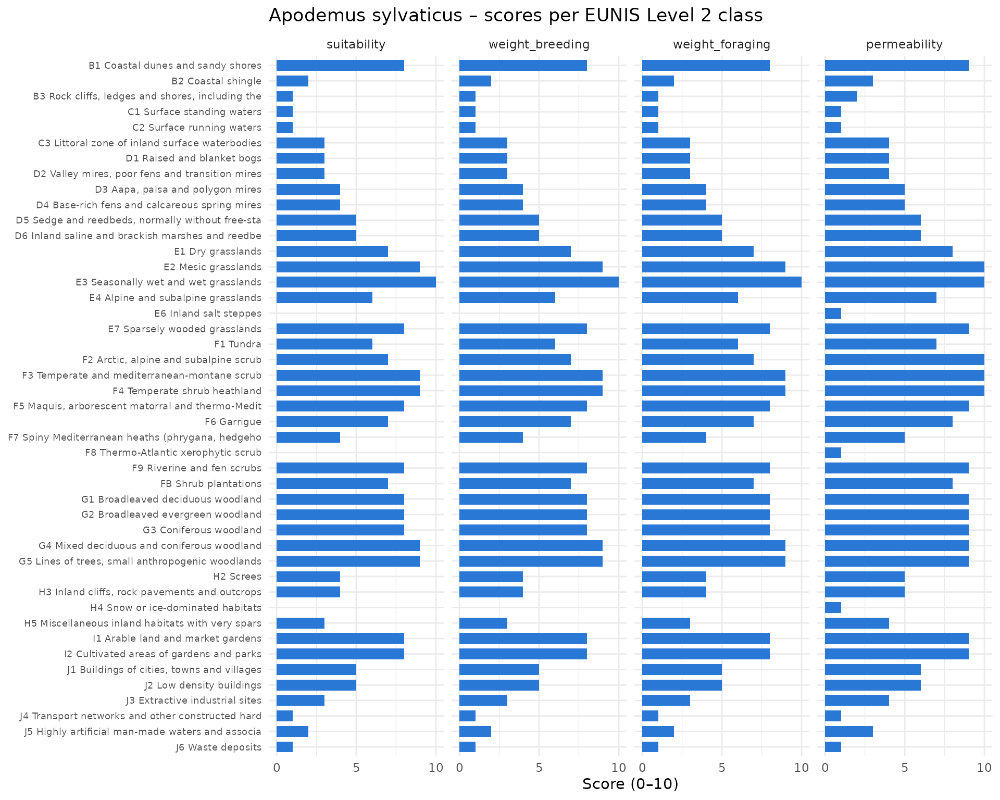
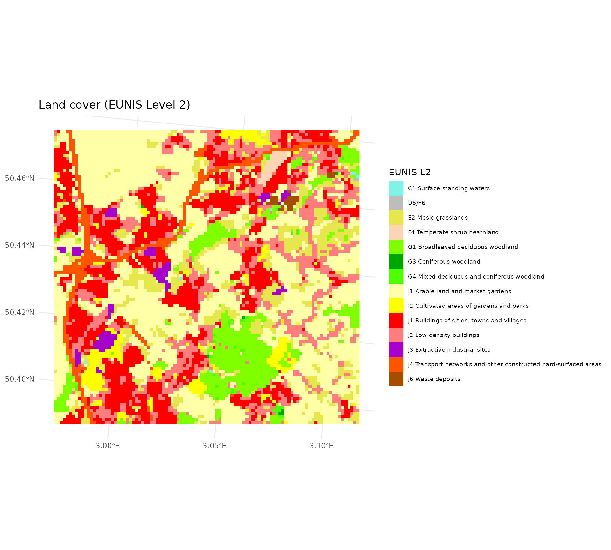
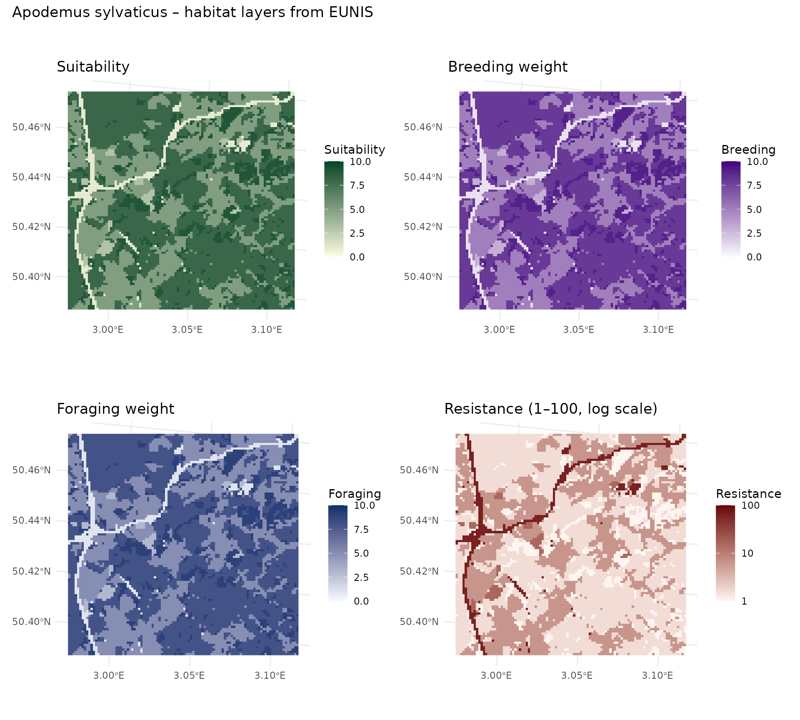
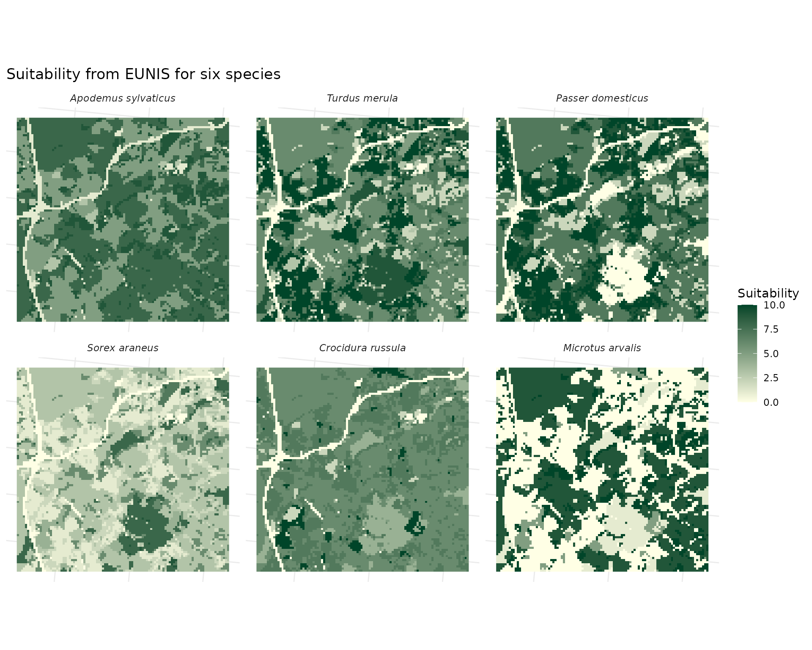
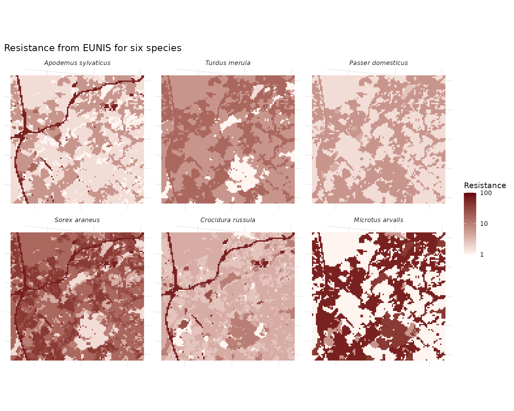
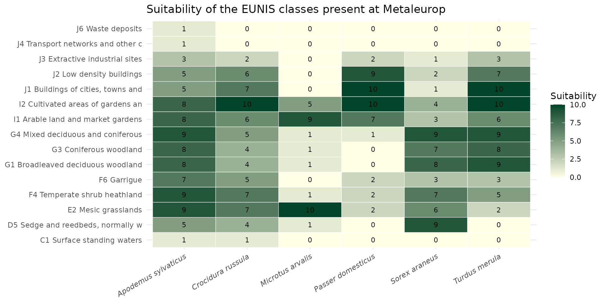

# Habitat Layer from EUNIS

## Introduction

The [Habitat
Layer](https://qonfluens.github.io/spacemodR/articles/core_Habitat.md)
guide builds species habitat maps from the French OCS-GE land cover and
the `ocsge_species_dict` dataset. This guide does the same from the
**EUNIS** classification (European Nature Information System), using the
`eunis_species_dict` dataset.

EUNIS is a useful alternative when:

- the study area is **outside France**: the EEA *Ecosystem Type Map
  v3.1* covers the 39 EEA countries;
- the species depends on habitats that OCS-GE cannot separate: OCS-GE
  describes land *cover* only, so reedbeds, wet meadows, bogs, dunes or
  arable land are merged into broad classes. EUNIS Level 2 has 45
  terrestrial classes, including 6 wetland types (D1–D6), 6 grassland
  types (E1–E7) and 10 scrub types (F1–FB).

The trade-off is resolution: the EUNIS map is 100 m, while OCS-GE is
vector data mapped at about 1:5,000 scale.

We again focus on the Wood mouse (*Apodemus sylvaticus*), then compare a
few other species.

``` r

library(spacemodR)
library(dplyr)
library(ggplot2)
library(terra)
library(tidyterra)
library(leaflet)
library(patchwork)
```

## The database

### How it was built

`eunis_species_dict` covers the same 935 European vertebrates as
`ocsge_species_dict`, with the same EEA habitat descriptions as input.
Each species was scored against the 45 EUNIS Level 2 classes, each
described by a short ecological summary (e.g. *G5: “Lines of trees,
small woodlands, recently felled woodland: edge-rich, fragmented”*).

Compared with `ocsge_species_dict`, the scoring was changed to make the
values easier to compare across species and directly usable in
connectivity models:

- **Anchored scale.** Every score uses the same reference points (0
  unused or avoided, 2 marginal, 5 secondary, 8 main, 10 core habitat),
  so that a 5 means the same thing for a toad and for an eagle.
- **Breeding separated from foraging.** Many species breed in one
  habitat and feed in another (amphibians in ponds and woods, raptors on
  cliffs and in steppe).
- **Taxon-aware movement.** Flight, swimming and burrowing are taken
  into account, so a road is a strong barrier for a toad but not for a
  kite.
- **Resistance derived, not scored.** Resistance is computed from
  permeability on the 1–100 log scale expected by Omniscape, so the two
  can never contradict each other and no further transformation is
  needed.
- **Species-level flags** for confidence in the source description and
  presence in France.

Scores were assigned by a large language model (Claude Opus 5.5) reading
the descriptions; they are expert-judgement values, not fitted to
occurrence data.

### What each column means

``` r

data("eunis_species_dict")
data("ref_eunis")
str(eunis_species_dict)
#> 'data.frame':    42075 obs. of  13 variables:
#>  $ code_eunis     : chr  "B1" "B2" "B3" "C1" ...
#>  $ nom_espece     : chr  "Alytes_cisternasii" "Alytes_cisternasii" "Alytes_cisternasii" "Alytes_cisternasii" ...
#>  $ sppID          : chr  "A1" "A1" "A1" "A1" ...
#>  $ taxon_group    : chr  "amphibian" "amphibian" "amphibian" "amphibian" ...
#>  $ suitability    : int  3 1 0 6 8 6 0 2 0 1 ...
#>  $ weight_breeding: int  0 0 0 6 9 3 0 2 0 0 ...
#>  $ weight_foraging: int  3 1 0 3 4 2 0 2 0 1 ...
#>  $ permeability   : int  6 3 1 7 8 7 3 4 3 3 ...
#>  $ resistance     : num  6.3 25.1 63.1 4 2.5 4 25.1 15.8 25.1 25.1 ...
#>  $ habitat_breadth: int  11 11 11 11 11 11 11 11 11 11 ...
#>  $ specialization : num  0.13 0.13 0.13 0.13 0.13 0.13 0.13 0.13 0.13 0.13 ...
#>  $ confidence     : int  3 3 3 3 3 3 3 3 3 3 ...
#>  $ in_france      : int  0 0 0 0 0 0 0 0 0 0 ...
```

| Column | Level | Range | Meaning |
|----|----|----|----|
| `code_eunis` | class | – | EUNIS Level 2 code, matches `ref_eunis$code` (with `level == "L2"`) and the raster returned by `get_eunis_data(level = "L2")`. |
| `nom_espece` | species | – | Scientific name, `Genus_species`. |
| `sppID` | species | – | EEA identifier; first letter gives the group (A, R, B, M). |
| `taxon_group` | species | – | amphibian, reptile, bird or mammal. |
| `suitability` | class | 0–10 | Overall habitat quality. **Use as the source / habitat weight.** |
| `weight_breeding` | class | 0–10 | Value as breeding, nesting, denning, roosting or larval site. |
| `weight_foraging` | class | 0–10 | Value for feeding. |
| `permeability` | class | 0–10 | Ease of movement (10 free, 7 readily, 4 reluctantly, 1 strong barrier, 0 impassable). |
| `resistance` | class | 1–100 | `10^(2 * (1 - permeability / 10))`: 10 → 1, 5 → 10, 0 → 100. **Use as the resistance layer.** |
| `habitat_breadth` | species | 0–45 | Number of classes with `suitability >= 5`. |
| `specialization` | species | 0–1 | 1 − normalised Shannon evenness of the suitability profile: 0 generalist, 1 specialist. |
| `confidence` | species | 1–3 | Quality of the source description: 1 vague or empty, 2 medium, 3 detailed. |
| `in_france` | species | 0/1 | 1 if the species occurs natively and regularly in metropolitan France. |

The relation between permeability and resistance:

``` r

data.frame(permeability = 0:10) %>%
  mutate(resistance = 10^(2 * (1 - permeability / 10))) %>%
  ggplot(aes(permeability, resistance)) +
  geom_line(colour = "#2a78d6", linewidth = 1) +
  geom_point(colour = "#2a78d6", size = 2) +
  scale_y_log10(breaks = c(1, 2.5, 10, 25, 100)) +
  scale_x_continuous(breaks = 0:10) +
  theme_minimal() +
  labs(x = "Permeability (0–10)", y = "Resistance (log scale)")
```



Species-level columns help select or weigh species before mapping, for
example the specialists present in France with a reliable description:

``` r

eunis_species_dict %>%
  distinct(nom_espece, taxon_group, habitat_breadth, specialization, confidence, in_france) %>%
  filter(in_france == 1, confidence == 3) %>%
  arrange(desc(specialization)) %>%
  head(8)
#>              nom_espece taxon_group habitat_breadth specialization confidence
#> 1  Hydrobates_pelagicus        bird               1           1.00          3
#> 2  Calonectris_diomedea        bird               1           1.00          3
#> 3 Puffinus_mauretanicus        bird               1           1.00          3
#> 4     Puffinus_puffinus        bird               1           1.00          3
#> 5     Puffinus_yelkouan        bird               1           1.00          3
#> 6        Morus_bassanus        bird               1           1.00          3
#> 7    Fratercula_arctica        bird               1           0.92          3
#> 8            Uria_aalge        bird               1           0.92          3
#>   in_france
#> 1         1
#> 2         1
#> 3         1
#> 4         1
#> 5         1
#> 6         1
#> 7         1
#> 8         1
```

## Defining habitat for *Apodemus sylvaticus*

### Scores of the Wood mouse

We filter the dictionary for *Apodemus sylvaticus* and join the EUNIS
labels and official colors from `ref_eunis`.

``` r

ref_l2 <- ref_eunis %>% filter(level == "L2") %>% select(code, nomenclature, couleur)

apsy <- eunis_species_dict %>%
  filter(nom_espece == "Apodemus_sylvaticus") %>%
  left_join(ref_l2, by = c("code_eunis" = "code"))

apsy %>%
  distinct(habitat_breadth, specialization, confidence, in_france)
#>   habitat_breadth specialization confidence in_france
#> 1              25           0.06          3         1
```

The Wood mouse is a generalist: 25 of the 45 classes are at least
secondary habitat (`habitat_breadth`), and its specialization index is
close to 0.

``` r

apsy_long <- apsy %>%
  select(code_eunis, nomenclature, suitability, weight_breeding, weight_foraging, permeability) %>%
  tidyr::pivot_longer(c(suitability, weight_breeding, weight_foraging, permeability),
                      names_to = "score", values_to = "value") %>%
  mutate(label = factor(paste(code_eunis, substr(nomenclature, 1, 45)),
                        levels = rev(paste(apsy$code_eunis, substr(apsy$nomenclature, 1, 45)))),
         score = factor(score, levels = c("suitability", "weight_breeding", "weight_foraging", "permeability")))

ggplot(apsy_long, aes(value, label)) +
  geom_col(fill = "#2a78d6", width = 0.7) +
  facet_wrap(~score, nrow = 1) +
  scale_x_continuous(breaks = c(0, 5, 10)) +
  theme_minimal() +
  theme(axis.text.y = element_text(size = 7)) +
  labs(x = "Score (0–10)", y = NULL, title = "Apodemus sylvaticus – scores per EUNIS Level 2 class")
```



### Understanding habitat values

As in the OCS-GE guide, the suitability score can be read as habitat
quality classes:

- Non-habitat (suitability = 0):

``` r

apsy %>% filter(suitability == 0) %>% pull(nomenclature)
#> [1] "Inland salt steppes"              "Thermo-Atlantic xerophytic scrub"
#> [3] "Snow or ice-dominated habitats"
```

- Very poor habitat (0 \< suitability ≤ 3):

``` r

apsy %>% filter(suitability > 0, suitability <= 3) %>% pull(nomenclature)
#>  [1] "Coastal shingle"                                                
#>  [2] "Rock cliffs, ledges and shores, including the supralittoral"    
#>  [3] "Surface standing waters"                                        
#>  [4] "Surface running waters"                                         
#>  [5] "Littoral zone of inland surface waterbodies"                    
#>  [6] "Raised and blanket bogs"                                        
#>  [7] "Valley mires, poor fens and transition mires"                   
#>  [8] "Miscellaneous inland habitats with very sparse or no vegetation"
#>  [9] "Extractive industrial sites"                                    
#> [10] "Transport networks and other constructed hard-surfaced areas"   
#> [11] "Highly artificial man-made waters and associated structures"    
#> [12] "Waste deposits"
```

- Poor to secondary habitat (3 \< suitability ≤ 7):

``` r

apsy %>% filter(suitability > 3, suitability <= 7) %>% pull(nomenclature)
#>  [1] "Aapa, palsa and polygon mires"                                                              
#>  [2] "Base-rich fens and calcareous spring mires"                                                 
#>  [3] "Sedge and reedbeds, normally without free-standing water"                                   
#>  [4] "Inland saline and brackish marshes and reedbeds"                                            
#>  [5] "Dry grasslands"                                                                             
#>  [6] "Alpine and subalpine grasslands"                                                            
#>  [7] "Tundra"                                                                                     
#>  [8] "Arctic, alpine and subalpine scrub"                                                         
#>  [9] "Garrigue"                                                                                   
#> [10] "Spiny Mediterranean heaths (phrygana, hedgehog-heaths and related coastal cliff vegetation)"
#> [11] "Shrub plantations"                                                                          
#> [12] "Screes"                                                                                     
#> [13] "Inland cliffs, rock pavements and outcrops"                                                 
#> [14] "Buildings of cities, towns and villages"                                                    
#> [15] "Low density buildings"
```

- Good habitat (suitability \> 7):

``` r

apsy %>% filter(suitability > 7) %>% pull(nomenclature)
#>  [1] "Coastal dunes and sandy shores"                                                                           
#>  [2] "Mesic grasslands"                                                                                         
#>  [3] "Seasonally wet and wet grasslands"                                                                        
#>  [4] "Sparsely wooded grasslands"                                                                               
#>  [5] "Temperate and mediterranean-montane scrub"                                                                
#>  [6] "Temperate shrub heathland"                                                                                
#>  [7] "Maquis, arborescent matorral and thermo-Mediterranean brushes"                                            
#>  [8] "Riverine and fen scrubs"                                                                                  
#>  [9] "Broadleaved deciduous woodland"                                                                           
#> [10] "Broadleaved evergreen woodland"                                                                           
#> [11] "Coniferous woodland"                                                                                      
#> [12] "Mixed deciduous and coniferous woodland"                                                                  
#> [13] "Lines of trees, small anthropogenic woodlands, recently felled woodland, early-stage woodland and coppice"
#> [14] "Arable land and market gardens"                                                                           
#> [15] "Cultivated areas of gardens and parks"
```

## Mapping

### The EUNIS land cover layer

[`get_eunis_data()`](https://qonfluens.github.io/spacemodR/reference/get_eunis_data.md)
downloads the EUNIS raster for any region of interest from the EEA map
service. To keep this guide reproducible offline, the Metaleurop layer
is shipped with the package; it was produced with:

``` r

data("roi_metaleurop")
eunis_lc <- get_eunis_data(roi_metaleurop, level = "L2", resolution = 100)
```

``` r

eunis_lc <- load_raster_extdata("eunis_metaleurop_L2.tif")
eunis_lc
#> class       : SpatRaster
#> size        : 98, 102, 1  (nrow, ncol, nlyr)
#> resolution  : 100, 100  (x, y)
#> extent      : 3822180, 3832380, 3054498, 3064298  (xmin, xmax, ymin, ymax)
#> coord. ref. : ETRS89-extended / LAEA Europe (EPSG:3035)
#> source      : eunis_metaleurop_L2.tif
#> categories  : eunis_L2
#> name        : eunis_L2
#> min value   :       C1
#> max value   :       J6
```

The raster is categorical. Its level table gives the EUNIS code of each
pixel value. Note the combined code `"D5/F6"`: the EEA service draws D5
(sedge and reedbeds) and F6 (garrigue) with the same color, so these
pixels cannot be told apart (see
[`?get_eunis_data`](https://qonfluens.github.io/spacemodR/reference/get_eunis_data.md)).

``` r

lv <- terra::levels(eunis_lc)[[1]]
names(lv) <- c("value", "code")
lv %>% left_join(ref_l2, by = "code")
#>    value  code                                                 nomenclature
#> 1      1    C1                                      Surface standing waters
#> 2      2 D5/F6                                                         <NA>
#> 3      3    E2                                             Mesic grasslands
#> 4      4    F4                                    Temperate shrub heathland
#> 5      5    G1                               Broadleaved deciduous woodland
#> 6      6    G3                                          Coniferous woodland
#> 7      7    G4                      Mixed deciduous and coniferous woodland
#> 8      8    I1                               Arable land and market gardens
#> 9      9    I2                        Cultivated areas of gardens and parks
#> 10    10    J1                      Buildings of cities, towns and villages
#> 11    11    J2                                        Low density buildings
#> 12    12    J3                                  Extractive industrial sites
#> 13    13    J4 Transport networks and other constructed hard-surfaced areas
#> 14    14    J6                                               Waste deposits
#>    couleur
#> 1  #80F2E6
#> 2     <NA>
#> 3  #E6E64D
#> 4  #FCD5B4
#> 5  #80FF00
#> 6  #00A600
#> 7  #4DFF00
#> 8  #FFFFA8
#> 9  #FFFF00
#> 10 #FF0000
#> 11 #FF7D7D
#> 12 #A600CC
#> 13 #FF5500
#> 14 #A64D00
```

### From species scores to rasters

We write a small helper that replaces each EUNIS class by a species
score. For combined codes such as `"D5/F6"`, the scores of the two
classes are averaged.

``` r

eunis_species_raster <- function(lc, species, var = "suitability",
                                 dict = eunis_species_dict) {
  lv <- terra::levels(lc)[[1]]
  names(lv) <- c("value", "code")
  d <- dict[dict$nom_espece == species, ]
  if (nrow(d) == 0) stop("Species not found: ", species)
  val <- vapply(strsplit(lv$code, "/"),
                function(cc) mean(d[[var]][match(cc, d$code_eunis)]), numeric(1))
  r <- lc
  levels(r) <- NULL                       # drop categories, keep pixel ids
  out <- terra::classify(r, cbind(lv$value, val))
  names(out) <- var
  out
}
```

``` r

apsy_suit <- eunis_species_raster(eunis_lc, "Apodemus_sylvaticus", "suitability")
apsy_breed <- eunis_species_raster(eunis_lc, "Apodemus_sylvaticus", "weight_breeding")
apsy_forag <- eunis_species_raster(eunis_lc, "Apodemus_sylvaticus", "weight_foraging")
apsy_res <- eunis_species_raster(eunis_lc, "Apodemus_sylvaticus", "resistance")
```

### Static maps

``` r

eunis_lc_lab <- eunis_lc
levels(eunis_lc_lab) <- lv %>%
  left_join(ref_l2, by = "code") %>%
  transmute(value, eunis = ifelse(is.na(nomenclature), code, paste(code, nomenclature)))
eunis_cols <- lv %>%
  left_join(ref_l2, by = "code") %>%
  transmute(eunis = ifelse(is.na(nomenclature), code, paste(code, nomenclature)),
            couleur = ifelse(is.na(couleur), "#BDBDBD", couleur))

p0 <- ggplot() +
  geom_spatraster(data = eunis_lc_lab) +
  scale_fill_manual(values = setNames(eunis_cols$couleur, eunis_cols$eunis),
                    na.value = "transparent", name = "EUNIS L2") +
  theme_minimal() +
  theme(legend.text = element_text(size = 7)) +
  labs(title = "Land cover (EUNIS Level 2)")

p1 <- ggplot() +
  geom_spatraster(data = apsy_suit) +
  scale_fill_gradient(low = "#ffffe5", high = "#004529", limits = c(0, 10),
                      na.value = "transparent", name = "Suitability") +
  theme_minimal() + labs(title = "Suitability")

p2 <- ggplot() +
  geom_spatraster(data = apsy_breed) +
  scale_fill_gradient(low = "#fcfbfd", high = "#3f007d", limits = c(0, 10),
                      na.value = "transparent", name = "Breeding") +
  theme_minimal() + labs(title = "Breeding weight")

p3 <- ggplot() +
  geom_spatraster(data = apsy_forag) +
  scale_fill_gradient(low = "#f7fbff", high = "#08306b", limits = c(0, 10),
                      na.value = "transparent", name = "Foraging") +
  theme_minimal() + labs(title = "Foraging weight")

p4 <- ggplot() +
  geom_spatraster(data = apsy_res) +
  scale_fill_gradient(low = "#fff5f0", high = "#67000d", trans = "log10", limits = c(1, 100),
                      na.value = "transparent", name = "Resistance") +
  theme_minimal() + labs(title = "Resistance (1–100, log scale)")

p0
```



``` r

(p1 | p2) / (p3 | p4) +
  plot_annotation(title = "Apodemus sylvaticus – habitat layers from EUNIS")
```



For the Wood mouse, the arable land (I1) that dominates the Metaleurop
area is good habitat (8/10), as are the woodland (G1) and gardens and
parks (I2). Built-up areas (J1, J2) are secondary habitat (5/10). Roads
(J4) are nearly unusable (1/10) and form the strongest barriers
(resistance 63).

### Interactive synthesis

``` r

to_wgs <- function(r) terra::project(r, "EPSG:4326", method = "near")

pal_suit <- colorNumeric("YlGn", domain = c(0, 10), na.color = "transparent")
pal_breed <- colorNumeric("Purples", domain = c(0, 10), na.color = "transparent")
pal_forag <- colorNumeric("Blues", domain = c(0, 10), na.color = "transparent")
pal_res <- colorNumeric("Reds", domain = c(0, 2), na.color = "transparent")

leaflet() %>%
  addProviderTiles(providers$CartoDB.Positron) %>%
  addRasterImage(to_wgs(apsy_suit), colors = pal_suit, opacity = 0.7, group = "Suitability") %>%
  addRasterImage(to_wgs(apsy_breed), colors = pal_breed, opacity = 0.7, group = "Breeding") %>%
  addRasterImage(to_wgs(apsy_forag), colors = pal_forag, opacity = 0.7, group = "Foraging") %>%
  addRasterImage(log10(to_wgs(apsy_res)), colors = pal_res, opacity = 0.7, group = "Resistance (log10)") %>%
  addLayersControl(
    baseGroups = c("Suitability", "Breeding", "Foraging", "Resistance (log10)"),
    options = layersControlOptions(collapsed = FALSE)
  ) %>%
  addLegend(pal = pal_suit, values = c(0, 10), title = "Score (0–10)", position = "bottomright")
```

## Multi-species comparison

The same helper works for any species. Below are the species used in the
OCS-GE guide. Suitability shows where each one can live, and resistance
shows what blocks its movement.

``` r

species <- c("Apodemus_sylvaticus", "Turdus_merula", "Passer_domesticus",
             "Sorex_araneus", "Crocidura_russula", "Microtus_arvalis")

suit_stack <- rast(lapply(species, function(s) eunis_species_raster(eunis_lc, s, "suitability")))
names(suit_stack) <- gsub("_", " ", species)

ggplot() +
  geom_spatraster(data = suit_stack) +
  facet_wrap(~lyr, ncol = 3) +
  scale_fill_gradient(low = "#ffffe5", high = "#004529", limits = c(0, 10),
                      na.value = "transparent", name = "Suitability") +
  theme_minimal() +
  theme(axis.text = element_blank(), strip.text = element_text(face = "italic")) +
  labs(title = "Suitability from EUNIS for six species")
```



``` r

res_stack <- rast(lapply(species, function(s) eunis_species_raster(eunis_lc, s, "resistance")))
names(res_stack) <- gsub("_", " ", species)

ggplot() +
  geom_spatraster(data = res_stack) +
  facet_wrap(~lyr, ncol = 3) +
  scale_fill_gradient(low = "#fff5f0", high = "#67000d", trans = "log10", limits = c(1, 100),
                      na.value = "transparent", name = "Resistance") +
  theme_minimal() +
  theme(axis.text = element_blank(), strip.text = element_text(face = "italic")) +
  labs(title = "Resistance from EUNIS for six species")
```



The two birds never exceed a resistance of about 16 because they fly,
whereas roads reach 63 for all four small mammals. Built-up areas (J1)
are core habitat for the house sparrow and the blackbird (10/10),
secondary for the Wood mouse (5/10) and unsuitable for the common vole
(0/10). The common vole follows grassland (E2) and arable land (I1),
while the common shrew prefers woodland (G1) and avoids arable land
(3/10).

A compact way to compare the species is to plot their scores for the
classes present in the study area:

``` r

present <- unlist(strsplit(lv$code, "/"))

eunis_species_dict %>%
  filter(nom_espece %in% species, code_eunis %in% present) %>%
  left_join(ref_l2, by = c("code_eunis" = "code")) %>%
  mutate(nom_espece = gsub("_", " ", nom_espece),
         label = paste(code_eunis, substr(nomenclature, 1, 30))) %>%
  ggplot(aes(nom_espece, label, fill = suitability)) +
  geom_tile(colour = "white") +
  geom_text(aes(label = suitability), size = 3) +
  scale_fill_gradient(low = "#ffffe5", high = "#004529", limits = c(0, 10)) +
  theme_minimal() +
  theme(axis.text.x = element_text(angle = 30, hjust = 1, face = "italic")) +
  labs(x = NULL, y = NULL, fill = "Suitability",
       title = "Suitability of the EUNIS classes present at Metaleurop")
```



## Toward connectivity

The suitability raster is the **source** layer and the resistance raster
is the **resistance** layer for
`compute_dispersal(method = "omniscape")`. Unlike the OCS-GE dictionary,
`resistance` is already on the 1–100 log scale, so no exponential
transformation is needed.

To combine them with soil contamination maps, resample them onto the
same grid as the contamination raster with nearest-neighbour
interpolation:

``` r

ground_cd <- load_raster_extdata("ground_concentration_cd_compressed.tif")
apsy_suit_grid <- terra::project(apsy_suit, ground_cd, method = "near")
apsy_res_grid <- terra::project(apsy_res, ground_cd, method = "near")
c(apsy_suit_grid, apsy_res_grid)
#> class       : SpatRaster
#> size        : 415, 401, 2  (nrow, ncol, nlyr)
#> resolution  : 24.93766, 24.93976  (x, y)
#> extent      : 697602.7, 707602.7, 7032171, 7042521  (xmin, xmax, ymin, ymax)
#> coord. ref. : RGF93 v1 / Lambert-93 (EPSG:2154)
#> source(s)   : memory
#> varnames    : ground_concentration_cd_compressed
#>               ground_concentration_cd_compressed
#> names       : suitability, resistance
#> min values  :           1,          1
#> max values  :           9,  63.099998
```

``` r

res_m <- 500                                   # dispersal radius in metres
radius_px <- res_m / terra::res(ground_cd)[1]
compute_dispersal(
  x = apsy_suit_grid,
  method = "omniscape",
  options = list(resistance = apsy_res_grid, radius = radius_px)
)
```

See [Landscape Connectivity
(Omniscape)](https://qonfluens.github.io/spacemodR/articles/core_Omniscape_Connectivity.md)
for running and interpreting the connectivity model.

Note that the EUNIS map is 100 m, so the landscape structure after
resampling is coarser than with OCS-GE. Use EUNIS when the study area is
outside France, or when the species depends on habitats that OCS-GE does
not separate (wetlands, grassland types, dunes).
