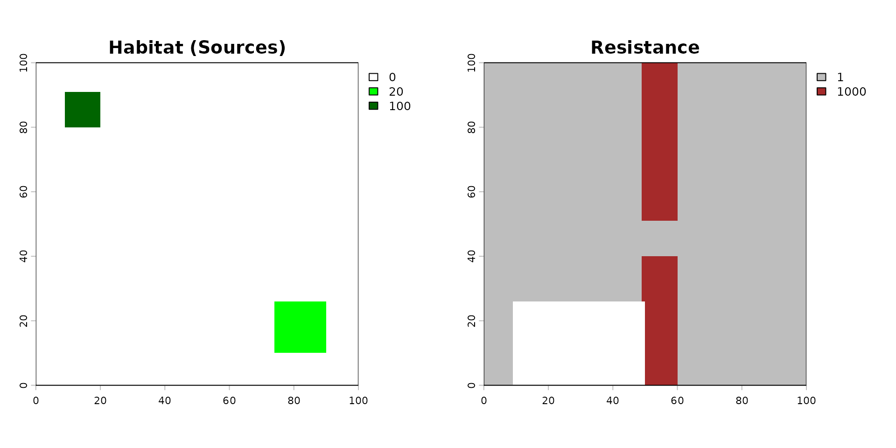
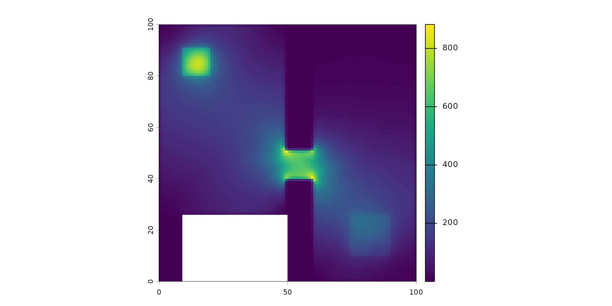
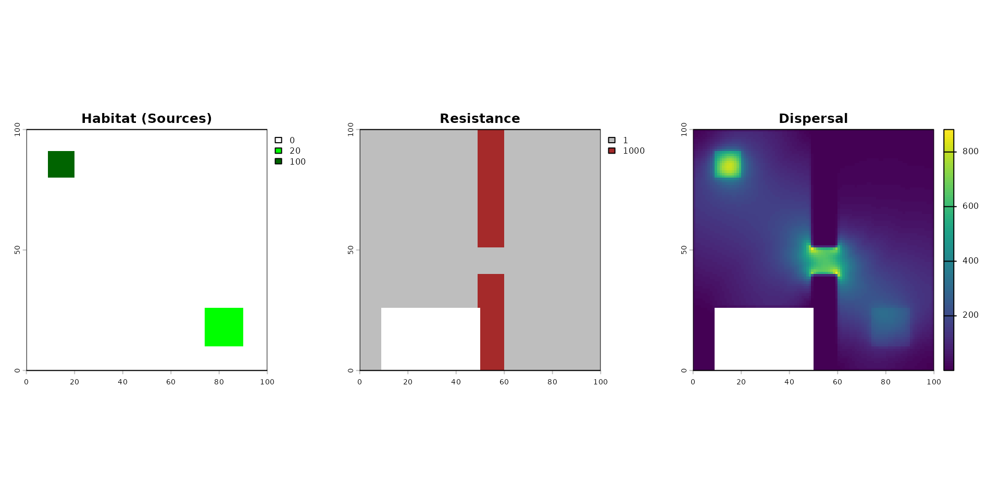

# Using Julia Omniscape to run Landscape Connectivity

``` r

library(spacemodR)
library(gridExtra)
library(terra) 
library(dplyr)
library(patchwork)
```

In this Notebook, we are going to see how we can use an external
function of dispersal. Here we show the case of using Julia Omniscape
function.

## About `Omniscape`

### The Core Concept: “Everywhere to Everywhere”

Standard connectivity models usually ask: “*How do I get from Point A to
Point B?*”

Omniscape asks: “*If individuals start everywhere and try to move in all
directions within their home range, where do they go? Which paths get
used the most?*”

It applies Circuit Theory: it treats the landscape like an electrical
circuit board.

- Individuals = Electrons (Current).
- Landscape difficulty = Resistance.

### The Inputs (What you give the model)

To run Omniscape, you primarily need two raster maps and one parameter.

1.  The **Source Strength** (Input Raster): This is your Population
    Density map (number of individuals/pixel). This tells the algorithm
    how much current (amperes) to inject at each pixel. Example: If a
    pixel has a value of 100 (100 individuals), the algorithm starts a
    large “flow” of movement from that spot. If a pixel has a value of 0
    (empty ground), no movement starts there (but movement can still
    pass through it).

2.  The **Resistance Surface** (Input Raster): The difficulty of moving
    through a pixel. Arbitrary resistance unit (Ohms), usually 1 to 100.
    Example: Low value (1): Easy to cross (e.g., preferred habitat), the
    “current” flows easily here. High value (100): Hard to cross (e.g.,
    a wall, water, road), the “current” is blocked and tries to find a
    way around. Infinite (NA): absolute barrier, no flow possible.

3.  The **Radius** (Parameter): The dispersal distance or home range (in
    pixels). The maximum distance an individual is likely to travel. The
    algorithm solves the connectivity problem within this moving window.

### About Units of Source, Resistance and Radius

1.  *Source*: relative capacity or suitability (usually `weight_global`
    or `weight_foraging` is the internal `ocsge_species_dict` dataset).
    For instance:

- Value 10 (Core habitat): A dense, undisturbed forest for a fox. It
  generates a massive amount of dispersing individuals.
- Value 2 (Poor habitat): A small, degraded woodlot. It emits very few
  individuals.
- Value 0 or NA (Non-habitat): A parking lot. It emits absolutely no
  individuals (though they might still walk across it if the resistance
  allows it).

2.  *Resistance*: Relative friction cost. The absolute minimum is 1
    (perfect, frictionless movement). It can never be 0 or negative.
    Effectively exponential/logarithmic. For instance:

- Value 1 (Optimal): A continuous forest. The animal moves freely.
- Value 10 (Sub-optimal): A tall grassland. The animal can cross it, but
  it takes more energy, so it will prefer the forest if it’s nearby.
- Value 100 (Hostile): A plowed agricultural field. The animal will
  actively avoid it and will only cross it if there is absolutely no
  other choice to reach the next habitat.
- Value 1000 or 10000 (Absolute Barrier): A fenced highway or an urban
  center. The cost is so high that the model will force the animal to
  take a massive detour (e.g., walking 50 pixels out of the way through
  1 resistance rather than crossing a single pixel of 1000).

### Exponential law for resistance

When we build resistance map, for instance from the internal
`ocsge_species_dict` dataset which provides resistance values that scale
sharply, we have to transform the `weight` factor set in `0-10` to a
log-scale function. Indeedn, if an optimal habitat is $`1`$ and the
worst barrier is only $`5`$, `Omniscape` will barely notice the barrier
and will simulate animals walking almost in straight lines!

A good practice would is to convert the linear scale $`0`$ to $`10`$ in
an exponential scale $`1`$ to $`1000`$
(e.g. `10^( (log10(1000) / 10) * x )`.

### The Algorithm

The algorithm is a circular window (defined by the Radius) sliding over
the landscape map.

### The Outputs

The most important result is the Cumulative Current Map.

1.  Cumulative Current (Output Raster): the total flow of individuals
    passing through a pixel, coming from all possible directions within
    the radius. It a Probability of movement (or Flow Intensity).
    Example: A high Value for a pixel is a “highway” or a “bottleneck”.
    A huge number of individuals pass through this spot. This could be
    because it’s a great habitat, or because it’s the only path between
    two barriers. In `spacemodR` context: If this area is contaminated,
    a large portion of the population will be exposed here because they
    all pass through it. A low value for a pixel means that few
    individuals visit this spot. Either it is hard to reach (surrounded
    by barriers), or the population source nearby is zero.

2.  Flow Potential (Optional Output): represents how the landscape would
    look if resistance was 1 everywhere (perfectly flat). It shows what
    the flow would be based only on the population density and geometry,
    ignoring the landscape barriers.

3.  Normalized Current (Optional Output): represents the
    `Cumulative Current / Flow Potential`. This highlights “pinch
    points.”: `>1` flow is higher than expected, the landscape is
    funneling individuals here (bottleneck effect). `< 1`: flow is lower
    than expected, the landscape is blocking movement here.

#### Units of the output “Cumulative Current Map”

- Score = 0.01 (Cold zones): Either an impassable barrier where nothing
  goes, or a massive, uniform optimal habitat where movement is so
  diffuse that it doesn’t concentrate anywhere.
- Score = 50.0 (Hot zones): A critical bottleneck. For instance, a
  narrow strip of trees between two large fields, or a single bridge
  over a river. All the “dispersal flow” is forced to squeeze through
  this specific pixel.

### For `spacemodR`:

You provide the map of where the animals live (Abundance) and how hard
it is to move (Resistance).

The algorithm simulates the movement of every individual in every
direction.

You get a map showing where the animals go. A pixel with high current
means “many animals pass here,” making it a critical zone for
contaminant exposure.

Then using
[`spacemodR::transfer`](https://qonfluens.github.io/spacemodR/reference/transfer.md),
we can compute the `exposure` and diffusion of the contaminant in
population.

## Example of habitat and resistance

``` r

# setup Matrix size
n_row <- 100
n_col <- 100
#  MATRIX of habitat (Source Strength)
mat_habitat <- matrix(0, nrow = n_row, ncol = n_col)
mat_habitat[10:20, 10:20] <- 100
mat_habitat[75:90, 75:90] <- 20
rast_habitat <- terra::rast(mat_habitat)
names(rast_habitat) <- "population"

# MATRICE Of RESISTANCE
mat_resistance <- matrix(1, nrow = n_row, ncol = n_col)
mat_resistance[, 50:60] <- 1000
mat_resistance[50:60, 50:60] <- 1
mat_resistance[75:100, 10:50] <- NA
rast_resistance <- terra::rast(mat_resistance)
names(rast_resistance) <- "resistance"

# SAVE RASTER FILE
terra::writeRaster(rast_habitat, "inst/extdata/example_habitat.tif", overwrite = TRUE)
terra::writeRaster(rast_resistance, "inst/extdata/example_resistance.tif", overwrite = TRUE)
terra::writeRaster(rast_habitat, "julia_run/example_habitat.tif", overwrite = TRUE)
terra::writeRaster(rast_resistance, "julia_run/example_resistance.tif", overwrite = TRUE)
```

``` r

# VIZUALIZE
par(mfrow = c(1, 2))
terra::plot(rast_habitat, main = "Habitat (Sources)", col = c("white", "green", "darkgreen"))
terra::plot(rast_resistance, main = "Resistance", col = c("grey", "brown"))
```



``` r

par(mfrow = c(1, 1))
```

Then the code to compute the dispersal. It can be very long to compute…

Radius is in Pixel. To convert it into a distance of a dispersal kernel,
you have to convert radius: for instance, if 1 pixel = x meter, then for
a dispersal radius of $`D`$, the radius provided is $`D/x`$.

``` r

## USE DOCKER IMAGE TO RUN THIS
dispersed_map <- compute_dispersal(
  x = rast_habitat,
  method = "omniscape",
  options = list(
    resistance = rast_resistance,
    radius = 25 # small radius for this little matrix
  )
)
```

``` r

plot(dispersed_map)
```



This map shows the Cumulative Current.

- It represents the probability of flow or the intensity of movement
  through the landscape. It highlights ecological corridors and
  bottlenecks.
- Unit: It is unitless (technically “Amperes” in circuit theory). It is
  a relative score of connectivity.
- Scale nature: It is highly variable and depends on the landscape’s
  shape. It is not strictly linear or exponential; it’s a spatial
  accumulation.
- Examples:
  - Score = 0.01 (Cold zones): Either an impassable barrier where
    nothing goes, or a massive, uniform optimal habitat where movement
    is so diffuse that it doesn’t concentrate anywhere.
  - Score = 50.0 (Hot zones): A critical bottleneck. For instance, a
    narrow strip of trees between two large fields, or a single bridge
    over a river. All the “dispersal flow” is forced to squeeze through
    this specific pixel.

## Running the Dispersal Computation via Docker

Due to the complex system dependencies required by Omniscape (Julia,
GDAL, PROJ), it is common to encounter compilation errors in local R
sessions (like `libcurl` version conflicts). The most robust workaround
is to execute the computation inside an isolated Docker container and
retrieve the result as an `.rds` file.

We will use a dedicated folder named `julia_run` to store our input
rasters, the R script, and the final output.

#### 1. Prepare the Workspace and Inputs

First, create the `julia_run` directory and export your spatial data
(`rast_habitat` and `rast_resistance`) into it so the Docker container
can access them.

*Note: Using
[`terra::writeRaster`](https://rspatial.github.io/terra/reference/writeRaster.html)
is ideal here because it allows you to pass clean, lightweight spatial
files (`.tif`) to the Docker container rather than `.rds` objects, which
can sometimes contain dead C++ pointers depending on the `terra`
version.*

``` r

# Create the shared directory
dir.create("julia_run", showWarnings = FALSE)
# Save the raster inputs to this directory
terra::writeRaster(rast_habitat, "julia_run/habitat.tif", overwrite = TRUE)
terra::writeRaster(rast_resistance, "julia_run/resistance.tif", overwrite = TRUE)
```

#### 2. Prepare the R script (`run_dispersal.R`)

Save the following code inside the `julia_run` folder as
`run_dispersal.R`. This script is designed to accept command-line
arguments for the file paths and the radius.

You can look at the file in `julia_run/run_disperal.R`.

### 2. Build the Docker image

In your terminal, navigate to the root directory of the `spacemodR`
package (where the `Dockerfile` is located) and run the following
command to build the image (this may take a few minutes):

``` bash
docker build -t spacemodr .
```

### 3. Run the container with argument

Now, execute the R script inside the container. We map our local
julia_run directory to `/julia_run` inside the container. Notice how we
pass the file paths and the radius ($`30`$) at the very end of the
command:

``` bash
docker run --rm \
  -v "$(pwd)/julia_run:/julia_run" \
  spacemodr Rscript /julia_run/run_dispersal.R \
  /julia_run/example_habitat.tif \
  /julia_run/example_resistance.tif \
  150 \
  dispersed_example_150
```

*Note: if you need interactive mode to debug, try:*

``` bash
docker run --rm -it -v "$(pwd)/julia_run:/julia_run" spacemodr bash
# check files exist then
ls -l /julia_run
# run Rscript command
Rscript /julia_run/run_dispersal.R /julia_run/example_habitat.tif /julia_run/example_resistance.tif 30 dispersed_example_30
```

5.  Retrieve the Data

Once the Docker process is complete, the `dispersed_map.rds` file will
be waiting for you in your local `julia_run` folder.

We can now see the pipeline effect:

``` r

par(mfrow = c(1, 3))
terra::plot(rast_habitat, main = "Habitat (Sources)", col = c("white", "green", "darkgreen"))
terra::plot(rast_resistance, main = "Resistance", col = c("grey", "brown"))
terra::plot(dispersed_map, main = "Dispersal",)
```



``` r

par(mfrow = c(1, 1))
```
