# Soil contamination maps by kriging

## Why this article?

Every spacemodR simulation starts from a **raster of soil
contamination** (e.g. `ground_concentration_cd_compressed.tif` used in
all the other articles). In the field, however, soil is only sampled at
a few hundred **points**. This article explains, step by step, how to go
from these points to a continuous raster, and which interpolation method
gives the most reliable map for the Metaleurop site.

The workflow has 8 steps:

| Step | What we do | spacemodR function |
|:--:|:---|:---|
| 1 | Look at the data and choose the scale (log10) | `data(soil_metaleurop)` |
| 2 | Understand the large-scale trend (distance to the smelter) | — |
| 3 | Build the output grid and the covariate rasters | [`soil_grid()`](https://qonfluens.github.io/spacemodR/reference/soil_grid.md), [`source_covariates()`](https://qonfluens.github.io/spacemodR/reference/source_covariates.md) |
| 4 | Compute the empirical variogram | [`soil_variogram()`](https://qonfluens.github.io/spacemodR/reference/soil_variogram.md) |
| 5 | Fit a variogram model | [`fit_soil_variogram()`](https://qonfluens.github.io/spacemodR/reference/fit_soil_variogram.md) |
| 6 | Compare interpolation methods by cross-validation | [`cv_soil()`](https://qonfluens.github.io/spacemodR/reference/cv_soil.md), [`kernel_smooth_soil()`](https://qonfluens.github.io/spacemodR/reference/kernel_smooth_soil.md) |
| 7 | Produce the final Cd, Pb and Zn rasters (+ uncertainty) | [`krige_soil()`](https://qonfluens.github.io/spacemodR/reference/krige_soil.md) |
| 8 | Check the maps and plug them into spacemodR | [`load_raster_extdata()`](https://qonfluens.github.io/spacemodR/reference/load_raster_extdata.md) |

**Short answer** (justified in step 6): for the three metals, the best
method is **kriging with external drift (KED)** of
`log10(concentration)`, using `log10(distance to the smelter)` as drift
and an **exponential** variogram.

``` r

library(spacemodR)
library(sf)
library(terra)
library(ggplot2)
library(tidyterra)
library(patchwork)
```

## Step 1 — The data

The data set `soil_metaleurop` contains 595 topsoil samples collected
around the former Metaleurop Nord lead and zinc smelter (northern
France), with total Cd, Pb and Zn concentrations (mg/kg). The
coordinates are in Lambert-93 (EPSG:2154), **in metres**: this is
required, since kriging works with distances.

``` r

data(soil_metaleurop)
soil_metaleurop
#> Simple feature collection with 595 features and 8 fields
#> Geometry type: POINT
#> Dimension:     XY
#> Bounding box:  xmin: 698603.6 ymin: 7033174 xmax: 706601.9 ymax: 7041519
#> Projected CRS: RGF93 v1 / Lambert-93
#> First 10 features:
#>        id usage     dist    angle wind        cd        pb         zn
#> 1  20-01S     L 2749.259 247.8030  5.7 3.5000000 211.00000  387.00000
#> 2  21-01S     L 2562.256 249.2580  5.7 2.1000000 162.00000  430.00000
#> 3  22-01S     L 2098.059 266.5827  3.8 2.8000000 188.00000  307.00000
#> 4  23-01S     L 1983.692 279.7745  2.1 4.3495935 339.43089  516.26016
#> 5  23-02S     L 1820.005 278.9970  2.1 4.5426829 463.41463  740.85366
#> 6  23-03S     L 1902.154 267.9507  3.8 3.9165819 387.58901  839.26755
#> 7  23-04S     L 1754.204 265.4483  3.8 8.5830785 706.42202 1131.49847
#> 8  23-05S     L 1725.637 275.9000  2.1 0.7080366  38.65717   98.37233
#> 9  24-01S     L 1677.324 290.3067  1.4 7.9000000 666.00000 1481.00000
#> 10 25-01S     L 1433.359 309.1812  1.4 7.9000000 575.00000  691.00000
#>                    geometry
#> 1  POINT (698603.6 7035783)
#> 2  POINT (698754.5 7035912)
#> 3  POINT (699062.2 7036691)
#> 4  POINT (699205.7 7037152)
#> 5  POINT (699362.5 7037098)
#> 6  POINT (699256.3 7036747)
#> 7  POINT (699407.8 7036674)
#> 8  POINT (699442.7 7036991)
#> 9  POINT (699589.6 7037394)
#> 10 POINT (700053.5 7037713)
summary(sf::st_drop_geometry(soil_metaleurop)[, c("cd", "pb", "zn")])
#>        cd                 pb                zn         
#>  Min.   :   0.100   Min.   :   16.0   Min.   :   44.0  
#>  1st Qu.:   3.584   1st Qu.:  192.8   1st Qu.:  290.1  
#>  Median :   5.200   Median :  287.3   Median :  425.0  
#>  Mean   :  12.615   Mean   :  567.1   Mean   :  702.6  
#>  3rd Qu.:   9.150   3rd Qu.:  519.5   3rd Qu.:  697.5  
#>  Max.   :2402.062   Max.   :41958.8   Max.   :38762.9
```

The concentrations are extremely **skewed**: for cadmium the median is
around 5 mg/kg but the maximum is above 2000 mg/kg. Kriging is a linear
method (a weighted average of neighbouring values) and is very sensitive
to such extreme values. On a **log10 scale**, the distributions become
nearly symmetric (log-normal data), so all the interpolation is done on
`log10(concentration)`. This is the default (`log10 = TRUE`) in all
spacemodR functions.

``` r

long <- data.frame(
  metal = rep(c("Cd", "Pb", "Zn"), each = nrow(soil_metaleurop)),
  value = c(soil_metaleurop$cd, soil_metaleurop$pb, soil_metaleurop$zn)
)
p_raw <- ggplot(long, aes(value)) +
  geom_histogram(bins = 40, fill = "grey40") +
  facet_wrap(~metal, scales = "free") +
  labs(title = "Raw scale (mg/kg)", x = NULL) + theme_minimal()
p_log <- ggplot(long, aes(log10(value))) +
  geom_histogram(bins = 40, fill = "steelblue") +
  facet_wrap(~metal, scales = "free") +
  labs(title = "log10 scale", x = NULL) + theme_minimal()
p_raw / p_log
```

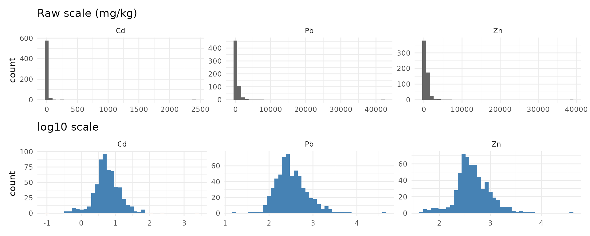

The three metals are highly correlated (same emission source), so the
same method should suit all of them:

``` r

cor(log10(sf::st_drop_geometry(soil_metaleurop)[, c("cd", "pb", "zn")]))
#>           cd        pb        zn
#> cd 1.0000000 0.8993741 0.9198521
#> pb 0.8993741 1.0000000 0.8907395
#> zn 0.9198521 0.8907395 1.0000000
```

## Step 2 — The large-scale trend: distance to the smelter

Contamination comes from the atmospheric fallout of a **single point
source**: the smelter chimney. The data set gives the distance of each
sample to the smelter (`dist`), but not the smelter location itself. We
recover it by looking for the point whose distance to every sample best
matches `dist` (a simple least-squares triangulation):

``` r

xy <- sf::st_coordinates(soil_metaleurop)
misfit <- function(p) {
  sum((sqrt((xy[, 1] - p[1])^2 + (xy[, 2] - p[2])^2) - soil_metaleurop$dist)^2)
}
fit <- optim(colMeans(xy), misfit)
smelter <- sf::st_sfc(sf::st_point(fit$par), crs = 2154)
smelter
#> Geometry set for 1 feature 
#> Geometry type: POINT
#> Dimension:     XY
#> Bounding box:  xmin: 701155.8 ymin: 7036798 xmax: 701155.8 ymax: 7036798
#> Projected CRS: RGF93 v1 / Lambert-93
# average mismatch with the `dist` column (m):
sqrt(fit$value / nrow(xy))
#> [1] 1.035147
```

The match is almost perfect (about 1 m), and the point lies at 3.0162°
E, 50.4287° N, i.e. on the former Metaleurop site at Noyelles-Godault.

``` r

ggplot() +
  geom_sf(data = soil_metaleurop, aes(colour = log10(cd)), size = 1.8) +
  geom_sf(data = smelter, shape = 8, size = 5, colour = "red", stroke = 1.5) +
  scale_colour_viridis_c(name = "log10 Cd\n(mg/kg)") +
  labs(title = "Sampling points (red star: smelter)") +
  theme_minimal()
```

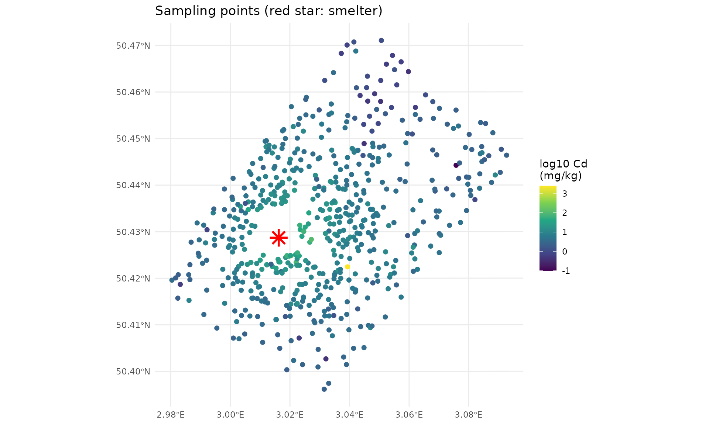

Plotting the concentrations against the distance on a log-log scale
reveals a strong **linear trend**: concentrations decrease as a power
law of the distance, as expected for atmospheric deposition.

``` r

long$dist <- rep(soil_metaleurop$dist, 3)
ggplot(long, aes(log10(dist), log10(value))) +
  geom_point(alpha = 0.3) +
  geom_smooth(method = "lm", colour = "red") +
  facet_wrap(~metal, scales = "free_y") +
  labs(x = "log10(distance to smelter, m)", y = "log10(concentration)") +
  theme_minimal()
```

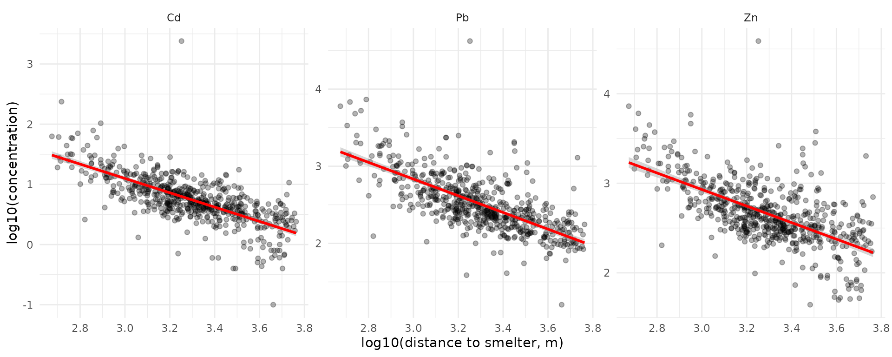

``` r


summary(lm(log10(cd) ~ log10(dist), data = soil_metaleurop))$r.squared
#> [1] 0.5028893
```

The distance alone explains about **half of the variance** of log10(Cd).
This is a precious information for interpolation, especially **far from
the samples**: ordinary kriging would there predict the global mean of
the data, whereas a model including the distance keeps decreasing away
from the smelter. This motivates testing *kriging with external drift*
below.

## Step 3 — Output grid and covariate rasters

### 3a. The grid

[`soil_grid()`](https://qonfluens.github.io/spacemodR/reference/soil_grid.md)
builds an empty raster around the points, with a given resolution `res`
and a `margin` around the bounding box of the samples. Here: 25 m cells
and 1 km of margin, as for the rasters already shipped with the package.

``` r

grid <- soil_grid(soil_metaleurop, res = 25, margin = 1000)
grid
#> class       : SpatRaster
#> size        : 415, 401, 1  (nrow, ncol, nlyr)
#> resolution  : 25, 25  (x, y)
#> extent      : 697600, 707625, 7032150, 7042525  (xmin, xmax, ymin, ymax)
#> coord. ref. : RGF93 v1 / Lambert-93 (EPSG:2154)
```

### 3b. The covariates

[`source_covariates()`](https://qonfluens.github.io/spacemodR/reference/source_covariates.md)
computes, for every cell of the grid:

- `log10_dist`: the log10 of the distance to the source (the drift found
  in step 2);
- `wind` (optional): the frequency of the wind sector in which the cell
  lies, seen from the source. The data set gives this frequency (`wind`)
  for each sample in 20° sectors, so we rebuild the wind rose from it:

``` r

sector <- (round(soil_metaleurop$angle / 20) %% 18) * 20
wind_rose <- aggregate(
  soil_metaleurop$wind, by = list(direction = sector),
  FUN = function(x) as.numeric(names(which.max(table(x))))
)
names(wind_rose)[2] <- "freq"
wind_rose
#>    direction freq
#> 1          0  7.0
#> 2         20  8.5
#> 3         40  6.8
#> 4         60  8.8
#> 5         80 11.1
#> 6        100  8.0
#> 7        120  5.2
#> 8        140  4.4
#> 9        160  4.3
#> 10       180  4.9
#> 11       200  4.2
#> 12       220  6.1
#> 13       240  5.7
#> 14       260  3.8
#> 15       280  2.1
#> 16       300  1.4
#> 17       320  2.7
#> 18       340  5.1
```

``` r

covariates <- source_covariates(grid, smelter, wind_rose = wind_rose)
covariates
#> class       : SpatRaster
#> size        : 415, 401, 2  (nrow, ncol, nlyr)
#> resolution  : 25, 25  (x, y)
#> extent      : 697600, 707625, 7032150, 7042525  (xmin, xmax, ymin, ymax)
#> coord. ref. : RGF93 v1 / Lambert-93 (EPSG:2154)
#> source(s)   : memory
#> names       : log10_dist, wind
#> min values  :    1.39794,  1.4
#> max values  :   3.935608, 11.1

plot_cov <- function(layer, title) {
  ggplot() +
    geom_spatraster(data = covariates[[layer]]) +
    scale_fill_viridis_c(name = NULL) +
    geom_sf(data = smelter, shape = 8, size = 3, colour = "red") +
    labs(title = title) + theme_minimal()
}
plot_cov("log10_dist", "log10(distance to the smelter, m)") +
  plot_cov("wind", "Wind frequency of the sector (%)")
```

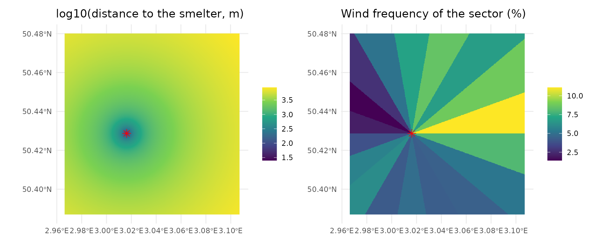

The wind layer shows that the north-east of the smelter is the most
exposed, downwind of the dominant south-westerly winds.

## Step 4 — The empirical variogram

Kriging relies on one idea: **two close samples are more alike than two
distant samples**. The *semi-variogram* quantifies this: for all pairs
of points separated by a distance $`h`$ (grouped in distance classes, or
*lags*),

``` math
\gamma(h) = \frac{1}{2 N(h)} \sum_{(i,j) \,:\, d_{ij} \approx h} \left(z_i - z_j\right)^2
```

where $`z`$ is the log10 concentration and $`N(h)`$ the number of pairs.
A variogram that increases with $`h`$ means there is spatial structure
that kriging can exploit.

[`soil_variogram()`](https://qonfluens.github.io/spacemodR/reference/soil_variogram.md)
computes it. By default it uses distances up to one third of the study
area diagonal (`cutoff`) in 15 classes (`width`).

``` r

v_ok <- soil_variogram(soil_metaleurop, "cd")
head(v_ok)
#>     np      dist      gamma
#> 1 1260  174.5234 0.05594691
#> 2 3429  396.6164 0.06124015
#> 3 5228  648.8699 0.08059952
#> 4 6849  904.2774 0.09498779
#> 5 8100 1159.0879 0.12406657
#> 6 9379 1415.9839 0.13137464
```

When a drift is used (KED), the spatial structure must be described on
the **residuals of the trend**, not on the raw values; this is done by
passing the covariates:

``` r

v_ked <- soil_variogram(soil_metaleurop, "cd",
                        covariates = covariates[["log10_dist"]])
```

``` r

both <- rbind(
  data.frame(as.data.frame(unclass(v_ok)), type = "raw values (OK)"),
  data.frame(as.data.frame(unclass(v_ked)), type = "residuals of log10(dist) (KED)")
)
ggplot(both, aes(dist, gamma, colour = type)) +
  geom_point(aes(size = np)) + geom_line() +
  expand_limits(y = 0) +
  labs(x = "Distance h (m)", y = expression(gamma(h)),
       colour = NULL, size = "Number of pairs",
       title = "Empirical variograms of log10(Cd)") +
  theme_minimal()
```

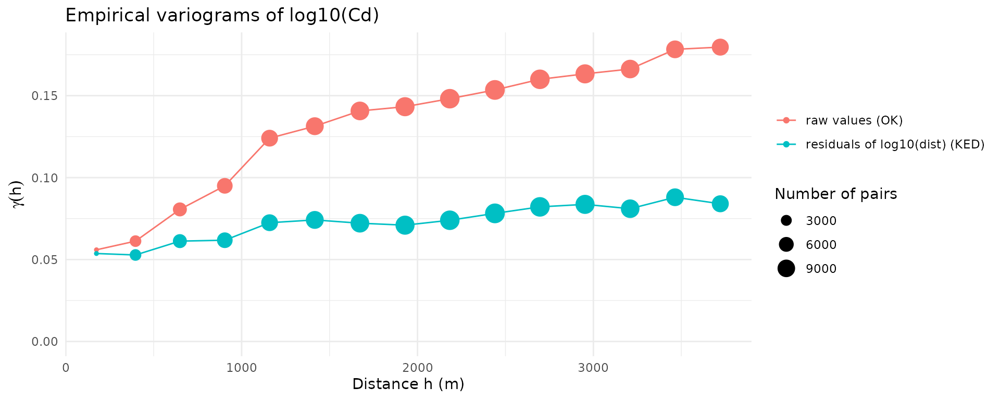

Reading the plot:

- the **raw** variogram keeps increasing over several kilometres: this
  is the signature of the large-scale trend (values decrease with the
  distance to the smelter);
- once the trend is removed, the **residual** variogram is about half as
  high and almost flat beyond 1–1.5 km: the remaining spatial dependence
  is short-range, the long-range part being explained by the distance;
- neither curve starts at 0: the value at the origin is the **nugget**,
  i.e. variability between very close samples (measurement error, very
  local heterogeneity, the extreme outlier of the data set…).

## Step 5 — Fitting a variogram model

Kriging needs a continuous function $`\gamma(h)`$, so a model is fitted
to the empirical points. Every model has three parameters:

- **nugget** $`c_0`$: the jump at the origin;
- **partial sill** $`c`$: the additional variance reached at large
  distances (total sill = nugget + partial sill);
- **range** $`a`$: how fast the sill is reached (the distance at which
  samples stop being correlated is about $`3a`$ for the exponential
  model, $`a`$ for the spherical one).

Four models are available: exponential (`"Exp"`), spherical (`"Sph"`),
Gaussian (`"Gau"`) and Matérn (`"Mat"`).
[`fit_soil_variogram()`](https://qonfluens.github.io/spacemodR/reference/fit_soil_variogram.md)
fits them by weighted least squares (more weight to short distances and
to classes with many pairs) and returns the one with the lowest error,
together with the comparison table.

``` r

m_ok <- fit_soil_variogram(v_ok, model = c("Exp", "Sph", "Gau"))
m_ok
#> Variogram model: Gau  
#>   nugget = 0.05312 | partial sill = 0.1073 | range = 1235 m
#>   weighted SSE = 1.386e-05
#>   fitted on values (constant mean)
m_ok$comparison
#>   model     nugget     psill    range          sse
#> 1   Gau 0.05311783 0.1072776 1235.369 1.386473e-05
#> 2   Sph 0.04211793 0.1231917 2887.673 2.587145e-05
#> 3   Exp 0.03899008 0.1726382 2113.585 3.157755e-05

m_ked <- fit_soil_variogram(v_ked, model = c("Exp", "Sph", "Gau"))
m_ked
#> Variogram model: Gau  
#>   nugget = 0.05244 | partial sill = 0.02688 | range = 1220 m
#>   weighted SSE = 5.879e-06
#>   fitted on residuals of the drift: log10_dist
```

``` r

(plot(m_ok) + ggtitle("OK: raw log10(Cd)")) +
  (plot(m_ked) + ggtitle("KED: residuals of the distance trend")) +
  plot_layout(guides = "collect")
```

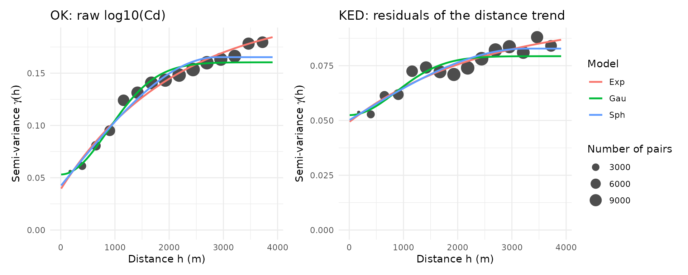

The models are very close to each other. **The best fit to the variogram
points does not necessarily give the best map**: this is what the old
Python workflow used (ranking models by the $`R^2`$ of the variogram
fit). A more reliable criterion is the quality of the *predictions*,
assessed by cross-validation in the next step.

## Step 6 — Which method gives the best map? Cross-validation

### 6a. Principle

In **k-fold cross-validation**
([`cv_soil()`](https://qonfluens.github.io/spacemodR/reference/cv_soil.md)),
the points are split into 10 groups. Each group is removed in turn, the
whole method (including the variogram fit) is run on the 9 other groups,
and the removed points are predicted. Comparing predictions with
observations gives:

- **RMSE** (root mean squared error, log10 units) — the main criterion,
  lower is better;
- **MAE** (mean absolute error) — less sensitive to the outlier;
- **bias** (mean error) — should be close to 0;
- **R2** — share of the variance of the data reproduced by the
  predictions.

Two ways of making the groups are used:

- **random** folds: the removed points usually have close neighbours
  left, this measures the quality of the interpolation *between*
  samples;
- **spatial** folds (`block_size = 1500`): whole 1.5 km × 1.5 km blocks
  are removed, which mimics the prediction of areas **without any sample
  nearby** (e.g. the margin of the map). The block size is of the order
  of the distance at which the residual variogram flattens.

### 6b. The candidates

1.  **Kernel smoothing**
    ([`kernel_smooth_soil()`](https://qonfluens.github.io/spacemodR/reference/kernel_smooth_soil.md)):
    a Gaussian weighted mean of the samples, built with the dispersal
    kernel of the package
    ([`compute_kernel()`](https://qonfluens.github.io/spacemodR/reference/compute_kernel.md))
    and a convolution
    ([`terra::focal()`](https://rspatial.github.io/terra/reference/focal.html)).
    Simple, but it ignores the spatial structure and its smoothing
    radius must be chosen.
2.  **Ordinary kriging (OK)** with an exponential, spherical or Gaussian
    variogram: what the old Python workflow (`pykrige`) did.
3.  **Kriging with external drift (KED)** on `log10_dist`: a linear
    trend in log-distance to the smelter + kriging of the residuals.
4.  **KED on `log10_dist` + `wind`**.

``` r

candidates <- list(
  "Kernel (radius 300 m)"  = list(method = "kernel", radius = 300),
  "OK - Exp"               = list(model = "Exp"),
  "OK - Sph"               = list(model = "Sph"),
  "OK - Gau"               = list(model = "Gau"),
  "KED dist - Exp"         = list(model = "Exp", covariates = covariates[["log10_dist"]]),
  "KED dist + wind - Exp"  = list(model = "Exp", covariates = covariates)
)

run_cv <- function(metal, block_size = NULL) {
  do.call(rbind, lapply(names(candidates), function(nm) {
    args <- c(list(points = soil_metaleurop, value = metal,
                   block_size = block_size), candidates[[nm]])
    cbind(method = nm, summary(do.call(cv_soil, args)))
  }))
}
```

``` r

cv_results <- do.call(rbind, lapply(c("cd", "pb", "zn"), function(metal) {
  rbind(cbind(metal = metal, folds = "random",  run_cv(metal)),
        cbind(metal = metal, folds = "spatial", run_cv(metal, block_size = 1500)))
}))
cv_results$method <- factor(cv_results$method, levels = names(candidates))
```

``` r

knitr::kable(
  cv_results[order(cv_results$folds, cv_results$metal, cv_results$RMSE),
             c("folds", "metal", "method", "RMSE", "MAE", "bias", "R2", "n")],
  digits = 3, row.names = FALSE
)
```

| folds   | metal | method                |  RMSE |   MAE |   bias |    R2 |   n |
|:--------|:------|:----------------------|------:|------:|-------:|------:|----:|
| random  | cd    | KED dist - Exp        | 0.244 | 0.156 |  0.000 | 0.624 | 587 |
| random  | cd    | OK - Gau              | 0.246 | 0.157 |  0.001 | 0.617 | 587 |
| random  | cd    | KED dist + wind - Exp | 0.246 | 0.158 |  0.001 | 0.617 | 587 |
| random  | cd    | OK - Sph              | 0.249 | 0.161 |  0.000 | 0.607 | 587 |
| random  | cd    | OK - Exp              | 0.251 | 0.162 |  0.000 | 0.603 | 587 |
| random  | cd    | Kernel (radius 300 m) | 0.251 | 0.165 |  0.005 | 0.602 | 587 |
| random  | pb    | KED dist + wind - Exp | 0.232 | 0.159 |  0.000 | 0.596 | 587 |
| random  | pb    | KED dist - Exp        | 0.233 | 0.159 |  0.000 | 0.593 | 587 |
| random  | pb    | OK - Gau              | 0.237 | 0.161 |  0.001 | 0.581 | 587 |
| random  | pb    | OK - Sph              | 0.239 | 0.163 |  0.000 | 0.574 | 587 |
| random  | pb    | Kernel (radius 300 m) | 0.240 | 0.166 |  0.005 | 0.570 | 587 |
| random  | pb    | OK - Exp              | 0.241 | 0.165 |  0.000 | 0.566 | 587 |
| random  | zn    | KED dist - Exp        | 0.223 | 0.157 | -0.001 | 0.584 | 587 |
| random  | zn    | KED dist + wind - Exp | 0.224 | 0.156 | -0.001 | 0.583 | 587 |
| random  | zn    | OK - Gau              | 0.227 | 0.157 | -0.001 | 0.572 | 587 |
| random  | zn    | OK - Sph              | 0.227 | 0.158 | -0.002 | 0.570 | 587 |
| random  | zn    | OK - Exp              | 0.228 | 0.160 | -0.002 | 0.565 | 587 |
| random  | zn    | Kernel (radius 300 m) | 0.230 | 0.164 |  0.001 | 0.557 | 587 |
| spatial | cd    | KED dist - Exp        | 0.245 | 0.160 |  0.007 | 0.621 | 587 |
| spatial | cd    | KED dist + wind - Exp | 0.251 | 0.167 |  0.010 | 0.602 | 587 |
| spatial | cd    | OK - Exp              | 0.251 | 0.165 | -0.002 | 0.602 | 587 |
| spatial | cd    | OK - Sph              | 0.253 | 0.169 | -0.003 | 0.595 | 587 |
| spatial | cd    | OK - Gau              | 0.253 | 0.168 |  0.008 | 0.594 | 587 |
| spatial | cd    | Kernel (radius 300 m) | 0.270 | 0.187 |  0.006 | 0.539 | 587 |
| spatial | pb    | KED dist - Exp        | 0.244 | 0.171 |  0.006 | 0.553 | 587 |
| spatial | pb    | KED dist + wind - Exp | 0.245 | 0.172 |  0.008 | 0.550 | 587 |
| spatial | pb    | OK - Sph              | 0.250 | 0.174 | -0.002 | 0.534 | 587 |
| spatial | pb    | OK - Exp              | 0.252 | 0.176 | -0.004 | 0.527 | 587 |
| spatial | pb    | OK - Gau              | 0.252 | 0.176 |  0.004 | 0.527 | 587 |
| spatial | pb    | Kernel (radius 300 m) | 0.274 | 0.202 |  0.006 | 0.440 | 587 |
| spatial | zn    | KED dist - Exp        | 0.232 | 0.168 |  0.004 | 0.551 | 587 |
| spatial | zn    | KED dist + wind - Exp | 0.237 | 0.172 |  0.005 | 0.530 | 587 |
| spatial | zn    | OK - Gau              | 0.239 | 0.172 |  0.001 | 0.525 | 587 |
| spatial | zn    | OK - Exp              | 0.239 | 0.175 | -0.002 | 0.524 | 587 |
| spatial | zn    | OK - Sph              | 0.240 | 0.176 |  0.000 | 0.518 | 587 |
| spatial | zn    | Kernel (radius 300 m) | 0.265 | 0.198 |  0.007 | 0.413 | 587 |

``` r

ggplot(cv_results, aes(x = RMSE, y = method, colour = folds)) +
  geom_point(size = 3) +
  facet_wrap(~metal, scales = "free_x") +
  scale_y_discrete(limits = rev) +
  labs(x = "Cross-validation RMSE (log10 units, lower is better)", y = NULL,
       colour = "Folds") +
  theme_minimal()
```

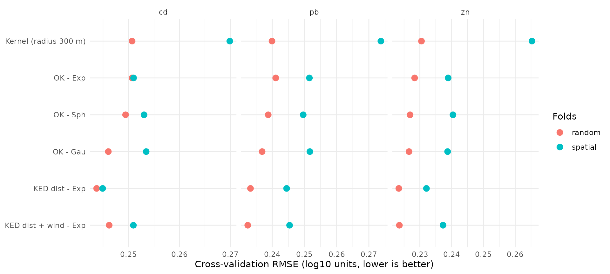

### 6c. Conclusion of the comparison

- **Kernel smoothing** is competitive with random folds (it behaves like
  a smooth ordinary kriging), but it is clearly the worst with **spatial
  folds**: far from the samples, it simply averages whatever lies within
  its window, without any model of how values evolve with distance.
- The **variogram model of ordinary kriging** (Exp / Sph / Gau) changes
  the error only marginally.
- **KED with the distance to the smelter** gives the lowest error for
  the three metals, and the gain is largest with **spatial folds**: the
  drift is most useful where samples are scarce.
- Adding the **wind** does not bring a consistent improvement (once the
  distance is known, the wind frequency does not help predicting, and an
  extra parameter adds noise). It is not retained.

We also tested, outside this article, a generalized additive model
(`mgcv::gam(log10(cd) ~ log10(dist) + wind + s(x, y))`) and a random
forest (`ranger`) on coordinates, distance and wind: neither beat KED,
so no additional package dependency is needed.

**Retained method: KED, drift = log10(distance to the smelter),
exponential variogram, on log10 concentrations.**

The exponential model is kept (rather than the one with the best
variogram fit) because it is the most robust across metals in spatial
cross-validation, and it is the classical choice for contaminated soils
(continuous but rough surfaces).

## Step 7 — Final rasters of Cd, Pb and Zn

[`krige_soil()`](https://qonfluens.github.io/spacemodR/reference/krige_soil.md)
does steps 4, 5 and the prediction in one call. To obtain maps that can
directly replace the rasters already used in spacemodR, we use the
existing raster as `template` (same extent and resolution).

``` r

template <- load_raster_extdata("ground_concentration_cd_compressed.tif")
dist_template <- source_covariates(template, smelter)   # layer "log10_dist"
```

``` r

soil_maps <- lapply(c("cd", "pb", "zn"), function(metal) {
  krige_soil(soil_metaleurop, metal,
             template = template,
             covariates = dist_template,
             model = "Exp")
})
#> 8 duplicated location(s) averaged.
#> Variogram model: Exp  
#>   nugget = 0.04954 | partial sill = 0.04664 | range = 2454 m
#>   weighted SSE = 6.59e-06
#>   fitted on residuals of the drift: log10_dist
#> Covariate 'log10_dist' clamped to [2.672, 3.762] in 30319 cell(s).
#> 8 duplicated location(s) averaged.
#> Variogram model: Exp  
#>   nugget = 0.04496 | partial sill = 0.0305 | range = 1076 m
#>   weighted SSE = 9.935e-06
#>   fitted on residuals of the drift: log10_dist
#> Covariate 'log10_dist' clamped to [2.672, 3.762] in 30319 cell(s).
#> 8 duplicated location(s) averaged.
#> Variogram model: Exp  
#>   nugget = 0.03963 | partial sill = 0.04391 | range = 1959 m
#>   weighted SSE = 4.871e-06
#>   fitted on residuals of the drift: log10_dist
#> Covariate 'log10_dist' clamped to [2.672, 3.762] in 30319 cell(s).
names(soil_maps) <- c("cd", "pb", "zn")
soil_maps_packed <- lapply(soil_maps, terra::wrap)
```

``` r

soil_maps$cd
#> class       : SpatRaster
#> size        : 415, 401, 3  (nrow, ncol, nlyr)
#> resolution  : 24.93766, 24.93976  (x, y)
#> extent      : 697602.7, 707602.7, 7032171, 7042521  (xmin, xmax, ymin, ymax)
#> coord. ref. : RGF93 v1 / Lambert-93 (EPSG:2154)
#> source(s)   : memory
#> names       :  cd_log10,   cd_var,        cd
#> min values  : -0.094192, 0.053746,  0.805022
#> max values  :  1.759147, 0.104387, 57.431024
```

Note the messages about **clamping**: the closest sample is about 472 m
from the chimney, so the `log10_dist` values of the cells closer than
that are outside the range of the data. Extrapolating the linear trend
there would predict unrealistic values (several thousand mg/kg of Cd
inside the factory site). By default (`clamp = TRUE`),
[`krige_soil()`](https://qonfluens.github.io/spacemodR/reference/krige_soil.md)
therefore restricts each covariate to the range observed at the samples:
within ~472 m of the chimney, and beyond the farthest sample, the trend
is kept constant.

Each result has three layers:

- `cd_log10`: the prediction on the log10 scale;
- `cd_var`: the **kriging variance** (log10 scale), an estimate of the
  uncertainty of each cell;
- `cd`: the back-transformed concentration $`10^{\text{prediction}}`$ in
  mg/kg. Note that it is the **median** concentration expected in the
  cell (the mean of a log-normal variable is higher:
  $`10^{\mu + \ln(10)\,\sigma^2/2}`$).

``` r

plot_map <- function(metal) {
  ggplot() +
    geom_spatraster(data = soil_maps[[metal]][[paste0(metal, "_log10")]]) +
    scale_fill_viridis_c(name = "log10\n(mg/kg)") +
    geom_sf(data = smelter, shape = 8, size = 2, colour = "red") +
    labs(title = toupper(metal)) +
    theme_minimal() +
    theme(axis.text = element_blank(), legend.position = "bottom")
}
plot_map("cd") + plot_map("pb") + plot_map("zn") +
  plot_annotation(title = "KED predictions (log10 concentration)")
```

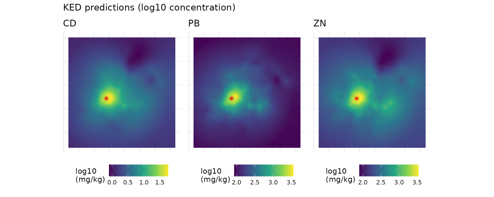

### Uncertainty

The kriging standard deviation ($`\sqrt{\text{variance}}`$) is low close
to the samples and grows in the margin, where no data are available. It
is a useful map to know where the contamination layer, and therefore the
whole spacemodR risk assessment, is less reliable.

``` r

ggplot() +
  geom_spatraster(data = sqrt(soil_maps$cd[["cd_var"]])) +
  geom_sf(data = soil_metaleurop, size = 0.3, colour = "white") +
  scale_fill_viridis_c(name = "sd\n(log10)", option = "magma") +
  labs(title = "Kriging standard deviation of log10(Cd)") +
  theme_minimal()
```

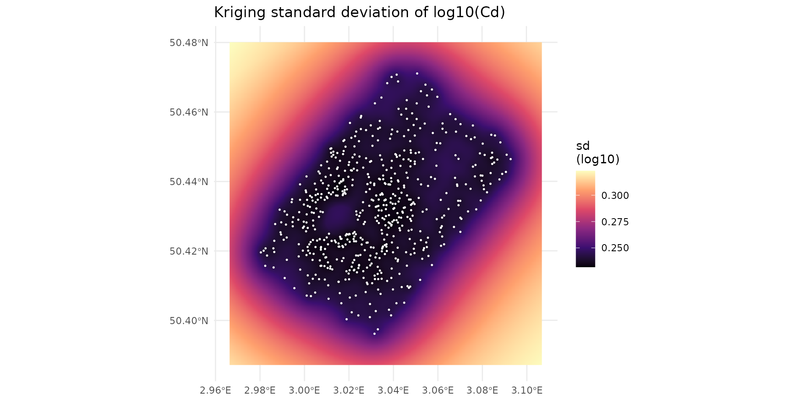

A rough 95% interval of the concentration in each cell is
$`10^{\text{pred} \pm 1.96\,\text{sd}}`$:

``` r

sd_cd <- sqrt(soil_maps$cd[["cd_var"]])
interval <- c(10^(soil_maps$cd[["cd_log10"]] - 1.96 * sd_cd),
              soil_maps$cd[["cd"]],
              10^(soil_maps$cd[["cd_log10"]] + 1.96 * sd_cd))
names(interval) <- c("lower 2.5%", "median", "upper 97.5%")
ggplot() +
  geom_spatraster(data = log10(interval)) +
  facet_wrap(~lyr) +
  scale_fill_viridis_c(name = "log10 Cd\n(mg/kg)") +
  theme_minimal() + theme(axis.text = element_blank())
```

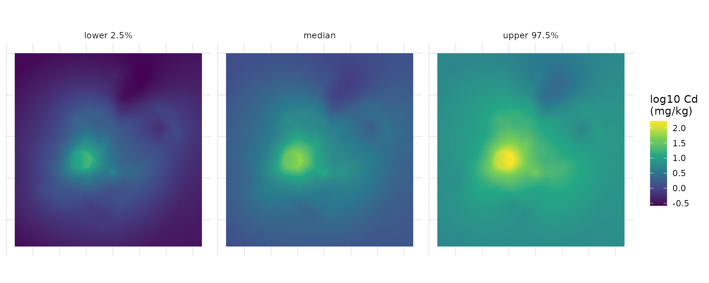

## Step 8 — Checks and use in spacemodR

### 8a. Behaviour far from the samples

The main practical difference between OK and KED lies in the margin of
the map. We extract both predictions along a transect starting at the
smelter and going to the south-west corner of the map:

``` r

ok_cd <- krige_soil(soil_metaleurop, "cd", template = template,
                    model = "Exp", verbose = FALSE)
ok_cd_packed <- terra::wrap(ok_cd)
```

``` r


corner <- c(xmin(template), ymin(template))
start <- sf::st_coordinates(smelter)[1, ]
s <- seq(0, 1, length.out = 300)
transect <- cbind(x = start[1] + s * (corner[1] - start[1]),
                  y = start[2] + s * (corner[2] - start[2]))
dist_km <- sqrt((transect[, 1] - start[1])^2 + (transect[, 2] - start[2])^2) / 1000

# last distance with a sample closer than 300 m from the transect
pts_xy <- sf::st_coordinates(soil_metaleurop)
near <- apply(transect, 1, function(p) min(sqrt((pts_xy[, 1] - p[1])^2 + (pts_xy[, 2] - p[2])^2)))
last_sample <- max(dist_km[near < 300])

profile <- rbind(
  data.frame(dist_km, value = extract(ok_cd[["cd_log10"]], transect)[, 1], method = "OK"),
  data.frame(dist_km, value = extract(soil_maps$cd[["cd_log10"]], transect)[, 1], method = "KED (distance)")
)
ggplot(profile, aes(dist_km, value, colour = method)) +
  geom_line(linewidth = 1) +
  geom_vline(xintercept = last_sample, linetype = 2) +
  annotate("text", x = last_sample, y = max(profile$value), hjust = -0.05,
           label = "no more samples beyond this line") +
  labs(x = "Distance from the smelter along the transect (km)",
       y = "Predicted log10(Cd)", colour = NULL) +
  theme_minimal()
```

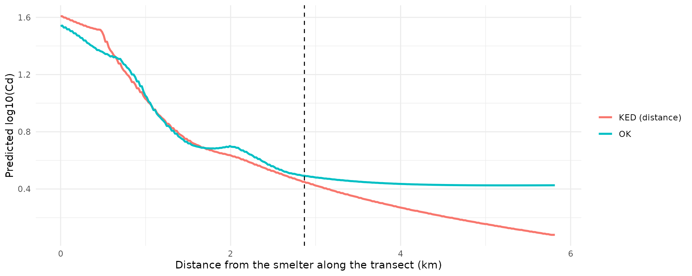

Beyond the last samples, OK goes back to the **mean of the data**, which
is dominated by the many samples taken close to the smelter: it
overestimates the contamination far away. KED keeps following the
physically sensible decrease with distance.

### 8b. Comparison with the previous rasters

The rasters shipped in `inst/extdata` were produced by the old Python
workflow (ordinary kriging). The difference with the new KED maps:

``` r

old_cd <- load_raster_extdata("ground_concentration_cd_compressed.tif")
diff_cd <- soil_maps$cd[["cd_log10"]] - old_cd
names(diff_cd) <- "KED - old OK"

lim <- max(abs(values(diff_cd)), na.rm = TRUE)
ggplot() +
  geom_spatraster(data = diff_cd) +
  scale_fill_distiller(palette = "RdBu", limits = c(-lim, lim),
                       name = "difference\n(log10)") +
  geom_sf(data = soil_metaleurop, size = 0.2) +
  labs(title = "log10(Cd): new KED map minus previous map") +
  theme_minimal()
```

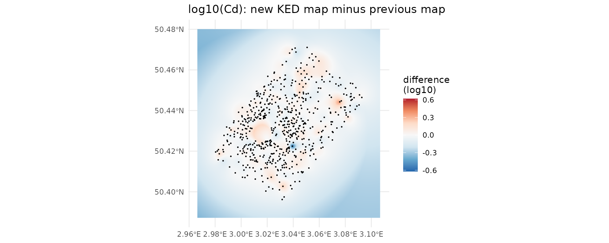

``` r

# Inside / outside the convex hull of the samples
hull <- terra::vect(sf::st_convex_hull(sf::st_union(soil_metaleurop)))
inside  <- values(terra::mask(diff_cd, hull), mat = FALSE)
outside <- values(terra::mask(diff_cd, hull, inverse = TRUE), mat = FALSE)
rbind(inside  = quantile(inside,  c(0.05, 0.5, 0.95), na.rm = TRUE),
      outside = quantile(outside, c(0.05, 0.5, 0.95), na.rm = TRUE))
#>                 5%           50%         95%
#> inside  -0.0760046 -0.0002601581  0.10073052
#> outside -0.3041180 -0.1496480143 -0.02294464
```

Inside the sampled area the two maps are close (differences are local
and mostly small, they come from the different variogram and from the
drift). Outside the sampled area, the new map is systematically
**lower**, because OK reverted to the mean of the data far from the
samples (see 8a).

### 8c. Use in a spacemodR workflow

The resulting layer behaves exactly like the rasters used in the other
articles: it can be saved, masked to a region of interest, and used as
the soil layer of a `spacemodel`.

``` r

# Save the log10 Cd map
terra::writeRaster(soil_maps$cd[["cd_log10"]], "ground_concentration_cd.tif",
                   overwrite = TRUE)

# Or use it directly, e.g. restricted to the region of interest
data(roi_metaleurop)
ground_cd <- terra::mask(soil_maps$cd[["cd_log10"]],
                         terra::vect(sf::st_transform(roi_metaleurop, 2154)))
```

## Summary: the whole workflow in a few lines

``` r

library(spacemodR)
data(soil_metaleurop)

# 1. Source location and covariate raster
smelter <- sf::st_sfc(sf::st_point(c(701156, 7036799)), crs = 2154)
grid <- soil_grid(soil_metaleurop, res = 25, margin = 1000)
dist_cov <- source_covariates(grid, smelter)          # layer "log10_dist"

# 2. (optional) inspect the variogram
v <- soil_variogram(soil_metaleurop, "cd", covariates = dist_cov)
plot(fit_soil_variogram(v, model = c("Exp", "Sph", "Gau")))

# 3. (optional) check the prediction error
summary(cv_soil(soil_metaleurop, "cd", covariates = dist_cov, model = "Exp"))

# 4. Kriging with external drift
cd_map <- krige_soil(soil_metaleurop, "cd", covariates = dist_cov, model = "Exp")
terra::plot(cd_map)
```

## Appendix — Implementation notes

- The kriging is implemented directly in spacemodR (packages `sf`,
  `terra` and `stats` only): with a few hundred samples, the kriging
  system can be solved globally (all samples are used for each
  prediction). It follows the conventions of the reference package
  **gstat** (same variogram models and parameters, same weighted
  least-squares fit), and gives the same predictions and variances as
  [`gstat::krige()`](https://r-spatial.github.io/gstat/reference/krige.html)
  (checked to $`10^{-7}`$) for both ordinary kriging and kriging with
  external drift.
- Duplicated sampling locations are averaged (otherwise the kriging
  system is singular): this is why the cross-validation tables report
  `n` = 587 instead of 595.
- For data sets with strong outliers,
  `soil_variogram(..., estimator = "robust")` uses the Cressie-Hawkins
  estimator, which is less sensitive to them.
- Kernel smoothing reuses
  [`compute_kernel()`](https://qonfluens.github.io/spacemodR/reference/compute_kernel.md),
  the Gaussian kernel used for dispersal in spacemodR.

``` r

# Optional check against gstat (only run if gstat is installed)
pts <- soil_metaleurop[!duplicated(sf::st_coordinates(soil_metaleurop)), ]
pts$cd_log10 <- log10(pts$cd)
m <- soil_vgm("Exp", psill = 0.17, range = 2000, nugget = 0.04)
g <- gstat::vgm(psill = 0.17, model = "Exp", range = 2000, nugget = 0.04)

small_grid <- soil_grid(soil_metaleurop, res = 500, margin = 0)
ours <- krige_soil(pts, "cd", template = small_grid, vgm = m, verbose = FALSE)
cells <- sf::st_as_sf(as.data.frame(xyFromCell(small_grid, 1:ncell(small_grid))),
                      coords = c("x", "y"), crs = 2154)
ref <- gstat::krige(cd_log10 ~ 1, pts, cells, model = g, debug.level = 0)
max(abs(ref$var1.pred - values(ours[["cd_log10"]])))
#> [1] 6.664536e-11
```

## References

- Pebesma, E. J. (2004). Multivariable geostatistics in S: the gstat
  package. *Computers & Geosciences*, 30(7), 683–691.
- Hengl, T., Heuvelink, G. B. M., & Rossiter, D. G. (2007). About
  regression-kriging: from equations to case studies. *Computers &
  Geosciences*, 33(10), 1301–1315.
- Webster, R., & Oliver, M. A. (2007). *Geostatistics for Environmental
  Scientists* (2nd ed.). Wiley.
