# Calibration of Transfer Models

    #> Loading required package: StanHeaders
    #> 
    #> rstan version 2.32.7 (Stan version 2.32.2)
    #> For execution on a local, multicore CPU with excess RAM we recommend calling
    #> options(mc.cores = parallel::detectCores()).
    #> To avoid recompilation of unchanged Stan programs, we recommend calling
    #> rstan_options(auto_write = TRUE)
    #> For within-chain threading using `reduce_sum()` or `map_rect()` Stan functions,
    #> change `threads_per_chain` option:
    #> rstan_options(threads_per_chain = 1)
    #> 
    #> Attaching package: 'dplyr'
    #> The following objects are masked from 'package:stats':
    #> 
    #>     filter, lag
    #> The following objects are masked from 'package:base':
    #> 
    #>     intersect, setdiff, setequal, union
    #> Linking to GEOS 3.12.1, GDAL 3.8.4, PROJ 9.4.0; sf_use_s2() is TRUE
    #> terra 1.9.34
    #> 
    #> Attaching package: 'terra'
    #> The following object is masked from 'package:rstan':
    #> 
    #>     extract
    #> 
    #> Attaching package: 'tidyterra'
    #> The following object is masked from 'package:stats':
    #> 
    #>     filter
    #> 
    #> Attaching package: 'scales'
    #> The following object is masked from 'package:terra':
    #> 
    #>     rescale
    #> The following object is masked from 'package:purrr':
    #> 
    #>     discard
    #> 
    #> Attaching package: 'patchwork'
    #> The following object is masked from 'package:terra':
    #> 
    #>     area

## Transfer model

For the inference of transfer model, we use Bayesian Multiple Linear
Regression model using Stan code.

### Simple model

The likelihood is defined as:

``` math
y_i \sim \mathcal{N}(\mu_i, \sigma^2)
```

``` math
\mu_i = \beta_0 + \beta_1 x_i + \beta_{\text{cat}}[x\_cat_i]
```
Where:

- $`\beta_0`$ is the global intercept.
- $`\beta_1`$ is the slope coefficient for the continuous variable
  $`x`$.
- $`\beta_{\text{cat}}[x\_cat_i]`$ is the specific coefficient (effect)
  associated with the category to which observation $`i`$ belongs.
- $`\sigma`$ is the standard deviation of the error term (residuals).

The model specifies weakly informative priors for its parameters to
regularize the inferences without overly constraining the data:

- Intercept: $`\beta_0 \sim \mathcal{N}(0, 10)`$
- Continuous Slope: $`\beta_1 \sim \mathcal{N}(0, 10)`$
- Categorical Coefficients:
  $`\beta_{\text{cat}} \sim \mathcal{N}(0, 10)`$ for each of the $`K`$
  categories.
- Error Standard Deviation: $`\sigma \sim \text{Half-Cauchy}(0, 5)`$.
  Because $`\sigma`$ is constrained to be strictly positive
  (`real<lower=0> sigma;`) , the Cauchy prior automatically becomes a
  truncated Half-Cauchy distribution.

Based on the structure of the likelihood function, this model makes the
following classical linear regression assumptions:

- Linearity: The relationship between the continuous predictor $`x`$ and
  the mean of the response $`y`$ is strictly linear.
- Additivity (No Interactions): The effect of the continuous variable
  ($`x`$) and the categorical variable ($`x_{cat}`$) are purely
  additive. The slopes are assumed to be identical across all
  categories; only the intercepts vary (parallel lines model).
- Normality of Errors: The residuals (the differences between observed
  and predicted values) are normally distributed.
- Homoscedasticity (Constant Variance): The standard deviation of the
  error term, $`\sigma`$, is assumed to be constant across all values of
  $`x`$ and across all $`K`$ categories.
- Independence: Each observation $`i`$ is conditionally independent
  given the parameters.

## Direct fix-point model of Soil-Organism

### Inference for Vegetation and Earthworm

For both species, we assumed a direct link:

``` math
\log_{10}\left( C_{internal} \right) = \beta_0 + \beta_1  \log_{10}\left( C_{soil} \right)
```

In Veltman et al. ([2007](#ref-veltman2007cadmium)) the regressions for
empirical aboveground plant parts (predominantly leaves) and earthworm
concentrations with total soil concentrations is such as:

``` math
\log_{10}(C_{plant}) = -0.42 + 0.59 \times \log_{10}(C_{soil}) 
```

``` math
\log_{10}(C_{earthworm}) = 1.09 +  0.68 \times \log_{10}(C_{soil})
```
\### Vegetation

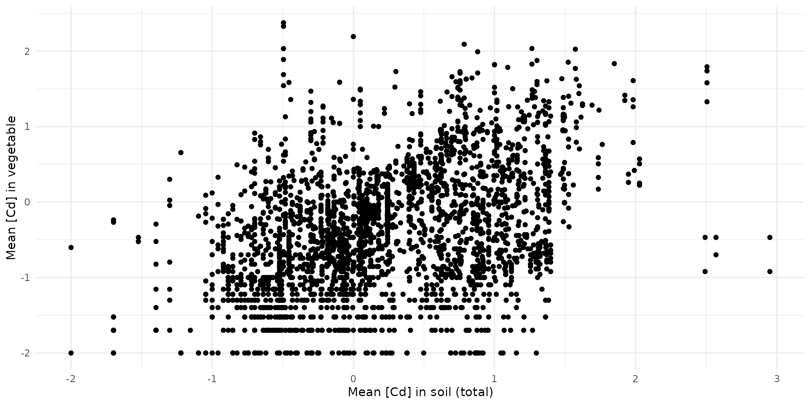

``` r

stan_data = list(
  N = nrow(bappet_cd),
  x = bappet_cd$log10_media_mean,
  y = bappet_cd$log10_plant_mean,
  M = 100,
  x_sim = seq(-2, 3, length.out=100)
)
```

``` r

# fit_simple_veg_cd <- calibrate_simple(stan_data, chains=4, warmup=500, iter=1000)
# saveRDS(fit_simple_veg_cd, file="raw_data/fit_simple_veg_cd.rds")
fit_simple_veg_cd <- load_safe("raw_data/fit_simple_veg_cd.rds")
```

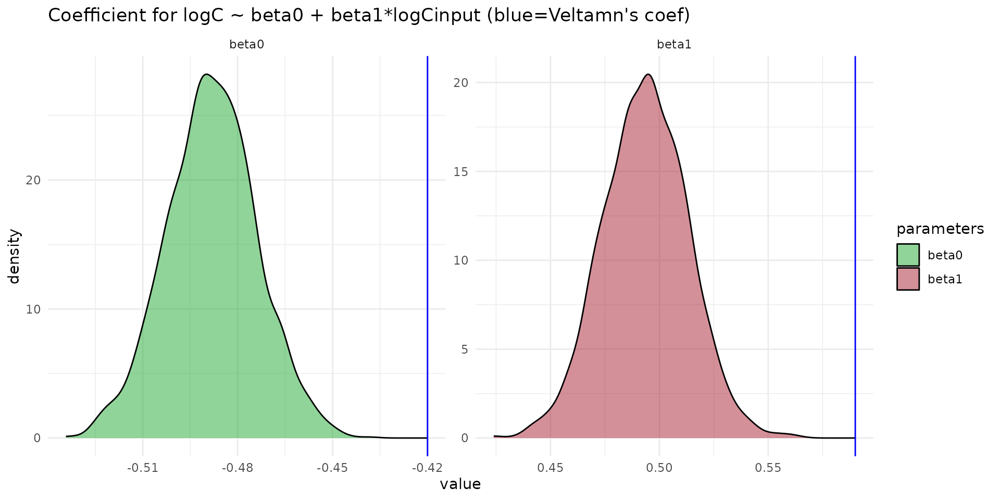

``` r

arr_sim <- rstan::extract(fit_simple_veg_cd, "y_sim")[[1]]
```

``` r

quants <- c(0.025, 0.5, 0.975)
q_mat <- apply(arr_sim, 2, quantile, probs = quants)
df_sim <- q_mat %>%
  t() %>%
  as.data.frame() %>%
  mutate(
    var_id = 1:n(),
    x_sim = stan_data$x_sim
  )

df_veltman = data.frame(
  x_sim = stan_data$x_sim,
  y_sim = -0.42 + 0.59 *stan_data$x_sim
)
```

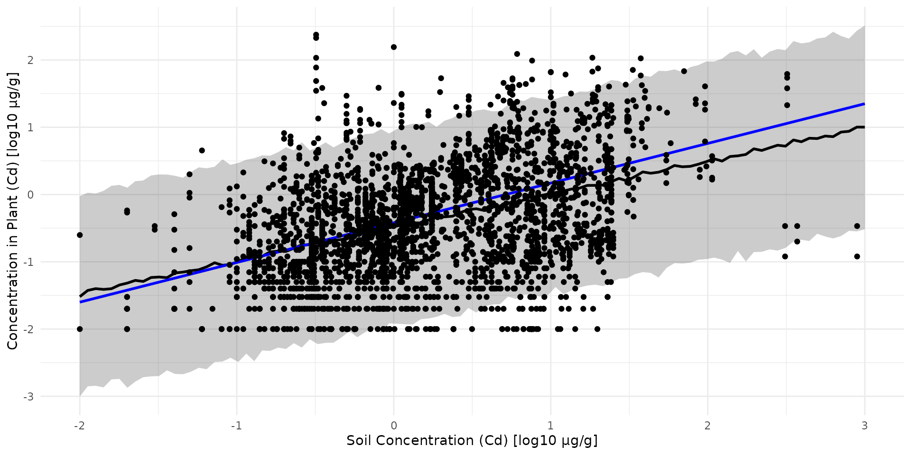

#### Earthworm

``` r

data("earthworm_cd")

stan_data = list(
  N = nrow(earthworm_cd),
  x = earthworm_cd$log10_cd_soil,
  y = earthworm_cd$log10_cd_worm,
  M = 100,
  x_sim = seq(-2, 3, length.out=100)
)
```

``` r

# fit_simple_worm_cd <- calibrate_simple(stan_data, chains=4, warmup=500, iter=1000)
# saveRDS(fit_simple_worm_cd, file="raw_data/fit_simple_worm_cd.rds")
fit_simple_worm_cd <- load_safe("raw_data/fit_simple_worm_cd.rds")
```

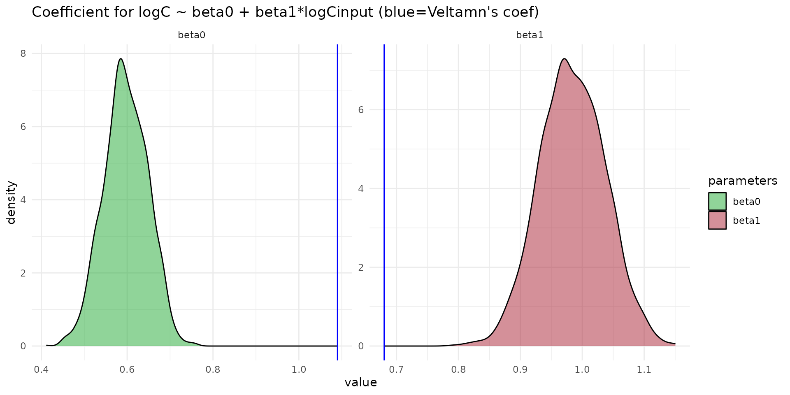

``` r

arr_sim <- rstan::extract(fit_simple_worm_cd, "y_sim")[[1]]
```

``` r

quants <- c(0.025, 0.5, 0.975)
q_mat <- apply(arr_sim, 2, quantile, probs = quants)
df_sim <- q_mat %>%
  t() %>%
  as.data.frame() %>%
  mutate(
    var_id = 1:n(),
    x_sim = stan_data$x_sim
  )

df_veltman = data.frame(
  x_sim = stan_data$x_sim,
  y_sim = 1.09 + 0.68 *stan_data$x_sim
)
```

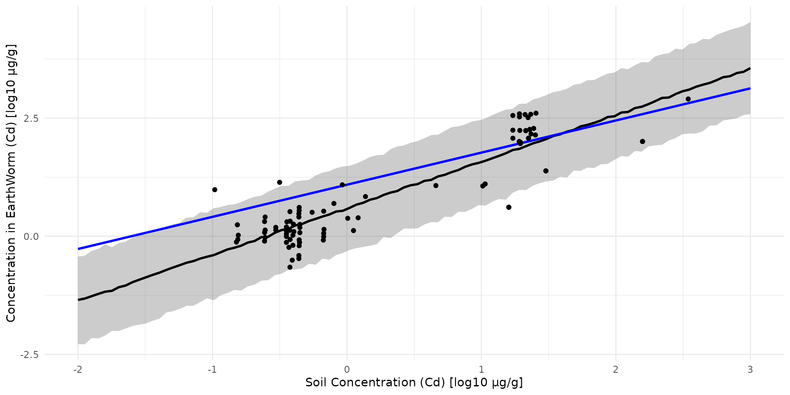

### Soil -\> Micro-Mammals

``` r

data(sf_micromammals)
# ADD LOG_10 COLUMNS
sf_train <- sf_micromammals |>
  dplyr::mutate(
    log10_cd_S = log10(cd_S),
    log10_cd_WB_FW = log10(cd_WB_FW))
# ADD GROUP HERBIVOE vs INSECTIVORE
lookup_table = data.frame(
    group = c('shrew', 'mouse', 'vole'),
    food = c('insectivore', 'herbivore', 'herbivore'),
    food_cat_num = c(2,1,1))
sf_train = dplyr::left_join(sf_train, lookup_table, by='group')
```

``` r

stan_data = list(
  N = nrow(sf_train),
  K = 2,
  x = sf_train$log10_cd_S,
  y = sf_train$log10_cd_WB_FW,
  x_cat = sf_train$food_cat_num,
  M = 100,
  x_sim = seq(min(sf_train$log10_cd_S), max(sf_train$log10_cd_S), length.out=100)
)
```

``` r

# fit_direct <- calibrate_direct(stan_data, chains=4, warmup=500, iter=1000)
# saveRDS(fit_direct, file="raw_data/fit_direct_cd.rds")
fit_direct <- load_safe("raw_data/fit_direct_cd.rds")
```

#### Equation parameters

The equation of the direct model is given by:

``` math
\log_{10}\left( C_{internal} \right) = \beta_0 + \beta_1  \log_{10}\left( C_{soil} \right) + beta_{cat} \log_{10}\left( C_{soil} \right) 
```

``` r

fit_pars <- rstan::extract(fit_direct, c("beta0", "beta1", "beta_cat"))

df_pars <- dplyr::bind_rows(list(
  data.frame(value=fit_pars$beta0, par="beta0"),
  data.frame(value=fit_pars$beta1, par="beta1"),
  data.frame(value=fit_pars$beta_cat[,1], par="beta_herbivore"),
  data.frame(value=fit_pars$beta_cat[,2], par="beta_insectivore")
))
ggplot(data=df_pars) +
  theme_minimal() +
  scale_x_log10() +
  scale_fill_manual(
    name="parameters",
    values=c("#22aa33", "#aa2233","#3322aa", "#2233aa")) +
  geom_density(aes(value, fill=par), alpha=0.5) 
#> Warning in transformation$transform(x): NaNs produced
#> Warning in scale_x_log10(): log-10 transformation introduced
#> infinite values.
#> Warning: Removed 3131 rows containing non-finite outside the scale range
#> (`stat_density()`).
```

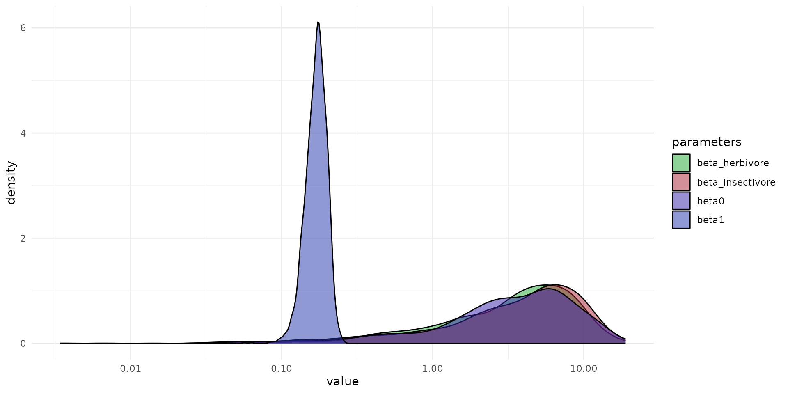

#### Observation vs Prediction

``` r

arr_sim <- rstan::extract(fit_direct, "y_sim")[[1]]
```

In the study of Veltman et al. ([2007](#ref-veltman2007cadmium)), an
equation is given by

\$\$ C\_{}0.68·log(Csoil)1.09 \$\$

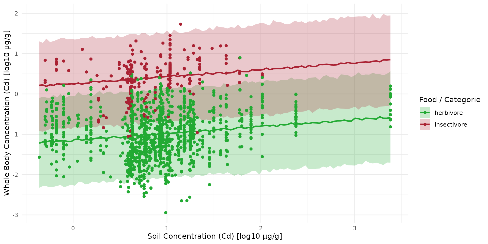

#### Predictive Test

The Cd concentration in body, dry weight, µg.g-1, is calculated from
dat\*a measured using equation given in Veltman et al. 2007 in
Environmental Toxicology and Chemistry:

- voles:
  $`\frac{1}{0.8} \left( 0.054 \times \text{Cd}_\text{liver} + 0.013 \times \text{Cd}_\text{kidney} \right)`$
- shrews:
  $`\frac{1}{0.8} \left( 0.07 \times \text{Cd}_\text{liver} + 0.019 \times\text{Cd}_\text{kidney} \right)`$

Then, the Cd concentration in body, fresh weight, µg.g-1, is calculated
from data measured using the Dry/fresh ratio: \$Wfresh = Wdry \$

``` r

# ADD GROUP HERBIVORE vs INSECTIVORE
lookup_table = data.frame(
    Species = c('APSY', 'CRRU', 'SOMI'),
    group = c('vole', 'shrew', 'shrew'),
    coef_WB_CD_liver = c(0.054, 0.07, 0.07),
    coef_WB_CD_kidney = c(0.013, 0.019, 0.019),
    food = c('herbivore', 'insectivore', 'insectivore'),
    food_cat_num = c(2,1,1))

sf_test = dplyr::left_join(sf_metaleurop_2025, lookup_table, by='Species') |>
  dplyr::mutate(cd_WB_DW = 1/0.8*(coef_WB_CD_liver*CdInLiver + coef_WB_CD_kidney*CdInKidneys)) |>
  dplyr::mutate(cd_WB_FW = cd_WB_DW*1/4) |>
  dplyr::mutate(log10_cd_WB_FW = log10(cd_WB_FW))
```

Collect corresponding soil value

``` r

sf_test <- st_transform(sf_test, crs(ground_cd))

centroids <- st_centroid(sf_test)
#> Warning: st_centroid assumes attributes are constant over geometries
val_centroid <- terra::extract(ground_cd, centroids)
val_mean_trapline <- terra::extract(ground_cd, vect(sf_test), fun = mean, na.rm = TRUE)

sf_test$log10_cd_S_centroid <- val_centroid[, 2]
sf_test$log10_cd_S_meanLine <- val_mean_trapline[, 2]
```

Big points are

    #> Warning: Removed 7 rows containing missing values or values outside the scale range
    #> (`geom_point()`).

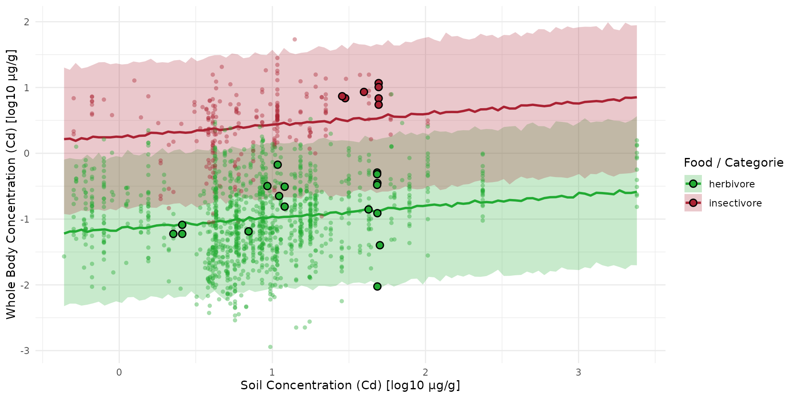

## Direct dist-buffer model of Soil-Organism

For moving organism as micro-mammals, the idea here is to consider a
buffer around the traplines. Let 100m first.

### Collect Buffer mean Value

``` r

sf_train_b <- st_transform(sf_metaleurop_2010, crs(ground_cd))
sf_train_b100 <- st_buffer(sf_train_b, dist = 100)

centroids <- st_centroid(sf_train_b)
#> Warning: st_centroid assumes attributes are constant over geometries
val_centroid <- terra::extract(ground_cd, centroids)
val_mean_trapline <- terra::extract(ground_cd, vect(sf_train_b), fun = mean, na.rm = TRUE)
val_mean_b100 <- terra::extract(ground_cd, vect(sf_train_b100), fun = mean,  na.rm = TRUE)

sf_train_b100$log10_cd_S_centroid <- val_centroid[, 2]
sf_train_b100$log10_cd_S_meanLine <- val_mean_trapline[, 2]
sf_train_b100$log10_cd_S_meanb100 <- val_mean_b100[, 2]
```

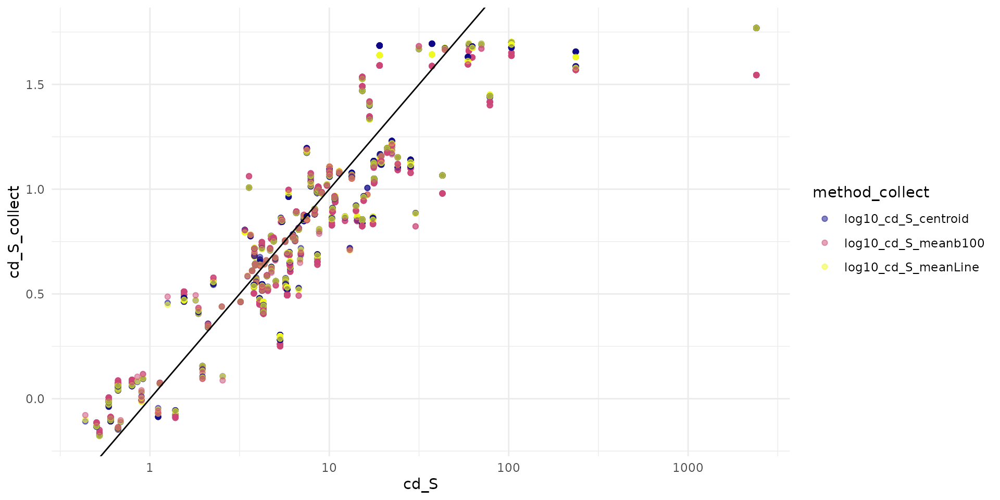

### Compute inference

``` r

d00 = sf_train_b100 %>%
  dplyr::mutate(
    log10_cd_S = log10(cd_S),
    log10_cd_WB_FW = log10(cd_WB_FW),
  )
lookup_table = data.frame(
    group = c('shrew', 'mouse', 'vole'),
    food = c('insectivore', 'herbivore', 'herbivore'),
    food_cat_num = c(2,1,1))
d = dplyr::left_join(d00, lookup_table, by='group')

stan_data = list(
  N = nrow(d),
  K = 2,
  x = d$log10_cd_S_meanb100,
  y = d$log10_cd_WB_FW,
  x_cat = d$food_cat_num,
  M = 100,
  x_sim = seq(min(d$log10_cd_S), max(d$log10_cd_S), length.out=100)
)
```

``` r

# fit_direct_b100 <- calibrate_direct(stan_data, chains=4, warmup=500, iter=1000)
# saveRDS(fit_direct_b100, file="raw_data/fit_direct_b100_cd.rds")
fit_direct_b100 <- load_safe("raw_data/fit_direct_b100_cd.rds")
```

``` r

arr_sim_b100 <- rstan::extract(fit_direct_b100, "y_sim")[[1]]
```

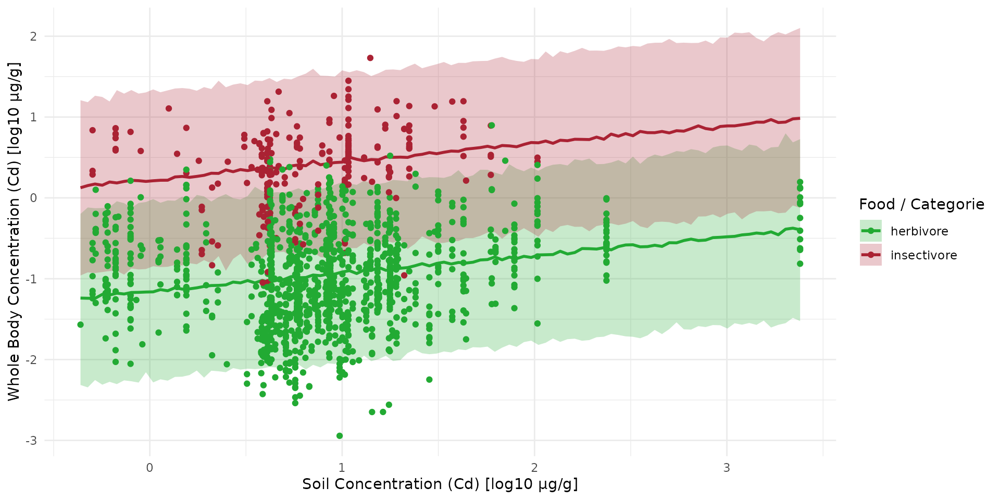

### Compare prediction with new data

``` r

sf_full <- data.frame(
  food =           c(sf_train$food, sf_test$food),
  set =            c(rep("train", nrow(sf_train)), rep("test", nrow(sf_test))),
  log10_cd_S =     c(sf_train$log10_cd_S, sf_test$log10_cd_S_meanLine),
  log10_cd_WB_FW = c(sf_train$log10_cd_WB_FW, sf_test$log10_cd_WB_FW)
)
sf_full$set <- factor(sf_full$set, levels = c("train", "test"))

plt_full <- plt_sim +
  geom_point(
    data = subset(sf_full, set == "train"),
    aes(x = log10_cd_S, y = log10_cd_WB_FW, color = food),
    shape = 16, alpha = 0.4, size = 1.5
  ) +
  geom_point(
    data = subset(sf_full, set == "test"),
    aes(x = log10_cd_S, y = log10_cd_WB_FW, fill = food),
    shape = 21, color = "black", stroke = 0.8, size = 2.5
  )
plt_full
#> Warning: Removed 7 rows containing missing values or values outside the scale range
#> (`geom_point()`).
```

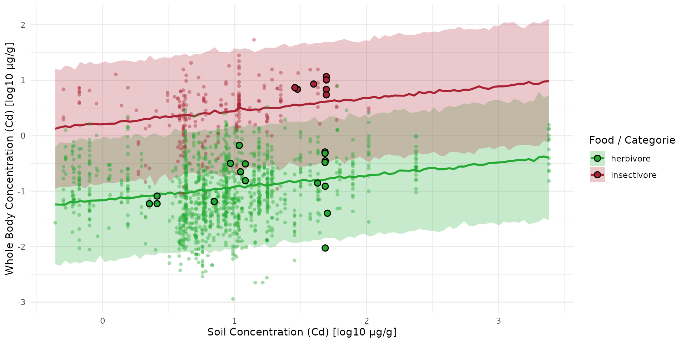

### Mapping

Here we are going to compute the map of predicted concentration over the
landscape.

Let first recapture the value of median:

``` r

fit_pars <- rstan::extract(fit_direct_b100, c("beta0", "beta1", "beta_cat"))

df_pars <- dplyr::bind_rows(list(
  data.frame(value=fit_pars$beta0, par="beta0"),
  data.frame(value=fit_pars$beta1, par="beta1"),
  data.frame(value=fit_pars$beta_cat[,1], par="beta_herbivore"),
  data.frame(value=fit_pars$beta_cat[,2], par="beta_insectivore")
))

dp_q50 <- df_pars %>%
  dplyr::group_by(par) %>%
  dplyr::summarise(median_value = median(value, na.rm=TRUE))

ls_q50 <- setNames(as.list(dp_q50$median_value), dp_q50$par)
```

``` r

names_hab = c("soil", "herbivore", "insectivore")
list_habitat <- lapply(names_hab, function(i) ground_cd)
stack_habitat <- raster_stack(list_habitat, names_hab)
trophic_df <- trophic() |>
  add_link("soil", "herbivore") |>
  add_link("soil", "insectivore")
spcmdl_direct <- spacemodel(stack_habitat, trophic_df)

direct_kernels <- list(soil = NA, herbivore = NA, insectivore = NA)

direct_fluxes <- flux(
    spcmdl_direct,
    default = 1,          # for all other default is 1
    normalize = FALSE
  ) |> # TRUE would weight every link to sum at 1
  add_flux("soil", "herbivore", ~ ls_q50$beta0 + ls_q50$beta1*x + ls_q50$beta_herbivore*x) |>
  add_flux("soil", "insectivore", ~ ls_q50$beta0 + ls_q50$beta1*x + ls_q50$beta_insectivore*x)

spcmdl_direct_risk <- transfer(
  spcmdl_direct,
  direct_kernels,
  direct_fluxes,
  exposure_weighting="potential")
```

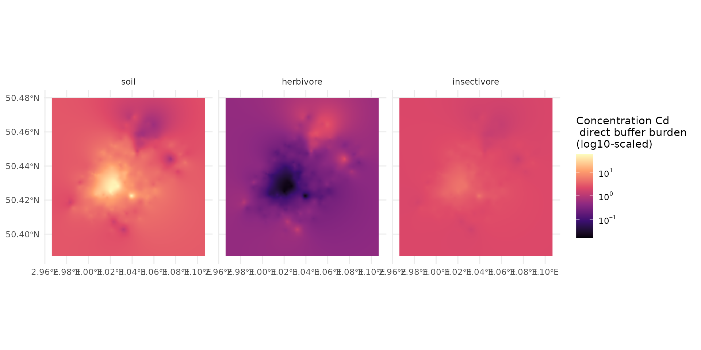

## Direct kernel-buffer model of Soil-Organism

``` r

data("ocsge_species_dict")
```

## Trophic Transfer

### Plant -\> Vole & Earthworm -\> Shrew

In Veltman et al. ([2007](#ref-veltman2007cadmium)) the regressions for
empirical aboveground plant parts (predominantly leaves) and earthworm
concentrations with total soil concentrations is such as:

``` math
\log_{10}(C_{vole}) = -0.37 + 1.16 \times \log_{10}(C_{plant}) 
```

``` math
\log_{10}(C_{shrew}) = -0.45 + 0.79 \times \log_{10}(C_{earthworm}) 
```

Veltman, Karin, Mark AJ Huijbregts, Timo Hamers, Sander Wijnhoven, and A
Jan Hendriks. 2007. “Cadmium Accumulation in Herbivorous and Carnivorous
Small Mammals: Meta-Analysis of Field Data and Validation of the
Bioaccumulation Model Optimal Modeling for Ecotoxicological
Applications.” *Environmental Toxicology and Chemistry* 26 (7): 1488–96.
