# Berisp-like: a trophic model of contamination

``` r

library(spacemodR)
library(rstan)
library(ggplot2)
library(scales)
library(stringr)
library(dplyr)
library(tidyr)
library(terra)
library(purrr)
```

## Trophic web

Often, in other notebooks, we started by defining the habitats. But in
this case, let’s begin by defining the species and their trophic
relationships.

The goal is to reproduce the results of the Berisp model by using the
same species. Here are the species we want to model:

- The **soil** category: although not a species, we need this layer to
  account for areas with and without soil. This allows us to isolate the
  kriging process used to estimate contamination, which we will address
  later. Note that we could also define layers for pH and Organic Matter
  (%OM), which are sometimes included in transfer equations.

Next, the organisms directly linked to the soil:

- **Plants** (aka **plant**): let’s include all plants (trees, grasses,
  cereal crops, and shrubs). We could break down this stratum further,
  but let’s keep it simple.
- **Earthworms** (aka **earthworm**: we will use this single category to
  represent soil invertebrates.
- **Ground beetles**, (aka **beetle**): a highly species-rich family
  present everywhere. They are strongly influenced by soil conditions
  and occasionally prey on earthworms.

Mammals. We are only considering small mammals:

- **Bank vole** (*Myodes glareolus*, aka **myodes**): a strictly
  herbivorous rodent that prefers wooded habitats.
- **Common vole** (*Microtus arvalis*, aka **microtus**): a highly
  herbivorous rodent that primarily inhabits meadows.
- **Wood mouse** (*Apodemus sylvaticus*, aka **apodemus**): a rodent
  with a more diverse diet than the previous two.
- **Shrew** (aka **shrew**, Soricidae: *Sorex araneus* and the greater
  white-toothed shrew, *Crocidura russula*): classified as insectivores,
  they feed on ground beetles, but also consume earthworms and slugs.

Finally, 3 bird species (Note: le texte original disait “2” mais en
liste 3):

- **Pigeon/Dove** (aka **columba**): not included in Berisp, but useful
  as a common herbivore/granivore; it is widely used in Eco-SSL and
  various exposure models.
- **Blackbird** (*Turdus merula*, aka **turdus**): an omnivore that
  feeds on insects, earthworms, very small animals, and seeds.
- **Little owl** (*Athene noctua*, aka **athene**): feeds heavily on
  insects, earthworms, and small mammals. This will be the apex predator
  of our food web.

### Plants and Beetles

So, let’s start creating the food web.

For plants and earthworm, 100% of the feeding behavior is based on soil.
We keep thing simples, so we do not make any assumption on other sources
of contaminantion, and we could eventually modulate the intake rate with
the flux equatiosn comming after.

For ground beetles (Carabidae), according to recent literature
(@sacco2024carabs and @deroulers2019carabs), ground beetles display a
highly opportunistic and plastic diet, adapting their food intake based
on environmental availability. While they are major predators of soil
invertebrates like earthworms, they also exhibit a feeding continuum
that includes a significant intake of weed seeds and plant material,
particularly within specific tribes. To maintain simplicity within our
food web model, we will bypass these highly dynamic seasonal shifts and
assume a fixed dietary composition for the ground beetles consisting of
10% soil particles (accounting for incidental ingestion during
foraging), 45% vegetation, and 45% earthworms.

``` r

trophic_df_init <- trophic() |>
  add_link("soil", "plant", 1) |>
  add_link("soil", "earthworm", 1)

# beetle and beetles
trophic_df <- trophic_df_init |>
  add_link("soil", "beetle", 0.1) |>
  add_link("plant", "beetle", 0.45) |>
  add_link("earthworm", "beetle", 0.45)
```

``` r

plot(trophic_df_init, colors = species_colors)
```

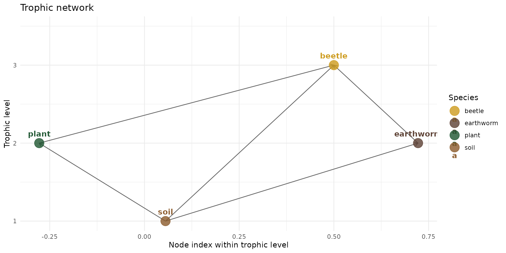

### Diet of mammals and birds: the EltonTraits 1.0 database

Before going any further, we have two datasets from the EltonTraits 1.0
database, one for birds (9,994 species) and one for mammals (5,401
species), which will help us refine these dietary profiles. That is what
we will explore here.

``` r

data("DBFunc_MamFuncDat")
data("DBFunc_BirdFuncDat")

head(DBFunc_MamFuncDat)
#>   MSW3_ID               Scientific    MSWFamilyLatin Diet.Inv Diet.Vend
#> 1       1   Tachyglossus aculeatus    Tachyglossidae      100         0
#> 2       2  Zaglossus attenboroughi    Tachyglossidae      100         0
#> 3       3        Zaglossus bartoni    Tachyglossidae      100         0
#> 4       4        Zaglossus bruijni    Tachyglossidae      100         0
#> 5       5 Ornithorhynchus anatinus Ornithorhynchidae       80         0
#> 6       6      Caluromys philander       Didelphidae       20         0
#>   Diet.Vect Diet.Vfish Diet.Vunk Diet.Scav Diet.Fruit Diet.Nect Diet.Seed
#> 1         0          0         0         0          0         0         0
#> 2         0          0         0         0          0         0         0
#> 3         0          0         0         0          0         0         0
#> 4         0          0         0         0          0         0         0
#> 5         0         20         0         0          0         0         0
#> 6         0          0        10         0         20         0        10
#>   Diet.PlantO Diet.Source Diet.Certainty ForStrat.Value ForStrat.Certainty
#> 1           0       Ref_1            ABC              G                  A
#> 2           0      Ref_65            ABC              G                  A
#> 3           0       Ref_2             D1              G                  A
#> 4           0       Ref_1            ABC              G                  A
#> 5           0       Ref_1            ABC              G                  A
#> 6          40       Ref_1            ABC             Ar                  A
#>   ForStrat.Comment Activity.Nocturnal Activity.Crepuscular Activity.Diurnal
#> 1                                   1                    1                0
#> 2                                   1                    0                0
#> 3                                   1                    0                0
#> 4                                   1                    0                0
#> 5                                   1                    1                1
#> 6                                   1                    1                0
#>   Activity.Source Activity.Certainty BodyMass.Value BodyMass.Source
#> 1           Ref_1                ABC        3025.00         Ref_117
#> 2           Ref_1                ABC        8532.39    Ref_2, Ref_3
#> 3           Ref_1                ABC        7180.00         Ref_131
#> 4           Ref_1                ABC       10139.50         Ref_117
#> 5           Ref_1                ABC        1484.25         Ref_117
#> 6           Ref_1                ABC         229.25         Ref_117
#>   BodyMass.SpecLevel
#> 1                  1
#> 2                  0
#> 3                  1
#> 4                  1
#> 5                  1
#> 6                  1
```

Concise Diet Descriptions (EltonTraits 1.0):

- `Diet.PlantO`: % of other vegetative tissues (leaves, stems, roots,
  bark).
- `Diet.Fruit`: % of fruits and berries consumed.
- `Diet.Seed`: % of seeds, nuts, grains, or cones.
- `Diet.Nect`: % of nectar, pollen, or plant exudates.
- `Diet.Inv`: % of invertebrates (insects, larves, worms, mollusks).
- `Diet.Vfish`: % of fish consumed.
- `Diet.Vect`: % of ectothermic vertebrates (reptiles and amphibians).
- `Diet.Vend`: % of endothermic vertebrates (birds and mammals).
- `Diet.Scav`: % of scavenging activity (eating carrion/dead animals).
- `Diet.Vunk`: % of unknown or unclassified vertebrates.

And also:

- `Diet.Source`: Reference/ID of the scientific data source.
- `Diet.Certainty`: Data certainty score (direct species study
  vs. genus-level extrapolation).

#### Small mammals: voles and shrew

``` r

diet_mammal <- DBFunc_MamFuncDat |>
  dplyr::filter(
    Scientific %in% 
      c("Microtus arvalis", "Myodes glareolus", "Apodemus sylvaticus", "Sorex araneus", "Crocidura russula")
    )

# transform data_set
species_short = c(
  "Microtus arvalis"="microtus",
  "Myodes glareolus"="myodes",
  "Apodemus sylvaticus"="apodemus",
  "Sorex araneus"="sorex",
  "Crocidura russula"="crocidura")
diet_long <- diet_mammal |>
  pivot_longer(
    cols = c(Diet.Inv, Diet.Vend, Diet.Vect, Diet.Vfish, Diet.Vunk, 
             Diet.Scav, Diet.Fruit, Diet.Nect, Diet.Seed, Diet.PlantO),
    names_to = "Diet_Category",
    values_to = "Value"
  ) |>
  mutate(
    Diet_Category = stringr::str_remove(Diet_Category, "Diet\\."),
    Diet_Category = factor(Diet_Category, levels = trophic_order),
    Species_Short = species_short[Scientific]
  )

# create plot
ggplot(diet_long, aes(x = Diet_Category, y = Value, color = Species_Short, shape=Scientific)) +
  geom_point(size = 3, alpha = 0.8, position = position_jitter(width = 0.15, height = 0)) +
  theme_minimal(base_size = 14) +
  scale_color_manual(values = species_colors) +
  labs(
    title = "Dietary composition of some small-mammals species",
    x = "Diet Category",
    y = "Percentage / Value",
    color = "Species"
  ) +
  theme(
    axis.text.x = element_text(angle = 45, hjust = 1),
    panel.grid.minor = element_blank(),
  )
```

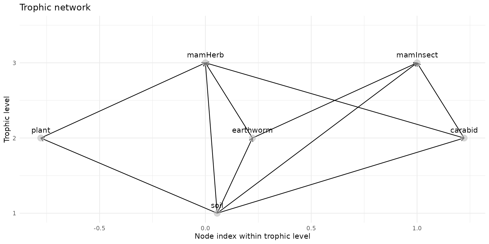

We can compared the results with what is used in the Berisp
documentation, and see that the results are similar:

|  | grass | herbs | berries | seeds | earthworm | beetle | soil |
|:---|:--:|:--:|:--:|:--:|:--:|:--:|:--:|
| bank vole (*Myodes glareolus*) | 20 | 20 | 26 | 24 | 4 | 4 | 2 |
| common vole (*Microtus arvalis*) | 42 | 41 |  | 15 |  |  | 2 |
| wood mouse (*Apodemus sylvaticus*) | 6 | 6 | 12 | 58 | 8 | 8 | 2 |
| shrew (*Sorex araneus* or *Crocidura russula*) |  |  |  |  | 49 | 49 | 2 |

So we add mammals to the trophic network

``` r

trophic_df <- trophic_df |>
  # myodes
  add_link("soil", "myodes", 0.02) |>
  add_link("plant", "myodes", 0.9) |>
  add_link("earthworm", "myodes", 0.04) |>
  add_link("beetle", "myodes", 0.04) |>
  # microtus
  add_link("soil", "microtus", 0.02) |>
  add_link("plant", "microtus", 0.98) |>
  # wood mouse
  add_link("soil", "apodemus", 0.02) |>
  add_link("plant", "apodemus", 0.82) |>
  add_link("earthworm", "apodemus", 0.08) |>
  add_link("beetle", "apodemus", 0.08) |>
  # sorex
  add_link("soil", "sorex", 0.02) |>
  add_link("earthworm", "sorex", 0.49) |>
  add_link("beetle", "sorex", 0.49) |>
  # crocidura
  add_link("soil", "crocidura", 0.02) |>
  add_link("earthworm", "crocidura", 0.49) |>
  add_link("beetle", "crocidura", 0.49)
```

``` r

plot(trophic_df, colors = species_colors)
```

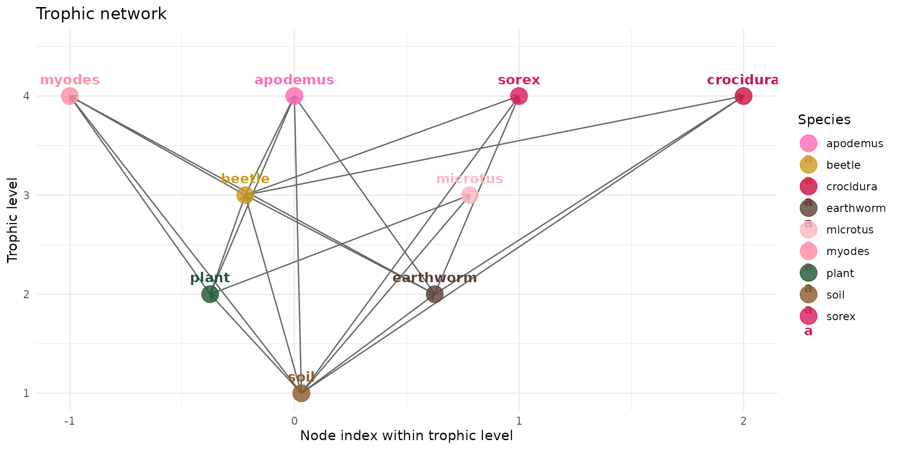

#### Birds: little owl and black bird

``` r

diet_bird <- DBFunc_BirdFuncDat |>
  dplyr::filter(
    Scientific %in% 
      c("Athene noctua", "Turdus merula", "Columba palumbus")
    )

# transform data_set
species_short = c(
  "Columba palumbus"="columba",
  "Athene noctua"="athene",
  "Turdus merula"="turdus")
diet_long <- diet_bird |>
  pivot_longer(
    cols = c(Diet.Inv, Diet.Vend, Diet.Vect, Diet.Vfish, Diet.Vunk, 
             Diet.Scav, Diet.Fruit, Diet.Nect, Diet.Seed, Diet.PlantO),
    names_to = "Diet_Category",
    values_to = "Value"
  ) |>
  mutate(
    Diet_Category = stringr::str_remove(Diet_Category, "Diet\\."),
    Diet_Category = factor(Diet_Category, levels = trophic_order),
    Species_Short = species_short[Scientific]
  )

# create plot
ggplot(diet_long, aes(x = Diet_Category, y = Value, color = Species_Short, shape=Scientific)) +
  geom_point(size = 3, alpha = 0.6, position = position_jitter(width = 0.15, height = 0)) +
  theme_minimal(base_size = 14) +
  scale_color_manual(values = species_colors) +
  labs(
    title = "Dietary composition of some small-mammals species",
    x = "Diet Category",
    y = "Percentage / Value",
    color = "Species"
  ) +
  theme(
    axis.text.x = element_text(angle = 45, hjust = 1),
    panel.grid.minor = element_blank(),
  )
```

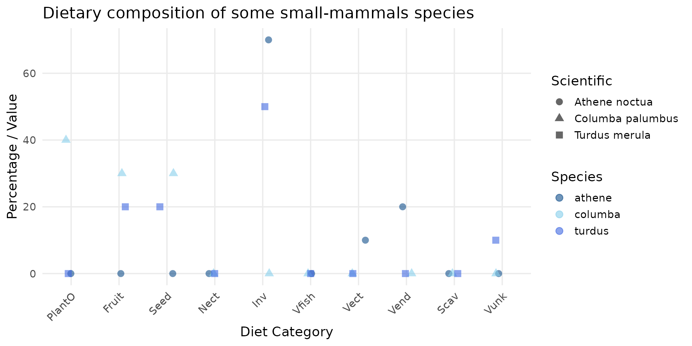

From this graph, we observe the following:

- *Columba palumbus* is strictly herbivorous/granivorous, consisting of
  40% plants, 30% fruits, and 30% seeds.
- *Turdus merula* is more of an omnivore, with 20% fruits, 20% seeds,
  and 50% invertebrates (which we will divide equally between earthworms
  and beetles). The remaining 10% consists of unknown vertebrates
  (likely because they are not consumed whole), which we will not take
  into account.
- *Athene noctua* feeds on 70% invertebrates (which we will split into
  35% earthworms and 35% beetles), 20% endotherms, and 10% ectotherms
  (we will distribute this combined 30% across all organisms).

And we finally add birds to the trophic network:

``` r

trophic_df <- trophic_df |>
  # columba
  add_link("plant", "columba", 1) |>
  # turdus
  add_link("plant", "turdus", 0.4) |>
  add_link("earthworm", "turdus", 0.3) |>
  add_link("beetle", "turdus", 0.3) |>
  # athene
  add_link("earthworm", "athene", 0.35) |>
  add_link("beetle", "athene", 0.35) |>
  add_link("myodes", "athene", 0.06) |>
  add_link("microtus", "athene", 0.06) |>
  add_link("apodemus", "athene", 0.06) |>
  add_link("sorex", "athene", 0.06) |>
  add_link("crocidura", "athene", 0.06)
```

``` r

plot(trophic_df, colors = species_colors, edge_width="norm_target")
```

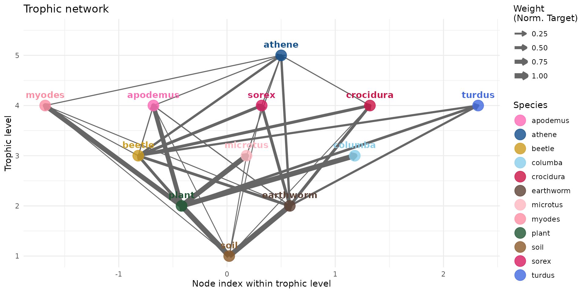

### Food Ingestion Rate per Body Weight

We have the energy needs of 749 species, 97 mammals, 107 birds, 170
fishes, 51 reptiles, 11 amphibians, 110 crustacean, 65 arthropods, 75
protozoa

``` r

data("FmrBT")
```

##### close species

The list is missing some species.

- Sorex and Crocidura (Shrews): the list lacks true shrews (Soricidae).
  When seeking a metabolic surrogate for temperate shrews (Sorex spp.)
  within this dataset, small temperate insectivorous bats, such as
  *Myotis lucifugus* and *Plecotus auritus*, serve as excellent
  physiological equivalents. Like true shrews, these bats are
  lightweight (often weighing between 5 and 12 grams) and operate under
  immense thermal pressure from temperate and boreal climates. Because
  they are strictly insectivorous, they share a highly active foraging
  strategy that demands a continuous supply of high-protein, easily
  digestible prey. Most importantly, the extreme energetic cost of
  flapping flight combined with their tiny body size forces these bats
  to run a hyper-metabolic “engine.”

- *Myodes glareolus* (Bank Vole): the list is highly enriched with
  rodents that are phylogenetically very close to the bank vole. Most
  notably, *Cleithrionomys rutilus* belongs to the exact same genus (as
  Myodes and *Cleithrionomys* are synonymous in modern taxonomy).
  Additionally, species from the genera *Microtus* (like *M. agrestis*
  and *M. pennsylvanicus*) and *Arvicola* belong to the same family,
  Cricetidae, sharing identical microtine (vole-like) metabolic and
  toxicokinetic traits.

``` r

energy_mammal <- FmrBT |>
  filter(
    SpeciesVerbatim %in% c(
      "Apodemus sylvaticus", "Plecotus auritus", "Myotis lucifugus",
      "Cleithrionomys rutilus",
      "Microtus agrestis", "Microtus pennsylvanicus")
  )

# plot
ggplot(data = energy_mammal, aes(x = Mass_g, y = FMR_kJ_d/Mass_g, color = SpeciesVerbatim)) +
  geom_point(size = 3.5, alpha = 0.8) + 
  labs(
    title = "Field Metabolic Rate (FMR) vs. Body Mass in Small Mammals",
    x = "Body Mass (g)",
    y = "Field Metabolic Rate (kJ/day/g)",
    color = "Species"
  ) +
  theme_minimal() +
  theme(
    plot.title = element_text(face = "bold", size = 14, hjust = 0.5),
    legend.title = element_text(face = "bold"),
    legend.position = "right"
  )
```


- *Athene noctua* (Little Owl): true owls (Strigiformes) are completely
  absent from this dataset. The closest relative available is
  *Phalaenoptilus nuttallii* (the common poorwill), which belongs to the
  *Caprimulgiformes* (nightjars). While it is a distinct family,
  nightjars share a nocturnal, insectivorous niche with small owls and
  belong to the same broader evolutionary landbird/Strisores lineage,
  making it the best available surrogate for nocturnal avian traits.

``` r

energy_mammal <- FmrBT |>
  filter(SpeciesVerbatim %in% c(
      "Turdus merula", "Phalaenoptilus nuttallii")
  )

# plot
ggplot(data = energy_mammal, aes(x = Mass_g, y = FMR_kJ_d/Mass_g, color = SpeciesVerbatim)) +
  geom_point(size = 3.5, alpha = 0.8) + 
  labs(
    title = "Field Metabolic Rate (FMR) vs. Body Mass in Small Mammals",
    x = "Body Mass (g)",
    y = "Field Metabolic Rate (kJ/day/g)",
    color = "Species"
  ) +
  theme_minimal() +
  theme(
    plot.title = element_text(face = "bold", size = 14, hjust = 0.5),
    legend.title = element_text(face = "bold"),
    legend.position = "right"
  )
```

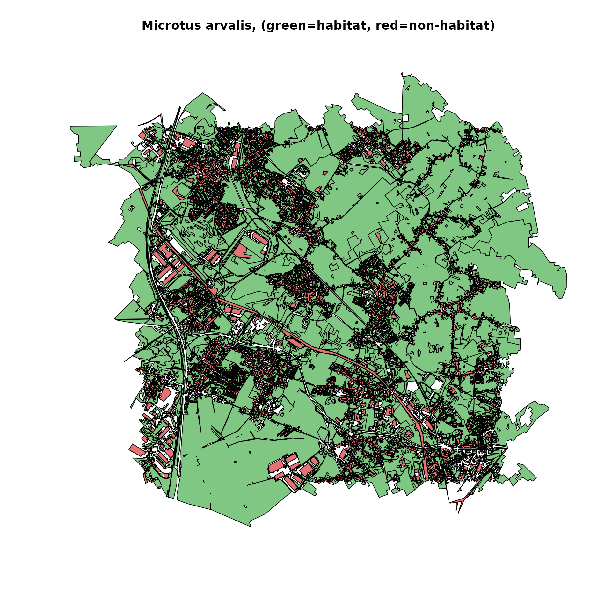

#### FIR weighted

``` r

library(tibble)

species_traits <- tribble(
  ~species,    ~bw,          ~FIRbw,  # En-têtes des colonnes (précédées d'un tilde ~)
  # --- INSECTES ---
  "beetle",    55 * 10^-3,   0.51,    # bw: Zygmunt et al. 2006 / FIR: Pocock et al. 2020
  # --- MAMMIFÈRES ---
  "myodes",    20,           0.3,     # bw & FIR: à vérifier
  "microtus",  25,           0.45,    # bw & FIR: à vérifier
  "apodemus",  21.7,         0.206,   # bw & FIR: POLARIS
  "sorex",     9.7,          13.3,    # bw & FIR: POLARIS
  "crocidura", 11.6,         13.3,    # bw: à vérifier / FIR: POLARIS sur Sorex
  # --- OISEAUX ---
  "columba",   490,          0.074,   # bw & FIR: POLARIS - Tier 2
  "turdus",    113,          0.5,     # FIR: POLARIS - Tier 2 (between seeds 0.185 & slugs 1.01)
  "athene",    180,          0.30     # bw & FIR: à vérifier
)
species_traits <- as.data.frame(species_traits)
# Calcul automatique du FIR absolu (Food Ingestion Rate en g/jour)
species_traits$FIR <- species_traits$FIRbw * species_traits$bw
# Création des vecteurs nommés pour la suite du modèle
vec_FIRbw <- setNames(species_traits$FIRbw, species_traits$species)
vec_FIR   <- setNames(species_traits$FIR, species_traits$species)
```

``` r

trophic_df_FIR <- trophic_df_init |>
  # Invertébrés
  add_link("soil", "beetle", 0.1 * vec_FIR["beetle"]) |>
  add_link("plant", "beetle", 0.45 * vec_FIR["beetle"]) |>
  add_link("earthworm", "beetle", 0.45 * vec_FIR["beetle"] ) |>
  # Mammifères - Myodes
  add_link("soil", "myodes", 0.02 * vec_FIR["myodes"]) |>
  add_link("plant", "myodes", 0.9 * vec_FIR["myodes"]) |>
  add_link("earthworm", "myodes", 0.04 * vec_FIR["myodes"]) |>
  add_link("beetle", "myodes", 0.04 * vec_FIR["myodes"]) |>
  # Mammifères - Microtus
  add_link("soil", "microtus", 0.02 * vec_FIR["microtus"]) |>
  add_link("plant", "microtus", 0.98 * vec_FIR["microtus"]) |>
  # Mammifères - Apodemus
  add_link("soil", "apodemus", 0.02 * vec_FIR["apodemus"]) |>
  add_link("plant", "apodemus", 0.82 * vec_FIR["apodemus"]) |>
  add_link("earthworm", "apodemus", 0.08 * vec_FIR["apodemus"]) |>
  add_link("beetle", "apodemus", 0.08 * vec_FIR["apodemus"]) |>
  # Mammifères - Musaraignes
  add_link("soil", "sorex", 0.02 * vec_FIR["sorex"]) |>
  add_link("earthworm", "sorex", 0.49 * vec_FIR["sorex"]) |>
  add_link("beetle", "sorex", 0.49 * vec_FIR["sorex"]) |>
  add_link("soil", "crocidura", 0.02 * vec_FIR["crocidura"]) |>
  add_link("earthworm", "crocidura", 0.49 * vec_FIR["crocidura"]) |>
  add_link("beetle", "crocidura", 0.49 * vec_FIR["crocidura"]) |>
  # Oiseaux
  add_link("plant", "columba", 1 * vec_FIR["columba"]) |>
  add_link("plant", "turdus", 0.4 * vec_FIR["turdus"]) |>
  add_link("earthworm", "turdus", 0.3 * vec_FIR["turdus"]) |>
  add_link("beetle", "turdus", 0.3 * vec_FIR["turdus"]) |>
  # Super-Prédateur - Athene
  add_link("earthworm", "athene", 0.35 * vec_FIR["athene"]) |>
  add_link("beetle", "athene", 0.35 * vec_FIR["athene"]) |>
  add_link("myodes", "athene", 0.06 * vec_FIR["athene"]) |>
  add_link("microtus", "athene", 0.06 * vec_FIR["athene"]) |>
  add_link("apodemus", "athene", 0.06 * vec_FIR["athene"]) |>
  add_link("sorex", "athene", 0.06 * vec_FIR["athene"]) |>
  add_link("crocidura", "athene", 0.06 * vec_FIR["athene"])
```

We can normalize on `target` (sum to 1 for each target/to node):

``` r

plot(trophic_df_FIR, colors = species_colors, edge_width="norm_target")
```


or we can normalize for the whole graph (uses the raw weights).

``` r

plot(trophic_df_FIR, colors = species_colors, edge_width="raw")
```

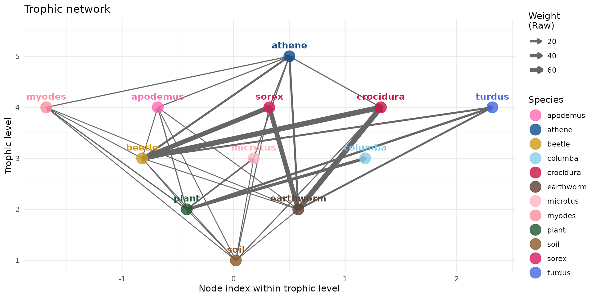

Here we have the daily food ingestion rate per body weight (FIRbw).

And we see that shrews having a high FIRbw, would as have a strong
potential intake rate of the contaminant.

``` r

trophic_df_FIRbw <- trophic_df_init |>
  # beetle
  add_link("soil", "beetle", 0.1 * vec_FIRbw["beetle"]) |>
  add_link("plant", "beetle", 0.45 * vec_FIRbw["beetle"]) |>
  add_link("earthworm", "beetle", 0.45 * vec_FIRbw["beetle"]) |>
  # myodes
  add_link("soil", "myodes", 0.02 * vec_FIRbw["myodes"]) |>
  add_link("plant", "myodes", 0.9 * vec_FIRbw["myodes"]) |>
  add_link("earthworm", "myodes", 0.04 * vec_FIRbw["myodes"]) |>
  add_link("beetle", "myodes", 0.04 * vec_FIRbw["myodes"]) |>
  # microtus
  add_link("soil", "microtus", 0.02 * vec_FIRbw["microtus"]) |>
  add_link("plant", "microtus", 0.98 * vec_FIRbw["microtus"]) |>
  # wood mouse (apodemus)
  add_link("soil", "apodemus", 0.02 * vec_FIRbw["apodemus"]) |>
  add_link("plant", "apodemus", 0.82 * vec_FIRbw["apodemus"]) |>
  add_link("earthworm", "apodemus", 0.08 * vec_FIRbw["apodemus"]) |>
  add_link("beetle", "apodemus", 0.08 * vec_FIRbw["apodemus"]) |>
  # sorex
  add_link("soil", "sorex", 0.02 * vec_FIRbw["sorex"]) |>
  add_link("earthworm", "sorex", 0.49 * vec_FIRbw["sorex"]) |>
  add_link("beetle", "sorex", 0.49 * vec_FIRbw["sorex"]) |>
  # crocidura
  add_link("soil", "crocidura", 0.02 * vec_FIRbw["crocidura"]) |>
  add_link("earthworm", "crocidura", 0.49 * vec_FIRbw["crocidura"]) |>
  add_link("beetle", "crocidura", 0.49 * vec_FIRbw["crocidura"]) |>
  # columba
  add_link("plant", "columba", 1 * vec_FIRbw["columba"]) |>
  # turdus
  add_link("plant", "turdus", 0.4 * vec_FIRbw["turdus"]) |>
  add_link("earthworm", "turdus", 0.3 * vec_FIRbw["turdus"]) |>
  add_link("beetle", "turdus", 0.3 * vec_FIRbw["turdus"]) |>
  # athene
  add_link("earthworm", "athene", 0.35 * vec_FIRbw["athene"]) |>
  add_link("beetle", "athene", 0.35 * vec_FIRbw["athene"]) |>
  add_link("myodes", "athene", 0.06 * vec_FIRbw["athene"]) |>
  add_link("microtus", "athene", 0.06 * vec_FIRbw["athene"]) |>
  add_link("apodemus", "athene", 0.06 * vec_FIRbw["athene"]) |>
  add_link("sorex", "athene", 0.06 * vec_FIRbw["athene"]) |>
  add_link("crocidura", "athene", 0.06 * vec_FIRbw["athene"])
```

``` r

plot(trophic_df_FIRbw, colors = species_colors, edge_width="raw")
```

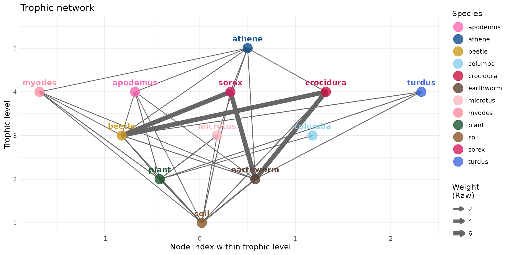

## Habitat

Once again, we load data from a site in northern France.

Here, we use the provided data (`ocsge_metaleurop` and `roi_metaleurop`)
along with the `ggplot2` package for visualization.

``` r

# Load a study area (e.g., the Metaleurop site) and its land cover data
data("roi_metaleurop")
data("ocsge_metaleurop")

ggplot() +
  theme_minimal() +
  geom_sf(data=ocsge_metaleurop, aes(fill=code_cs), color=NA) +
  geom_sf(data=roi_metaleurop, fill=NA, color="red", size=1) +
  theme(legend.position = "none") +
  labs(title="Land Cover in the Region of Interest (ROI)")
```


From these vector polygons, we define **habitats** for our species. A
habitat is a combination of favorable, unfavorable, or neutral zones.
These geometries are then rasterized (converted into regular grids) to
prepare them for modeling.

``` r

# Habitat definition based on OSGE codes (which are in the `ocsge_metaleurop` table)
layer_soil_natural = ocsge_metaleurop$code_cs %in% 
  c("CS1.2.1","CS2.1.1.1","CS2.1.1.2","CS2.1.1.3", "CS2.1.2","CS2.1.3","CS2.2.1","CS2.2.3")
layer_soil_artificial = ocsge_metaleurop$code_cs %in%
  c("CS1.1.1.1", "CS1.1.1.2", "CS1.1.2.1")
layer_plant = ocsge_metaleurop$code_cs %in% 
   c("CS2.1.1.1", "CS2.1.1.2", "CS2.1.1.3", "CS2.1.3", "CS2.2.1")
```

``` r

habitat_soil = habitat() |>
  add_habitat(ocsge_metaleurop[layer_soil_natural,]) |>
  add_nohabitat(ocsge_metaleurop[layer_soil_artificial,])
plot(habitat_soil)
```

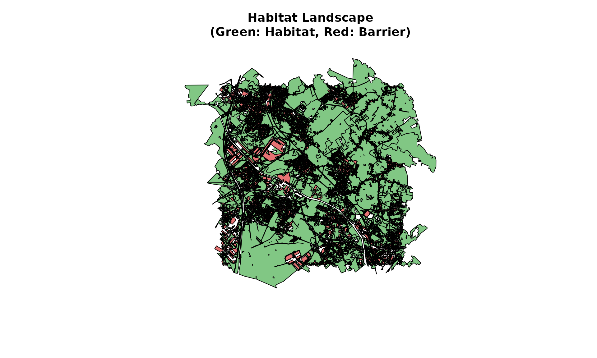

``` r

habitat_plant = habitat() |>
  add_habitat(ocsge_metaleurop[layer_plant,]) |>
  add_nohabitat(ocsge_metaleurop[layer_soil_artificial,])
```

We assume that earthworm and beetle have the same habitat that soil:
everywhere there is soil, it is an habitat for earthworm and beetle.

``` r

habitat_earthworm = habitat_soil
habitat_beetle = habitat_soil
```

### Database of Habitat base on @oconnor2024habitat

In this section, for birds and mammals we use the data base we build
using LLM based on the original database created by @oconnor2024habitat
where we linked species habitat to enriched OCS-GE descriptions. Then,
instead of a single presence/absence score, the model simultaneously
generates four continuous variables (on a scale of 0 to 10) that capture
finer landscape ecology concepts: \* `weight_global`: Overall habitat
suitability (closest to the traditional AOH score). \*
`weight_movement`: Landscape permeability for species dispersion. \*
`weight_foraging`: Habitat attractiveness specifically for feeding and
resource acquisition. \* `resistance`: The impedance or barrier effect
of the environment, heavily informed by the “avoided-habitat”
descriptions.

``` r

data("ocsge_species_dict")
```

This database includes 935 species, including 499 birds, 215 mammals,
136 reptiles, and 85 amphibians.

For example, for the common vole (*Microtus arvalis*):

``` r

microtus_hab <- join_ocsge_species(ocsge_metaleurop, "Microtus_arvalis")
plot_species_habitat(microtus_hab)
```


``` r

microtus_habitat <- habitat(microtus_hab, habitat=TRUE, weight=microtus_hab$weight_global) |>
  add_nohabitat(microtus_hab[microtus_hab$resistance==10,])
plot(microtus_habitat, main="Microtus arvalis, (green=habitat, red=non-habitat)")
```

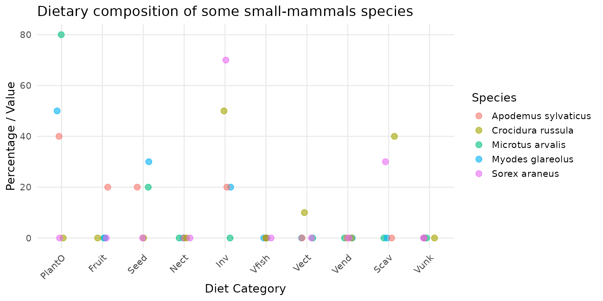

``` r

myodes_hab <- join_ocsge_species(ocsge_metaleurop, "Myodes_glareolus")
plot_species_habitat(myodes_hab)
```

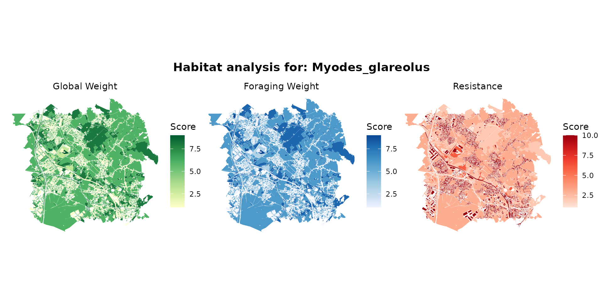

``` r

myodes_habitat <- habitat(myodes_hab, habitat=TRUE, weight=myodes_hab$weight_global) |>
  add_nohabitat(myodes_hab[myodes_hab$resistance==10,])
```

``` r

apodemus_hab <- join_ocsge_species(ocsge_metaleurop, "Apodemus_sylvaticus")
plot_species_habitat(apodemus_hab)
```


``` r

apodemus_habitat <- habitat(apodemus_hab, habitat=TRUE, weight=apodemus_hab$weight_global) |>
  add_nohabitat(apodemus_hab[apodemus_hab$resistance==10,])
```

``` r

sorex_hab <- join_ocsge_species(ocsge_metaleurop, "Sorex_araneus")
plot_species_habitat(sorex_hab)
```

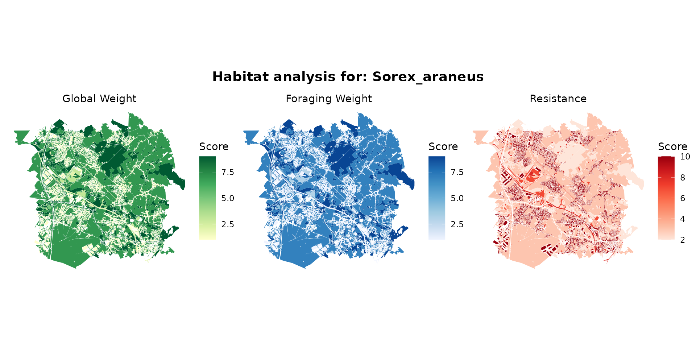

``` r

sorex_habitat <- habitat(sorex_hab, habitat=TRUE, weight=sorex_hab$weight_global) |>
  add_nohabitat(sorex_hab[sorex_hab$resistance==10,])
```

``` r

crocidura_hab <- join_ocsge_species(ocsge_metaleurop, "Crocidura_russula")
plot_species_habitat(crocidura_hab)
```

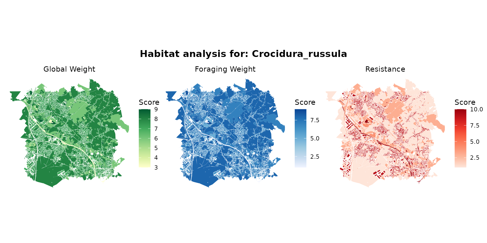

``` r

crocidura_habitat <- habitat(sorex_hab, habitat=TRUE, weight=sorex_hab$weight_global) |>
  add_nohabitat(sorex_hab[sorex_hab$resistance==10,])
```

``` r

columba_hab <- join_ocsge_species(ocsge_metaleurop, "Columba_palumbus")
plot_species_habitat(columba_hab)
```

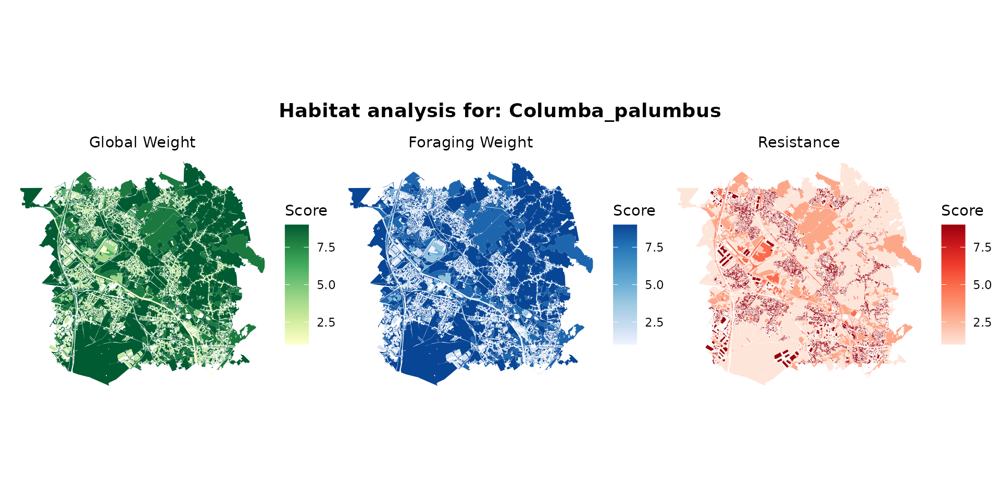

``` r

columba_habitat <- habitat(columba_hab, habitat=TRUE, weight=columba_hab$weight_global) |>
  add_nohabitat(columba_hab[columba_hab$resistance==10,])
```

``` r

turdus_hab <- join_ocsge_species(ocsge_metaleurop, "Turdus_merula")
plot_species_habitat(turdus_hab)
```


``` r

turdus_habitat <- habitat(turdus_hab, habitat=TRUE, weight=turdus_hab$weight_global) |>
  add_nohabitat(turdus_hab[turdus_hab$resistance==10,])
```

``` r

athene_hab <- join_ocsge_species(ocsge_metaleurop, "Athene_noctua")
plot_species_habitat(athene_hab)
```

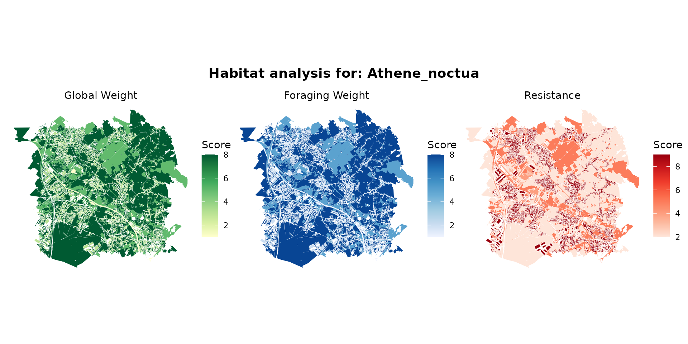

``` r

athene_habitat <- habitat(athene_hab, habitat=TRUE, weight=athene_hab$weight_global) |>
  add_nohabitat(athene_hab[athene_hab$resistance==10,])
```

### Rasterize on a same grid frame

At this stage, now that the habitats are defined, we rasterize the
habitats based on a default layer, here `cd_ground`. This allows us to
have the same landscape grid so we can successfully overlay all the
layers.

``` r

# Loading a background concentration raster for a contaminant (Cadmium)
ground_cd <- load_raster_extdata("ground_concentration_cd_compressed.tif")
```

``` r

# We initialize habitat grids (rasters) for each level
rast_soil <- habitat_raster(ground_cd, habitat_soil)
rast_plant <- habitat_raster(ground_cd, habitat_plant)
rast_earthwom <- habitat_raster(ground_cd, habitat_earthworm)
rast_beetle <- habitat_raster(ground_cd, habitat_beetle)

rast_myodes <- habitat_raster(ground_cd, myodes_habitat)
rast_microtus <- habitat_raster(ground_cd, microtus_habitat)
rast_apodemus <- habitat_raster(ground_cd, apodemus_habitat)
rast_crocidura <- habitat_raster(ground_cd, crocidura_habitat)
rast_sorex <- habitat_raster(ground_cd, sorex_habitat)

rast_columba <- habitat_raster(ground_cd, columba_habitat)
rast_turdus <- habitat_raster(ground_cd, turdus_habitat)
rast_athene <- habitat_raster(ground_cd, athene_habitat)

# We create the `raster_stack` of the habitats
stack_habitat <- raster_stack(
  raster_list = list(
    rast_soil, rast_plant, rast_earthwom, rast_beetle,
    rast_myodes, rast_microtus, rast_apodemus, rast_sorex, rast_crocidura,
    rast_columba, rast_turdus, rast_athene),
  names = c("soil", "plant", "earthworm", "beetle",
    "myodes", "microtus", "apodemus", "sorex", "crocidura",
    "columba", "turdus", "athene")
)
```

### Create the spacemodel

``` r

spcmdl_berisp_init <- spacemodel(stack_habitat, trophic_df)

plot(spcmdl_berisp_init)
```

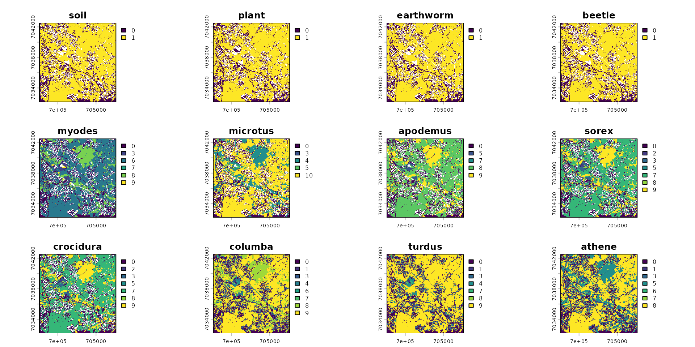

## Fluxes

There are several pathways of contamination, which can be divided into
two main categories:

1.  Direct contamination: This occurs when an organism absorbs a
    pollutant directly from its environment. Examples include a fish
    exposed to waterborne contaminants, an earthworm absorbing
    pollutants from the soil, or flying arthropods and birds exposed to
    airborne pollutants. A single organism can also have multiple direct
    exposure routes; for instance, benthic (sediment-dwelling)
    invertebrates can be contaminated by both the sediment and the
    overlying water. To model this, a simple equation is usually
    sufficient, potentially accounting for environmental properties
    (e.g., soil pH, organic matter, clay percentage) and
    species-specific traits (e.g., how a plant might modify the
    soil-plant interaction).
2.  Trophic contamination: This refers to contamination through dietary
    intake. To accurately model this route, it is necessary to know the
    organism’s diet composition (food items consumed), the biomass flux
    per kilogram of the individual, and the contaminant flux, which is
    calculated by estimating the contaminant concentration within each
    specific food resource.

A second challenging aspect for the model is differentiating between
exposures (the doses to which organisms are exposed) and accumulated
concentrations.

- For organisms undergoing direct exposure, there is no need to
  calculate dietary contamination fluxes. The organism is exposed to
  100% of the surrounding medium—and therefore the pollution—and the
  direct flux equation translates this contamination straight into a
  body burden.
- For trophic contamination, however, it is essential to know the
  biomass of each specific item in the diet to determine the actual
  exposure (by multiplying the ingestion rates by the resource
  concentrations), and finally to calculate the body burdens. These
  steps can be broken down into separate components, but this is exactly
  where careful attention is required.

### Fluxes: Direct contamination (soil-target transfer for plant and earthworm)

#### Vegetation

``` r

data("bappet_cd")
plt_bappet_cd = bappet_cd[bappet_cd$extraction=="Totale",]
```

``` r

fit_simple_veg_cd <- load_safe("raw_data/fit_simple_veg_cd.rds")
fit_pars <- rstan::extract(fit_simple_veg_cd, c("beta0", "beta1"))
xseq = seq(min(bappet_cd$log10_media_mean), max(bappet_cd$log10_media_mean), length.out=100)
yseq = fit_pars$beta1 %*% t(xseq) + c(fit_pars$beta0)
yseq_q = apply(yseq, 2, quantile, prob = c(0.025, 0.5, 0.975))

# Créer un data.frame pour la ligne
line_data <- data.frame(
  x = xseq,
  y_q50 = yseq_q[2,],
  y_qinf95 = yseq_q[1,],
  y_qsup95 = yseq_q[3,]
)
```

``` r

ggplot() +
  theme_minimal() +
  geom_point(data = plt_bappet_cd,
    aes(x = log10_media_mean, y = log10_plant_mean, color = plant_type)) +
  # geom_line(data = line_data, aes(x = x, y = y_q50), color = "blue", size=1) +
  geom_abline(intercept = -0.488, slope = 0.494, color="red")
```

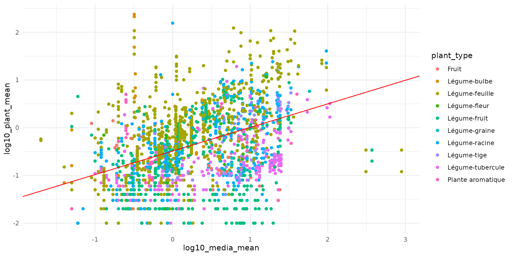

This model give the following equation:

``` math
\log_{10}(C_{vegetation}) = 0.494 * \log_{10}(C_{soil}) -0.488
```

For Cadmium, the equation is given in Berisp:

``` math
\log C_{vegetation} = 0.17 + 0.49 \times \log C_{soil} - 0.28 \times \log OM - 0.12 \times pH
```

In Eco-SSL, authors use the following equation (Neperian logarithm):

``` math
\ln(C_{vegetation}) = 0.546 * \ln(C_{soil}) - 0.475
```

#### Earthworm

``` r

data("earthworm_cd")
```

``` r

fit_simple_worm_cd <- load_safe("raw_data/fit_simple_worm_cd.rds")
fit_pars <- rstan::extract(fit_simple_worm_cd, c("beta0", "beta1"))
xseq = seq(min(earthworm_cd$log10_cd_soil), max(earthworm_cd$log10_cd_soil), length.out=100)
yseq = fit_pars$beta1 %*% t(xseq) + c(fit_pars$beta0)
yseq_q = apply(yseq, 2, quantile, prob = c(0.025, 0.5, 0.975))

# Créer un data.frame pour la ligne
line_data <- data.frame(
  x = xseq,
  y_q50 = yseq_q[2,],
  y_qinf95 = yseq_q[1,],
  y_qsup95 = yseq_q[3,]
)
```

``` r

ggplot() +
  theme_minimal() +
  geom_point(data = earthworm_cd,
    aes(x = log10_cd_soil, y = log10_cd_worm)) +
  # geom_line(data = line_data, aes(x = x, y = y_q50), color = "blue", size=1) +
  geom_abline(intercept = 0.596, slope = 0.983, color="red")
```

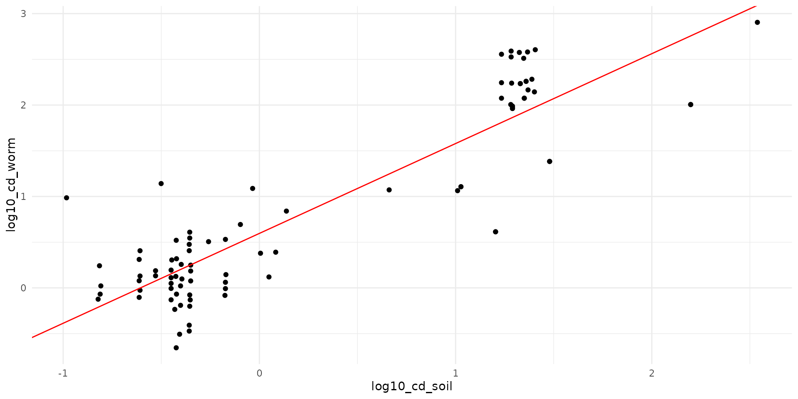

This model give the following equation:

``` math
\log_{10}(C_{earthworm}) = 0.983 * \log_{10}(C_{soil}) + 0.596
```

For Cadmium, the equation is given by (Ma et al., 2004):

``` math
\log C_{earthworm} = 2.92 + 0.747 \times \log C_{soil} - 0.5336 \times \log OM - 0.2101 \times pH
```

In Eco-SSL, the following equation is given (see Neperian logarithm):

``` math
\ln(C_{earthworm}) = 0.795 * \ln(C_{soil}) + 2.114
```

#### `spacemodel` edit: implementing soil-vegetation and soil-earthworm fluxes

``` r

# 1. Assign the actual concentration grid into the "soil" layer
# The Cd in ground layer is in log10(Cd)
spcmdl_berisp_flux <- spcmdl_berisp_init
spcmdl_berisp_flux[["soil"]][] <- ground_cd

# 2. Define the transfer equations (Bioaccumulation / Bioconcentration Factors)
fluxes <- flux(
    spcmdl_berisp_flux,
    default = 1,    # for all other default is 1
    normalize=FALSE # TRUE would weight every link to sum at 1
  ) |>
  add_flux("soil", "plant",  ~ -0.488 + 0.494 * x) |>
  add_flux("soil", "earthworm",  ~ 0.596 + 0.983 * x)
```

### Fluxes: Trophic Contamination (Dietary Exposure)

#### A little bit of theory

In the Terrasys software, using the framework of the US-EPA, the
equation of transfer is given by:

``` math
C_{consumer} = k_{met, consumer} \times BTF_{consumer} \times \frac{FIR_{consumer}}{b_{consumer}} \times \sum_i C_{resource,i} \times p_{i,consumer}  
```

with:

- $`p_{i,consumer}`$ proportion of that resource $`i`$ in the diet of
  the consumer
- $`BTF_{consumer}`$: the biotransfer factor for the consumer in
  $`day/g`$
- $`FIR_{consumer}`$: the Food Ingestion Rate in $`g food / day`$.
- $`b_{consumer}`$: individual/item biomass of consumer $`[g]`$ (in
  average).
- $`k_{met, consumer}`$: the coefficient of metabolisation. Default is
  1.0 is Terrasys.

In the EFSA guidelines for risk assessment on Birds and Mammals,
@efsa2023era, the equation of dose of contaminant to which a target is
exposed to is given by:

``` math
D_{consumer} = FIR_{consumer} \times \sum_{i} \frac{C_{resource,i}}{b_{consumer}} \times p_{i,consumer} \times PT_{consumer}
```

where variable name are already defined except these:

- $`D_{consumer}`$: dose to which the consumer is exposed to (not yet in
  body burden),
- $`PT_{consumer}`$: proportion of the consumer in the area of the
  contaminated resources (or within the treated area) (spatial
  overlapping),
- $`b_{consumer}`$: individual/item biomass of consumer $`[g]`$ (in
  average).

The difference between the dose and the internal concentration is gevin
in terrasys by:

``` math
k_{met, consumer} \times BTF_{consumer} 
```

Finally, in the original Berisp documentation, the following equation is
used to model the trophic transfer:

``` math
C_{consumer} = \frac{b_{resource}}{b_{consumer}} \times  C_{resource} \times \frac{k_{up}}{k_{out}} \left( 1 - \exp^{- c_{out} \times a} \right)
```

where:

- $`b_{resource}`$: average individual/item biomass of resource $`[g]`$,
- $`b_{consumer}`$: average individual/item biomass of consumer $`[g]`$,
- $`C_{resource}`$: concentration of substance in resource
  (e.g. $`ppm=[ug.g^{-1}]=[mg.kg^{-1}]`$),
- $`C_{resource}`$: concentration of substance in resource
  (e.g. $`ppm=[ug.g^{-1}]=[mg.kg^{-1}]`$),
- $`k_{up}`$: assimilation efficiency of food $`[n.d.]`$,
- $`k_{out}`$: excretion rate of food, $`[day^{-1}]`$
- $`a`$: average age of the consumer $`[day]`$,

We can see that $`b_{resource}`$ is the value given by
$`FIR_{consumer} \times p_{i,consumer}`$ in previous equations used in
Terrasys software or by the EFSA.

Further assumptions:

1.  We could reduce complexity by assuming a single
    $`BF_{resource, consumer} = k_{up}/k_{out}`$ paramater since
    parameterisation of $`k_{up}`$ and $`k_{out}`$ are not identifiable
    in this equation. The idea is to re-use the \$BF\_{resource,
    consumer} = k\_{met} BTF\_{consumer} \$ from the Terrasys model. .
2.  We can also assume that individuals are old enough to reach a
    stability of contamination, so as:
    ``` math
    C_{consumer} = \frac{b_{resource}}{b_{consumer}} \times  C_{resource} \times BF_{resource, consumer}
    ```
3.  the $`b_{resource}`$ is the Food Ingestion Rate of the consumer
    ($`[g food / g consumer / day]`$) times the proportion of that
    resource in the diet ($`p_{resource, consumer}`$).

With this assumption, the equation is:

``` math
C_{consumer} = \frac{FIR_{consumer}}{b_{consumer}} \times \sum_i p_{i, consumer} \times   C_{i} \times  BF_{i, consumer}
```

#### Fluxes of Biomass FIRbw

##### `spacemodel` edit: implementing fluxes of biomass

#### Fluxes of Contaminants

##### Carabid

In Berisp, authors use the following direct soil-target equation:

``` math
\log(C_{carabid}) = -1 + 0.6 * \log(C_{soil})
```

In our model, ground beetles eats plants and earthworm. So we are going
to use a transfer model.

In Terrasys software, the equation for the BTF was given by:

``` math
\log_{10}(BTF_{soil_invertebrates}) = 1.588 - 0.578 \times \log_{10}(k_{ow})
```

with:

- $`BTF_i`$: biotransfer factor
- $`k_{ow}`$: octanol /water partition coefficient.

But the problem is that $`1.588 - 0.578 * (-1.65))=`$ would give a
$`BTF`$ of

``` math
C_{\text{terrestrial invertebrates}} = BTF_veg_inv × C_vegetation
```

##### Mammals

In Terrasys software, the equation for the BTF from the US-EPA (1999c)
was:

``` math
\log_{10}(BTF_{mammal}) = -7.6 + \log_{10}(k_{ow})
```

##### Birds

In Terrasys software, the equation for the BTF from the US-EPA (1999c)
was:

``` math
BTF_{bird} = 0.8 BTF_{mammal} = 0.8 \times \left( 10^{-7.6 + \log_{10}(k_{ow})}\right)
```

##### `spacemodel` edit: implementing fluxes of contaminant

Important: After this step: concentration in soil, plant and earthworm
are log10 scaled ppm, while concentration in beetle, mammal and birds
are in ppm.

``` r

BTF_beetle <- 0.1   
BTF_mammal_herb <- 0.05
BTF_mammal_ins <- 0.025 # 0.08
BTF_bird   <- 0.04  # (0.8 * 0.05)
species_traits <- species_traits %>%
  mutate(
    BTF = case_when(
      species == "beetle" ~ BTF_beetle,
      species %in% c("myodes", "microtus") ~ BTF_mammal_herb,
      species %in% c("apodemus", "sorex", "crocidura") ~ BTF_mammal_ins,
      species %in% c("columba", "turdus", "athene") ~ BTF_bird
    )
  )
vec_BTF <- setNames(species_traits$BTF, species_traits$species)

# Définition des transferts de flux dans le spacemodel
fluxes <- flux(
    spcmdl_berisp_flux, 
    default = 1,
    normalize = FALSE
  ) |>
  # 1. Contamination directe (les équations donnent le log10 de la concentration)
  add_flux("soil", "plant",  ~ -0.488 + 0.494 * x) |>
  add_flux("soil", "earthworm",  ~ 0.596 + 0.983 * x) |>
  # 2. Invertébrés (beetle)
  add_flux("soil", "beetle", ~ 10^x * vec_FIRbw["beetle"] * vec_BTF["beetle"]) |>
  add_flux("plant", "beetle", ~ 10^x * vec_FIRbw["beetle"] * vec_BTF["beetle"]) |>
  add_flux("earthworm", "beetle", ~ 10^x * vec_FIRbw["beetle"] * vec_BTF["beetle"]) |>
  # 3. Mammifères - Myodes (Bank vole)
  add_flux("soil", "myodes", ~ 10^x * vec_FIRbw["myodes"] * vec_BTF["myodes"]) |>
  add_flux("plant", "myodes", ~ 10^x * vec_FIRbw["myodes"] * vec_BTF["myodes"]) |>
  add_flux("earthworm", "myodes", ~ 10^x * vec_FIRbw["myodes"] * vec_BTF["myodes"]) |>
  add_flux("beetle", "myodes", ~ x * vec_FIRbw["myodes"] * vec_BTF["myodes"]) |>
  # 4. Mammifères - Microtus (Common vole)
  add_flux("soil", "microtus", ~ 10^x * vec_FIRbw["microtus"] * vec_BTF["microtus"]) |>
  add_flux("plant", "microtus", ~ 10^x * vec_FIRbw["microtus"] * vec_BTF["microtus"]) |>
  # 5. Mammifères - Apodemus (Wood mouse)
  add_flux("soil", "apodemus", ~ 10^x * vec_FIRbw["apodemus"] * vec_BTF["apodemus"]) |>
  add_flux("plant", "apodemus", ~ 10^x * vec_FIRbw["apodemus"] * vec_BTF["apodemus"]) |>
  add_flux("earthworm", "apodemus", ~ 10^x * vec_FIRbw["apodemus"] * vec_BTF["apodemus"]) |>
  add_flux("beetle", "apodemus", ~ x * vec_FIRbw["apodemus"] * vec_BTF["apodemus"]) |>
  # 6. Mammifères - Musaraignes (Sorex & Crocidura)
  add_flux("soil", "sorex", ~ 10^x * vec_FIRbw["sorex"] * vec_BTF["sorex"]) |>
  add_flux("earthworm", "sorex", ~ 10^x * vec_FIRbw["sorex"] * vec_BTF["sorex"]) |>
  add_flux("beetle", "sorex", ~ x * vec_FIRbw["sorex"] * vec_BTF["sorex"]) |>
  add_flux("soil", "crocidura", ~ 10^x * vec_FIRbw["crocidura"] * vec_BTF["crocidura"]) |>
  add_flux("earthworm", "crocidura", ~ 10^x * vec_FIRbw["crocidura"] * vec_BTF["crocidura"]) |>
  add_flux("beetle", "crocidura", ~ x * vec_FIRbw["crocidura"] * vec_BTF["crocidura"]) |>
  # 7. Oiseaux - Pigeon (Columba)
  add_flux("plant", "columba", ~ 10^x * vec_FIRbw["columba"] * vec_BTF["columba"]) |>
  # 8. Oiseaux - Merle noir (Turdus)
  add_flux("plant", "turdus", ~ 10^x * vec_FIRbw["turdus"] * vec_BTF["turdus"]) |>
  add_flux("earthworm", "turdus", ~ 10^x * vec_FIRbw["turdus"] * vec_BTF["turdus"]) |>
  add_flux("beetle", "turdus", ~ x * vec_FIRbw["turdus"] * vec_BTF["turdus"]) |>
  # 9. Oiseaux - Chouette chevêche (Athene) - Super prédateur
  add_flux("earthworm", "athene", ~ 10^x * vec_FIRbw["athene"] * vec_BTF["athene"]) |>
  add_flux("beetle", "athene", ~ x * vec_FIRbw["athene"] * vec_BTF["athene"]) |>
  add_flux("myodes", "athene", ~ x * vec_FIRbw["athene"] * vec_BTF["athene"]) |>
  add_flux("microtus", "athene", ~ x * vec_FIRbw["athene"] * vec_BTF["athene"]) |>
  add_flux("apodemus", "athene", ~ x * vec_FIRbw["athene"] * vec_BTF["athene"]) |>
  add_flux("sorex", "athene", ~ x * vec_FIRbw["athene"] * vec_BTF["athene"]) |>
  add_flux("crocidura", "athene", ~ x * vec_FIRbw["athene"] * vec_BTF["athene"])
```

## Movement of population (extended habitat) dispersion in landscape

``` r

# Calcul des noyaux de dispersion en fonction de l'écologie spatiale (rayons de mobilité)
# Invertébrés terrestres
k_beetle    <- compute_kernel(radius=10, GSD=25, size_std=0.1)

# Micromammifères (Rongeurs et Insectivores)
k_sorex     <- compute_kernel(radius=25, GSD=25, size_std=0.1)
k_crocidura <- compute_kernel(radius=25, GSD=25, size_std=0.1)
k_microtus  <- compute_kernel(radius=30, GSD=25, size_std=0.1)
k_myodes    <- compute_kernel(radius=40, GSD=25, size_std=0.1)
k_apodemus  <- compute_kernel(radius=60, GSD=25, size_std=0.1)

# Oiseaux
k_turdus    <- compute_kernel(radius=150, GSD=25, size_std=0.1)
k_columba   <- compute_kernel(radius=300, GSD=25, size_std=0.1)
k_athene    <- compute_kernel(radius=800, GSD=25, size_std=0.1)
```

#### Representation of kernels

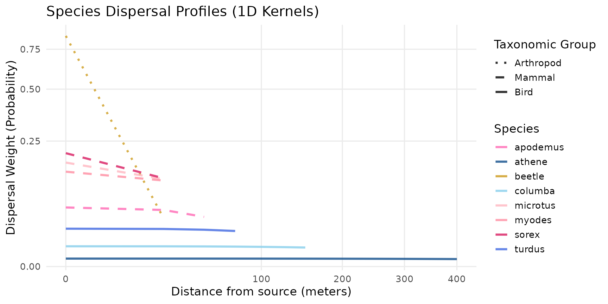

### Compute dispersal

``` r

# Application de la dispersion sur l'objet spacemodel (avec les flux calculés précédemment)
spcmdl_dispersal_init <- spcmdl_berisp_init |>
  dispersal("beetle",    method="convolution", method_option=list(kernel=k_beetle)) |>
  dispersal("sorex",     method="convolution", method_option=list(kernel=k_sorex)) |>
  dispersal("crocidura", method="convolution", method_option=list(kernel=k_crocidura)) |>
  dispersal("microtus",  method="convolution", method_option=list(kernel=k_microtus)) |>
  dispersal("myodes",    method="convolution", method_option=list(kernel=k_myodes)) |>
  dispersal("apodemus",  method="convolution", method_option=list(kernel=k_apodemus)) |>
  dispersal("turdus",    method="convolution", method_option=list(kernel=k_turdus)) |>
  dispersal("columba",   method="convolution", method_option=list(kernel=k_columba)) |>
  dispersal("athene",    method="convolution", method_option=list(kernel=k_athene))
```

``` r

plot(spcmdl_dispersal_init)
```


That we can normalized:

``` r

species_to_scale <- c("myodes", "microtus", "apodemus", "sorex", "crocidura", 
                      "columba", "turdus", "athene")
spcmdl_dispersal_init[[species_to_scale]] <- spcmdl_dispersal_init[[species_to_scale]] / 10
plot(spcmdl_dispersal_init)
```

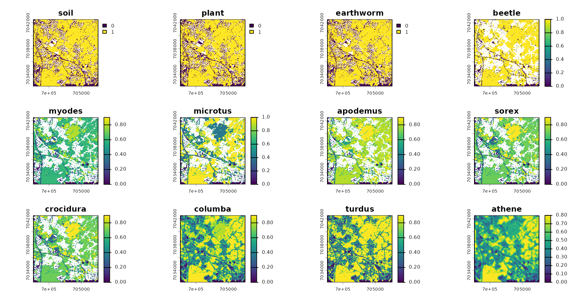

``` r

# Application de la dispersion sur l'objet spacemodel (avec les flux calculés précédemment)
spcmdl_dispersal_flux <- spcmdl_berisp_flux |>
  dispersal("beetle",    method="convolution", method_option=list(kernel=k_beetle)) |>
  dispersal("sorex",     method="convolution", method_option=list(kernel=k_sorex)) |>
  dispersal("crocidura", method="convolution", method_option=list(kernel=k_crocidura)) |>
  dispersal("microtus",  method="convolution", method_option=list(kernel=k_microtus)) |>
  dispersal("myodes",    method="convolution", method_option=list(kernel=k_myodes)) |>
  dispersal("apodemus",  method="convolution", method_option=list(kernel=k_apodemus)) |>
  dispersal("turdus",    method="convolution", method_option=list(kernel=k_turdus)) |>
  dispersal("columba",   method="convolution", method_option=list(kernel=k_columba)) |>
  dispersal("athene",    method="convolution", method_option=list(kernel=k_athene))
```

``` r

plot(spcmdl_dispersal_flux)
```

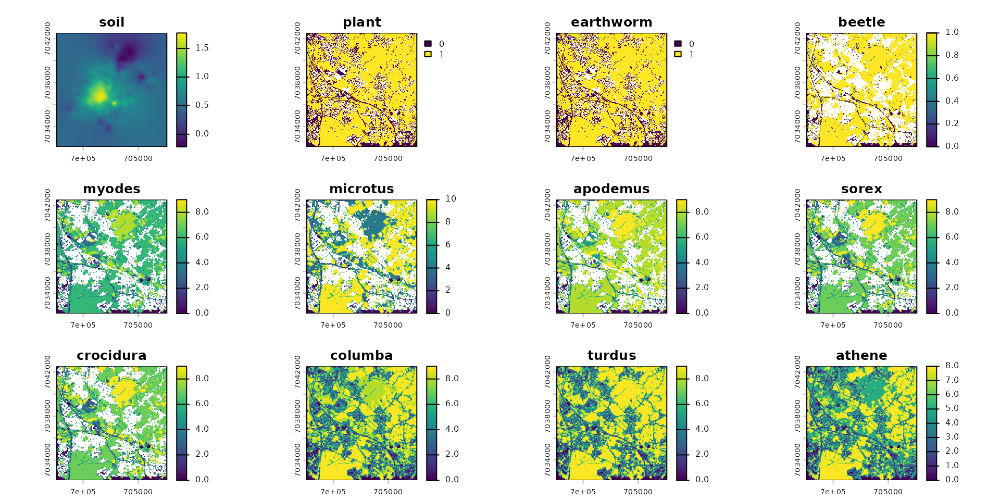

## Transfer of food and contaminant

To extract both the exposure (ingested dose) and the impregnation (body
burden) without running the model twice, we can use a simple
mathematical trick. Because our trophic network must propagate the body
burden from prey to predator, the spatial model calculates the final
tissue concentrations by default. However, since the transfer equation
for all our animals is strictly linear—where Body Burden = Exposure ×
BTF—we can easily retrieve the initial exposure post-simulation using
the inverse operation: Exposure = Body Burden / BTF. Here is how to
implement this cleanly in R to extract both metrics from your final
spatial model:

### Kernel of foraging

In spatial trophic modeling, it is crucial to distinguish between a
species’ habitat distribution (where it lives) and its foraging range
(where it eats).

The `foraging_kernels` list provided to the
[`transfer()`](https://qonfluens.github.io/spacemodR/reference/transfer.md)
function specifically defines this foraging range: it allows the model
to scan the surrounding pixels and average the contamination of the
ingested prey.

However, because the habitat maps were already smoothed during the
initial dispersal() step, we must carefully select the
exposure_weighting method to avoid a mathematical error known as double
smoothing (applying the kernel twice to the habitat):

- Avoid “diffuse”: This would apply the spatial kernel a second time to
  the habitat map, artificially expanding the species’ presence.
- Use “potential”: This maps the pure environmental risk by calculating
  the theoretical exposure an animal would face if placed on any given
  pixel, regardless of its actual habitat probability.
- Use “local”: This calculates the realized ecological risk by weighting
  the exposure strictly by the pre-dispersed habitat probability already
  calculated in the previous step.

``` r

foraging_kernels <- list(
  beetle    = k_beetle,
  sorex     = k_sorex,
  crocidura = k_crocidura,
  microtus  = k_microtus,
  myodes    = k_myodes,
  apodemus  = k_apodemus,
  turdus    = k_turdus,
  columba   = k_columba,
  athene    = k_athene
)
```

### Body-Burden: compute impregnation

``` r

# Calculate the final exposure/body burden for all species in the food web
spcmdl_impregnation <- transfer(
  # spacemodel = spcmdl_dispersal_flux,
  spacemodel = spcmdl_berisp_flux,
  kernels    = foraging_kernels,
  fluxes     = fluxes,
  # exposure_weighting = "local"
  exposure_weighting = "potential"
  # exposure_weighting = "diffuse"
)
plot(spcmdl_impregnation)
```

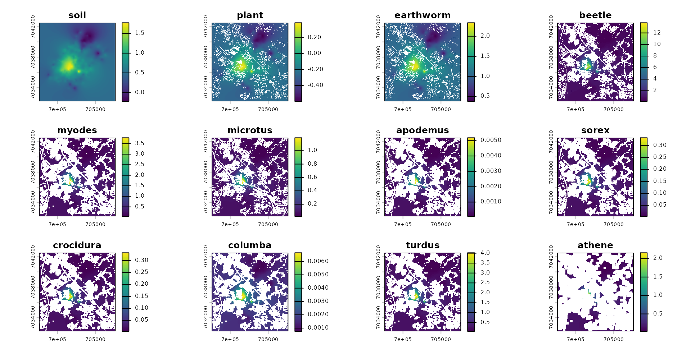

### Exposure Extract exposure

``` r

# Extraire TOUTES les couches du SpatRaster dans un seul data.frame
df_all <- as.data.frame(spcmdl_impregnation, na.rm = TRUE)

# Transformer le tableau "large" (1 colonne = 1 espèce) 
# en format "long" (1 ligne = 1 observation d'une espèce)
df_long <- pivot_longer(
  df_all,
  cols = everything(),
  names_to = "species",
  values_to = "concentration"
)

# Créer le graphique de densité globale
ggplot(df_long, aes(x = concentration, fill = species, color = species)) +
  geom_density(alpha = 0.4) + 
  scale_fill_manual(values = species_colors) +
  scale_color_manual(values = species_colors) +
  theme_minimal(base_size = 14) +
  scale_x_log10() +
  labs(
    title = "Distribution of Body-burden",
    x = "Body-burden",
    y = "Density",
    fill = "Species",
    color = "Species"
  ) +
  theme(
    legend.position = "right"
  )
```

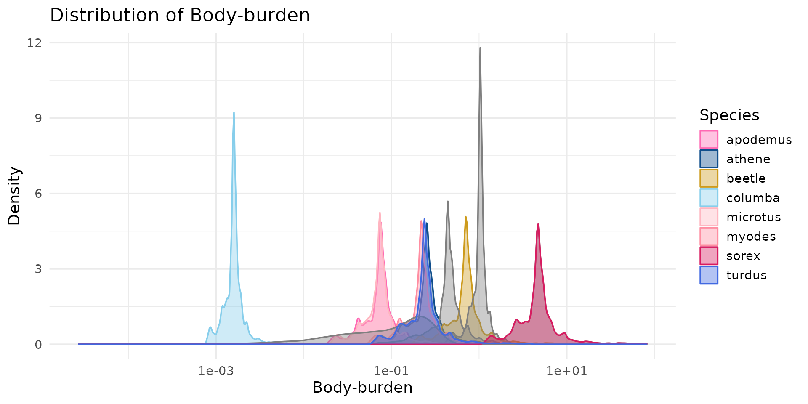

``` r

species_names <- species_traits$species
spcmdl_exposure <- spcmdl_impregnation
spcmdl_exposure[[species_names]] <- spcmdl_exposure[[species_names]] / vec_BTF
spcmdl_diet_conc <- spcmdl_exposure
spcmdl_diet_conc[[species_names]] <- spcmdl_diet_conc[[species_names]] / vec_FIRbw
```

Absolute value mg/g per individual

``` r

# absolute value mg/g per individual
plot(spcmdl_exposure)
```


Relative value as daily dose in mg/g/kg bw

``` r

# absolute value mg/g/kg bw
plot(spcmdl_diet_conc)
```

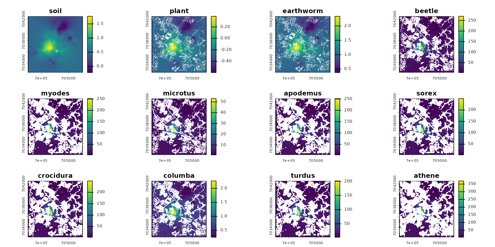

### Compared to data

#### Plants

#### Earthworm

``` r

data("earthworm_cd")

ggplot() +
  theme_minimal() +
  geom_point(data=earthworm_cd, aes(x=log10_cd_soil, y=log10_cd_worm)) +
  geom_point(data=df_all, aes(x=soil, y=earthworm), col="red")
```

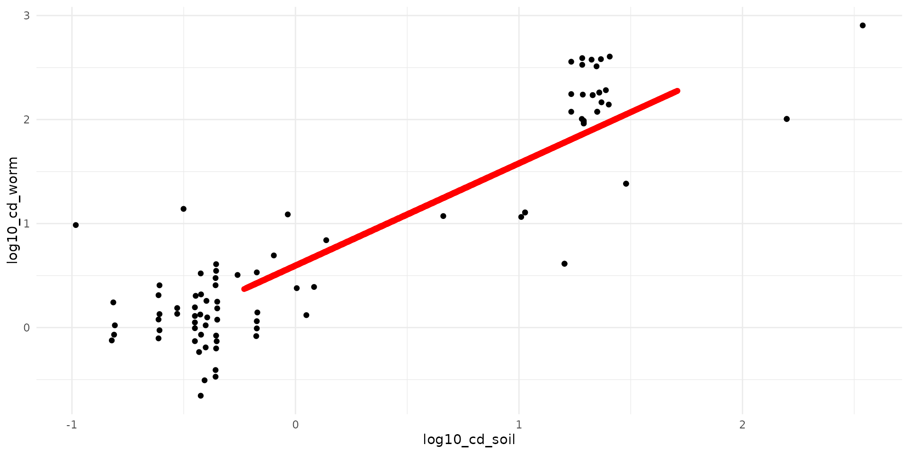

#### Mammals

``` r

micromammals_order <- c("microtus", "myodes", "apodemus", "sorex", "crocidura")
species_colors <- c(
  "beetle" = "#CD9B1D", "sorex" = "#D81B60", "microtus" = "#FFB6C1", 
  "myodes" = "#FF8DA1", "apodemus" = "#FF69B4", "turdus" = "#4169E1", 
  "columba" = "#87CEEB", "athene" = "#104E8B", "crocidura" = "#CC1144"
)

df_all_longer <- df_all |>
  dplyr::select(soil, myodes, microtus, apodemus, sorex, crocidura) |>
  tidyr::pivot_longer(
    cols = c("myodes", "microtus", "apodemus", "sorex", "crocidura"),
    names_to = "genus",
    values_to = "concentration"
  ) |>
  mutate(genus = factor(genus, levels = micromammals_order))


data("sf_micromammals")
sf_micromammals <- sf_micromammals |>
  mutate(genus = factor(tolower(genus), levels = micromammals_order))

ggplot() +
  theme_minimal(base_size = 14) +
  scale_x_log10() +
  scale_y_log10(limits = c(1e-3, NA)) +
  # Apply custom colors
  scale_color_manual(values = species_colors) +
  # Observed data (Points)
  geom_point(data = sf_micromammals, aes(x = cd_S, y = cd_WB_FW, color = genus), alpha = 0.6) +
  # Modeled data (Transfer/fit line)
  geom_point(data = df_all_longer, aes(x = 10^soil, y = concentration, color = genus), shape=4) +
  # Faceting: Respects the factor order defined above
  facet_grid(~genus) +
  labs(
    title = "Observation vs Trophic Model of Body Burden Micromammals",
    x = "Soil Concentration (Log Scale)",
    y = "Body Concentration (Log Scale)",
    color = "Genus"
  ) +
  theme(
    legend.position = "bottom",
    panel.grid.minor = element_blank()
  )
```


``` r

ggplot() +
  theme_minimal(base_size = 14) +
  scale_x_log10() +
  scale_y_log10(limits = c(1e-3, NA)) +
  
  # On garde vos couleurs pour le trait (color) et le remplissage (fill)
  scale_color_manual(values = species_colors) +
  scale_fill_manual(values = species_colors) +
  
  # 1. MODÈLE EN ARRIÈRE-PLAN (Nuage de croix discrètes)
  geom_point(
    data = df_all_longer, 
    aes(x = 10^soil, y = concentration, color = genus), 
    shape = 4, 
    size = 1,      # Plus petit
    alpha = 0.2    # Forte transparence pour ne pas surcharger
  ) +
  
  # 2. OBSERVATIONS EN PREMIER PLAN (Cercles avec bordure noire)
  geom_point(
    data = sf_micromammals, 
    aes(x = cd_S, y = cd_WB_FW, fill = genus), 
    shape = 21,          # Cercle remplissable
    color = "black",     # Bordure noire pour le contraste
    size = 2.5,          # Plus grand
    stroke = 0.5,        # Épaisseur de la bordure
    alpha = 0.9
  ) +
  
  facet_grid(~genus) +
  
  labs(
    title = "Observation vs Trophic Model of Body Burden in Micromammals",
    subtitle = "Crosses (x) = Model Predictions | Circles (o) = Field Observations",
    x = "Soil Concentration (Log Scale)",
    y = "Body Concentration (Log Scale)",
    color = "Genus",
    fill = "Genus"
  ) +
  theme(
    legend.position = "bottom",
    panel.grid.minor = element_blank(),
    strip.text = element_text(face = "bold", size = 12) # Met les noms d'espèces bien en évidence
  )
```

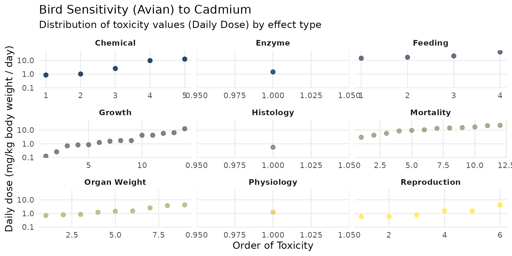

## Risk based on SSD

### Define threshold

``` r

data("SSD_ecoSSL_all")
```

#### plants

``` r

ssd_cd_plant <- SSD_ecoSSL_all |>
  dplyr::filter(
    compound == "Cadmium",
    species_group == "Plant",
    !is.na(tox_value)
  )

# Create the plot
ggplot(data = ssd_cd_plant, aes(x = order_tox_value, y = tox_value, color = ERE_full)) +
  theme_minimal(base_size = 14) +
  # geom_hline(yintercept = 32, linetype = "dashed", color = "red", linewidth = 1) +
  geom_point(size = 2.5, alpha = 0.8) +
  facet_wrap(~ ERE_full, scales = "free_x") +
  scale_y_log10(labels = label_number()) +
  scale_color_viridis_d(option = "plasma", guide = "none") +
  labs(
    title = "Plant Sensitivity to Cadmium (Soil)",
    subtitle = "Distribution of toxicity values by effect type (ERE)",
    x = "Order of Toxicity",
    y = "Soil concentration (mg/kg dry weight)"
  ) +
  theme(
    panel.grid.minor = element_blank(),
    strip.text = element_text(face = "bold", size = 10)
  )
```

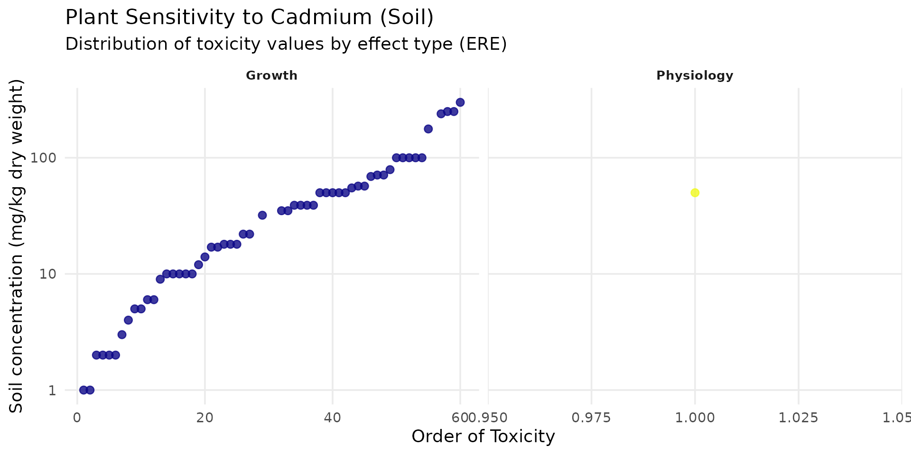

#### Invertebrates

``` r

ssd_cd_invert <- SSD_ecoSSL_all |>
  dplyr::filter(
    compound == "Cadmium",
    grepl("Invert", species_group), # Flexible filter for Invertebrates
    !is.na(tox_value)
  )

ggplot(data = ssd_cd_invert, aes(x = order_tox_value, y = tox_value, color = ERE_full)) +
  theme_minimal(base_size = 14) +
  geom_point(size = 2.5, alpha = 0.8) +
  facet_wrap(~ ERE_full, scales = "free_x", ncol=4) +
  scale_y_log10(labels = label_number()) +
  scale_color_viridis_d(option = "viridis", guide = "none") +
  labs(
    title = "Invertebrate Sensitivity to Cadmium (Soil)",
    subtitle = "Distribution of toxicity values by effect type (ERE)",
    x = "Order of Toxicity",
    y = "Soil concentration (mg/kg dry weight)"
  ) +
  theme(panel.grid.minor = element_blank(), strip.text = element_text(face = "bold"))
```

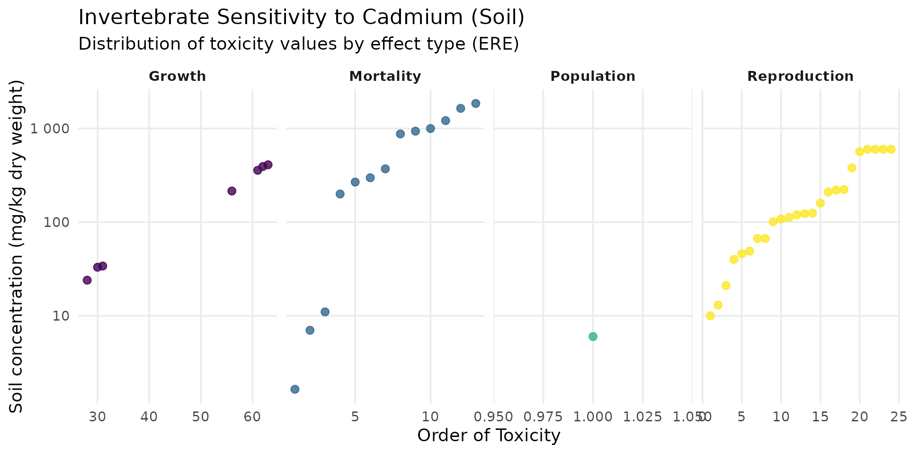

#### Mammals

``` r

ssd_cd_mammal <- SSD_ecoSSL_all |>
  dplyr::filter(
    compound == "Cadmium",
    grepl("Mammal", species_group),
    !is.na(tox_value)
  )

ggplot(data = ssd_cd_mammal, aes(x = order_tox_value, y = tox_value, color = ERE_full)) +
  theme_minimal(base_size = 14) +
  # geom_hline(yintercept = 0.77, linetype = "dashed", color = "red", linewidth = 1) +
  geom_point(size = 2.5, alpha = 0.8) +
  facet_wrap(~ ERE_full, scales = "free_x") +
  scale_y_log10(labels = label_number()) +
  scale_color_viridis_d(option = "magma", guide = "none") + 
  labs(
    title = "Mammal Sensitivity to Cadmium",
    subtitle = "Distribution of toxicity values (Daily Dose) by effect type",
    x = "Order of Toxicity",
    y = "Daily dose (mg/kg body weight / day)"
  ) +
  theme(panel.grid.minor = element_blank(), strip.text = element_text(face = "bold"))
```

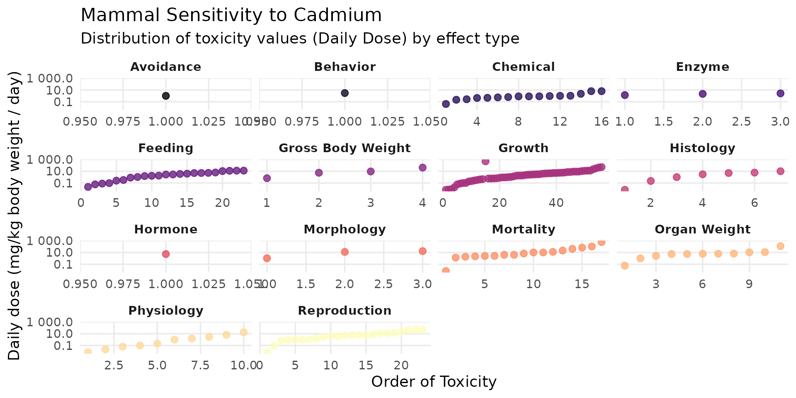

#### Birds

``` r

ssd_cd_avian <- SSD_ecoSSL_all |>
  dplyr::filter(
    compound == "Cadmium",
    grepl("Avian", species_group),
    !is.na(tox_value)
  )

ggplot(data = ssd_cd_avian, aes(x = order_tox_value, y = tox_value, color = ERE_full)) +
  theme_minimal(base_size = 14) +
  # geom_hline(yintercept = 1.47, linetype = "dashed", color = "red", linewidth = 1) +
  geom_point(size = 2.5, alpha = 0.8) +
  facet_wrap(~ ERE_full, scales = "free_x") +
  scale_y_log10(labels = label_number()) +
  scale_color_viridis_d(option = "cividis", guide = "none") +
  labs(
    title = "Bird Sensitivity (Avian) to Cadmium",
    subtitle = "Distribution of toxicity values (Daily Dose) by effect type",
    x = "Order of Toxicity",
    y = "Daily dose (mg/kg body weight / day)"
  ) +
  theme(panel.grid.minor = element_blank(), strip.text = element_text(face = "bold"))
```


### Risk Maps

#### Mortality

``` r

probs=0.5
plant_mortality = ssd_cd_plant[ssd_cd_plant$ERE_full=="Growth",]
plant_mortality_thrshld = quantile(plant_mortality$tox_value, probs=probs, na.rm=TRUE) |>
  as.numeric()

invert_mortality = ssd_cd_invert[ssd_cd_invert$ERE_full=="Mortality",]
invert_mortality_thrshld = quantile(invert_mortality$tox_value, probs=probs, na.rm=TRUE)|>
  as.numeric()

mammal_mortality = ssd_cd_mammal[ssd_cd_mammal$ERE_full=="Mortality",]
mammal_mortality_thrshld = quantile(mammal_mortality$tox_value, probs=probs, na.rm=TRUE)|>
  as.numeric()

bird_mortality = ssd_cd_avian[ssd_cd_avian$ERE_full=="Mortality",]
bird_mortality_thrshld = quantile(bird_mortality$tox_value, probs=probs, na.rm=TRUE)|>
  as.numeric()

# Reference thresholds for each component
# Reference thresholds for each component (Toutes les espèces incluses)
thresholds <- c(
  soil = 1,
  plant = plant_mortality_thrshld,
  earthworm = invert_mortality_thrshld,
  beetle = invert_mortality_thrshld,
  myodes = mammal_mortality_thrshld,
  microtus = mammal_mortality_thrshld,
  apodemus = mammal_mortality_thrshld,
  sorex = mammal_mortality_thrshld,
  crocidura = mammal_mortality_thrshld,
  columba = bird_mortality_thrshld,
  turdus = bird_mortality_thrshld,
  athene = bird_mortality_thrshld
)

# Align the vector's order with the raster layers' order (very important!)
ordered_thresholds <- thresholds[names(spcmdl_exposure)]
# Calculate the risk index: Concentration / Threshold
spcmdl_risk <-  spcmdl_diet_conc / ordered_thresholds
# Re-attach the trophic metadata since the division created a new object
spcmdl_risk <- spacemodel(spcmdl_risk, attr(spcmdl_diet_conc, "trophic_tbl"))
```

``` r

# Risk colors
breaks_risk <- c(-Inf, 0.1, 0.5, 1, 5, 10, Inf)
cols_risk <- c(
  "darkgreen",   # 0 - 0.1
  "green",       # 0.1 - 0.5
  "lightgreen",  # 0.5 - 1
  "yellow",      # 1 - 5
  "saddlebrown", # 5 - 10
  "#4A2C2A"      # > 10
)

names_keep <- names(spcmdl_risk)[names(spcmdl_risk) != "soil"]
spcmdl_risk_sub <- spcmdl_risk[[names_keep]]

terra::plot(spcmdl_risk_sub,
            breaks = breaks_risk,
            col = cols_risk)
```

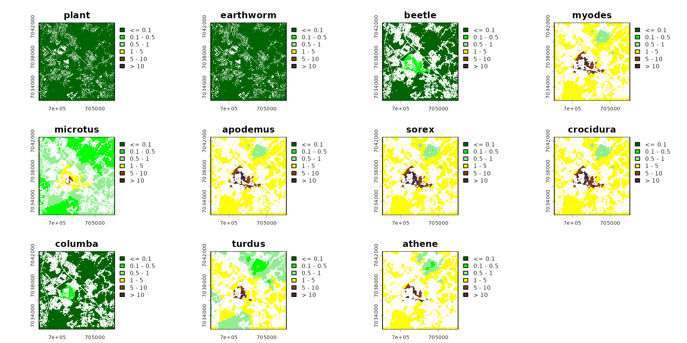

#### Reproduction

``` r

probs=0.5
plant_mortality = ssd_cd_plant[ssd_cd_plant$ERE_full=="Growth",]
plant_mortality_thrshld = quantile(plant_mortality$tox_value, probs=probs, na.rm=TRUE) |>
  as.numeric()

invert_mortality = ssd_cd_invert[ssd_cd_invert$ERE_full=="Reproduction",]
invert_mortality_thrshld = quantile(invert_mortality$tox_value, probs=probs, na.rm=TRUE)|>
  as.numeric()

mammal_mortality = ssd_cd_mammal[ssd_cd_mammal$ERE_full=="Reproduction",]
mammal_mortality_thrshld = quantile(mammal_mortality$tox_value, probs=probs, na.rm=TRUE)|>
  as.numeric()

bird_mortality = ssd_cd_avian[ssd_cd_avian$ERE_full=="Reproduction",]
bird_mortality_thrshld = quantile(bird_mortality$tox_value, probs=probs, na.rm=TRUE)|>
  as.numeric()

# Reference thresholds for each component
# Reference thresholds for each component (Toutes les espèces incluses)
thresholds <- c(
  soil = 1,
  plant = plant_mortality_thrshld,
  earthworm = invert_mortality_thrshld,
  beetle = invert_mortality_thrshld,
  myodes = mammal_mortality_thrshld,
  microtus = mammal_mortality_thrshld,
  apodemus = mammal_mortality_thrshld,
  sorex = mammal_mortality_thrshld,
  crocidura = mammal_mortality_thrshld,
  columba = bird_mortality_thrshld,
  turdus = bird_mortality_thrshld,
  athene = bird_mortality_thrshld
)

# Align the vector's order with the raster layers' order (very important!)
ordered_thresholds <- thresholds[names(spcmdl_diet_conc)]
# Calculate the risk index: Concentration / Threshold
spcmdl_risk <- spcmdl_diet_conc / ordered_thresholds
# Re-attach the trophic metadata since the division created a new object
spcmdl_risk <- spacemodel(spcmdl_risk, attr(spcmdl_diet_conc, "trophic_tbl"))
```

``` r

# Risk colors
breaks_risk <- c(-Inf, 0.1, 0.5, 1, 5, 10, Inf)
cols_risk <- c(
  "darkgreen",   # 0 - 0.1
  "green",       # 0.1 - 0.5
  "lightgreen",  # 0.5 - 1
  "yellow",      # 1 - 5
  "saddlebrown", # 5 - 10
  "#4A2C2A"      # > 10
)

names_keep <- names(spcmdl_risk)[names(spcmdl_risk) != "soil"]
spcmdl_risk_sub <- spcmdl_risk[[names_keep]]

terra::plot(spcmdl_risk_sub,
            breaks = breaks_risk,
            col = cols_risk)
```

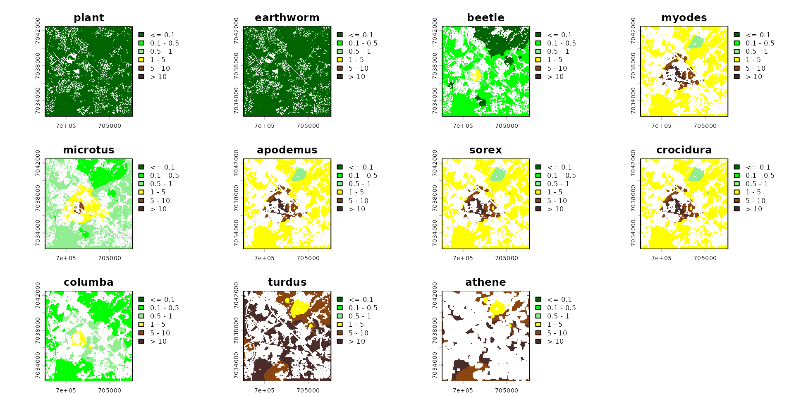

### vs Eco-SSL

``` r

# Define the Eco-SSL thresholds (in mg/kg) for each group in a named vector
# 1. Valeurs de référence Eco-SSL (en mg/kg) pour chaque groupe écologique
ecossl_vals <- c(
  plant      = 32,
  invert     = 140,
  mamHerb    = 73,
  mamInsect  = 0.36,
  birdHerb   = 28,
  birdInsect = 0.77,
  birdCarn   = 630
)

# 2. Liste des kernels (NA car le calcul du seuil Eco-SSL est purement local / non dispersé)
ecossl_kernels <- list(
  soil = NA, plant = NA, earthworm = NA, beetle = NA,
  myodes = NA, microtus = NA, apodemus = NA, 
  sorex = NA, crocidura = NA, 
  columba = NA, turdus = NA, athene = NA
)

# 3. Construction des seuils Eco-SSL (Calcul du Quotient de Danger - HQ)
ecossl_threshold <- flux(spcmdl_berisp_flux, default = 1, normalize = FALSE) |>
  # Végétaux
  add_flux(from = "soil", to = "plant", value = ~ 10^x / ecossl_vals["plant"]) |>
  # Invertébrés
  add_flux(from = "soil", to = "earthworm", value = ~ 10^x / ecossl_vals["invert"]) |>
  add_flux(from = "soil", to = "beetle",    value = ~ 10^x / ecossl_vals["invert"]) |>
  # Mammifères - Herbivores / Omnivores
  add_flux(from = "soil", to = "myodes",   value = ~ 10^x / ecossl_vals["mamHerb"]) |>
  add_flux(from = "soil", to = "microtus", value = ~ 10^x / ecossl_vals["mamHerb"]) |>
  add_flux(from = "soil", to = "apodemus", value = ~ 10^x / ecossl_vals["mamHerb"]) |>
  # Mammifères - Insectivores
  add_flux(from = "soil", to = "sorex",     value = ~ 10^x / ecossl_vals["mamInsect"]) |>
  add_flux(from = "soil", to = "crocidura", value = ~ 10^x / ecossl_vals["mamInsect"]) |>
  # Oiseaux
  add_flux(from = "soil", to = "columba", value = ~ 10^x / ecossl_vals["birdHerb"]) |>
  add_flux(from = "soil", to = "turdus",  value = ~ 10^x / ecossl_vals["birdInsect"]) |>
  add_flux(from = "soil", to = "athene",  value = ~ 10^x / ecossl_vals["birdCarn"])

# Apply the transfer to compute the spatial risk layers
spcmdl_ecossl_risk <- transfer(
  spcmdl_berisp_flux,
  ecossl_kernels,
  ecossl_threshold,
  exposure_weighting="potential"
)

# Risk colors
breaks_risk <- c(-Inf, 0.1, 0.5, 1, 5, 10, Inf)
cols_risk <- c(
  "darkgreen",   # 0 - 0.1
  "green",       # 0.1 - 0.5
  "lightgreen",  # 0.5 - 1
  "yellow",      # 1 - 5
  "saddlebrown", # 5 - 10
  "#4A2C2A"      # > 10
)

names_keep <- names(spcmdl_ecossl_risk)[names(spcmdl_ecossl_risk) != "soil"]
spcmdl_ecossl_risk_sub <- spcmdl_ecossl_risk[[names_keep]]

terra::plot(spcmdl_ecossl_risk_sub,
            breaks = breaks_risk,
            col = cols_risk)
```

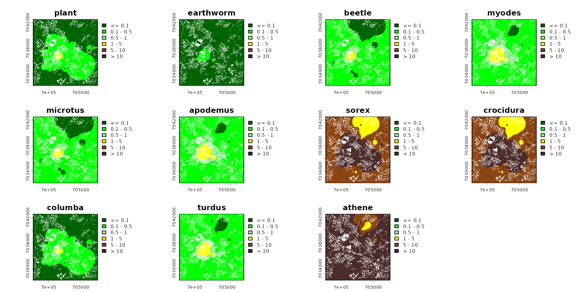
