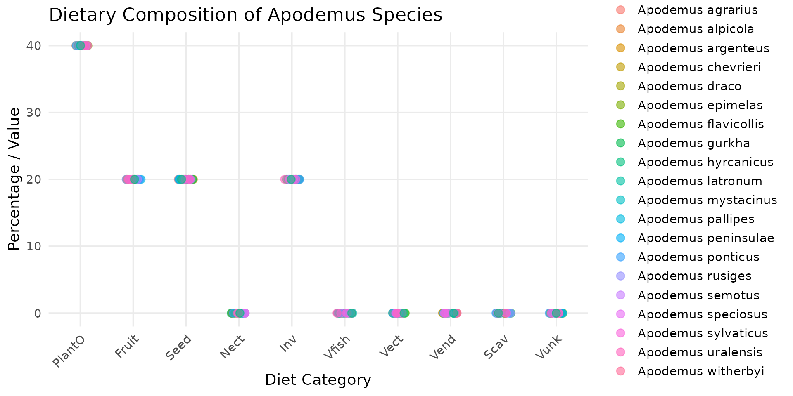

# Berisp-like: a trophic model of contamination

``` r

library(spacemodR)
library(rstan)
library(ggplot2)
library(scales)
library(dplyr)
library(tidyr)
library(terra)
```

## Define a Spacemodel

### Habitat

``` r

ground_cd <- load_raster_extdata("ground_concentration_cd_compressed.tif")
names_hab = c("soil", "plant", "earthworm", "carabid", "mamHerb", "mamInsect")
list_habitat <- lapply(names_hab, function(i) ground_cd)
stack_habitat <- raster_stack(list_habitat, names_hab)
```

### Trophic web

``` r

trophic_df <- trophic() |>
  add_link("soil", "plant", 1) |>
  add_link("soil", "earthworm", 1) |>
  add_link("soil", "carabid", 1) |>
  # mamHerb
  add_link("soil", "mamHerb", 2/100) |>
  add_link("plant", "mamHerb", 90/100) |>
  add_link("earthworm", "mamHerb", 4/100) |>
  add_link("carabid", "mamHerb", 4/100) |>
  # mamInsect
  add_link("soil", "mamInsect", 2/100) |>
  add_link("earthworm", "mamInsect", 49/100) |>
  add_link("carabid", "mamInsect", 49/100)
```

``` r

plot(trophic_df)
```


### create the spacemodel

``` r

spcmdl_trophic_fixed <- spacemodel(stack_habitat, trophic_df)
```

## Contaminantion by Cadmium

### Vegetation

For Cadmium, the equation is given in Berisp:

``` math
\log C_{vegetation} = 0.17 + 0.49 \times \log C_{soil} - 0.28 \times \log OM - 0.12 \times pH
```

In Eco-SSL, authors use the following equation (Neperian logarithm):

``` math
\ln(C_{plant}) = 0.546 * \ln(C_{soil}) - 0.475
```

### Earthworm

For Cadmium, the equation is given by (Ma et al., 2004):

``` math
\log C_{earthworm} = 2.92 + 0.747 \times \log C_{soil} - 0.5336 \times \log OM - 0.2101 \times pH
```

In Eco-SSL, the following equation is given (see Neperian logarithm):

``` math
\ln(C_{earthworm}) = 0.795 * \ln(C_{soil}) + 2.114
```

### Carabid

In Berisp, authors use the following equation:

``` math
\log(C_{carabid}) = -1 + 0.6 * \log(C_{soil})
```

## Transfer of food and contaminant

``` math
C_{consumer} = \frac{b_{resource}}{b_{consumer}} \times  C_{resource} \times \frac{k_{up}}{k_{out}} \left( 1 - \exp^{- c_{out} \times a} \right)
```
where:

- $`b_{resource}`$: average individual/item biomass of resource $`[g]`$,
- $`b_{consumer}`$: average individual/item biomass of consumer $`[g]`$,
- $`C_{resource}`$: concentration of substance in resource
  (e.g. $`ppm=[ug.g^{-1}]=[mg.kg^{-1}]`$),
- $`C_{resource}`$: concentration of substance in resource
  (e.g. $`ppm=[ug.g^{-1}]=[mg.kg^{-1}]`$),
- $`k_{up}`$: assimilation efficiency of food $`[n.d.]`$,
- $`k_{out}`$: excretion rate of food, $`[day^{-1}]`$
- $`a`$: average age of the consumer $`[day]`$,

### Diet and Body Mass

The diet and body mass of 5401 mammals and 9994 birds are in the
attached datasets.

``` r

data("DBFunc_MamFuncDat")
data("DBFunc_BirdFuncDat")
```

#### Apodemus diet

In this dataset `DBFunc_MamFuncDat`, we can look at the estimated diet
of all voles species as well as their mean body mass.

``` r

diet_apodemus = DBFunc_MamFuncDat[
  grepl("Apodemus", DBFunc_MamFuncDat$Scientific),
  ]

# transform data_set
diet_long <- diet_apodemus |>
  pivot_longer(
    cols = c(Diet.Inv, Diet.Vend, Diet.Vect, Diet.Vfish, Diet.Vunk, 
             Diet.Scav, Diet.Fruit, Diet.Nect, Diet.Seed, Diet.PlantO),
    names_to = "Diet_Category",
    values_to = "Value"
  ) |>
  mutate(
    Diet_Category = stringr::str_remove(Diet_Category, "Diet\\."),
    Diet_Category = factor(Diet_Category, levels = trophic_order)
  )

# create plot
ggplot(diet_long, aes(x = Diet_Category, y = Value, color = Scientific)) +
  geom_point(size = 3, alpha = 0.6, position = position_jitter(width = 0.15, height = 0)) +
  theme_minimal(base_size = 14) +
  labs(
    title = "Dietary Composition of Apodemus Species",
    x = "Diet Category",
    y = "Percentage / Value",
    color = "Species"
  ) +
  theme(
    axis.text.x = element_text(angle = 45, hjust = 1),
    panel.grid.minor = element_blank(),
  )
```



##### Concise Diet Descriptions (EltonTraits 1.0)

- `Diet.Inv`: % of invertebrates (insects, larves, worms, mollusks).
- `Diet.Vend`: % of endothermic vertebrates (birds and mammals).
- `Diet.Vect`: % of ectothermic vertebrates (reptiles and amphibians).
- `Diet.Vfish`: % of fish consumed.
- `Diet.Vunk`: % of unknown or unclassified vertebrates.
- `Diet.Scav`: % of scavenging activity (eating carrion/dead animals).
- `Diet.Fruit`: % of fruits and berries consumed.
- `Diet.Nect`: % of nectar, pollen, or plant exudates.
- `Diet.Seed`: % of seeds, nuts, grains, or cones.
- `Diet.PlantO`: % of other vegetative tissues (leaves, stems, roots,
  bark).

And also:

- `Diet.Source`: Reference/ID of the scientific data source.
- `Diet.Certainty`: Data certainty score (direct species study
  vs. genus-level extrapolation).

#### Small mammals: voles and shrew

``` r

diet_mammal <- DBFunc_MamFuncDat |>
  dplyr::filter(
    Scientific %in% 
      c("Microtus arvalis", "Myodes glareolus", "Apodemus sylvaticus", "Sorex araneus", "Crocidura russula")
    )

# transform data_set
diet_long <- diet_mammal |>
  pivot_longer(
    cols = c(Diet.Inv, Diet.Vend, Diet.Vect, Diet.Vfish, Diet.Vunk, 
             Diet.Scav, Diet.Fruit, Diet.Nect, Diet.Seed, Diet.PlantO),
    names_to = "Diet_Category",
    values_to = "Value"
  ) |>
  mutate(
    Diet_Category = stringr::str_remove(Diet_Category, "Diet\\."),
    Diet_Category = factor(Diet_Category, levels = trophic_order)
  )

# create plot
ggplot(diet_long, aes(x = Diet_Category, y = Value, color = Scientific)) +
  geom_point(size = 3, alpha = 0.6, position = position_jitter(width = 0.15, height = 0)) +
  theme_minimal(base_size = 14) +
  labs(
    title = "Dietary composition of some small-mammals species",
    x = "Diet Category",
    y = "Percentage / Value",
    color = "Species"
  ) +
  theme(
    axis.text.x = element_text(angle = 45, hjust = 1),
    panel.grid.minor = element_blank(),
  )
```


We can compared the results with what is used in the Berisp
documentation:

|  | grass | herbs | berries | seeds | earthworm | beetle | soil |
|:---|:--:|:--:|:--:|:--:|:--:|:--:|:--:|
| bank vole (*Myodes glareolus*) | 20 | 20 | 26 | 24 | 4 | 4 | 2 |
| common vole (*Microtus arvalis*) | 42 | 41 |  | 15 |  |  | 2 |
| wood mouse (*Apodemus sylvaticus*) | 6 | 6 | 12 | 58 | 8 | 8 | 2 |
| shrew (*Sorex araneus* or *Crocidura russula*) |  |  |  |  | 49 | 49 | 2 |

#### Birds: little owl and black bird

``` r

diet_bird <- DBFunc_BirdFuncDat |>
  dplyr::filter(
    Scientific %in% 
      c("Athene noctua", "Turdus merula")
    )

# transform data_set
diet_long <- diet_bird |>
  pivot_longer(
    cols = c(Diet.Inv, Diet.Vend, Diet.Vect, Diet.Vfish, Diet.Vunk, 
             Diet.Scav, Diet.Fruit, Diet.Nect, Diet.Seed, Diet.PlantO),
    names_to = "Diet_Category",
    values_to = "Value"
  ) |>
  mutate(
    Diet_Category = stringr::str_remove(Diet_Category, "Diet\\."),
    Diet_Category = factor(Diet_Category, levels = trophic_order)
  )

# create plot
ggplot(diet_long, aes(x = Diet_Category, y = Value, color = Scientific)) +
  geom_point(size = 3, alpha = 0.6, position = position_jitter(width = 0.15, height = 0)) +
  theme_minimal(base_size = 14) +
  labs(
    title = "Dietary composition of some small-mammals species",
    x = "Diet Category",
    y = "Percentage / Value",
    color = "Species"
  ) +
  theme(
    axis.text.x = element_text(angle = 45, hjust = 1),
    panel.grid.minor = element_blank(),
  )
```


### Energy Needs

We have the energy needs of 749 species, 97 mammals, 107 birds, 170
fishes, 51 reptiles, 11 amphibians, 110 crustacean, 65 arthropods, 75
protozoa

``` r

data("FmrBT")
```

##### close species

The list is missing some species.

- Sorex and Crocidura (Shrews): the list lacks true shrews (Soricidae).
  When seeking a metabolic surrogate for temperate shrews (Sorex spp.)
  within this dataset, small temperate insectivorous bats, such as
  *Myotis lucifugus* and *Plecotus auritus*, serve as excellent
  physiological equivalents. Like true shrews, these bats are
  lightweight (often weighing between 5 and 12 grams) and operate under
  immense thermal pressure from temperate and boreal climates. Because
  they are strictly insectivorous, they share a highly active foraging
  strategy that demands a continuous supply of high-protein, easily
  digestible prey. Most importantly, the extreme energetic cost of
  flapping flight combined with their tiny body size forces these bats
  to run a hyper-metabolic “engine.”

- *Myodes glareolus* (Bank Vole): the list is highly enriched with
  rodents that are phylogenetically very close to the bank vole. Most
  notably, *Cleithrionomys rutilus* belongs to the exact same genus (as
  Myodes and *Cleithrionomys* are synonymous in modern taxonomy).
  Additionally, species from the genera *Microtus* (like *M. agrestis*
  and *M. pennsylvanicus*) and *Arvicola* belong to the same family,
  Cricetidae, sharing identical microtine (vole-like) metabolic and
  toxicokinetic traits.

``` r

energy_mammal <- FmrBT |>
  filter(
    SpeciesVerbatim %in% c(
      "Apodemus sylvaticus", "Plecotus auritus", "Myotis lucifugus",
      "Cleithrionomys rutilus",
      "Microtus agrestis", "Microtus pennsylvanicus")
  )

# plot
ggplot(data = energy_mammal, aes(x = Mass_g, y = FMR_kJ_d/Mass_g, color = SpeciesVerbatim)) +
  geom_point(size = 3.5, alpha = 0.8) + 
  labs(
    title = "Field Metabolic Rate (FMR) vs. Body Mass in Small Mammals",
    x = "Body Mass (g)",
    y = "Field Metabolic Rate (kJ/day/g)",
    color = "Species"
  ) +
  theme_minimal() +
  theme(
    plot.title = element_text(face = "bold", size = 14, hjust = 0.5),
    legend.title = element_text(face = "bold"),
    legend.position = "right"
  )
```


- *Athene noctua* (Little Owl): true owls (Strigiformes) are completely
  absent from this dataset. The closest relative available is
  *Phalaenoptilus nuttallii* (the common poorwill), which belongs to the
  *Caprimulgiformes* (nightjars). While it is a distinct family,
  nightjars share a nocturnal, insectivorous niche with small owls and
  belong to the same broader evolutionary landbird/Strisores lineage,
  making it the best available surrogate for nocturnal avian traits.

``` r

energy_mammal <- FmrBT |>
  filter(SpeciesVerbatim %in% c(
      "Turdus merula", "Phalaenoptilus nuttallii")
  )

# plot
ggplot(data = energy_mammal, aes(x = Mass_g, y = FMR_kJ_d/Mass_g, color = SpeciesVerbatim)) +
  geom_point(size = 3.5, alpha = 0.8) + 
  labs(
    title = "Field Metabolic Rate (FMR) vs. Body Mass in Small Mammals",
    x = "Body Mass (g)",
    y = "Field Metabolic Rate (kJ/day/g)",
    color = "Species"
  ) +
  theme_minimal() +
  theme(
    plot.title = element_text(face = "bold", size = 14, hjust = 0.5),
    legend.title = element_text(face = "bold"),
    legend.position = "right"
  )
```


## Dose of Exposure

### Trophic transfer equation

``` math
\ln(C_{plant}) = - 0.475 + 0.546 * \ln(C_{soil}) 
```

``` math
\ln(C_{earthworm}) =  2.114 + 0.795 * \ln(C_{soil})
```

``` math
\log(C_{carabid}) = -1 + 0.6 * \log(C_{soil})
```

``` r

FIRbw_mamHerb = 0.0875 # kg dw/kg bw/d
FIRbw_mamInsect = 0.209 # kg dw/kg bw/d

direct_doses <- flux(
    spcmdl_trophic_fixed,
    default = 1,    # for all other default is 1
    normalize=FALSE # TRUE would weight every link to sum at 1
  ) |>
  # log(10^x) to change log10 to Neperian log.
  add_flux("soil", "plant", ~ - 0.475 + 0.546*log(10^x)) |>
  add_flux("soil", "earthworm", ~ 2.114 + 0.795*log(10^x)) |>
  add_flux("soil", "carabid", ~ -1 + 0.6*x)
  # mamHerb: compute only the dose to which link proportion applied
  # Then the ratio is applied to body rescale to the dose /body weight
  add_flux("soil", "mamHerb", ~ 10^x * FIRbw_mamHerb) |>
  add_flux("plant", "mamHerb", ~ exp(x) * FIRbw_mamHerb) |>
  add_flux("earthworm", "mamHerb", ~ exp(x) * FIRbw_mamHerb) |>
  add_flux("carabid", "mamHerb", ~ 10^x * FIRbw_mamHerb) |>
  # mamInsect: compute only the dose to which link proportion applied
  add_flux("soil", "mamInsect", 10^x * FIRbw_mamInsect) |>
  add_flux("earthworm", "mamInsect", ~ exp(x) * FIRbw_mamInsect) |>
  add_flux("carabid", "mamInsect", ~ 10^x * FIRbw_mamInsect)
```

### Population dispersion in landscape

``` r

# no dispersal
fixed_kernels <- list(
  soil  = NA, plant = NA, earthworm = NA,
  carabid=NA,  mamHerb = NA, mamInsect = NA)
```

``` r

spcmdl_trophic_fixed_risk <- transfer(
  spcmdl_trophic_fixed,
  fixed_kernels,
  direct_fluxes,
  exposure_weighting="potential")
```

### Computing Population Exposure

## Risk based on SSD
