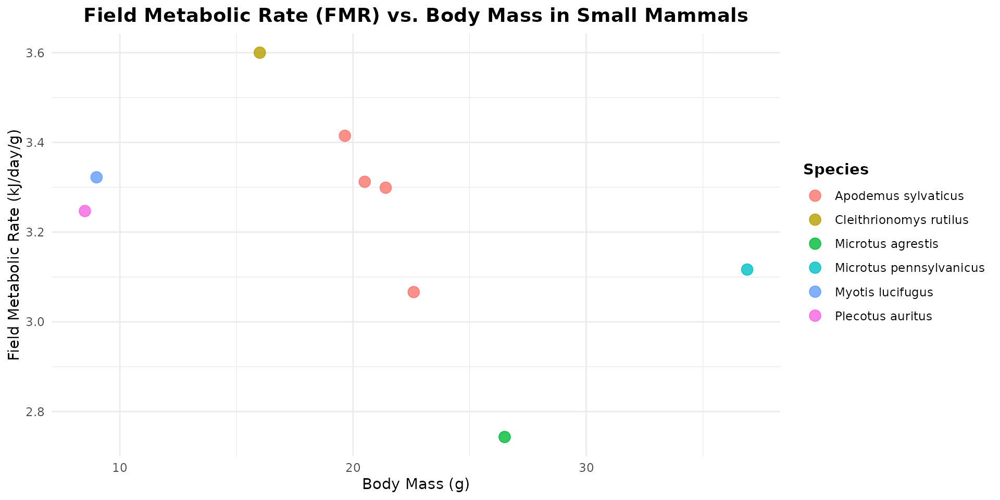

# Berisp-like: a trophic model of contamination

``` r

library(spacemodR)
library(rstan)
library(ggplot2)
library(scales)
library(stringr)
library(dplyr)
library(tidyr)
library(terra)
```

## Trophic web

Often, in other notebooks, we started by defining the habitats. But in
this case, let’s begin by defining the species and their trophic
relationships.

The goal is to reproduce the results of the Berisp model by using the
same species. Here are the species we want to model:

- The **soil** category: although not a species, we need this layer to
  account for areas with and without soil. This allows us to isolate the
  kriging process used to estimate contamination, which we will address
  later. Note that we could also define layers for pH and Organic Matter
  (%OM), which are sometimes included in transfer equations.

Next, the organisms directly linked to the soil:

- **Plants** (aka **plant**): let’s include all plants (trees, grasses,
  cereal crops, and shrubs). We could break down this stratum further,
  but let’s keep it simple.
- **Earthworms** (aka **earthworm**: we will use this single category to
  represent soil invertebrates.
- **Ground beetles**, (aka **beetle**): a highly species-rich family
  present everywhere. They are strongly influenced by soil conditions
  and occasionally prey on earthworms.

Mammals. We are only considering small mammals:

- **Bank vole** (*Myodes glareolus*, aka **myodes**): a strictly
  herbivorous rodent that prefers wooded habitats.
- **Common vole** (*Microtus arvalis*, aka **microtus**): a highly
  herbivorous rodent that primarily inhabits meadows.
- **Wood mouse** (*Apodemus sylvaticus*, aka **apodemus**): a rodent
  with a more diverse diet than the previous two.
- **Shrew** (aka **shrew**, Soricidae: *Sorex araneus* and the greater
  white-toothed shrew, *Crocidura russula*): classified as insectivores,
  they feed on ground beetles, but also consume earthworms and slugs.

Finally, 3 bird species (Note: le texte original disait “2” mais en
liste 3):

- **Pigeon/Dove** (aka **columba**): not included in Berisp, but useful
  as a common herbivore/granivore; it is widely used in Eco-SSL and
  various exposure models.
- **Blackbird** (*Turdus merula*, aka **turdus**): an omnivore that
  feeds on insects, earthworms, very small animals, and seeds.
- **Little owl** (*Athene noctua*, aka **athene**): feeds heavily on
  insects, earthworms, and small mammals. This will be the apex predator
  of our food web.

### Plants and Beetles

So, let’s start creating the food web.

For plants and earthworm, 100% of the feeding behavior is based on soil.
We keep thing simples, so we do not make any assumption on other sources
of contaminantion, and we could eventually modulate the intake rate with
the flux equatiosn comming after.

For ground beetles (Carabidae), according to recent literature
(@sacco2024carabs and @deroulers2019carabs), ground beetles display a
highly opportunistic and plastic diet, adapting their food intake based
on environmental availability. While they are major predators of soil
invertebrates like earthworms, they also exhibit a feeding continuum
that includes a significant intake of weed seeds and plant material,
particularly within specific tribes. To maintain simplicity within our
food web model, we will bypass these highly dynamic seasonal shifts and
assume a fixed dietary composition for the ground beetles consisting of
10% soil particles (accounting for incidental ingestion during
foraging), 45% vegetation, and 45% earthworms.

``` r

trophic_df <- trophic() |>
  add_link("soil", "plant", 1) |>
  add_link("soil", "earthworm", 1) |>
  # beetle
  add_link("soil", "beetle", 0.1) |>
  add_link("plant", "beetle", 0.45) |>
  add_link("earthworm", "beetle", 0.45)
```

``` r

plot(trophic_df, colors = species_colors)
```


### Diet of mammals and birds: the EltonTraits 1.0 database

Before going any further, we have two datasets from the EltonTraits 1.0
database, one for birds (9,994 species) and one for mammals (5,401
species), which will help us refine these dietary profiles. That is what
we will explore here.

``` r

data("DBFunc_MamFuncDat")
data("DBFunc_BirdFuncDat")

head(DBFunc_MamFuncDat)
#>   MSW3_ID               Scientific    MSWFamilyLatin Diet.Inv Diet.Vend
#> 1       1   Tachyglossus aculeatus    Tachyglossidae      100         0
#> 2       2  Zaglossus attenboroughi    Tachyglossidae      100         0
#> 3       3        Zaglossus bartoni    Tachyglossidae      100         0
#> 4       4        Zaglossus bruijni    Tachyglossidae      100         0
#> 5       5 Ornithorhynchus anatinus Ornithorhynchidae       80         0
#> 6       6      Caluromys philander       Didelphidae       20         0
#>   Diet.Vect Diet.Vfish Diet.Vunk Diet.Scav Diet.Fruit Diet.Nect Diet.Seed
#> 1         0          0         0         0          0         0         0
#> 2         0          0         0         0          0         0         0
#> 3         0          0         0         0          0         0         0
#> 4         0          0         0         0          0         0         0
#> 5         0         20         0         0          0         0         0
#> 6         0          0        10         0         20         0        10
#>   Diet.PlantO Diet.Source Diet.Certainty ForStrat.Value ForStrat.Certainty
#> 1           0       Ref_1            ABC              G                  A
#> 2           0      Ref_65            ABC              G                  A
#> 3           0       Ref_2             D1              G                  A
#> 4           0       Ref_1            ABC              G                  A
#> 5           0       Ref_1            ABC              G                  A
#> 6          40       Ref_1            ABC             Ar                  A
#>   ForStrat.Comment Activity.Nocturnal Activity.Crepuscular Activity.Diurnal
#> 1                                   1                    1                0
#> 2                                   1                    0                0
#> 3                                   1                    0                0
#> 4                                   1                    0                0
#> 5                                   1                    1                1
#> 6                                   1                    1                0
#>   Activity.Source Activity.Certainty BodyMass.Value BodyMass.Source
#> 1           Ref_1                ABC        3025.00         Ref_117
#> 2           Ref_1                ABC        8532.39    Ref_2, Ref_3
#> 3           Ref_1                ABC        7180.00         Ref_131
#> 4           Ref_1                ABC       10139.50         Ref_117
#> 5           Ref_1                ABC        1484.25         Ref_117
#> 6           Ref_1                ABC         229.25         Ref_117
#>   BodyMass.SpecLevel
#> 1                  1
#> 2                  0
#> 3                  1
#> 4                  1
#> 5                  1
#> 6                  1
```

Concise Diet Descriptions (EltonTraits 1.0):

- `Diet.PlantO`: % of other vegetative tissues (leaves, stems, roots,
  bark).
- `Diet.Fruit`: % of fruits and berries consumed.
- `Diet.Seed`: % of seeds, nuts, grains, or cones.
- `Diet.Nect`: % of nectar, pollen, or plant exudates.
- `Diet.Inv`: % of invertebrates (insects, larves, worms, mollusks).
- `Diet.Vfish`: % of fish consumed.
- `Diet.Vect`: % of ectothermic vertebrates (reptiles and amphibians).
- `Diet.Vend`: % of endothermic vertebrates (birds and mammals).
- `Diet.Scav`: % of scavenging activity (eating carrion/dead animals).
- `Diet.Vunk`: % of unknown or unclassified vertebrates.

And also:

- `Diet.Source`: Reference/ID of the scientific data source.
- `Diet.Certainty`: Data certainty score (direct species study
  vs. genus-level extrapolation).

#### Small mammals: voles and shrew

``` r

diet_mammal <- DBFunc_MamFuncDat |>
  dplyr::filter(
    Scientific %in% 
      c("Microtus arvalis", "Myodes glareolus", "Apodemus sylvaticus", "Sorex araneus", "Crocidura russula")
    )

# transform data_set
species_short = c(
  "Microtus arvalis"="microtus",
  "Myodes glareolus"="myodes",
  "Apodemus sylvaticus"="apodemus",
  "Sorex araneus"="sorex",
  "Crocidura russula"="crocidura")
diet_long <- diet_mammal |>
  pivot_longer(
    cols = c(Diet.Inv, Diet.Vend, Diet.Vect, Diet.Vfish, Diet.Vunk, 
             Diet.Scav, Diet.Fruit, Diet.Nect, Diet.Seed, Diet.PlantO),
    names_to = "Diet_Category",
    values_to = "Value"
  ) |>
  mutate(
    Diet_Category = stringr::str_remove(Diet_Category, "Diet\\."),
    Diet_Category = factor(Diet_Category, levels = trophic_order),
    Species_Short = species_short[Scientific]
  )

# create plot
ggplot(diet_long, aes(x = Diet_Category, y = Value, color = Species_Short, shape=Scientific)) +
  geom_point(size = 3, alpha = 0.8, position = position_jitter(width = 0.15, height = 0)) +
  theme_minimal(base_size = 14) +
  scale_color_manual(values = species_colors) +
  labs(
    title = "Dietary composition of some small-mammals species",
    x = "Diet Category",
    y = "Percentage / Value",
    color = "Species"
  ) +
  theme(
    axis.text.x = element_text(angle = 45, hjust = 1),
    panel.grid.minor = element_blank(),
  )
```


We can compared the results with what is used in the Berisp
documentation, and see that the results are similar:

|  | grass | herbs | berries | seeds | earthworm | beetle | soil |
|:---|:--:|:--:|:--:|:--:|:--:|:--:|:--:|
| bank vole (*Myodes glareolus*) | 20 | 20 | 26 | 24 | 4 | 4 | 2 |
| common vole (*Microtus arvalis*) | 42 | 41 |  | 15 |  |  | 2 |
| wood mouse (*Apodemus sylvaticus*) | 6 | 6 | 12 | 58 | 8 | 8 | 2 |
| shrew (*Sorex araneus* or *Crocidura russula*) |  |  |  |  | 49 | 49 | 2 |

So we add mammals to the trophic network

``` r

trophic_df <- trophic_df |>
  # myodes
  add_link("soil", "myodes", 0.02) |>
  add_link("plant", "myodes", 0.9) |>
  add_link("earthworm", "myodes", 0.04) |>
  add_link("beetle", "myodes", 0.04) |>
  # microtus
  add_link("soil", "microtus", 0.02) |>
  add_link("plant", "microtus", 0.98) |>
  # wood mouse
  add_link("soil", "apodemus", 0.02) |>
  add_link("plant", "apodemus", 0.82) |>
  add_link("earthworm", "apodemus", 0.08) |>
  add_link("beetle", "apodemus", 0.08) |>
  # sorex
  add_link("soil", "sorex", 0.02) |>
  add_link("earthworm", "sorex", 0.49) |>
  add_link("beetle", "sorex", 0.49) |>
  # crocidura
  add_link("soil", "crocidura", 0.02) |>
  add_link("earthworm", "crocidura", 0.49) |>
  add_link("beetle", "crocidura", 0.49)
```

``` r

plot(trophic_df, colors = species_colors)
```


#### Birds: little owl and black bird

``` r

diet_bird <- DBFunc_BirdFuncDat |>
  dplyr::filter(
    Scientific %in% 
      c("Athene noctua", "Turdus merula", "Columba palumbus")
    )

# transform data_set
species_short = c(
  "Columba palumbus"="columba",
  "Athene noctua"="athene",
  "Turdus merula"="turdus")
diet_long <- diet_bird |>
  pivot_longer(
    cols = c(Diet.Inv, Diet.Vend, Diet.Vect, Diet.Vfish, Diet.Vunk, 
             Diet.Scav, Diet.Fruit, Diet.Nect, Diet.Seed, Diet.PlantO),
    names_to = "Diet_Category",
    values_to = "Value"
  ) |>
  mutate(
    Diet_Category = stringr::str_remove(Diet_Category, "Diet\\."),
    Diet_Category = factor(Diet_Category, levels = trophic_order),
    Species_Short = species_short[Scientific]
  )

# create plot
ggplot(diet_long, aes(x = Diet_Category, y = Value, color = Species_Short, shape=Scientific)) +
  geom_point(size = 3, alpha = 0.6, position = position_jitter(width = 0.15, height = 0)) +
  theme_minimal(base_size = 14) +
  scale_color_manual(values = species_colors) +
  labs(
    title = "Dietary composition of some small-mammals species",
    x = "Diet Category",
    y = "Percentage / Value",
    color = "Species"
  ) +
  theme(
    axis.text.x = element_text(angle = 45, hjust = 1),
    panel.grid.minor = element_blank(),
  )
```


From this graph, we observe the following:

- *Columba palumbus* is strictly herbivorous/granivorous, consisting of
  40% plants, 30% fruits, and 30% seeds.
- *Turdus merula* is more of an omnivore, with 20% fruits, 20% seeds,
  and 50% invertebrates (which we will divide equally between earthworms
  and beetles). The remaining 10% consists of unknown vertebrates
  (likely because they are not consumed whole), which we will not take
  into account.
- *Athene noctua* feeds on 70% invertebrates (which we will split into
  35% earthworms and 35% beetles), 20% endotherms, and 10% ectotherms
  (we will distribute this combined 30% across all organisms).

And we finally add birds to the trophic network:

``` r

trophic_df <- trophic_df |>
  # columba
  add_link("plant", "columba", 1) |>
  # turdus
  add_link("plant", "turdus", 0.4) |>
  add_link("earthworm", "turdus", 0.3) |>
  add_link("beetle", "turdus", 0.3) |>
  # athene
  add_link("earthworm", "athene", 0.35) |>
  add_link("beetle", "athene", 0.35) |>
  add_link("myodes", "athene", 0.06) |>
  add_link("microtus", "athene", 0.06) |>
  add_link("apodemus", "athene", 0.06) |>
  add_link("sorex", "athene", 0.06) |>
  add_link("crocidura", "athene", 0.06)
```

``` r

plot(trophic_df, colors = species_colors, use_weight=TRUE)
```


## Habitat

Once again, we load data from a site in northern France.

Here, we use the provided data (`ocsge_metaleurop` and `roi_metaleurop`)
along with the `ggplot2` package for visualization.

``` r

# Load a study area (e.g., the Metaleurop site) and its land cover data
data("roi_metaleurop")
data("ocsge_metaleurop")

ggplot() +
  theme_minimal() +
  geom_sf(data=ocsge_metaleurop, aes(fill=code_cs), color=NA) +
  geom_sf(data=roi_metaleurop, fill=NA, color="red", size=1) +
  theme(legend.position = "none") +
  labs(title="Land Cover in the Region of Interest (ROI)")
```


From these vector polygons, we define **habitats** for our species. A
habitat is a combination of favorable, unfavorable, or neutral zones.
These geometries are then rasterized (converted into regular grids) to
prepare them for modeling.

``` r

# Habitat definition based on OSGE codes (which are in the `ocsge_metaleurop` table)
layer_soil_natural = ocsge_metaleurop$code_cs %in% 
  c("CS1.2.1","CS2.1.1.1","CS2.1.1.2","CS2.1.1.3", "CS2.1.2","CS2.1.3","CS2.2.1","CS2.2.3")
layer_soil_artificial = ocsge_metaleurop$code_cs %in%
  c("CS1.1.1.1", "CS1.1.1.2", "CS1.1.2.1")
layer_plant = ocsge_metaleurop$code_cs %in% 
   c("CS2.1.1.1", "CS2.1.1.2", "CS2.1.1.3", "CS2.1.3", "CS2.2.1")
```

``` r

habitat_soil = habitat() |>
  add_habitat(ocsge_metaleurop[layer_soil_natural,]) |>
  add_nohabitat(ocsge_metaleurop[layer_soil_artificial,])
plot(habitat_soil)
```


``` r

habitat_plant = habitat() |>
  add_habitat(ocsge_metaleurop[layer_plant,]) |>
  add_nohabitat(ocsge_metaleurop[layer_soil_artificial,])
```

We assume that earthworm and beetle have the same habitat that soil:
everywhere there is soil, it is an habitat for earthworm and beetle.

``` r

habitat_earthworm = habitat_soil
habitat_beetle = habitat_soil
```

### Database of Habitat base on @oconnor2024habitat

In this section, for birds and mammals we use the data base we build
using LLM based on the original database created by @oconnor2024habitat
where we linked species habitat to enriched OCS-GE descriptions. Then,
instead of a single presence/absence score, the model simultaneously
generates four continuous variables (on a scale of 0 to 10) that capture
finer landscape ecology concepts: \* `weight_global`: Overall habitat
suitability (closest to the traditional AOH score). \*
`weight_movement`: Landscape permeability for species dispersion. \*
`weight_foraging`: Habitat attractiveness specifically for feeding and
resource acquisition. \* `resistance`: The impedance or barrier effect
of the environment, heavily informed by the “avoided-habitat”
descriptions.

``` r

data("ocsge_species_dict")
```

This database includes 935 species, including 499 birds, 215 mammals,
136 reptiles, and 85 amphibians.

For example, for the common vole (*Microtus arvalis*):

``` r

microtus_hab <- join_ocsge_species(ocsge_metaleurop, "Microtus_arvalis")
plot_species_habitat(microtus_hab)
```


``` r

microtus_habitat <- habitat(microtus_hab, habitat=TRUE, weight=microtus_hab$weight_global) |>
  add_nohabitat(microtus_hab[microtus_hab$resistance==10,])
plot(microtus_habitat, main="Microtus arvalis, (green=habitat, red=non-habitat)")
```


``` r

myodes_hab <- join_ocsge_species(ocsge_metaleurop, "Myodes_glareolus")
plot_species_habitat(myodes_hab)
```


``` r

myodes_habitat <- habitat(myodes_hab, habitat=TRUE, weight=myodes_hab$weight_global) |>
  add_nohabitat(myodes_hab[myodes_hab$resistance==10,])
```

``` r

apodemus_hab <- join_ocsge_species(ocsge_metaleurop, "Apodemus_sylvaticus")
plot_species_habitat(apodemus_hab)
```


``` r

apodemus_habitat <- habitat(apodemus_hab, habitat=TRUE, weight=apodemus_hab$weight_global) |>
  add_nohabitat(apodemus_hab[apodemus_hab$resistance==10,])
```

``` r

sorex_hab <- join_ocsge_species(ocsge_metaleurop, "Sorex_araneus")
plot_species_habitat(sorex_hab)
```


``` r

sorex_habitat <- habitat(sorex_hab, habitat=TRUE, weight=sorex_hab$weight_global) |>
  add_nohabitat(sorex_hab[sorex_hab$resistance==10,])
```

``` r

crocidura_hab <- join_ocsge_species(ocsge_metaleurop, "Crocidura_russula")
plot_species_habitat(crocidura_hab)
```


``` r

crocidura_habitat <- habitat(sorex_hab, habitat=TRUE, weight=sorex_hab$weight_global) |>
  add_nohabitat(sorex_hab[sorex_hab$resistance==10,])
```

``` r

columba_hab <- join_ocsge_species(ocsge_metaleurop, "Columba_palumbus")
plot_species_habitat(columba_hab)
```


``` r

columba_habitat <- habitat(columba_hab, habitat=TRUE, weight=columba_hab$weight_global) |>
  add_nohabitat(columba_hab[columba_hab$resistance==10,])
```

``` r

turdus_hab <- join_ocsge_species(ocsge_metaleurop, "Turdus_merula")
plot_species_habitat(turdus_hab)
```


``` r

turdus_habitat <- habitat(turdus_hab, habitat=TRUE, weight=turdus_hab$weight_global) |>
  add_nohabitat(turdus_hab[turdus_hab$resistance==10,])
```

``` r

athene_hab <- join_ocsge_species(ocsge_metaleurop, "Athene_noctua")
plot_species_habitat(athene_hab)
```


``` r

athene_habitat <- habitat(athene_hab, habitat=TRUE, weight=athene_hab$weight_global) |>
  add_nohabitat(athene_hab[athene_hab$resistance==10,])
```

### Rasterize on a same grid frame

At this stage, now that the habitats are defined, we rasterize the
habitats based on a default layer, here `cd_ground`. This allows us to
have the same landscape grid so we can successfully overlay all the
layers.

``` r

# Loading a background concentration raster for a contaminant (Cadmium)
ground_cd <- load_raster_extdata("ground_concentration_cd_compressed.tif")
```

``` r

# We initialize habitat grids (rasters) for each level
rast_soil <- habitat_raster(ground_cd, habitat_soil)
rast_plant <- habitat_raster(ground_cd, habitat_plant)
rast_earthwom <- habitat_raster(ground_cd, habitat_earthworm)
rast_beetle <- habitat_raster(ground_cd, habitat_beetle)

rast_myodes <- habitat_raster(ground_cd, myodes_habitat)
rast_microtus <- habitat_raster(ground_cd, microtus_habitat)
rast_apodemus <- habitat_raster(ground_cd, apodemus_habitat)
rast_crocidura <- habitat_raster(ground_cd, crocidura_habitat)
rast_sorex <- habitat_raster(ground_cd, sorex_habitat)

rast_columba <- habitat_raster(ground_cd, columba_habitat)
rast_turdus <- habitat_raster(ground_cd, turdus_habitat)
rast_athene <- habitat_raster(ground_cd, athene_habitat)

# We create the `raster_stack` of the habitats
stack_habitat <- raster_stack(
  raster_list = list(
    rast_soil, rast_plant, rast_earthwom, rast_beetle,
    rast_myodes, rast_microtus, rast_apodemus, rast_sorex, rast_crocidura,
    rast_columba, rast_turdus, rast_athene),
  names = c("soil", "plant", "earthworm", "beetle",
    "myodes", "microtus", "apodemus", "sorex", "crocidura",
    "columba", "turdus", "athene")
)
```

### Create the spacemodel

``` r

spcmdl_berisp_init <- spacemodel(stack_habitat, trophic_df)

plot(spcmdl_berisp_init)
```


## Contamination, bioaccumulation, biomagnification of the Cadmium

### Direct soil-target transfer for plant and earthworm

#### Vegetation

``` r

data("bappet_cd")
plt_bappet_cd = bappet_cd[bappet_cd$extraction=="Totale",]
```

``` r

fit_simple_veg_cd <- load_safe("raw_data/fit_simple_veg_cd.rds")
fit_pars <- rstan::extract(fit_simple_veg_cd, c("beta0", "beta1"))
xseq = seq(min(bappet_cd$log10_media_mean), max(bappet_cd$log10_media_mean), length.out=100)
yseq = fit_pars$beta1 %*% t(xseq) + c(fit_pars$beta0)
yseq_q = apply(yseq, 2, quantile, prob = c(0.025, 0.5, 0.975))

# Créer un data.frame pour la ligne
line_data <- data.frame(
  x = xseq,
  y_q50 = yseq_q[2,],
  y_qinf95 = yseq_q[1,],
  y_qsup95 = yseq_q[3,]
)
```

``` r

ggplot() +
  theme_minimal() +
  geom_point(data = plt_bappet_cd,
    aes(x = log10_media_mean, y = log10_plant_mean, color = plant_type)) +
  # geom_line(data = line_data, aes(x = x, y = y_q50), color = "blue", size=1) +
  geom_abline(intercept = -0.488, slope = 0.494, color="red")
```


This model give the following equation:

``` math
\log_{10}(C_{vegetation}) = 0.494 * \log_{10}(C_{soil}) -0.488
```

For Cadmium, the equation is given in Berisp:

``` math
\log C_{vegetation} = 0.17 + 0.49 \times \log C_{soil} - 0.28 \times \log OM - 0.12 \times pH
```

In Eco-SSL, authors use the following equation (Neperian logarithm):

``` math
\ln(C_{vegetation}) = 0.546 * \ln(C_{soil}) - 0.475
```

#### Earthworm

``` r

data("earthworm_cd")
```

``` r

fit_simple_worm_cd <- load_safe("raw_data/fit_simple_worm_cd.rds")
fit_pars <- rstan::extract(fit_simple_worm_cd, c("beta0", "beta1"))
xseq = seq(min(earthworm_cd$log10_cd_soil), max(earthworm_cd$log10_cd_soil), length.out=100)
yseq = fit_pars$beta1 %*% t(xseq) + c(fit_pars$beta0)
yseq_q = apply(yseq, 2, quantile, prob = c(0.025, 0.5, 0.975))

# Créer un data.frame pour la ligne
line_data <- data.frame(
  x = xseq,
  y_q50 = yseq_q[2,],
  y_qinf95 = yseq_q[1,],
  y_qsup95 = yseq_q[3,]
)
```

``` r

ggplot() +
  theme_minimal() +
  geom_point(data = earthworm_cd,
    aes(x = log10_cd_soil, y = log10_cd_worm)) +
  # geom_line(data = line_data, aes(x = x, y = y_q50), color = "blue", size=1) +
  geom_abline(intercept = 0.596, slope = 0.983, color="red")
```


This model give the following equation:

``` math
\log_{10}(C_{earthworm}) = 0.983 * \log_{10}(C_{soil}) + 0.596
```

For Cadmium, the equation is given by (Ma et al., 2004):

``` math
\log C_{earthworm} = 2.92 + 0.747 \times \log C_{soil} - 0.5336 \times \log OM - 0.2101 \times pH
```

In Eco-SSL, the following equation is given (see Neperian logarithm):

``` math
\ln(C_{earthworm}) = 0.795 * \ln(C_{soil}) + 2.114
```

### Trophic transfer

In Terrasys the equation of transfer is given by:

``` math
C_{consumer} = k_{met, consumer} \times BTF_{consumer} \times FIR_{consumer}\times \sum_i C_{resource,i} \times p_{i,consumer}  
```

with:

- $`p_{i,consumer}`$ proportion of that resource $`i`$ in the diet of
  the consumer
- $`BTF_{consumer}`$: the biotransfer factor for the consumer in
  $`day/g`$
- $`FIR_{consumer}`$: the Food Ingestion Rate in
  $`g food / g bw / day`$.
- $`k_{met, consumer}`$: the coefficient of metabolisation. Default is
  1.0 is Terrasys.

The equation of transfer of contaminant from one species to the other is
given by:

``` math
C_{consumer} = \frac{b_{resource}}{b_{consumer}} \times  C_{resource} \times \frac{k_{up}}{k_{out}} \left( 1 - \exp^{- c_{out} \times a} \right)
```

where:

- $`b_{resource}`$: average individual/item biomass of resource $`[g]`$,
- $`b_{consumer}`$: average individual/item biomass of consumer $`[g]`$,
- $`C_{resource}`$: concentration of substance in resource
  (e.g. $`ppm=[ug.g^{-1}]=[mg.kg^{-1}]`$),
- $`C_{resource}`$: concentration of substance in resource
  (e.g. $`ppm=[ug.g^{-1}]=[mg.kg^{-1}]`$),
- $`k_{up}`$: assimilation efficiency of food $`[n.d.]`$,
- $`k_{out}`$: excretion rate of food, $`[day^{-1}]`$
- $`a`$: average age of the consumer $`[day]`$,

Further assumptions:

1.  We could reduce complexity by assuming a single
    $`k_{upout} = k_{up}/k_{out}`$ paramater since parameterisation of
    $`k_{up}`$ and $`k_{out}`$ are not identifiable in this equation.
    The idea is to re-use the $`k_{upout} = k_{met} \times BTF`$ from
    the Terrasys model. .
2.  We also are assuming individuals is old enough to reach a stability
    of contamination, so as:
    ``` math
    C_{consumer} = \frac{b_{resource}}{b_{consumer}} \times  C_{resource} \times k_{upout}
    ```
3.  the $`b_{resource}`$ is the Food Ingestion Rate of the consumer
    ($`[g food / g consumer / day]`$) times the proportion of that
    resource in the diet ($`p_{resource, consumer}`$).

With this assumption, the equation is:

``` math
C_{consumer} = p_{resource, consumer} \times FIR_{consumer} \times  C_{resource} \times k_{met,consumer}
```

#### Carabid

In Berisp, authors use the following direct soil-target equation:

``` math
\log(C_{carabid}) = -1 + 0.6 * \log(C_{soil})
```

In our model, ground beetles are plants and earthworm. So we are going
to use a transfer model.

In Terrasys software, the equation was:

``` math
\log_{10}(BTF_{soil_invertebrates}) = 1.588 - 0.578 \times \log_{10}(k_{ow})
```

with:

- $`BCF_i`$: bioconcentration factor
- $`k_{ow}`$: octanol /water partition coefficient, with the value of
  $`\log(k_{ow}) = -1.65`$ for Cadmium.

``` math
C_{\text{terrestrial invertebrates}} = BTF_veg_inv × C_vegetation
```

### Mammals

In Terrasys software, the equation for the BTF from the US-EPA (1999c)
was:

``` math
\log_{10}(BTF_{mammal}) = -7.6 + \log_{10}(k_{ow})
```

### Birds

In Terrasys software, the equation for the BTF from the US-EPA (1999c)
was:

``` math
BTF_{bird} = 0.8 BTF_{mammal} = 0.8 \times \left( 10^{-7.6 + \log_{10}(k_{ow})}\right)
```

## Population dispersion in landscape

``` r

# Calcul des noyaux de dispersion en fonction d'un rayon de mobilité (ex: en pixels)
k_herb <- compute_kernel(radius=50, GSD=25, size_std=0.5)
k_carn <- compute_kernel(radius=150, GSD=25, size_std=0.5)

# Application de la dispersion sur le spacemodel
spcmdl_dispersal <- spcmdl_trophic_fixed |>
  dispersal("herbivore", method="convolution", method_option=list(kernel=k_herb)) |>
  dispersal("carnivore", method="convolution", method_option=list(kernel=k_carn))
```

## Transfer of food and contaminant

### Energy Needs

We have the energy needs of 749 species, 97 mammals, 107 birds, 170
fishes, 51 reptiles, 11 amphibians, 110 crustacean, 65 arthropods, 75
protozoa

``` r

data("FmrBT")
```

##### close species

The list is missing some species.

- Sorex and Crocidura (Shrews): the list lacks true shrews (Soricidae).
  When seeking a metabolic surrogate for temperate shrews (Sorex spp.)
  within this dataset, small temperate insectivorous bats, such as
  *Myotis lucifugus* and *Plecotus auritus*, serve as excellent
  physiological equivalents. Like true shrews, these bats are
  lightweight (often weighing between 5 and 12 grams) and operate under
  immense thermal pressure from temperate and boreal climates. Because
  they are strictly insectivorous, they share a highly active foraging
  strategy that demands a continuous supply of high-protein, easily
  digestible prey. Most importantly, the extreme energetic cost of
  flapping flight combined with their tiny body size forces these bats
  to run a hyper-metabolic “engine.”

- *Myodes glareolus* (Bank Vole): the list is highly enriched with
  rodents that are phylogenetically very close to the bank vole. Most
  notably, *Cleithrionomys rutilus* belongs to the exact same genus (as
  Myodes and *Cleithrionomys* are synonymous in modern taxonomy).
  Additionally, species from the genera *Microtus* (like *M. agrestis*
  and *M. pennsylvanicus*) and *Arvicola* belong to the same family,
  Cricetidae, sharing identical microtine (vole-like) metabolic and
  toxicokinetic traits.

``` r

energy_mammal <- FmrBT |>
  filter(
    SpeciesVerbatim %in% c(
      "Apodemus sylvaticus", "Plecotus auritus", "Myotis lucifugus",
      "Cleithrionomys rutilus",
      "Microtus agrestis", "Microtus pennsylvanicus")
  )

# plot
ggplot(data = energy_mammal, aes(x = Mass_g, y = FMR_kJ_d/Mass_g, color = SpeciesVerbatim)) +
  geom_point(size = 3.5, alpha = 0.8) + 
  labs(
    title = "Field Metabolic Rate (FMR) vs. Body Mass in Small Mammals",
    x = "Body Mass (g)",
    y = "Field Metabolic Rate (kJ/day/g)",
    color = "Species"
  ) +
  theme_minimal() +
  theme(
    plot.title = element_text(face = "bold", size = 14, hjust = 0.5),
    legend.title = element_text(face = "bold"),
    legend.position = "right"
  )
```



- *Athene noctua* (Little Owl): true owls (Strigiformes) are completely
  absent from this dataset. The closest relative available is
  *Phalaenoptilus nuttallii* (the common poorwill), which belongs to the
  *Caprimulgiformes* (nightjars). While it is a distinct family,
  nightjars share a nocturnal, insectivorous niche with small owls and
  belong to the same broader evolutionary landbird/Strisores lineage,
  making it the best available surrogate for nocturnal avian traits.

``` r

energy_mammal <- FmrBT |>
  filter(SpeciesVerbatim %in% c(
      "Turdus merula", "Phalaenoptilus nuttallii")
  )

# plot
ggplot(data = energy_mammal, aes(x = Mass_g, y = FMR_kJ_d/Mass_g, color = SpeciesVerbatim)) +
  geom_point(size = 3.5, alpha = 0.8) + 
  labs(
    title = "Field Metabolic Rate (FMR) vs. Body Mass in Small Mammals",
    x = "Body Mass (g)",
    y = "Field Metabolic Rate (kJ/day/g)",
    color = "Species"
  ) +
  theme_minimal() +
  theme(
    plot.title = element_text(face = "bold", size = 14, hjust = 0.5),
    legend.title = element_text(face = "bold"),
    legend.position = "right"
  )
```


## Dose of Exposure

### Trophic transfer equation

``` math
\ln(C_{plant}) = - 0.475 + 0.546 * \ln(C_{soil}) 
```

``` math
\ln(C_{earthworm}) =  2.114 + 0.795 * \ln(C_{soil})
```

``` math
\log(C_{carabid}) = -1 + 0.6 * \log(C_{soil})
```

``` r

FIRbw_mamHerb = 0.0875 # kg dw/kg bw/d
FIRbw_mamInsect = 0.209 # kg dw/kg bw/d

direct_doses <- flux(
    spcmdl_dispersal,
    default = 1,    # for all other default is 1
    normalize=FALSE # TRUE would weight every link to sum at 1
  ) |>
  # log(10^x) to change log10 to Neperian log.
  add_flux("soil", "plant", ~ - 0.475 + 0.546*log(10^x)) |>
  add_flux("soil", "earthworm", ~ 2.114 + 0.795*log(10^x)) |>
  add_flux("soil", "carabid", ~ -1 + 0.6*x)
  # mamHerb: compute only the dose to which link proportion applied
  # Then the ratio is applied to body rescale to the dose /body weight
  add_flux("soil", "mamHerb", ~ 10^x * FIRbw_mamHerb) |>
  add_flux("plant", "mamHerb", ~ exp(x) * FIRbw_mamHerb) |>
  add_flux("earthworm", "mamHerb", ~ exp(x) * FIRbw_mamHerb) |>
  add_flux("carabid", "mamHerb", ~ 10^x * FIRbw_mamHerb) |>
  # mamInsect: compute only the dose to which link proportion applied
  add_flux("soil", "mamInsect", 10^x * FIRbw_mamInsect) |>
  add_flux("earthworm", "mamInsect", ~ exp(x) * FIRbw_mamInsect) |>
  add_flux("carabid", "mamInsect", ~ 10^x * FIRbw_mamInsect)
```

## Feeding area in bird

page 273 de Terrsys, for predatory birds:

``` math
log(A_{feed}) = 1.2658 \log(bw_{bird}) - 1.194
```

for herbivorous birds:

``` math
log(A_{feed}) = 0.7006 \log(bw_{bird}) - 1.3379
```

### Foraging kernel

We asssume foragning kernel are the same as the dispersal (habitat)
kernels

``` r

foraging_kernels <- list(
  soil  = NA, plant = NA, earthworm = NA,
  carabid=NA,  mamHerb = k_herb, mamInsect = k_carn)
```

### Computing Population Exposure

``` r

spcmdl_exposure <- transfer(
  spcmdl_dispersal,
  fixed_kernels,
  direct_fluxes,
  exposure_weighting="potential")
```

## Risk based on SSD

``` r

# Reference thresholds for each component
thresholds <- c(soil = 1, plant = 32, earthworm = 140, carabid = 140,
                mamHerb=73, mamInsect=0.36)
# Align the vector's order with the raster layers' order (very important!)
ordered_thresholds <- thresholds[names(spcmdl_10)]
# Calculate the risk index: Concentration / Threshold
spcmdl_risk <- spcmdl_10 / ordered_thresholds
# Re-attach the trophic metadata since the division created a new object
spcmdl_risk <- spacemodel(spcmdl_risk, attr(spcmdl_transfer, "trophic_tbl"))
```
