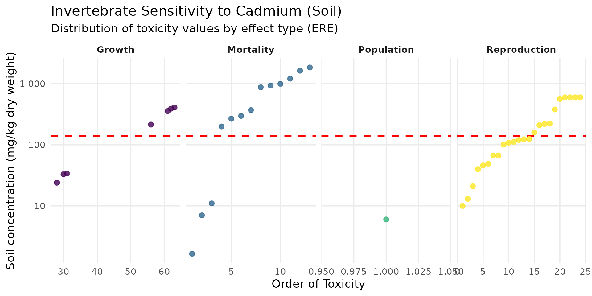
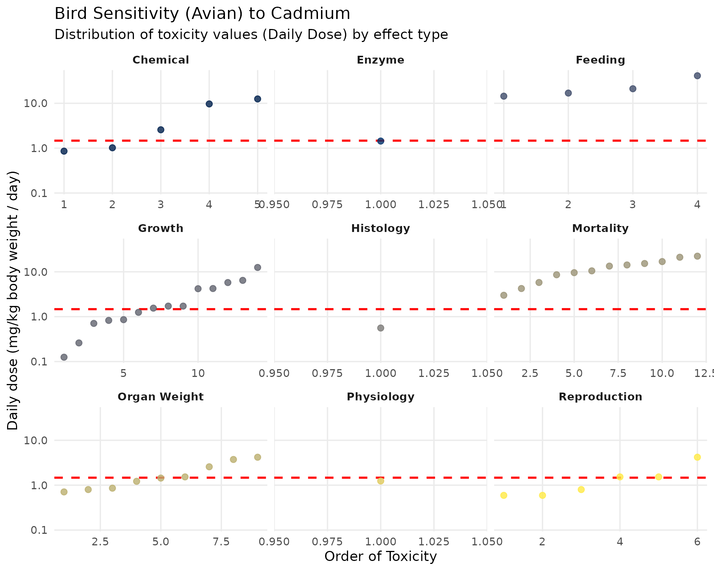
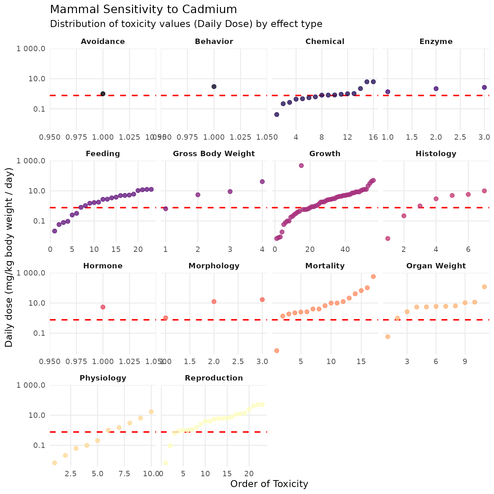

# Implementing Eco-SSL model

The fundamental principle of this assessment is based on the calculation
of the Hazard Quotient (HQ).

The goal of the algorithm is to find the exact concentration of the
contaminant in the soil (Soil) for which the HQ is strictly equal to 1
(the tipping point where the risk begins). The risk equation used to
model this relationship is as follows:

``` math
HQ = \frac{FIR \times (Soil \times P_s + B_i)}{TRV}
```
By setting $`HQ = 1`$, it is possible to rearrange the equation to
isolate the Soil variable. The Soil value thus obtained becomes our
safety threshold: the Eco-SSL.

**Exposure Parameters**

The numerator of our equation models the animal’s environmental
exposure. It is based on the following ecological and physiological
parameters:

- Food Ingestion Rate ($`FIR`$): The dietary ingestion rate. It is the
  total amount of food the animal consumes per day, normalized to its
  own body weight. (Example: a herbivorous bird consumes 0.190 kg of dry
  matter for each kg of its own body weight).
- Soil Ingestion as Proportion of Diet ($`P_s`$): The proportion of soil
  that the animal swallows accidentally or unintentionally while
  feeding. (Example: 13.9% or 0.139 for the herbivorous bird).
- Concentration of Cadmium in Biota Type ($`B_i`$): This is the core of
  trophic transfer. It refers to the concentration of the contaminant in
  the animal’s food items (plants, earthworms, prey). Because this
  concentration directly depends on the soil’s pollution state, it is
  modeled using specific regression equations. (Example: for plants
  eaten by a herbivore, the transfer equation is
  $`\ln(B_i) = 0.546 \times \ln(Soil) - 0.475`$).

## Build a `spacemodel` to get Eco-SSL risk layer

First step is load the package `spacemodR`.

You can install from CRAN or from the [github
repository](https://github.com/Qonfluens/spacemodR)

``` r

library(spacemodR)
# additional libraries for this specific notebook
library(dplyr)
#> 
#> Attaching package: 'dplyr'
#> The following objects are masked from 'package:stats':
#> 
#>     filter, lag
#> The following objects are masked from 'package:base':
#> 
#>     intersect, setdiff, setequal, union
library(ggplot2)
library(scales)
```

### Habitat

The first step is to build a raster stack with the ground as raster.

``` r

# the raster tif file is internal to the spacemodR package
ground_cd <- load_raster_extdata("ground_concentration_cd_compressed.tif")

color_contam <- colorRampPalette(c("white", "#A33D0A"))(255)
terra::plot(ground_cd, col=color_contam)
```


``` r

names_hab = c("soil", "plant", "invert", "mamHerb", "mamInsect", "birdInsect")
list_habitat <- lapply(names_hab, function(i) ground_cd)
stack_habitat <- raster_stack(list_habitat, names_hab)

terra::plot(stack_habitat, col=color_contam)
```


### Food Web

The second step is to build the trophic web, all species connecting
directly to the soil.

``` r

trophic_df <- trophic() |>
  add_link("soil", "plant") |>
  add_link("soil", "invert") |>
  add_link("soil", "mamHerb") |>
  add_link("soil", "mamInsect") |>
  add_link("soil", "birdInsect")
```

You can have access to trophic level:

``` r

attr(trophic_df, "level")
#>       soil      plant     invert    mamHerb  mamInsect birdInsect 
#>          1          2          2          2          2          2
```

And then plot it:

``` r

plot(trophic_df)
```


### Merge Habitat and Food Web

The third step is to merge the raster stack with the trophic data.frame.

``` r

spcmdl_ecossl_h <- spacemodel(stack_habitat, trophic_df)
```

### No dispersal in Eco-SSL

There is no dispersal in Eco-SSL, so all kernels are set to `NA`.

We set this list of kernel which is requirement later for transfer
function.

``` r

# no dispersal for eco_ssl
ecossl_kernels <- list(
  soil  = NA, plant = NA, invert = NA,
  mamHerb = NA, mamInsect = NA, birdInsect = NA)
```

## Computing the Risk

The computing of Risk Threshold using data for Species Sensitivity
Distribution compiled by the US-EPA is findable in this dataset:

``` r

data("SSD_ecoSSL_all")
```

#### For plants and soil invertebrates

For plants and soil invertebrates, the toxicological value is not a
daily ingested dose. It directly refers to the concentration in the soil
(expressed in mg/kg of soil dry weight). These organisms live in the
soil and are continuously exposed to it.

For plant, the Eco-SSL is the geometric mean of the maximum acceptable
toxicant concentration (MATC) values for fourteen test species under
different test conditions (pH and % organic matter (OM)) and is equal to
32 mg/kg dw.

``` r

# Data preparation (remove NAs to avoid warnings)
ssd_cd_plant <- SSD_ecoSSL_all |>
  dplyr::filter(
    compound == "Cadmium",
    species_group == "Plant",
    !is.na(tox_value)
  )

# Create the plot
ggplot(data = ssd_cd_plant, aes(x = order_tox_value, y = tox_value, color = ERE_full)) +
  theme_minimal(base_size = 14) +
  geom_hline(yintercept = 32, linetype = "dashed", color = "red", linewidth = 1) +
  geom_point(size = 2.5, alpha = 0.8) +
  facet_wrap(~ ERE_full, scales = "free_x") +
  scale_y_log10(labels = label_number()) +
  scale_color_viridis_d(option = "plasma", guide = "none") +
  labs(
    title = "Plant Sensitivity to Cadmium (Soil)",
    subtitle = "Distribution of toxicity values by effect type (ERE)",
    x = "Order of Toxicity",
    y = "Soil concentration (mg/kg dry weight)"
  ) +
  theme(
    panel.grid.minor = element_blank(),
    strip.text = element_text(face = "bold", size = 10)
  )
```


For invertebrates, the Eco-SSL is the geometric mean of the MATC or
$`EC_{10}`$ (concentration causing an effect on 10% of the population)
values for three test species under six different test conditions (pH)
and is equal 140 mg/kg dw. For Cadmium, the Eco-SSL is 32 mg/kg for
plants

``` r

ssd_cd_invert <- SSD_ecoSSL_all |>
  dplyr::filter(
    compound == "Cadmium",
    grepl("Invert", species_group), # Flexible filter for Invertebrates
    !is.na(tox_value)
  )

ggplot(data = ssd_cd_invert, aes(x = order_tox_value, y = tox_value, color = ERE_full)) +
  theme_minimal(base_size = 14) +
  geom_hline(yintercept = 140, linetype = "dashed", color = "red", linewidth = 1) +
  geom_point(size = 2.5, alpha = 0.8) +
  facet_wrap(~ ERE_full, scales = "free_x", ncol=4) +
  scale_y_log10(labels = label_number()) +
  scale_color_viridis_d(option = "viridis", guide = "none") +
  labs(
    title = "Invertebrate Sensitivity to Cadmium (Soil)",
    subtitle = "Distribution of toxicity values by effect type (ERE)",
    x = "Order of Toxicity",
    y = "Soil concentration (mg/kg dry weight)"
  ) +
  theme(panel.grid.minor = element_blank(), strip.text = element_text(face = "bold"))
```



#### For birds (Avian) and mammals (Mammalian)

The process involves two steps. First, a TRV (Toxicity Reference Value)
is calculated. This TRV represents the safe daily ingested dose,
expressed in milligrams of contaminant per kilogram of the animal’s body
weight per day (mg/kg bw/day). This is the one we are going to use here.

Then, this TRV is used to “back-calculate” the maximum acceptable
concentration in the soil (the Eco-SSL) by modeling the animal’s diet.

This is where we use the equation:

``` math
HQ = \frac{FIR \times (Soil \times P_s + B_i)}{TRV}
```

##### Birds

The Eco-SSL TRV for Cadmium in birds is 1.47 mg/kg/day.

``` r

ssd_cd_avian <- SSD_ecoSSL_all |>
  dplyr::filter(
    compound == "Cadmium",
    grepl("Avian", species_group),
    !is.na(tox_value)
  )

ggplot(data = ssd_cd_avian, aes(x = order_tox_value, y = tox_value, color = ERE_full)) +
  theme_minimal(base_size = 14) +
  geom_hline(yintercept = 1.47, linetype = "dashed", color = "red", linewidth = 1) +
  geom_point(size = 2.5, alpha = 0.8) +
  facet_wrap(~ ERE_full, scales = "free_x") +
  scale_y_log10(labels = label_number()) +
  scale_color_viridis_d(option = "cividis", guide = "none") +
  labs(
    title = "Bird Sensitivity (Avian) to Cadmium",
    subtitle = "Distribution of toxicity values (Daily Dose) by effect type",
    x = "Order of Toxicity",
    y = "Daily dose (mg/kg body weight / day)"
  ) +
  theme(panel.grid.minor = element_blank(), strip.text = element_text(face = "bold"))
```



##### Mammals

The official TRV for Cadmium in mammals is stricter, set at 0.77
mg/kg/day.

``` r

ssd_cd_mammal <- SSD_ecoSSL_all |>
  dplyr::filter(
    compound == "Cadmium",
    grepl("Mammal", species_group),
    !is.na(tox_value)
  )

ggplot(data = ssd_cd_mammal, aes(x = order_tox_value, y = tox_value, color = ERE_full)) +
  theme_minimal(base_size = 14) +
  geom_hline(yintercept = 0.77, linetype = "dashed", color = "red", linewidth = 1) +
  geom_point(size = 2.5, alpha = 0.8) +
  facet_wrap(~ ERE_full, scales = "free_x") +
  scale_y_log10(labels = label_number()) +
  scale_color_viridis_d(option = "magma", guide = "none") + 
  labs(
    title = "Mammal Sensitivity to Cadmium",
    subtitle = "Distribution of toxicity values (Daily Dose) by effect type",
    x = "Order of Toxicity",
    y = "Daily dose (mg/kg body weight / day)"
  ) +
  theme(panel.grid.minor = element_blank(), strip.text = element_text(face = "bold"))
```



### Computing Hazard Quotient (HQ)

To solve the equation
$`HQ = \frac{FIR \times (Soil \times P_s + B_i)}{TRV}`$, the table
integrates several species-specific parameters:

- Surrogate Receptor Group: This column identifies the specific bird
  species chosen by the EPA to represent an entire dietary guild within
  the ecosystem. For instance, the dove models avian herbivores, the
  woodcock models avian insectivores (foraging in the soil), and the
  hawk models avian carnivores.
- TRV for Cadmium (Toxicity Reference Value): This is the maximum safe
  daily dose of Cadmium the bird can ingest without experiencing adverse
  health effects. For all avian species in this assessment, the TRV is
  set at 1.47 mg/kg bw/day.
- Food Ingestion Rate (FIR): This parameter represents the total amount
  of food the bird consumes daily, normalized to its own body weight (kg
  of dry food per kg of body weight). Notice that the insectivore
  (woodcock) has the highest metabolic demand and ingestion rate (0.214)
  compared to the carnivore (0.0353).
- Soil Ingestion as Proportion of Diet ($`P_s`$): Birds incidentally
  swallow soil while foraging or preening. This value represents the
  fraction of their total daily diet that is made up of soil. The
  ground-probing woodcock incidentally ingests the most soil (16.4% or
  0.164).
- Concentration of Cadmium in Biota Type ($`B_i`$): This column provides
  the bioaccumulation regression equations used to estimate how much
  Cadmium transfers from the soil into the bird’s specific food source
  (plants, earthworms, or mammals). It bridges the gap between
  environmental contamination and dietary exposure.
- Eco-SSL (Ecological Soil Screening Level): The final calculated
  threshold. It represents the maximum allowable Cadmium concentration
  in the soil (in mg/kg dry weight) to ensure the target bird remains
  safe ($`HQ = 1`$). The avian insectivore is the most at risk,
  requiring a very stringent soil limit of 0.77 mg/kg, while the
  carnivore is protected up to 630 mg/kg.

#### Birds

| Surrogate Receptor Group | TRV for Cadmium (mg dw/kg bw/d)¹ | Food Ingestion Rate (FIR)² (kg dw/kg bw/d) | Soil Ingestion as Proportion of Diet ($`P_s`$)² | Concentration of Cadmium in Biota Type (i)²’³ ($`B_i`$) (mg/kg dw) | Eco-SSL (mg/kg dw)⁴ |
|:---|:--:|:--:|:--:|:---|:--:|
| Avian herbivore (dove) | 1.47 | 0.190 | 0.139 | $`\ln(B_i)=0.546\cdot\ln(Soil_j)-0.475`$ where i = plants | 28 |
| Avian ground insectivore (woodcock) | 1.47 | 0.214 | 0.164 | $`\ln(B_i)=0.795\cdot\ln(Soil_j)+2.114`$ where i = earthworms | 0.77 |
| Avian carnivore (hawk) | 1.47 | 0.0353 | 0.057 | $`\ln(B_i)=0.4723\cdot\ln(Soil_j)-1.2571`$ where i = mammals | 630 |

$`^1`$ The process for derivation of wildlife TRVs is described in
Attachment 4-5 of U.S. EPA (2003).

$`^2`$ Parameters (FIR, $`P_s`$, $`B_i`$ values, regressions) are
provided in U.S. EPA (2003) Attachment 4-1 (revised February 2005).

$`^3`$$`B_i`$ = Concentration in biota type (i) which represents 100% of
the diet for the respective receptor.

$`^4`$$`HQ = \frac{FIR \cdot (Soil_j \cdot P_s + B_i)}{TRV}`$ solved for
$`HQ=1`$ where $`Soil_j`$ = Eco-SSL (Equation 4-2; U.S. EPA, 2003). NA =
Not Applicable.

#### Mammals

| Surrogate Receptor Group | TRV for Cadmium (mg dw/kg bw/d)¹ | Food Ingestion Rate (FIR)² (kg dw/kg bw/d) | Soil Ingestion as Proportion of Diet ($`P_s`$)² | Concentration of Cadmium in Biota Type (i)²’³ ($`B_i`$) (mg/kg dw) | Eco-SSL (mg/kg dw)⁴ |
|:---|:--:|:--:|:--:|:---|:--:|
| Mammalian herbivore (vole) | 0.770 | 0.0875 | 0.032 | $`\ln(B_i)=0.546\cdot\ln(Soil_j)-0.475`$ where i = plants | 73 |
| Mammalian ground insectivore (shrew) | 0.770 | 0.209 | 0.030 | $`\ln(B_i)=0.795\cdot\ln(Soil_j)+2.114`$ where i = earthworms | 0.36 |
| Mammalian carnivore (weasel) | 0.770 | 0.130 | 0.043 | $`\ln(B_i)=0.4723\cdot\ln(Soil_j)-1.2571`$ where i = mammals | 84 |

$`^1`$ The process for derivation of wildlife TRVs is described in
Attachment 4-5 of U.S. EPA (2003). $`^2`$ Parameters (FIR, $`P_s`$,
$`B_i`$ values, regressions) are provided in U.S. EPA (2003) Attachment
4-1 (revised February 2005). $`^3`$$`B_i`$ = Concentration in biota type
(i) which represents 100% of the diet for the respective receptor.
$`^4`$$`HQ = \frac{FIR \cdot (Soil_j \cdot P_s + B_i)}{TRV}`$ solved for
$`HQ=1`$ where $`Soil_j`$ = Eco-SSL (Equation 4-2; U.S. EPA, 2003). NA =
Not Applicable.

## Mapping Risk Levels

To evaluate the spatial distribution of environmental risk, we will
calculate the Hazard Quotient (HQ) for each target group across the
landscape.

The HQ is simply the ratio of the environmental exposure to the safe
threshold (HQ = Exposure / Eco-SSL). B

Because our input soil concentration layers (`x`) are currently
$`log_{10}`$-scaled, we must first back-transform them to their actual,
linear values (using `10^x`) before performing the division. To keep our
model setup clean and easy to update, we will first define a vector
containing the specific Eco-SSL thresholds for each group, and then
apply these values within the
[`flux()`](https://qonfluens.github.io/spacemodR/reference/flux.md)
function to configure our `spacemodel` object.

``` r

# Define the Eco-SSL thresholds (in mg/kg) for each group in a named vector
ecossl_vals <- c(
  plant      = 32,
  invert     = 140,
  mamHerb    = 73,
  mamInsect  = 0.36,
  birdInsect = 0.77
)

# Build the Eco-SSL thresholds by transforming the log10 soil (10^x) 
# and dividing by the specific Eco-SSL value to get the HQ
ecossl_threshold <- flux(spcmdl_ecossl_h, default = 1, normalize = FALSE) |>
  add_flux(from = "soil", to = "plant", value = ~ 10^x / ecossl_vals["plant"]) |>
  add_flux(from = "soil", to = "invert", value = ~ 10^x / ecossl_vals["invert"]) |>
  add_flux(from = "soil", to = "mamHerb", value = ~ 10^x / ecossl_vals["mamHerb"]) |>
  add_flux(from = "soil", to = "mamInsect", value = ~ 10^x / ecossl_vals["mamInsect"]) |>
  add_flux(from = "soil", to = "birdInsect", value = ~ 10^x / ecossl_vals["birdInsect"])

# Apply the transfer to compute the spatial risk layers
spcmdl_ecossl_risk <- transfer(
  spcmdl_ecossl_h,
  ecossl_kernels,
  ecossl_threshold,
  exposure_weighting="potential"
)
```

To easily interpret the spatial distribution of ecological risks, we map
the calculated Hazard Quotients (HQs) using a discrete, threshold-based
color scale. Because an HQ value of `1` represents the regulatory
tipping point for risk, the palette is split intentionally: areas below
the threshold are represented by shades of green (safe zones), while
areas exceeding the threshold shift to yellow and dark brown (action or
risk zones). After excluding the baseline `soil` layer to focus strictly
on our ecological receptors, we plot the entire study area and
subsequently crop and mask the layers to our specific Metaleurop Region
of Interest (ROI) for a clean, site-focused evaluation.

``` r

# Risk colors
breaks_risk <- c(0, 0.1, 0.5, 1, 5, 10, Inf)
cols_risk <- c(
  "darkgreen",   # 0 - 0.1
  "green",       # 0.1 - 0.5
  "lightgreen",  # 0.5 - 1
  "yellow",      # 1 - 5
  "saddlebrown", # 5 - 10
  "#4A2C2A"      # > 10
)

names_keep <- names(spcmdl_ecossl_risk)[names(spcmdl_ecossl_risk) != "soil"]
spcmdl_ecossl_risk_sub <- spcmdl_ecossl_risk[[names_keep]]

terra::plot(spcmdl_ecossl_risk_sub,
            breaks = breaks_risk,
            col = cols_risk)
```


``` r

poly <- roi_metaleurop
poly_vect <- terra::project(terra::vect(poly), terra::crs(spcmdl_ecossl_risk_sub))

rast_crop <- terra::crop(spcmdl_ecossl_risk_sub, poly_vect)
rast_final <- terra::mask(rast_crop, poly_vect)
terra::plot(rast_final,
            breaks = breaks_risk,
            col = cols_risk)
```


