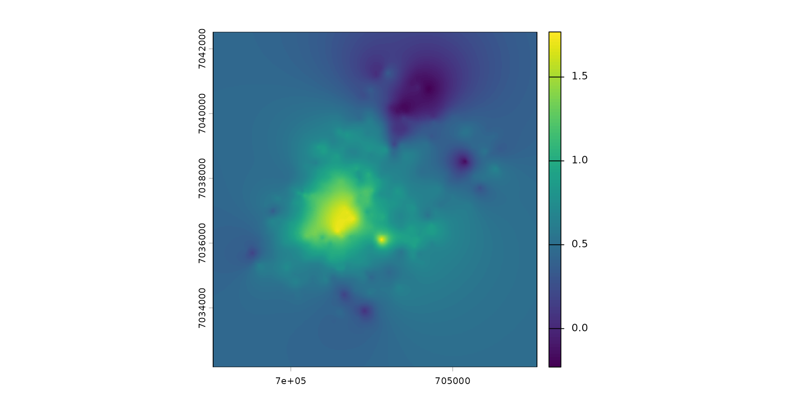
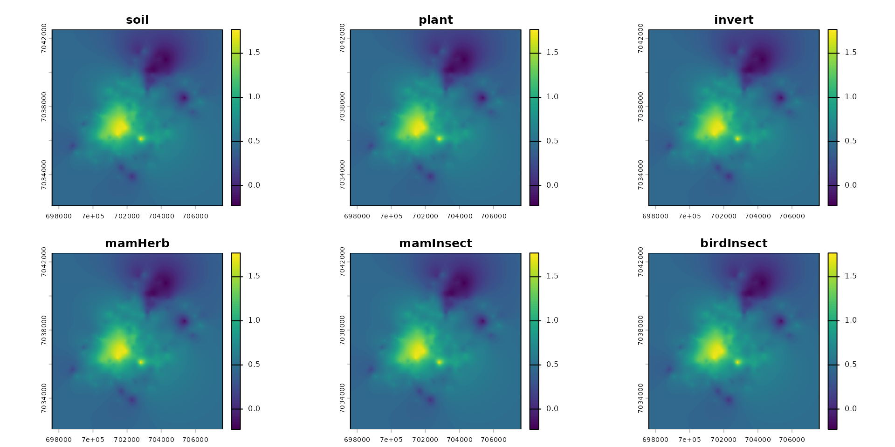
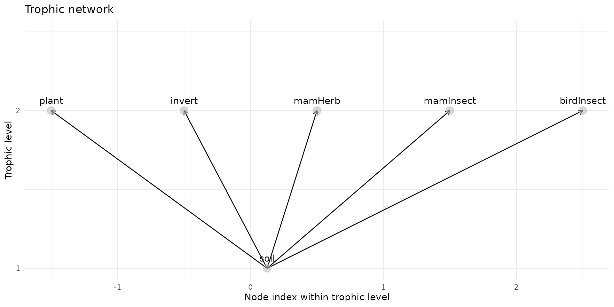
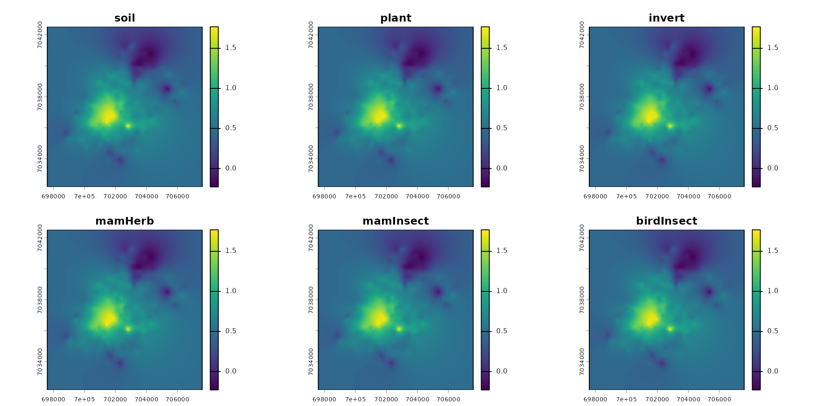
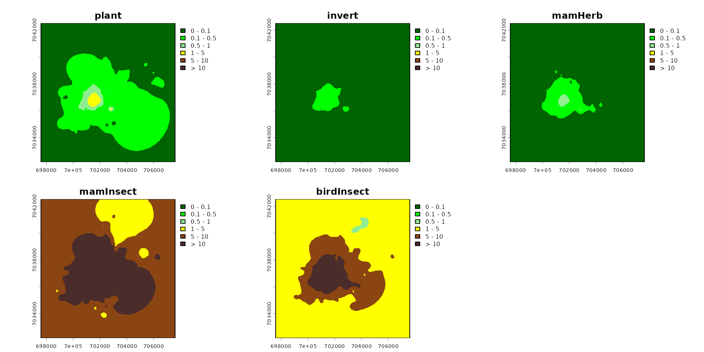
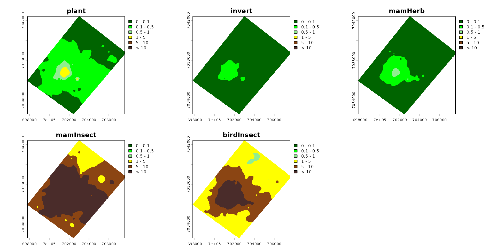
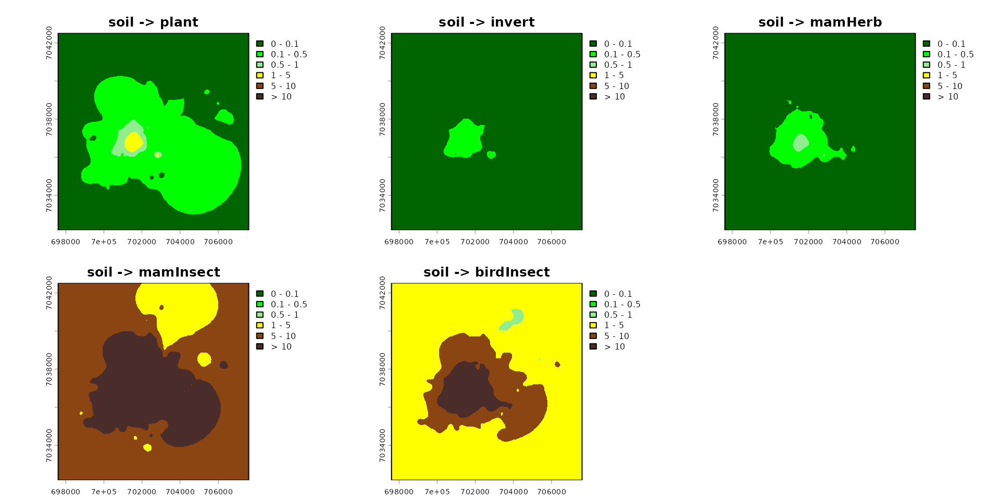

# zoo_ecossl

## Build a `spacemodel` to get Eco-SSL risk layer

First step is load the package `spacemodR`.

You can install from CRAN or from the [github
repository](https://github.com/Qonfluens/spacemodR)

``` r

library(spacemodR)
```

### Habitat

The first step is to build a raster stack with the ground as raster.

``` r

# the raster tif file is internal to the spacemodR package
ground_cd <- load_raster_extdata("ground_concentration_cd_compressed.tif")
terra::plot(ground_cd)
```



``` r

names_hab = c("soil", "plant", "invert", "mamHerb", "mamInsect", "birdInsect")
list_habitat <- lapply(names_hab, function(i) ground_cd)
stack_habitat <- raster_stack(list_habitat, names_hab)

terra::plot(stack_habitat)
```



### Food Web

The second step is to build the trophic web, all species connecting
directly to the soil.

``` r

trophic_df <- trophic() |>
  add_link("soil", "plant") |>
  add_link("soil", "invert") |>
  add_link("soil", "mamHerb") |>
  add_link("soil", "mamInsect") |>
  add_link("soil", "birdInsect")

attr(trophic_df, "level")
#>       soil      plant     invert    mamHerb  mamInsect birdInsect 
#>          1          2          2          2          2          2
```

``` r

plot(trophic_df)
```



### Merge Habitat and Food Web

The third step is to merge the raster stack with the trophic data.frame.

``` r

spcmdl_ecossl_h <- spacemodel(stack_habitat, trophic_df)

terra::plot(spcmdl_ecossl_h)
```



### Transfer Soil-Target

``` r

# no dispersal for eco_ssl
ecossl_kernels <- list(
  soil  = NA, plant = NA, invert = NA,
  mamHerb = NA, mamInsect = NA, birdInsect = NA)
```

``` r

ecossl_intakes <- intake(spcmdl_ecossl_h,
  "soil -> plant"       = ~ 10^x/32,  
  "soil -> invert"      = ~ 10^x/140,
  "soil -> mamHerb"     = ~ 10^x/73,
  "soil -> mamInsect"   = ~ 10^x/0.36,
  "soil -> birdInsect"  = ~ 10^x/0.77,
  default = 1, # for all other default is 1
  normalize = FALSE # TRUE would weight every link to sum at 1
)

spcmdl_ecossl_risk <- transfer(
  spcmdl_ecossl_h,
  ecossl_kernels,
  ecossl_intakes,
  exposure_weighting="potential")
```

### Risk Indices

Finally, we build the Risk indice.

A plot of layer with risk threshold color scale.

``` r

# Risk colors
breaks_risk <- c(0, 0.1, 0.5, 1, 5, 10, Inf)
cols_risk <- c(
  "darkgreen",   # 0 - 0.1
  "green",       # 0.1 - 0.5
  "lightgreen",  # 0.5 - 1
  "yellow",      # 1 - 5
  "saddlebrown", # 5 - 10
  "#4A2C2A"      # > 10
)

names_keep <- names(spcmdl_ecossl_risk)[names(spcmdl_ecossl_risk) != "soil"]
spcmdl_ecossl_risk_sub <- spcmdl_ecossl_risk[[names_keep]]

terra::plot(spcmdl_ecossl_risk_sub,
            breaks = breaks_risk,
            col = cols_risk)
```



``` r

poly <- roi_metaleurop
poly_vect <- terra::project(terra::vect(poly), terra::crs(spcmdl_ecossl_risk_sub))

rast_crop <- terra::crop(spcmdl_ecossl_risk_sub, poly_vect)
rast_final <- terra::mask(rast_crop, poly_vect)
terra::plot(rast_final,
            breaks = breaks_risk,
            col = cols_risk)
```



### checking Eco-SSL

For this very simple example, a simple check can be done, because
Eco-SSL is a computing of a risk based on the amount in soil:

``` r

check_ecossl_risk = list(
  "soil -> plant"       = 10^ground_cd/32,  
  "soil -> invert"      = 10^ground_cd/140,
  "soil -> mamHerb"     = 10^ground_cd/73,
  "soil -> mamInsect"   = 10^ground_cd/0.36,
  "soil -> birdInsect"  = 10^ground_cd/0.77
)

r_check_ecossl_risk = terra::rast(check_ecossl_risk)

terra::plot(r_check_ecossl_risk,
            breaks = breaks_risk,
            col = cols_risk)
```


